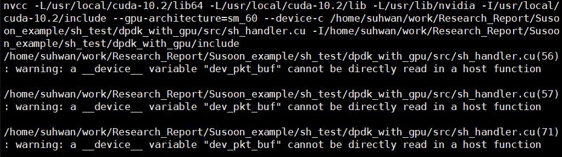
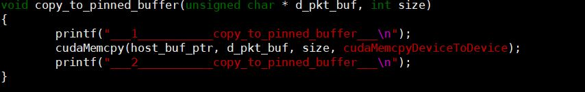
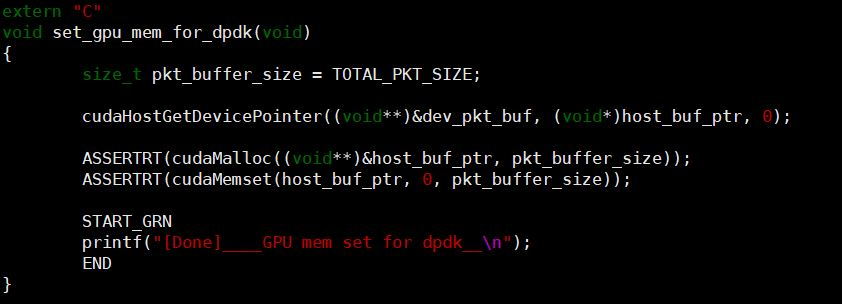
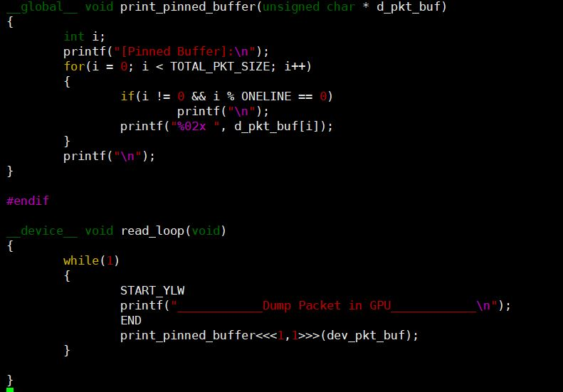
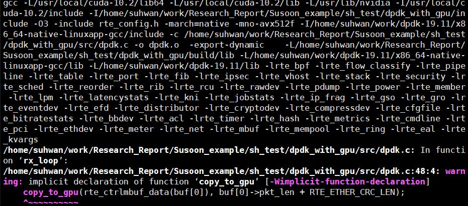

# DPDK error들

# 1.환경변수

## 1.1 환경변수를 인식하지 못하는 경우

* RTE_SDK를 환경변수로 지정을 해주고 bash.bashrc에도 저장을 했는데도 makefile이 인식을 못한다.

* 그래서 필요한 file마다 찾아가서 저장을 해줬다.
* source써서 실행하고 reboot까지 했지만 설정이 안됨

### solution

* 계정별로 환경변수가 다르게 지정되고 이를 확인해줄 필요가 있음
* 해당 file의 소유주가 어떤 계정이냐에 따라 불러지는 환경변수가 달라짐

# 2. cuda code

## 2.1 \_\_device\_\_와 \_\_global\_\_, host 간의 관계

 sh_handler.cu compile warning 

* sh_handler.cu 파일을 컴파일할 때 뜬 warning이다
* gpu 내의 buffer로 활용하기 위해서 전역변수로 설정해둔 dev_pkt_buf 배열이 host function에서는 읽을 수 없다는 경고
  * gpu에 memory를 setting해주고 data를 copy할 때 host가 사용하는 함수에 그냥 넣어버림....
* 다음과 같이 코드를 수정하여 해결

 solution of sh_handler.cu warning 

* device의 buffer를 가리키는 dev_pkt_buf 포인터와 host에서 그 포인터를 다루기 위해 만든 host_buf_ptr 포인터를 만듬
* dram에 있는 packet을 pinned buffer로 옮기기 위해 copy_to_pinned_buffer 함수를 만듬
* set_gpu_mem_for_dpdk 함수에서 device 포인터를 host 포인터에 mapping해주는 함수인 cudaHostGetDevicePointer 함수를 사용하여 dev_pkt_buf를 host_buf_ptr에 mapping함
* pinned_buffer에 있는 packet을 출력하는 함수인 print_pinned_buffer함수를 만듬
* polling하는 메인 persistent loop인 read_loop에서 print_pinned_buffer를 호출하여 gpu에서 pinned buffer에 있는 packet을 dump하도록 해줌

 dpdk.c compile warning 

* dpdk.c 파일을 compile할 때 뜬 warning이다
* dpdk.c에서 sh_handler.cu에 있는 copy_to_gpu 함수를 불러오지 못하고 있다
  * 내가 만든 파일끼리의 linking이 되지 않았다는 증거
* compile tag 문제, 아래의 port를 못 찾을 때의 에러 참고

# 3. Excution error

## 3.1 address mapping and port error

* 실행시에는 다음과 같은 에러가 발생

* 첫번째 error는 address mapping error
  * sh_handler.cu 내에 read_handler 함수에서 device를 건드리는 function(\_\_global\_\_ or \_\_device\_\_ or cudaMalloc etc...)를 호출하면 error가 발생
  * linking 과정이나 함수 코드 내의 문제일 가능성 있음
* 두번째 error는 port를 찾을 수 없는 error
  * compile tag에 의한 error
  * 원래는 rte.var.mk를 통한 compile이 되어야하지만 libdpdk.pc를 수정하는 과정에서 그 연결이 끊어짐
  * 다시 연결을 잇는 법을 찾지 못해 tag를 다 넣어줌

  Execution Result 

* 위의 캡쳐처럼 copy_to_gpu가 print_gpu를 호출하지만 출력 결과를 보면 packet도 출력이 안되고 [GPU]: 이부분도 아예 출력이 안되는 걸 보면 print_gpu가 호출이 안됨
* 그래서 copy_to_gpu에 print로 packet을 출력시키려 하니 segmentation fault error가 발생함

### Solution

* cuda compile시 gpu driver에 따라 다른 sm 버젼을 줘야함
  * K4000의 경우 30을 줘야 정상적으로 제 기능을 함

## 3.2 Infinite loop in GPU

* gpu에서 persistent loop를 돌리려하면 다른 cudaMemcpy같은 gpu 관련 함수들이 전혀 실행되지 않음

### Solution

* 이는 Kepla 시리즈가 preemption을 지원하지 않기 때문
* 찬규형의 test환경은 Pascal gpu를 사용함
  * 그래서 찬규형의 코드에는 infinite loop가 있어도 다른 gpu 함수들이 preemption으로 loop를 밀고 들어와 실행하기 때문에 정상적인 기능을 할 수 있음
* pthread를 사용해서 CPU에서 infinite loop을 돌리고 loop 안에 monitor code를 넣어 gpu에서 infinite loop을 도는 것과 유사한 환경을 만들어줌