# Daily Report for DPDK

##  ToDo List

1. DMA 공부하기
2. network stack 공부하기
3. network stack open source 찾아보기

---
## 11/13 현재상황
* QEMU로 VM을 띄우고 있다.
* 이 과정을 글로 남겨 후에 다시 QEMU를 사용하기에 편하도록 하고자 한다.
* 이를 위해서는 2가지 과정이 필요하다.
    1. WSL GUI 설정
    2. ssh GUI 설정
    3. QEMU 사용법
---
### 1. WSL GUI 설정

* 이는 사실 매우 간단하다.
* **xming** 프로그램을 사용하면 GUI로 띄워준다.
* 다만 이를 세팅해주는 과정이 필요하고 이는 ssh GUI 설정을 확인하면 된다.

---
### 2. ssh GUI 설정

* 이를 위해서는 필요한 과정이 많다.

1. client 
* .bashrc 파일에 다음의 내용을 추가한다
    * 추가한 뒤 꼭 source ~/.bashrc를 해줘서 적용되도록 해준다.
```
export DISPLAY=localhost:0
export NO_AT_BRIDGE=1
```
* /etc/ssh/ssh\_config 파일에 다음의 내용을 주석해제 및 추가한다.
```
ForwardAgent yes
ForwardX11 yes
ForwardX11Trusted yes
```
* /etc/ssh/sshd\_config 파일에 다음의 내용을 주석해제 및 추가한다.
    * 위의 ssh\_config파일과 sshd\_config 파일을 모두 수정한 뒤 `sudo service sshd restart`로 꼭 재실행해서 적용되도록 해준다.
```
Port 22
Protocol 2
PubkeyAuthentication yes
X11Forwarding yes
```
* 원하는 서버에 ssh로 접속시 **-Y** 혹은 **-X** 옵션을 붙인다.
    * -Y와 -X의 차이는 크게 없다고 한다.
    * 자세히는 모르겠으나 -Y 쪽이 보안이 더 강하다고....
    * stackoverflow에서는 -X로 안되면 -Y로 하라고 했다.

2. server
* .bashrc 파일에 다음의 내용을 추가한다.
    * 여기에는 DISPLAY export를 **절대 해주면 안된다**.
    * 기본으로 세팅되어있는 DISPLAY port가 있는데 세팅을 바꿔버리면 정상적인 port를 찾지 못해 에러가 발생할 수 있다.
    * 또한 이는 사용하는 계정뿐만 아니라 root 계정에도 동일하게 설정해주어야한다.
```
export NO_AT_BRIDGE=1
```
* /etc/ssh/ssh\_config 파일에 다음의 내용을 주석해제 및 추가한다.
```
ForwardAgent yes
ForwardX11 yes
ForwardX11Trusted yes
```
* /etc/ssh/sshd\_config 파일에 다음의 내용을 주석해제 및 추가한다.
    * 위의 ssh\_config파일과 sshd\_config 파일을 모두 수정한 뒤 `sudo service sshd restart`로 꼭 재실행해서 적용되도록 해준다.
```
Port 22
Protocol 2
PubkeyAuthentication yes
X11Forwarding yes
```
---
### 2\_1. ssh GUI에 문제 발생시

* 이유는 모르겠으나 재접속시 계속 설정이 바뀐다.
* 때문에 문제가 발생할 경우가 잦으며, 위의 설정 변경에 의한 문제가 아니더라도 아래의 내용을 확인하면 보통 해결되었다.

1. xming
* 아주 당연한 사실이지만 xming이 켜져있지 않으면 GUI가 실행되지 않는다.
* gtk connection failed의 에러가 발생하면 이를 확인해보자.
* 현재는 시작프로그램에 지정되어있다보니 왠만하면 켜지겠지만 확인해볼 필요는 있다.

2. .Xauthority
* .Xauthority 파일은 ssh와 Xming간의 세팅을 저장해주는 파일이다.
* 위에서 서술한 설정이 바뀌는 부분이 이 파일과 관련된 부분이다.
* 문제가 발생하는 계정은 일반 사용계정이 아닌 **root 계정**이다.
* 따라서 아래의 내용은 root 계정과 관련된 내용이다.
* 재접속시 이 파일이 refresh가 되는 듯 하다.
* 이때는 `xauth merge /home/susoon/.Xauthority`를 command창에 입력하면 해결할 수 있다.
* 이를 확인하기 위해서는 `xhost +`를 입력해서 정상작동하는지 확인하자.
    * xhost + failed. Cannot connect to 'localhost:10.0'이란 메세지가 뜨면 에러가 발생한 상태이다.
    * 'access control disabled, clients can connect from any host'이란 메세지가 떠야 정상작동하는 상태이다.

3. DISPLAY 환경변수
* 이는 왠만하면 발생할 일이 없는 문제이다.
* 기본으로 세팅되어있는 DISPLAY port가 변경되었거나 수정된 경우 발생할 수 있는 문제이다.
* 이는 .bashrc에 추가한 export DISPLAY부분을 변경하면 된다.
* 이때 DISPLAY port가 어떻게 설정되었는지 꼭 확인한 뒤 이에 맞게 설정해줘야한다.
* 하지만 보통 기본으로 세팅된 DISPLAY port에 잘 연결되니 걱정할 필요는 없다.

---
### 3. QEMU 실행방법

* 이는 아직 해결하지 못한 부분이 남아있다.
* 위의 GUI 세팅이 모두 완료되었다는 가정하에 진행된다.

1. 이미지 생성
* VM 이미지를 만들고 이를 QEMU에 넘겨주어야 QEMU가 이 이미지 VM과 관련된 데이터를 저장하고 이를 이용해 VM을 실행시킨다.
* 아래의 명령어를 통해 생성할 수 있다.
```
sudo qemu-img create -f <format>  
```
* 이 경우에는 굳이 sudo를 줄 필요는 없다.
* 위를 적용한 예시는 다음과 같다.
```
sudo qemu-img create -f qcow2 ubuntu.qcow2 20G
```
* VM 이미지에 사용되는 format은 다양하며 `qcow2`는 QEMU가 제공하는 default 이미지 형식이다.
* `vdi`를 사용할 경우 virtual Box의 default 이미지 형식에 맞게 생성된다.
* 간단하게 `img`라는 형식을 사용할 수도 있다.

2. 최초 OS 설치
* 이 과정은 native OS 설치 시 OS 파일이 담긴 USB를 컴퓨터에 꽂고 BIOS를 이용해 해당 USB로 컴퓨터를 켜는 과정에 해당된다.
* 아래의 명령어를 통해 실행할 수 있다.
```
sudo qemu-system-x86_64 -m <memory size> -boot <boot type> -cdrom <iso file path> -drive file= -smp <number of cores> -cpu <'host' or specific cpu name> (-nographic -serial <origin I/O:target I/O)
```
* 이 경우에는 sudo를 필수로 주어야한다.
    * 이 때문에 위에서 ssh GUI 설정을 root 계정에서도 동일하게 해주어야한다.
* 위를 적용한 예시는 다음과 같다.
```
sudo qemu-system-x86_64 -m 2048 -boot menu=on -cdrom ubuntu-20.04.1-desktop-amd64.iso -drive file=ubuntu.qcow2 -smp 2 -cpu host
```
* 각 옵션들은 다음을 나타낸다

* `-m` : VM memory size
* `-boot` : VM boot type
* `-drive file` : Image file
* `-smp` : Number of cores
* `-cpu` : CPU name
    * 이는 보통 host를 사용하면 된다.
    * host가 아닌 경우는 모두 목록이 따로 있으며 현재 사용되는 서버는 해당 CPU 종류가 아니니 신경 안써도 된다.
* `-nographic` : Not using GUI
    * 이는 GUI 세팅이 되지 않았을 경우 추가해준다.
* `-serial` : serial mapping
    * 이도 역시 GUI 세팅이 되지 않았을 경우 추가해준다.
---
* 위의 내용들이 현재까지 QEMU에 대해서 알아낸 내용들이다.
* 현재 상황은 VM이 GUI로 실행되고 설치까지 진행된다.
* 하지만 설치 중 kill이 뜨면서 종료된다.
* 혹은 설치 완료 후 실행시 `error : out of memory`라는 에러가 발생하며 실행이 되지 않는다. 

---
## 10/20 현재상황
* DMA를 이용해 확인해 볼 것이 생겼다.
* DRAM에 non\-contiguous한 메모리 공간을 두 곳 잡는다.
* 그 두 곳의 virtual address를 번갈아가며 붙여 누더기 virtual address를 만든다.
    * e.g.) |M1addr|M2addr|M1addr|M2addr|...
* 이 누더기 virtual address를 physical address로 mapping한다.
    * 이 과정은 직접 새로 구현해야한다.
* 이러한 과정을 통해 발생한 physical address로 DMA를 해본다.
* 각 메모리 공간에 데이터가 따로따로 저장된다면 이 메모리 공간 중 하나를 device의 메모리 공간으로 바꿔본다.
    * GDDR의 메모리 공간으로 바꿔본다.

---
## 10/08 현재상황

* DMA를 scatter/gather방식으로 진행하는 함수를 찾았다.
* dma\_map\_sg함수이다.
    * /usr/src/linux/include/dma-mappiung.h파일 안에 있다


* dma\_map\_sg함수는 사실 매크로 함수이고 해당 함수를 호출하면 dma\_map\_sg\_attrs라는 함수가 호출된다.

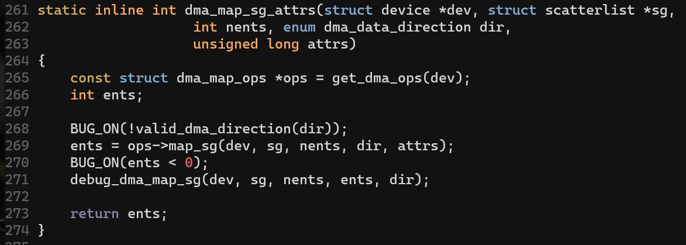

* 이때 dma\_map\_sg\_attrs함수 내부에서 호출되는 map\_sg가 실질적으로 dma 주소를 받아와 scatterlist 변수인 sg에 해당 주소를 저장해주는 역할을 한다.
* 이 map\_sg라는 함수는 사용하는 device나 host의 기기 종류에 따라, dma 정책\(e.g. coherent, direct, etc...\)에 따라 구분되어 함수포인터가 대입된다.
* 하지만 모든 map\_sg에 대입되는 함수들이 하는 일은 동일하다.
* **dma할 물리 주소를 찾아와 대입시킨다.**
* 단지 기기의 종류나 dma 정책에 따라 해야하는 일과 방식이 달라 구분되어 구현되어 있는 것이다.
* 그렇다면 debug\_dma\_map\_sg 함수가 남는데 이 함수도 map\_sg와 동일하게 기기 종류나 dma 정책에 따라 구분되어 구현되어 있다.
* 하지만 debug\_dma\_map\_sg 함수에 대입된 함수의 원형을 따라가보면 **몸체가 비어있는 함수**들도 존재한다.
* 이는 debug\_dma\_map\_sg 함수는 dma에 직접적인 관여를 하지 않는다는 것이다.
    * 사실 dma 관련 meta data를 수정하거나 하는 일을 하는 함수들도 존재해 직접적인 관여를 하지 않는 것은 아니다.
    * 하지만 관여를 하지 않는 경우가 존재하고 이는 이 함수가 아닌 다른 부분을 관찰할 필요가 있다는 것을 의미한다.
    * 그 이유는 현재 찾고자하는 바가 **대입된 dma 주소를 어떠한 방식으로 전해주어야 scatter/gather이 가능한가**이기 때문이다.
* 이때문에 dma\_map\_sg 함수 몸체에서 호출되는 함수를 따라 call flow를 타고 내려가는 것이 아니라 dma\_map\_sg 함수 자체를 어떻게 운용하는가에 대한 정보도 필요하다.
* 혹은 dma 주소를 대입해주는 것만으로도 dma가 진행되었던 gdnio의 경우를 생각해봤을때 단순히 대입만해도 dma를 진행해줄 가능성이 존재한다.
    * 사실 매우 크다.
* 그렇다면 dma 주소가 대입되는 scatterlist 포인터 변수 sg라는 변수가 어떻게 운용되는지에 대해 알아볼 필요도 있다. 
* 해당 변수가 어떻게 사용되고 어떻게 세팅되었는가에 따라 이 scatter/gather을 사용할 수 있는지가 결정될 수 있다.

---
### 참고 사이트

* [문c블로그](http://jake.dothome.co.kr/dma-1/)
* [dma\_map\_sg 운용 예시](https://cpp.hotexamples.com/examples/-/-/dma_map_sg/cpp-dma_map_sg-function-examples.html)
* [dma\_linux\_document](https://www.kernel.org/doc/html/latest/driver-api/dmaengine/index.html)

---
## 09/10 현재상황

* FFmpeg을 사용할 것인가에 대한 것을 확실히 하기위해선 다음의 내용을 확실히 파악할 필요가 있다.

1. **NVIDIA**에서 제공하는 H264 코덱을 활용할 수 있는가
2. 일반적으로 가장 많이 사용되는 **x264** 라이브러리를 GPU에 포팅시킬 수 있는가
3. **CUDA**를 사용하여 구현된 H264 코덱이 있는가

* 그에 대한 답변을 아래에 남긴다.

---
### 1. **NVIDIA**에서 제공하는 H264 코덱을 활용할 수 있는가

* NVIDIA에서는 H264 코덱을 제공한다.
* 이들의 이름은 NVENC와 NVDEC이다.
    * NVidia ENCoder와 NVidia DECoder이다.
* 이들은 09/09일자에 밝힌바와 같이 **하드웨어에 구워져서** 나온다.

> NVIDIA GPUs contain one or more **hardware-based decoder and encoder(s) (separate from the CUDA cores)** which provides fully-accelerated hardware-based video decoding and encoding for several popular codecs. With decoding/encoding offloaded, the graphics engine and the CPU are free for other operations.

* NVIDIA developer에서도 실제로 위와 같이 hardware\-based decoder and encoders\(s\) \(seperate from the CUDA cores\)가 강조되어있다.
* 아래는 NVIDIA가 이해를 돕기위해 위의 글 아래에 기재한 그림이다.

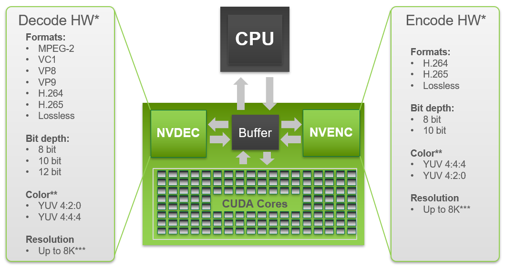

* 설명과 동일하게 **CUDA core와 별개로** codec과 codec을 위한 버퍼가 존재함을 알 수 있다.
* 해당 기능이 탑재된 GPU는 아래의 링크에서 확인할 수 있다.
    * [NVIDIA GPU Codec](https://developer.nvidia.com/video-encode-decode-gpu-support-matrix)
* 따라서 NVIDIA에서 제공하는 코덱은 수정이 불가하여 활용할 수 없다.
* 이를 조금더 확실히 하려면 **ffmpeg에서 NVENC와 NVDEC를 어떻게 호출하는가**를 파악할 필요가 있다.
* 코덱을 호출하는 방식에 따라 활용도가 정해질 수 있기 때문이다.
* 이는 FFmpeg 코드를 조금더 확인해봐야 알 수 있는 부분이다.
* 여태까지 확인한 바로는 NVENC와 NVDEC에 관한 코드가 존재는 하지만 C파일로만 존재를 하며, 해당 파일 내에는 코덱 설정을 위해 사용하는 구조체에 해당 코덱을 사용하기 위해 필요한 변수 세팅이 되어있으며, 그 외에는 NVIDIA 코덱에서 사용하는 변수 선언이 전부이다.
* 더 자세한 연결고리는 FFmpeg에 cuda관련 옵션을 configure에 주고 make하여 코드를 확인하면 찾을 수 있을 것 같지만 현재 hulkbuster 서버에는 GPU가 없어서 nvcc를 호출하지 못해 configure자체가 불가능한 상태이다.

* 참고 링크
* [NVIDIA Developer video codec](https://developer.nvidia.com/nvidia-video-codec-sdk#NVENCFeatures)
* [NVIDIA GPU Codec](https://developer.nvidia.com/video-encode-decode-gpu-support-matrix)

---
### 2. 일반적으로 가장 많이 사용되는 **x264** 라이브러리를 GPU에 포팅시킬 수 있는가

* 위는 불가능하다고 보는 게 맞다.
* 09/09일자에 기록한 바와 같이 x264 라이브러리는 CPU에 맞게 구현된 라이브러리이기 때문에 모든 코드가 CPU에 맞게 최적화되어 구현되어 있다.
* 이러한 라이브러리를 GPU에 맞게 최적화하여 재구현한다는 것은 하나의 work에 가까운 수준으로의 시간과 노력투자를 요구한다.
* 따라서 이는 **불가능하다**.

---
### 3. **CUDA**를 사용하여 구현된 H264 코덱이 있는가

* 2번에서의 이슈를 조금 더 생각해보면, **누군가 이미 x264 라이브러리를 GPU에 포팅시켜놓지 않았을까?**라는 생각을 할 수 있다.
* 만약 누군가 이미 x264라이브러리를 GPU에 맞게 포팅시켜놓았고, 이를 논문으로 제출한 기록이 있다면 따로 구현할 필요 없이 해당 코드만 받아와 조금 수정해서 사용하고 논문에 ref하면 된다.
* 그런데 **없다.**
* google scholar에 검색해서 확인해본 결과 총 5편의 논문이 h264 코덱을 GPU에 포팅하려는 시도를 하였다.

1. Performance Evaluation of H.264/AVC Decoding and Visualization using the GPU
2. MULTI-PASS AND FRAME PARALLEL ALGORITHMS OF MOTION ESTIMATION IN H.264/AVC FOR GENERIC GPU
3. H.264/AVC MOTION ESTIMATION IMPLMENTATION ON COMPUTE UNIFIED DEVICE ARCHITECTURE (CUDA)
4. Accelerating H.264 Inter Prediction in a GPU by using CUDA
5. A Parallel H.264 Encoder with CUDA: Mapping and Evaluation

* 1번은 2007년에 나온 논문으로 CUDA가 처음 나왔을 때 이를 이용해 h264를 구현한 논문이다.
    * github이 2007년 10월에 나왔다.
* 1번은 너무 오래된 논문이기도 하고 코드를 공개하지도 않아 코드도 없다.
* 2번은 CPU와 GPU를 모두 사용해 h264를 구현한 논문이기 때문에 이를 사용하려면 CPU코드를 GPU에 다시 포팅해야하는 결과를 초래한다.
* 코드도 또한 보이지 않는다.
* 3번은 인용수가 179회로 어마어마한 수치를 가지고 있지만 paper의 쪽수가 4페이지밖에 안되고 2008년에 나온 논문이라 1번과 유사하게 너무 오래되기도 했고 코드도 역시 없다.
* 4번은 h264의 일부 기능만 GPU에서 구현한 듯하다.
* 이는 추가적으로 확인이 필요하다.
* 그런데 이 논문\(?\)은 2페이지다.
* 5번이 그나마 가장 가능성이 있는데 CUDA를 이용해 h264 encoder를 구현한 논문이다.
* 이 논문은 encoder밖에 없다는 단점이 있지만 이쪽에 코드가 있다면 찾아볼 가치는 있다.
* 하지만 전체적으로 코드 공개가 되지 않은 논문이 많고 너무 오래된 논문도 많아 사용할 수 있는 것이 있을지는 미지수이다.

---
### 결론

* FFmpeg을 사용해서 evaluation을 진행하는데에는 무리가 있어보인다.
* 가장 많이 사용하는 코덱 알고리즘인 h264나 h265를 이용해 실험을 진행하는 것이 당위성이 있는데, h265는 유료화되어 있고 h264는 위의 이유로 인해 코드의 존재 가능성이 매우 낮다.
* 확실히 존재하지 않는다는 것을 증명해야하지만 현재로서는 가능성이 매우 낮다.

---
## 09/09 현재상황

* 알아낸 정보로는 NVIDIA에서 지원해주는 ffmpeg용 h264 코덱은 nvenc인데 이는 **NVIDIA 드라이버가 관리해주는 하드웨어상에 구현된 디코더**이다.
    * 이는 NVIDIA가 FFmpeg측에 source를 전부 제공한 후 만들어달라고 부탁한 것이라고....
    * 여기서 source는 드라이버 코드인 것 같다.
    * AMD도 전부 갖다바친 뒤 만들어달라고 부탁해서 만든 것\(amf\)이 있다.
* nvenc는 하드웨어 상에 구현된 디코더이다보니 GPU\-Ether에 맞게 수정할 수가 없다....
* 한가지 가능성은 **CoreAVC**라는 디코더이다. 이는 NVIDIA에서 제공한 것은 아니지만 CUDA를 사용한 GPU 가속을 제공한다고 한다.
* 하지만 CoreAVC는 유료이다...
* 결국 마지막 방법은 오픈소스이자 가장 높은 성능을 보인다는 x264를 GPU에 포팅하는 것이다.
* 이는 **전부 CPU코드로 구성된 코덱을 GPU에 포팅**하는 엄청난 노~~오오오오오오~~력이 필요하다....
* 사용가능한 opensource를 조금더 찾아보고 ffmpeg의 구조를 더 자세히 파악할 필요가 있지만 GPU로 포팅의 가능성이 그렇게 높아보이진 않는다.
* 아래는 참고한 사이트들이다.

* [wikipedia-Advanced Video Coding](https://en.wikipedia.org/wiki/Advanced_Video_Coding)
* [H.264/MPEG-4 AVC products and implementations](https://en.wikipedia.org/wiki/H.264/MPEG-4_AVC_products_and_implementations#cite_note-23)
* [Video Transcoding Examined: AMD, Intel, And Nvidia In-Depth](https://www.tomshardware.com/reviews/video-transcoding-amd-app-nvidia-cuda-intel-quicksync,2839-2.html)
* [FFmpeg-NVIDIA](https://developer.nvidia.com/ffmpeg)
* [NVIDIA-Video Codec SDK Documentation](https://docs.nvidia.com/video-technologies/video-codec-sdk/ffmpeg-with-nvidia-gpu/index.html)

* 아래는 ffmpeg 설치를 위해 사용한 configure 옵션들이다.
```
./configure --enable-gpl --enable-cuda-sdk --enable-libx264 --enable-cuda --enable-cuvid --enable-nvenc --enable-nonfree --extra-cflags=-I/usr/local/cuda/include  --extra-ldflags=-usr/local/cuda/lib64 --enable-cross-compile
```

* 아래는 추가로 살펴본 영상 파일을 구할 수 있는 사이트들이다.
* [DigitalFoundary](https://www.digitalfoundry.net/)
* [Red](https://www.red.com/sample-r3d-files)
* [Xiph](https://media.xiph.org/)

---
* ffmpeg의 작동원리에 대해서 공부하고 있다.
* ffmpeg을 사용하더라도 추가적인 코덱을 라이브러리러 넘겨줘야 기대하는 수준의 화질로 영상을 인코딩할 수 있다.
* H264방식의 인코딩을 택할 예정이며, 현재 hulkbuster 서버에는 GPU가 없으므로 libx264로 인코딩하는 것을 목표로 하며 추후에 GPU를 설치하고 난 뒤에는 h264\_nvenc로 인코딩하는 것이 목표이다.
    * H264는 인코딩을 직접 해주는 프로그램이 아닌 **인코딩 알고리즘**이며, **이를 구현한 것**이 libx264와 h264\_nvenc이다.
    * libx264는 cpu를 사용해 인코딩을 진행하는 코덱이고 h264\_nvenc는 NVIDIA GPU를 사용해 인코딩을 진행하는 코덱이다.
* 최종 목표가 GPU로 직접 들어오는 데이터를 이용해 GPU에서 인코딩하도록 ffmpeg을 GPU에 포팅하는 것이기 때문에 자세히 확인해야할 부분은 **h264\_nvenc가 인코딩과 디코딩을 진행하는 과정**이다.
* 아래의 사이트들은 현재 참고중에 있는 사이트들이다.

* [비디오 코덱과 기본용어](https://shana.pe.kr/shanaencoder_tip/80458)
* [ffmpeg 사용법 및 하드웨어 가속](https://topis.me/162)
* [H.264 동영상 압축의 기본 개념](https://crynut84.tistory.com/55?category=229006)

---
## 09/04 현재상황

* ffmpeg에 libx264 코덱을 연결하는 중에 있다.
* xiph에 있는 영상을 libx264를 통해 인코딩할 경우 깔끔한 화질의 영상이 생성됨을 확인했다.
* 하지만 이는 libx264의 실행파일인 x264를 이용해 인코딩을 진행한 것이며 이를 ffmpeg에 연결하지 못했다.
* x264를 컴파일 후 install까지 했지만 ffmpeg에 연결이 되지않는다.
* ffmpeg configure파일에 \-\-enable\-libx264 옵션을 줘도 연결이 되지 않는다.
	* 옵션을 준 후 ffmpeg 설치는 성공했으나 ffmpeg 실행시 libx264라는 encoder를 찾을 수 없다고 에러를 발생시킨다.
* 코덱 설치와 관련된 것을 조사해보다가 x264 코덱이 최근 성능이 좋다고 평가되는 코덱이라는 말을 발견했다.
* 자세히 확인해볼 필요가 있겠으나 인코딩한 영상의 화질을 미루어보았을때 높은 성능의 코덱으로 보인다.
* x264가 raw video를 고화질의 영상으로 인코딩해주지만 xiph에 있는 영상으로는 인코딩 시간이 매우 짧다.
	* 정확하게 계산해보지는 않았으나 x264실행 후 종료까지 10초 내외가 걸린다.
* 그 이유는 인코딩에 사용한 xiph의 영상 길이가 매우 짧기 때문이다.
	* 다운로드 받은 4K 영상은 모두 5초의 길이였다.
* 7GB의 용량을 가진 raw video였지만 실제 영상으로 인코딩 과정을 마칠 경우 5초의 길이밖에 되지 않는다는 것은 실제 실험에 사용할 영상의 크기는 100GB 이상의 크기를 가질 것을 알려준다.
* 영상 자료도 다시 모아야할 것 같다.

---
## 09/03 현재상황

* ffmpeg의 사용법을 숙지중에 있다.
* librav1e를 사용하면 y4m형식의 영상을 인코딩할 수 있다고 했으나 librav1e는 설치되지 않았다...
* 대신 rav1e가 설치되었고 해당 app을 사용해서도 인코딩이 가능하지만 인코딩 속도가 굉장히 느리고 ivf라는 새로운 확장자로 인코딩된다.
* ffmpeg을 사용해 y4m형식의 영상을 인코딩하기 위해선 다음의 명령어를 실행할 필요가 있다.

```
ffmpeg -i Netflix_Narrator_4096x2160_60fps_10bit_420.y4m -c:a libfdk_aac -b:a 128k ../test1.mp4
```
* 위의 명령어를 실행하면 인코딩이 진행되고 인코딩된 영상이 실행도 되지만 옵션들의 의미를 잘 파악하지 못해 추가 파악을 통해 실험해볼 필요가 있다.
* windows에선 해당 명령어로 실행이 되지 않으므로 더 자세히 파악할 필요가 있다.
* 위의 인코딩에 사용된 영상은 다음의 사이트에서 다운받아 사용했다.
	* [xiph_videos](https://media.xiph.org/video/derf/)
* 명령어에 대한 숙지를 위해선 영상의 코덱과 ffmpeg에서 요구하는 스트림에 대한 숙지가 필요하다.

---
* Streaming 실험 관련 내용을 조사했다.

1. Streaming 실험 방법
	* Client가 하는 기능 & 그 기능을 하기위해 필요한 app
	* Server가 하는 기능 & 그 기능을 하기위해 필요한 app
	* Client와 Server 사이의 통신 방법
2. Streaming evaluation metric
	* 일반적인 Network Throughput을 사용하는가
	* 그 외에 사용하는 metric이 있는가
---
### Streaming Evaulation Method

* 전체적인 그림은 다음과 같다.
1. Server가 자체적으로 영상을 가지고 있다.
2. Server가 가진 영상을 DASH\(Dynamic Adaptive Streaming over HTTP\)의 방식으로 Client에게 전송한다.
	* DASH란 Client와 Server간의 Link Bandwidth이 유동적일때 영상의 화질을 유동적으로 해당 bandwidth에서 보낼 수 있는 최고화질로 변경해서 전송해주는 기법을 말한다.
3. Client는 Server가 보내준 영상을 실시간으로 play한다.

* 위의 방식은 mobicom과 infocom에 제출된 논문 4개의 Evaluation 부분을 통해 확인한 내용이다.
* 해당 논문은 가장 아래에 참조되어있다.

* 각 단계를 세부적으로 파악하자면 다음과 같다.

`1. Server가 자체적으로 영상을 가지고 있다.`

* 그렇다면 그 영상은 어디서 구한 것이고 어떤 것이며 어떠한 형태로 저장되어 있는가.
* 각 논문들은 다양한 곳에서 영상을 구해서 사용했다.
* 영상의 출처를 밝히지 않은 논문이 대부분이었으며, 출처가 발혀진 경우에도 Twitch와 Vimeo같은 사용자가 많은 Streaming 배급사의 영상을 사용한 경우가 있었다.
* 위의 경우를 제외하고 남은 경우는 \(1\) 다른 논문의 데이터를 사용하거나 \(2\) 인터넷 상에 존재하는 dataset을 사용한 것이었다.
* 인터넷 상에 존재하는 dataset의 경우 영상의 길이와 frame, 화질과 획득방법에 따라 잘 나뉘어 있었는데 추후에 evaluation에 사용하기에 좋을 것 같다.
	* [Xiph](https://media.xiph.org/video/derf/.)
* 이러한 출처를 통해 각 논문이 원하는 주제에 맞는 영상을 획득한 것 같다.
	* 4k관련 논문은 4k 영상을, 다양한 frame의 영상을 통해 전반적인 streaming의 성능을 보여줄 필요가 있을 경우 다양한 영상을 사용했다.
	* wireless관련 논문의 경우 타 논문의 데이터를 주로 사용하였는데 이때는 LTE dataset을 사용했다고한다.
	* 이는 실제 영상을 사용하였다기보다는 LTE의 성능과 관련된 dataset을 사용하였지 않았을까라는 추측이 있다.
	* 자세한 내용은 해당 dataset을 서술한 논문을 확인해볼 필요가 있다.
* 어떠한 형태로 저장되어 있는가에 대한 내용은 다음 단계에서 설명한다.

`2. Server가 가진 영상을 DASH의 방식으로 Client에게 전송한다.`

* 이를 보고 파악해야하는 부분은 DASH의 방식으로 전송하기 위한 모든 것들이다.
* DASH는 어떻게 구현했는지 혹은 어떤 APP을 사용했는지, DASH를 위해 Server와 Client가 해야할 일은 무엇인지가 필요하다.
* DASH를 위해 Server가 해야할 일을 먼저 서술하자면, Server는 해당 DASH app 혹은 구현에 맞는 코덱으로 실험 영상을 인코딩해야하고 Client와의 Link의 Bandwidth를 확인 후 적절한 화질의 영상을 선택 후 전송해야한다.
* 이 과정에 대한 서술은 논문에 따라 다르다.
* 공통적인 부분은 대부분의 논문에서 영상 인코딩은 **ffmpeg**을 사용해서 진행했다는 것이다.
* DASH가 미리 여러가지 버전으로 인코딩된 영상을 상황에 맞게 보내주는 알고리즘이라는 것을 감안해봤을때, ffmpeg으로 인코딩된 영상을 bandwidth 상황에 맞게 보내준 것 같다. 
* 영상을 일정한 크기의 chunk로 나누어 각 chunk를 다양한 화질로 인코딩한 후 chunk의 길이\(e.g. 4초\)단위로 bandwidth를 확인 후 이를 전송하는 방식을 택했다.
* 대부분의 논문에서 DASH 알고리즘을 구현했다라는 언급만 있고 어떠한 오픈소스를 사용했다는 언급은 없었다.
* OSMF\(Open Source Media Framework\)라는 framework를 사용해 구현한 경우도 있었으나 이는 해당 논문에서 제안한 시스템을 구현하기 위함이라는 이유가 강했으면 그 외에는 Twitch나 Vimeo를 직접 사용하여 DASH를 구현할 필요가 없었다.
* 추후에 연구에서 DASH를 구현할 필요가 없어 자세한 구현 방법을 알아보지는 않았으나 DASH 구현을 도와주는 라이브러리와 framework가 존재하니 이를 잘 활용하면 될 것 같다.
	* [http-streaming](https://github.com/videojs/http-streaming)
	* [flashls](https://github.com/mangui/flashls)

`3. Client는 Server가 보내준 영상을 실시간으로 play한다.`

* 그렇다면 Client는 각 chunk를 어떠한 방법으로 받아서 출력하는가.
* 이는 특별한 구조를 알리지 않았다.
* 대신 어떠한 app을 사용했는지만 언급되어있는데 이는 다음과 같다.
* GPAC, Chrome과 Chromium이다.
* 현존하는 다양한 player를 사용해서 실행하였다.
* 이는 Client부분이 논문들이 관심있는 부분이 아니기 때문이다.
* 추후 연구에서 영상을 실행할 필요는 없기때문에 자세한 파악은 필요없어 보인다.

---
### Streaming evaluation metric

* 각 논문에서 사용한 metric은 모두 다양하다.
* 하지만 공통적으로 사용한 metric이 존재하는데 이는 다음과 같다.
* TTFB\(Time To First Byte\)이다.
* TTFB란 Client가 Server에게 처음으로 보낸 메시지가 Server가 처리된 후 다시 Client에게 전송하여 Client의 Browser가 처리를 마치는 데에까지 걸리는 시간을 의미한다.
	* 쉽게 설명하자면 Client가 클릭한 후 해당 버튼 관련 기능이 화면에 출력되기까지 걸리는 시간이다.
* 이러한 TTFB가 중요한 분야는 SEO\(Search Engine Optimization\)이긴 하지만 채팅과 같은 Viewer\-Streamer간의 소통이 존재하는 Streaming의 특성상 TTFB가 중요한 지표 중 하나로 작용한다.
* 또 다른 metric으로는 SSIM\(Structual Similarity\)과 PSNR\(Peak Signal-to-Noise Rate\)이 있다.
* SSIM은 영상 압축 과정에서 발생하는 손실률을 계산하는 지표이며 PSNR은 신호가 가질 수 있는 최대 전력에 대한 잡음의 전력의 비를 계산해 영상 압축의 손실률을 계산하는 식이다.
* SSIM의 경우 2004년에 publish된 논문이며 어디 학회에 제출된 것인지는 찾지 못했으나 Wikitree에 기재될 정도로 유명한 state\-of\-art로 보인다.
* 그 외에 사용된 metric은 대부분 논문 자체에서 중점을 둔 기능의 성능을 보여주기위해 직접 만든 계산식을 따르거나 Network Throughput을 사용하였다.

---
### Reference

* 아래의 논문은 이번 조사에 참고한 논문들이다.
* 모두 읽어본 것은 아니며 일부분, 특히 Evaluation만을 확인하였다.

1. Exploring the interplay between CDN caching and video streaming performance : Ehab Ghabashneh and Sanjay Rao
2. PERM: Neural Adaptive Video Streaming with Multi-path Transmission : Yushuo Guan, Yuanxing Zhang, Bingxuan Wang, Kaigui Bian, Xiaoliang Xiong and Lingyang Song
3. Walls Have Ears: Traffic-based Side-channel Attack in Video Streaming : Jiaxi Gu, Jiliang Wang, Zhiwen Yu, Kele Shen 
4. Jigsaw: Robust Live 4K Video Streaming : Ghufran Baig, Jian He, Mubashir Adnan Qureshi, Lili Qiu, Guohai Chen, Peng Chen, Yinliang Hu
5. Improving Fairness, Efficiency, and Stability in HTTP-based Adaptive Video Streaming with FESTIVE : Junchen Jiang, Vyas Sekar, Hui Zhang
6. MultiLive: Adaptive Bitrate Control for Low-delay Multi-party Interactive Live Streaming : Ziyi Wang, Young Cui, Xiaoyu Hu, Xin Wang, Wei Tsang Ooi, Yi Li
7. Image Quality Assessment: From Error Visibility to Structural Similarity : Zhou Wang, Member, IEEE, Alan Conrad Bovik, Fellow, IEEE, Hamid Rahim Sheikh, Student Member, IEEE, and Eero P. Simoncelli, Senior Member, IEEE
8. DASH in Twitch: Adaptive Bitrate Streaming in Live Game Streaming Platforms : Karine Pires, Gwendal Simon

---
## 08/10 현재상황

* 모든 실험을 마쳤다.
* 원인을 파악하지 못한 이슈는 다음과 같다.

1. DPDK의 rate이 불안정한 이슈
	* 이는 headroom을 삽입할 경우에 발생하는 이슈이다.
	* 64B의 headroom을 삽입하면 128B에서 발생하고, 128B의 headroom을 삽입하면 256B에서 발생한다.
	* 패킷 크기의 절반에 해당하는 headroom을 삽입하면 발생하는 것으로 추정된다.
	* cacheline과 관련있을 가능성이 크다.
2. APUNet의 NIDS 성능이 낮은 이슈
	* Single Thread 버전으로 NIDS를 실행시킬 경우 GPU-Ether와 DPDK는 62%에 준하는 성능이 나온다.
		* 64B패킷을 사용했으며, DPDK는 forwarding rate이 50%가량의 성능을 보여 62%는 아니지만 forwarding rate에 준하는 성능이 나온다.
	* APUNet의 경우 50Gbps의 forwarding rate을 보였지만 NIDS의 경우 2.5Gbps로 5%의 성능을 보였다.
		* 역시 64B패킷의 경우이다.
	* Single Thread 버전으로 random port를 사용해 실험한 GPU-Ether와 DPDK에 비해 APUNet의 NIDS의 throughput이 처참하게 낮다.
	* DPDK도 처음에 동일한 성능이 나왔으나 pktgen의 버그를 발견한 뒤 forwarding rate에 준하는 성능을 보였다.
	* 그 버그는 **udp헤더의 패킷 크기 값 설정 오류**이다.
	* pktgen의 경우 패킷 크기와 무관하게 udp헤더에 패킷 크기를 1234로 지정해놓는다.
		* 이는 16진법의 수이며, 10진법으로 13330이다.
	* 하나의 thread가 13288B\(13330 - 42\)를 모두 담당하니 당연히 rate이 떨어질 수 밖에 없었던 것이다.
	* 1514B의 패킷으로 실험할 경우 100%의 throughput을 보이는데 이는 RX rate이 64B에 비해 20배가량 적기 때문으로 추정된다.
	* **APUNet 정도되는 논문이 이 사실을 몰랐을까....?**

---
## 08/04 현재상황

* 실험을 위한 DPDK 구현을 모두 마쳤다.
* forwarding과 NF에 대한 실험을 마쳤다.
* 아래에 DPDK 구현 중 맞이한 이슈를 남긴다.

---

### Pipelining Issue

* 실험에 사용된 DPDK는 Worker\-Master형식으로 구현되어 있다.
* 이로 인해 Worker와 Master, GPU App 총 3개의 프로그램이 병렬실행되며 Worker \<\-\> Master \<\-\> GPU App의 형태로 데이터를 공유한다.
* 이때 Worker와 Master, GPU App간의 데이터 접근 타이밍을 잘 맞춰주지 않으면 에러가 발생하거나 큰 폭으로 변화하는 유동적인 throughput rate을 유발한다.


#### 1. Master Thread

<center> Master Thread code : Before </center>


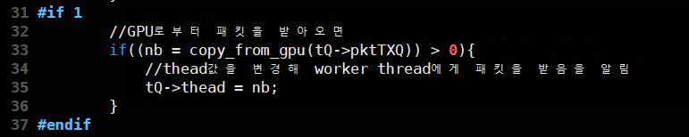

* 기존 Master Thread의 코드에서 GPU로부터 패킷을 받아올때의 조건문은 위와 같았다.
* copy\_from\_gpu 함수를 호출하여 **바로 패킷 Queue에 패킷을 복사**하고 복사된 패킷의 수가 0보다 크면 thead의 값을 복사된 패킷수로 변경해주는 방식이었다.
* 이는 **Worker Thread가 I/O처리를 마쳐 패킷 Queue가 비었는지**에 대해 고려하지 않은 코드이다.


<center> Master Thread code : After </center>


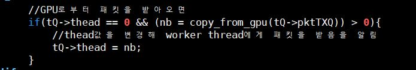

* 기존 조건문에 thead가 0인지 확인하는 조건을 삽입했다.
* 조건 삽입을 통해 **Worker Thread가 I/O처리를 위해 패킷 Queue에서 DPDK 패킷 버퍼로 패킷 복사를 마친 후 thead를 0으로 변경해주면** GPU로부터 패킷을 복사해오게끔 변경되었다.


#### 2. Worker Thread


<center> Worker Thread code : Before </center>


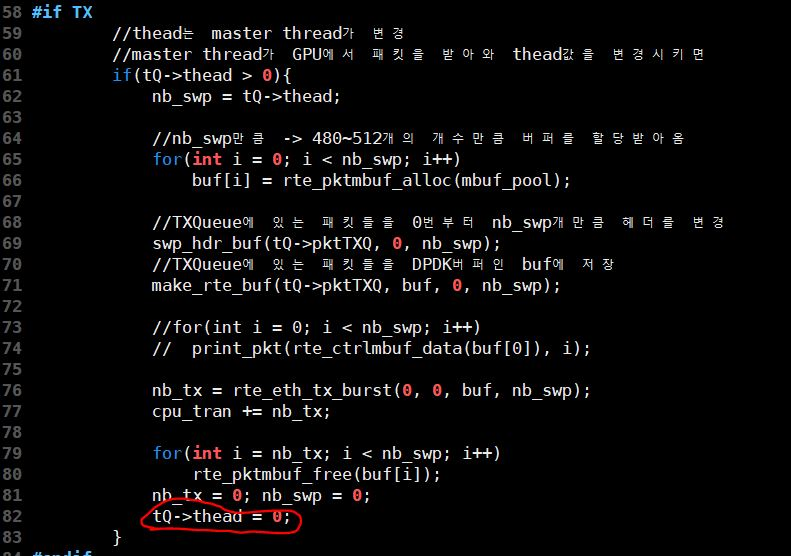

* 기존 코드에서는 **패킷 Queue에 있는 패킷의 헤더 변경 \-\> 패킷 Queue에 있는 패킷을 DPDK 패킷 버퍼에 저장 \-\> 패킷 전송 및 버퍼 free \-\> thead변경**의 순서대로 진행되었다.
* 이로인해 **Worker Thread가 과도하게 많은 시간동안 패킷 큐를 점령**하고 있게 된다.


<center> Worker Thread code : After </center>


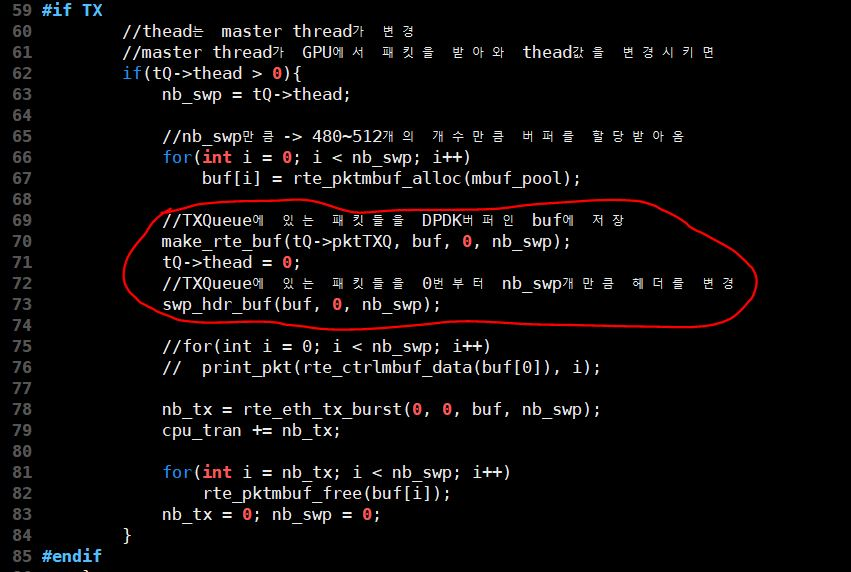

* 위의 코드는 기존 방식에서 패킷 처리 순서를 변경한 코드이다.
* **패킷 Queue에 있는 패킷을 DPDK 패킷 버퍼에 저장 \-\> thead변경 \-\> 패킷 Queue에 있는 패킷의 헤더 변경 \-\>  패킷 전송 및 버퍼 free**의 순서대로 진행되게 변경하였다.
* 이로인해 Worker Thread가 패킷 Queue를 최대한 빨리 비우고 **DPDK 패킷 버퍼에서 I/O 작업을 진행**하게 되어 Master Thread가 패킷 Queue에 더 빈번하게 접근가능하게 수정되었다.


#### 3. GPU App

<center> GPU App code : Forwarding </center>


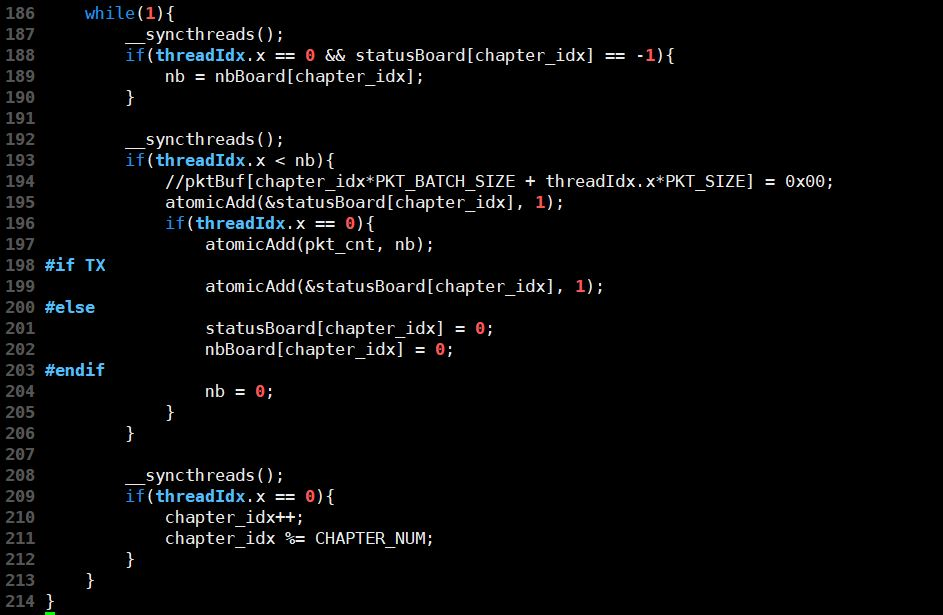

* 위의 코드는 DPDK Forwarding 버전에 사용된 GPU kernel 코드이다.
  * 다른 NF 코드들도 동일하게 변경되어 가장 간단한 코드인 Forwarding으로 예시를 들었다.
* 위의 while문은 3개의 if문으로 구성되어 있다.
  1. statusBoard를 확인하여 패킷이 Master Thread로부터 전달되었는지 확인
  2. 전달받은 패킷 수보다 작은 번호를 가지는 thread들이 GPU processing을 진행
     * Forwarding에서는 하는 일이 없다.
  3. chapter\_idx 변경으로 패킷 버퍼의 다음 챕터에 패킷이 복사되어있는지 확인
* 각 if문 전에 syncthread를 추가하여 모든 thread가 같은 nb값을 사용하고 같은 chapter\_idx를 통해 동일한 챕터를 확인하게 강제하였다.
* 또한, 2번째 if문에서 thread들은 각자의 processing을 마친 후 statusBoard의 값을 1 증가시킨다.
* 마지막에서 0번 thread가 statusBoard의 값을 1 추가로 증가시켜 nb의 값고 statusBoard의 값이 동일하게 맞춰준다.
  * statusBoard가 -1부터 시작하므로 1을 추가로 증가시켜주어야한다.
* Master Thread는 copy\_from\_gpu 함수를 통해 위의 패킷을 복사해오는데, 이때 **statusBoard의 값과 nbBoard의 값이 동일한 챕터**의 패킷을 복사해온다.
* 위의 과정을 통해 **모든 thread가 전달받은 패킷에 대한 처리를 끝내야 Master Thread가 패킷을 복사해가게끔** 강제하였다.
  * nb\(받은 패킷 수\)와 statusBoard의 값\(패킷을 처리한 thread의 수\)가 동일해야 전달받은 패킷을 모든 thread가 처리했다는 것이기 때문이다.


#### 4. Pkt-gen


<center> Pkt-gen : range </center>


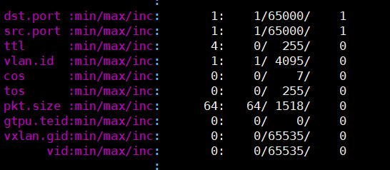

* Router와 IPSec의 경우 각 패킷이 ip와 port값이 pkt\-gen의 range 기능을 통해 변화하면서 전송되도록 설정해두었다.
* 이때 range의 기능을 사용하게 되면 패킷의 크기도 range를 통해 지정해주지 않으면 위의 상태로 전송되어 **64B의 크기로 전송**된다.
* 따라서 다음의 명령어를 통해 pkt\-gen에게 패킷 크기를 지정해줘야한다.

```
range 0 size start (pkt size)
range 0 size min (pkt size)
range 0 size max (pkt size)
set 0 size (pkt size)
```

* **range 모드를 위한 패킷 크기 뿐만 아니라 기본 pkt\-gen을 위한 패킷 크기도 설정해주어야한다.**

---

### DPDK Performance

* 아래는 DPDK의 Forwarding과 NF 성능 그래프이다.


<center> DPDK Forwarding Graph </center>

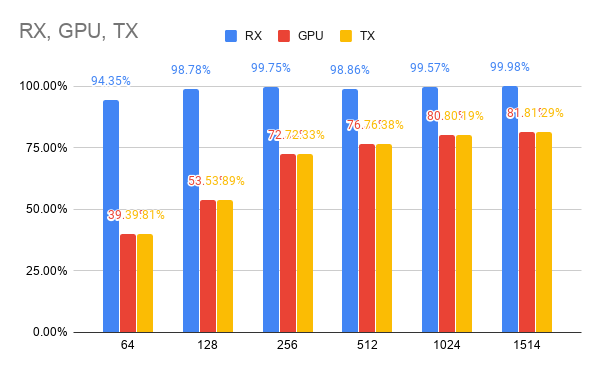


<center> DPDK NF Graph </center>

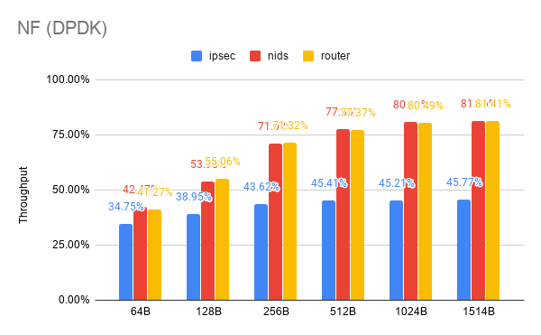


---

## 07/29 현재상황

* Cache Pollution test를 진행했다.
* DPDK와 GPU를 결합한 코드에서 512B 이상의 크기의 패킷의 경우에서 TX rate이 큰 폭으로 변화하는 버그가 있다.

---

### Cache Pollution Evaluation

* 기존의 Access, Memcpy, Add실험이 아닌 Matrix Product을 Noisy Neighbor로 지정해서 실험을 진행했다.
  * Access, Memcpy, Add 실험은 6.28일자 실험 참고
* Lynx 논문에서의 Matrix Product 실험을 참고했다.
  * Lynx에서도 snow와 동일하게 15MB의 L3 캐시를 사용해 동일한 크기의 Matrix를 이용해 실험했다.
* 기존의 실험에서는 DPDK를 CPU I/O만 기능하는 코드를 택하였으나 DPDK와 GPU를 결합한 코드를 채택해 실험을 진행했다.
* pktgen에서 랜덤 payload 패킷을 전송하게 하였으며 1514B의 패킷을 사용해 실제 환경과 유사한 환경을 조성했다.


<center> Cache Pollution Graph </center>


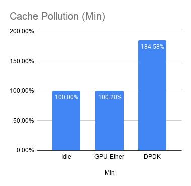

* GPU\-Ether는 0.2%의 적은 performance degradation을 보인 반면, DPDK는 84.58%의 높은 degradation을 보였다.
* 기존 실험과 달리 극명한 차이를 보인 이유는 다음과 같이 추정된다.
  1. 랜덤 payload를 사용
  2. 행렬곱을 1회 시행하여 이전 시행이 다음 시행에 영향을 미치지 않음

---

### DPDK TX rate Problem

* 512B 이상의 크기를 가지는 패킷의 경우 DPDK가 불안정한 TX rate를 보였다.


<center> DPDK with GPU : 1514B </center>


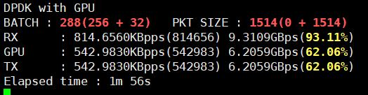


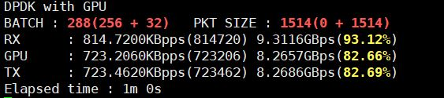

* 위는 router를 실행하는 DPDK의 Throughput이다.
  * forwarding도 동일한 증상을 보이지만 사진이 없어 router로 대체했다.
* 200Kpps의 변동폭을 가진다.
* 이는 1514B의 패킷 기준으로 RX rate의 25%가량의 성능 변화이다.
* 하지만 Monitoring Loop을 실행시키지 않는다면 안정적인 rate을 보인다.


<center> DPDK with GPU :1514B with No Monitoring </center>


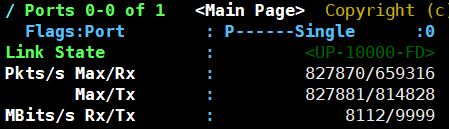

* 모니터링을 하지 않는다면 위의 수치를 안정적으로 보여준다.
* 이는 **CPU thread의 과부화**에 의한것으로 추측된다.
* 위의 문제를 해결할 필요가 있다.


---

## 07/26 현재상황

* DPDK와 GPU를 결합한 코드를 완성했다.
* Worker\-Master형식의 코드와 Worker가 Master의 역할을 모두 수행하는 코드를 만들었다.
  * 각각 dpdkGPU와 dpdkGPUONE이다.
* Worker\-Master형식의 코드가 Forwarding에서 더 높은 속도를 보여 Worker\-Master형식의 DPDK코드가 최종 채택되었다.
* Worker\-Master형식의 코드를 이용해 GPU로 넘겨줄때의 batch하는 패킷수 변화에 따른 Throughput을 확인해보았다.
* 결론을 먼저 밝히자면

**1. Worker\-Master와 One Core의 경우 Worker\-Master 형식이 채택되었다.**

**2. 최적의 batch 크기는 256개이다.** 

---

###  Worker\-Master vs One Core

* Worker\-Master형식과 1개의 thread가 모두 처리하는 방식의 성능 차이는 상황에 따라 다르다.
* **아래의 Bps와 %는 정확한 수치를 출력하지 못하므로 무시해야한다.**


<center> Rx with reaching on GPU : Worker-Master</center>


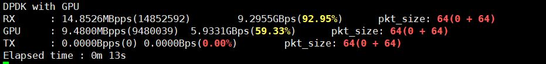


<center> Rx with reaching on GPU : One Thread</center>


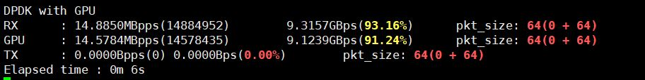


* 위의 그림은 DPDK가 RX한 패킷을 GPU에 넘겨주는 과정까지만 진행했을 때의 Throughput을 측정한 실험 결과이다.
  * 패킷의 크기는 64B이며 batch한 패킷 수는 512개이다.
* 위의 경우에 대해서는 One Thread의 경우 거의 모든 패킷을 GPU에 전달한 반면, Worker\-Thread의 경우 9.5M개의 패킷만 전달할 수 있었다.


<center> Forwarding : Worker-Master</center>


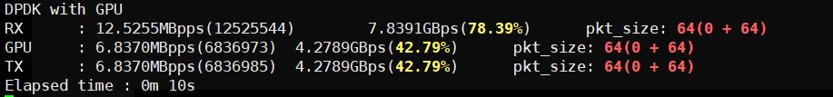


<center> Forwarding : One Thread</center>


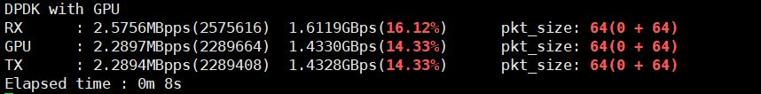

* 위의 사진은 DPDK가 pktgen이 전송한 패킷을 GPU에 전달한 뒤 GPU에서 패킷 수를 카운트하고 다시 DPDK에 전달, 그 후에 DPDK가 TX를 하는 Forwarding을 모두 진행했을 때의 실험 결과이다.
  * 패킷의 크기는 64B이며 batch한 패킷 수는 512개이다.
* 위의 경우에서는 1개의 Thread를 사용할 경우 2.5Mpps만큼의 RX Throughput을 보이며 GPU에 도달하는 패킷수와 TX는 그보다 적은 2.3Mpps를 보였다.
* 반면 Worker\-Master의 경우 6.8Mpps의 50%에 살짝 못미치는 수준의 속도를 보였다.
* 이는 Packet Shader가 보여준 성능과 유사하다.
  * Packet Shader는 3개의 Worker와 1개의 Master Thread 그룹을 다수 구현하고, 10G NIC 8개를 사용해 80Gbps 환경에서 실험해 40Gbps가량의 성능을 보였다.
    * Thread 그룹의 수는 밝히지 않았다.
    * 논문에서 밝힌 실험환경상 4개였을 것으로 추측된다.
* Packet Shader가 Worker Thread 수를 늘리고 pipelining을 하는 등 다양한 최적화 기법을 적용했음에도 불구하고 50%의 성능이었던 것을 감안하면 **적절한 수치라고 추측된다.**

* **위의 실험결과에 의해 Worker\-Master 형식의 DPDK가 채택되었다.**
  * 그 이유는 NF와 Forwarding 실험을 해야하기 때문


---

### Batch Size Test

* Worker\-Master 형식의 DPDK를 사용하여 batch size test를 진행했다.
* 64B의 패킷을 사용했으며 DPDK가 받은 패킷 수\(RX\), GPU에 도달한 패킷 수\(GPU\), DPDK가 전송한 패킷 수\(TX\)를 각각 기록하였다.
* 그래프의 수치들은 pktgen이 전송한 패킷 수로 RX/GPU/TX를 각각 나눈 값을 퍼센트로 사용했다.
  * pktgen이 전송한 패킷 중 몇 퍼센트가 RX/GPU/TX처리 되었는지를 퍼센트로 나타낸 것이다.

<center> Batch Size Test Graph </center>

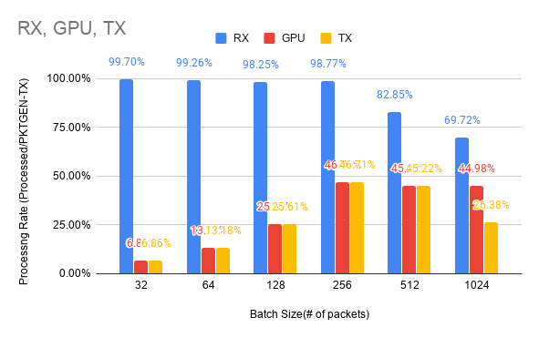

* 위의 그래프를 보면 예상과 다르게 256개의 batch 크기가 최적의 크기임을 알 수 있다.
* 512개를 batch할 경우 GPU에 도달하는 패킷수가 256개일때와 동일하지만 batch하는 과정에서의 overhead에 의해 **RX rate이 떨어졌다.**
* 1024개를 batch할 경우 batch  overhead에 의해 **TX rate까지 떨어졌다.**
* RX를 100% 근방으로 처리하면서 GPU에 가장 많은 양의 패킷을 전달하는 batch의 수는 256개였다.
* **따라서 NF에서의 실험은 256개로 진행해야한다.**


---

## 07/23 현재상황

* dpdk와 GPU를 결합해 작동하는 Worker\-Master 버전의 dpdk를 구현중이다.
* Worker\-Master 버전의 dpdk 구현 중 생긴 이슈를 남긴다.

---

### Segfault error 6

1. 발단
   * DPDK의 IO와 Fowarding 등 모든 기능을 하나의 thread에서 담당할때는 발생하지 않았던 에러가 발생했다.
   * IO만을 담당하는 Worker thread와 Master thread로 분리하고 이들간의 소통을 위해 pktMetaData 구조체를 만들어 RX/TX를 위한 패킷 큐와 이들의 head를 각각 담게끔 만들었다.
   * 해당 구조체 변수\(pmd\)를 선언해 서로간의 데이터 공유를 시도했다.
   * 컴파일 후 실행시 정상작동하지만 패킷을 전송받기 시작하면 segfault가 발생하며 종료된다.
   * dmesg를 통해 확인하니 segfault error 6라는 에러가 발생한 것이었다.
2. 원인 파악
   * master thread와의 통신에 문제가 발생한 것으로 추측하여 파일 분할에 문제가 있어 발생한 것으로 추측하였다.
     * master thread의 코드를 모두 주석처리하여 worker thread만 해당 변수에 접근하게 하였으나 동일한 에러가 발생했다.
   * 구조체를 사용한 것에 문제가 발생한 것으로 추측하였다.
     * 구조체 내부의 field를 각각 따로 선언후 접근하게 하였으나 동일한 에러가 발생했다.
   * segfault error 6에 대해 검색해보니 다음과 같은 의미를 담고 있다고 한다.

``` 6: The cause was a user-mode write resulting in no page being found. ```
   * user\-mode write를 진행하려는 메모리의 page가 발견되지 않았다는 뜻이다.
   * 좀 더 자세한 원인을 파악하기 위해 gdb를 사용했다.

<center> gdb debug result </center>

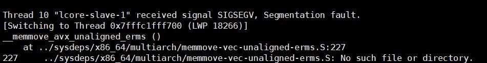

3. gdb 결과 분석
   * 해당 결과를 검색해보니 다음과 같은 답변이 나왔다.


   * 메모리 관리에 문제가 있다는 뜻이다.
   * 위의 답변과 segfault error 6의 의미를 함께 생각해보면 다음과 같은 결론이 나온다.
   * **할당한 메모리 영역 너머의 공간에 접근을 시도했다.**

4. segfault 원인 코드 수정
   * segfault를 유발한 코드는 DPDK 패킷 버퍼 내의 패킷 데이터를 character 배열\(패킷 Q\)로 옮겨 담는 함수인 **make\_char\_buf**함수였다.

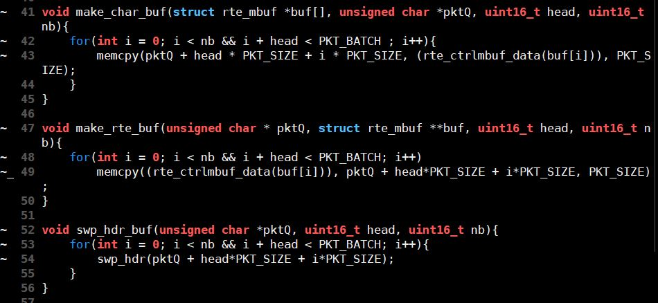

   * 위의 코드의 for문 조건부는 원래 **i < nb**였다.
   * 즉, 위의 조건은 **할당된 메모리 영역은 신경쓰지 않고 받은 패킷 수만큼 옮겨담는데에만 관심을 가지겠다**라는 뜻이다.
   * 위의 코드를 **i < nb && head + i < PKT\_BATCH**로 변경했다.
      * head는 패킷 Q에 패킷 데이터가 담기는 시작점을 의미한다.
      * 60이라면 60개의 패킷 데이터가 패킷 Q에 담겨있으니 61번째의 공간부터 패킷 데이터를 저장하라는 의미이다.
      * 패킷 Q의 크기는 PKT\_BATCH로 \(패킷의 크기\) \* \(패킷을 배치하는 개수\)의 크기이다.

* 위의 과정을 거친 후 코드는 segfault를 발생시키지 않고 정상작동한다.

---

## 07/16 현재상황

1. 랜덤 ip 혹은 랜덤 payload를 가진 패킷 전송이 가능하게 DPDK pktgen을 수정하였다.
2. 랜덤 ip 패킷을 이용해 router 실험 결과를 수집했다.
3. 랜덤 payload 패킷을 이용해 router 실험 결과를 수집했다.

---
### DPDK pktgen을 이용해 랜덤 ip를 가진 패킷을 전송하는 법

* 사실 랜덤 ip는 아니다.
* 랜덤에 가까운 형태의 ip를 전송시키는 것이다.
* 방법은 다음과 같다.

1. rand\_router.pkt 파일을 생성한다.
   * 사실 이름은 상관없고 .pkt의 확장자만 가지면 된다.
2. rand\_router.pkt 파일 내에 다음과 같은 내용을 기입한다.


```
enable 0 range
range 0 dst ip start 0.0.0.0
range 0 dst ip min 0.0.0.0
range 0 dst ip max 255.255.255.255
range 0 dst ip inc 5.7.3.11
range 0 dst mac start a0:36:9f:03:13:86
range 0 dst mac min a0:36:9f:03:13:86
range 0 dst mac max a0:36:9f:03:13:86
range 0 dst mac inc 00:00:00:00:00:00
range 0 dst port start 1
range 0 dst port min 1
range 0 dst port max 65000
range 0 dst port inc 1
range 0 src port start 1
range 0 src port min 1
range 0 src port max 65000
range 0 src port inc 1
range 0 src ip start 0.0.0.0
range 0 src ip min 0.0.0.0
range 0 src ip max 255.255.255.255
range 0 src ip inc 7.11.5.3
```

   * 위의 코드의 의미는 다음과 같다.
   1. 패킷을 단일 패킷이 아닌 일정 범위에 해당하는 패킷을 전송 가능하게 하겠다.
   2. 패킷의 destination의 ip는 0.0.0.0에서 255.255.255.255까지 5.7.3.11씩 증가된다.
      * 5.7.3.11의 의미는 각 숫자들이 2의 서로소이면서 소수이게 만든 것이다.
      * 서로 다른 소수이므로 랜덤에 가까운 변화를 보이지 않을까해서 만든 것이다.
   3. 패킷의 destination의 mac ip는 snow의 mac ip로 고정시킨다.
   4. 패킷의 destination의 port는 1부터 65000까지 1씩 증가된다.
   5. 패킷의 source의 ip와 mac ip도 동일하게 변화한다.
3. execution\_router.sh라는 파일을 만들어 아래의 내용을 기입한다.
```
sudo ./app/x86_64-native-linuxapp-gcc/pktgen -l 0-3 -- -T -P -m [1-3:1-3].0 -f ./nf/router/rand_router.pkt
```
4. execution\_router.sh 파일을 실행시킨다.

* 위의 과정을 마치면 ip와 mac ip, port가 계속 변화하는 패킷들이 전송된다.
---
### DPDK pktgen을 이용해 랜덤 payload를 가진 패킷을 전송하는 법

* 랜덤 payload를 가진 패킷을 전송하기 위해서는 DPDK pktgen의 코드 수정이 필요하다.
* pktgen 폴더의 app 폴더 내에 있는 pktgen.c라는 파일의 수정이 필요하다.

<center> pktgen\_fill\_pattern </center>

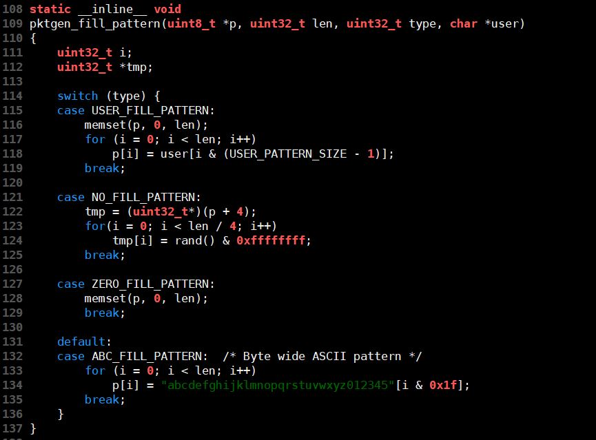

* 위의 함수를 수정해야한다.
* 위의 함수에서 pattern을 none으로 줬을 때 랜덤 payload를 가진 패킷을 전송하게 하기 위해서 NO\_FILL\_PATTERN의 경우에 코드를 추가했다.
* 랜덤값을 대입하는 것을 최적화하기 위해서 uint8\_t을 4개 묶어 uint32\_t로 계산해서 대입한다.
* 여기서 주의할 점은 rand\(\)함수의 시드 값을 주는 srand함수를 **pg\_start\_lcore라는 pktgen의 시작부**에 추가해야한다는 것이다.
   * 아무생각없이 위의 코드에서 랜덤값을 넣어주기 직전에 srand함수를 호출하였다가 Full Rate이 나오지 않는 경우가 발생했다.
   * 더군다나 매번 시드를 타고 들어가 가장 첫 값을 건네받다보니 랜덤 payload를 가지지도 못했다.
* 위의 코드를 추가하고 나면 아래와 같이 랜덤한 payload를 가진 패킷을 전송하게 된다.

<center> Packets with random payload </center>

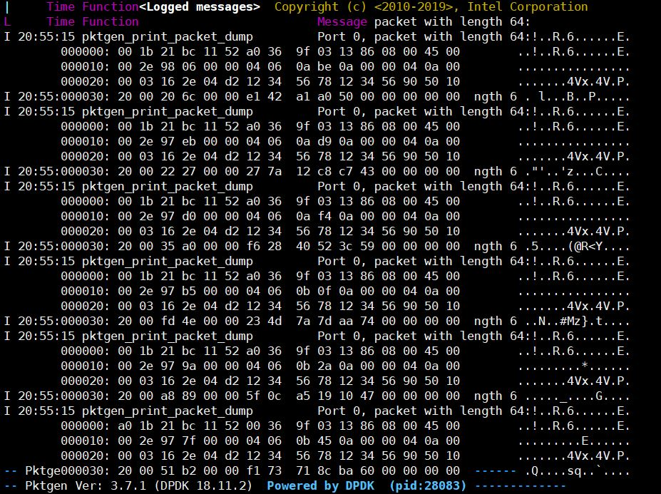
* 위의 패킷을 보면 랜덤한 payload를 가진 패킷임을 확인할 수 있습니다.
---
### NIDS와 Router의 성능

* 아래의 그래프는 랜덤 패킷을 이용해 진행한 실험의 결과이다.

<center> NIDS and Router </center>

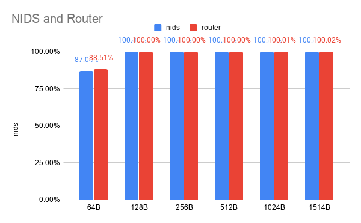
* 64B의 패킷을 제외하고 모두 100%의 성능을 보임을 알 수 있다.
* NIDS의 경우 100%의 성능을 보이지 못할 것이라 예상했지만 **Single Thread로도 100%의 성능을 보인다.** 
* 64B의 패킷의 경우 1%가량의 차이를 보이지만 이는 일시적 변화량에 의한 오차범위 내의 값이다.

---

## 07/14 현재상황

1. DPDK에 컴파일러 옵션을 준 경우와 주지 않은 경우의 실험 결과를 수집했다.
2. GPU\-Ether와 NF를 붙혀 RX와 TX 모두 진행한 경우의 실험 결과를 수집했다.

---

### DPDK Compiler Option Test


<center> No Opt and O3 </center>


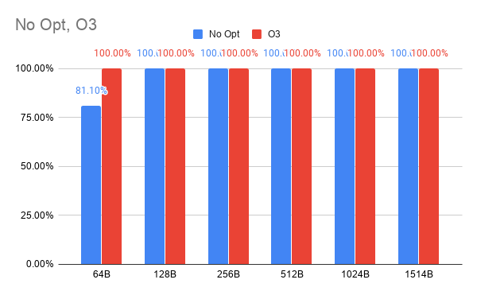

* 위의 그래프에서 확인할 수 있듯이,컴파일러 최적화 옵션을 주지 않은 경우 64B의 패킷에서만 81.1%로 낮은 throughput을 보이고 나머지는 모두 100%를 보인다.

---

### GPU-Ether NF test


<center> NIDS and IPv4 Forwarding </center>


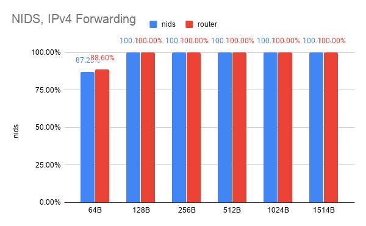

* 위의 그래프는 GPU\-Ether와 NF를 함께 실행시킨 결과를 수집한 그래프이다.
* GPU\-Ether의 RX \-> NF \-> GPU\-Ether의 TX 순으로 실행되었다.
* 64B를 제외하고는 모두 100%를 보였으나 64B의 Forwarding Rate를 생각해보면 사실상 100%라고 봐도 무방할 듯 하다.
* 위는 DPDK\-pktgen에 표기되는 수치로 계산한 것이나, GPU\-Ether가 자체적으로 계산하여 화면에 출력하는 수치로는 **128B 패킷에서 모두 99.7 \~ 99.8%에 상주한다**.

---

## 07/13 현재상황

1. 패킷의 헤더가 변환되지 않거나 헤더가 변환된 패킷을 받게된 이유는 **rte\_pktmbuf\_free**때문이었다.
   * 아래에 설명된 rte\_pktmbuf\_free가 필수적이라는 것은 잘못된 정보이다.
     * 필수이긴 하지만 내용이 다르다.
   * tx\_burst가 패킷 버퍼를 free해주지 않는 줄 알았으나 실제로는 해준다.
   * rte\_pktmbuf\_free는 **RX 받았지만 TX되지 않은 패킷에 한해서** 진행되어야한다.
     * 그렇지 않으면 에러가 발생한다.


<center> rte_pktmbuf_free Example </center>


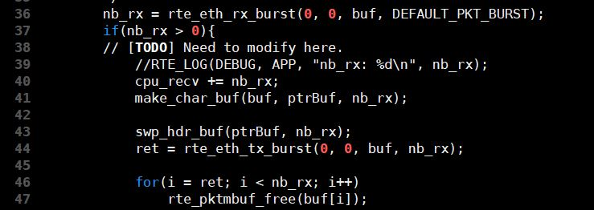


2. DPDK의 log를 기록하고 확인하는 법을 알아냈다.
   * 아래에 자세히 기술한다.

3. 컴파일러 최적화 옵션인 \-O3는 DPDK의 정상작동에 영향을 주지 않는다.
   * rte\_pktmbuf\_free를 없애면 모두 정상작동한다.
   * 최적화 옵션을 줬을 경우 모든 패킷 크기에 대해 100%의 성능을 보인다.
   * 최적화 옵션을 주지 않았을 경우 64B 패킷 크기에 대해 80%의 성능을 보인다.
   * **재실험 후 결과사진 필요**

---

### DPDK log 출력 및 확인

1. DPDK가 log를 출력하도록 설정하여야한다.

* 아래의 방법 중 하나가 그 역할을 한다.
  * 정확하게 어떤 방법이 역할을 했는지는 확실하지않다.


1) dpdk 폴더의 config 폴더 내에 있는 "defconfig_x86_64-native-linuxapp-gccdefconfig_x86_64-native-linuxapp-gcc" 파일을 다음과 같이 수정한다.


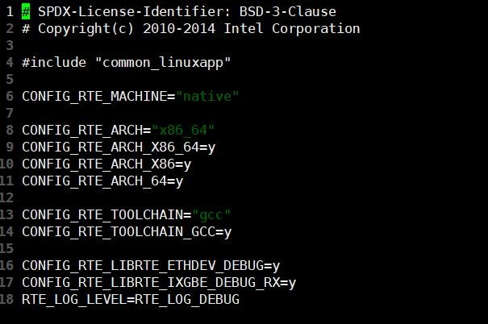


2) dpdk 폴더의 config 폴더 내에 있는 "common_base"파일 중 일부를 다음과 같이 수정한다.


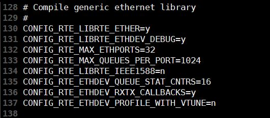

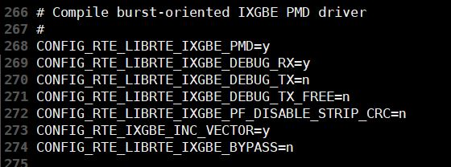

* 위의 방법이 가장 유력하다.


3) rte_log.h 파일 중 일부를 다음과 같이 수정한다.


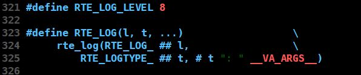


2. DPDK 기반의 앱을 실행시킬때 다음과 같은 옵션을 추가한다.

``--log-level="LOGTYPE,LOGLEVEL"``

* 여기서 LOGTYPE과 LOGLEVEL은 rte\_log.h 파일에 매크로로 기록되어있는 것 중 하나를 각각 택해서 사용한다.


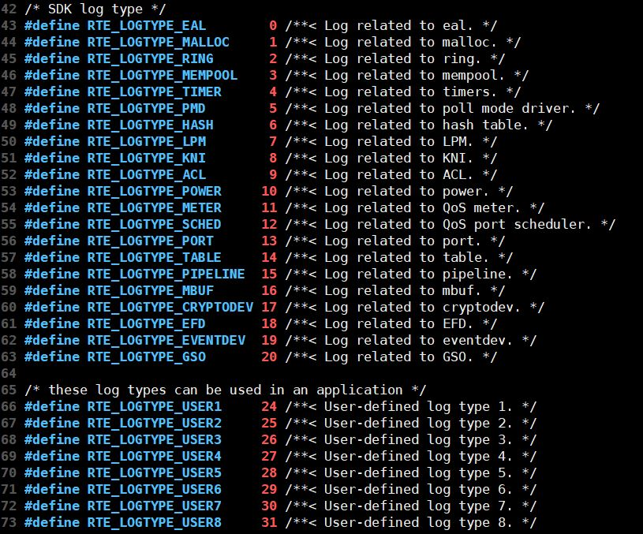

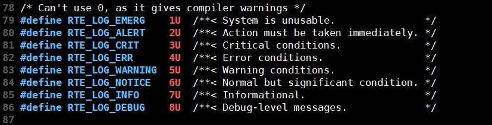

* 위의 방법을 사용하면 **화면에 DPDK log를 출력**한다.


3. /var/log/syslog 파일을 확인한다.

* 화면에 출력된 log든지 출력되지 않은 log든지 모두 syslog에 기록된다.
* 위의 common\_base 파일에 설정하지 않은 LOGTYPE의 경우 log level 옵션을 주지 않으면 syslog에도 출력되지 않는다.


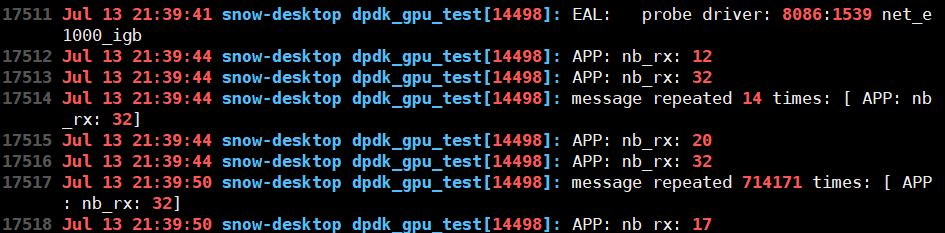

* 위의 형태로 log가 기록된다.
  * 위의 APP: nb_rx: 12라는 log는 DPDK 앱\(rx\_loop\)에서 RTE\_LOG 매크로를 직접 호출하여 log를 기록하게 하여 기록된 log이다.
  * RTE\_LOG\(DEBUG, "nb_rx : %d\n", nb_rx\);

* 위의 과정을 통해 DPDK log를 확인할 수 있다.

---

## 07/12 현재상황

* DPDK가 forwarding할 때, 패킷의 헤더가 바뀌지 않는 문제가 있었다.
* 이를 파악하던 중 이상한 점을 발견했다.

---

### rte\_pktmbuf_free - 잘못된 정보

* 현상 설명 전에 rte\_pktmbuf\_free가 정말로 필요한지에 대해서 미리 언급한다.
* 결론부터 말하자면 **필수**이다.
* 그 이유는 당연히 tx\_burst에서 패킷 버퍼를 free해주지 않기 때문이다.


<center> ixgbe_xmit_pkts </center>


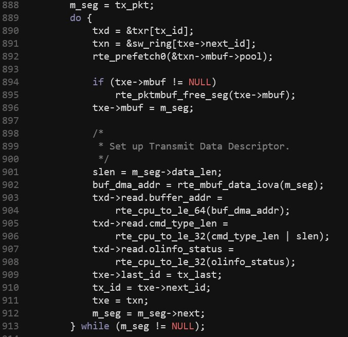

* 위의 코드는 tx\_burst를 호출하였을 때 실제로 불리는 함수인 ixgbe\_xmit\_pkts의 내부 코드이다.
* 위의 do\-while문이 전송을 위해 패킷 버퍼에 실제로 접근하는 유일한 코드이다.
* **그 어디에도 패킷 버퍼를 free해주는 코드가 없다.**
  * rte\_pktmbuf\_free\_seg 함수가 호출되는 이유는 txe의 mbuf라는 field에 패킷을 담아 전송하는 데, 만약 이전에 패킷이 전송되고 free되지 않았다면 이를 free시키고 패킷을 담기 위함이다.
    * rte\_pktmbuf\_free\_seg 함수는 여러개의 segment로 나뉘어진 패킷의 segment 중 하나만을 free해주는 함수이다.
  * 이는 **이 부분에서 mbuf가 사용될 때는 패킷이 전송된 후라는 것이 확실히 보증되었기 때문에 사용**된다. 


---

### Strange Things in DPDK execution

<center> DPDK header check source code </center>

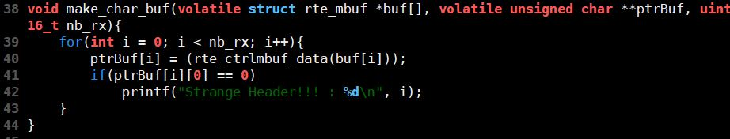


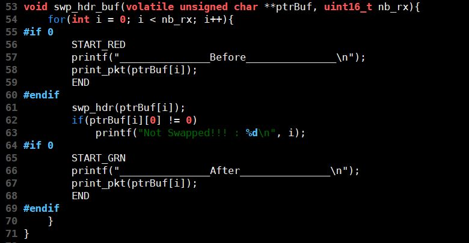

* 위는 헤더가 변환되는지 확인하기위해 printf문을 삽입한 코드이다.
* make\_char\_buf 함수에는 **RX한 패킷을 받은 직후에 확인하여 헤더의 첫번째 값이 0인지 확인한다.**
  * DPDK-pktgen을 실행시킨 ckjung의 mac 헤더의 첫번째 값이 0이다.
  * 따라서 받은 직후의 패킷의 헤더의 첫번째 값이 0이라면 **애초에 DPDK-pktgen에서 destination mac 헤더를 잘못 설정\(a0로 시작하는 snow의 mac 헤더가 아닌 본인의 mac해더로 설정\)해서 전송해준 것**이 된다.
* swp\_hdr\_buf 함수에는 swp\_hdr 함수를 통해 **헤더가 변경된 직후의 패킷의 헤더를 확인하여 헤더의 첫번째 값이 0이 아닌지 확인한다.**
  * 위에 make\_char\_buf 함수에서 설명했듯이 ckjung의 mac 헤더의 첫번째 값이 0임을 이용했다.
  * 헤더가 변경된 직후에 헤더를 확인했는데 0이 아니라면 **잘못된 destination mac 헤더를 가진 패킷이라는 뜻**이다.
* 만약 위의 코드를 실행시켜 Strange Header!!! -> Not Swapped!!!의 순서로 출력된다면 **해당 패킷은 애초에 잘못된 헤더를 담고 들어와 헤더 swap을 했지만 swap이 안된 것처럼 보인다 **라는 뜻이다.
  * snow의 mac ip를 담고와 ckjung의 mac ip로 변경되어서 나가야 정상적인 형태이지만
  * 애초에 ckjung의 mac ip를 담고와 변경을 시도하면 snow의 mac ip로 변경이되므로 swap을 했지만 swap이 안된 것처럼 보인다는 뜻이다.


<center> DPDK strange thing : without compiler optimization</center>


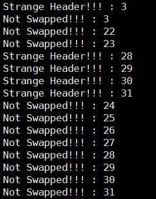

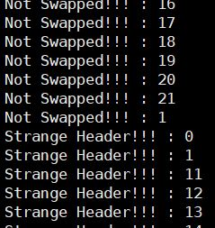

* 첫번째 사진을 보면 **Strange Header!!!가 아닌 패킷도 Not Swapped!!!를 띄운다**는 것을 확인할 수 있다.
  * 이는 snow의 mac ip를 destination ip로 헤더에 정상적으로 담고 왔지만 **진짜로 헤더 swap이 일어나지 않은 패킷**이라는 뜻이다.
* 두번째 사진은 더 이상한 결과를 보여준다.
* sequential하게 실행되는 for문을 실행시켰는데 **21번 패킷 다음에 1번 패킷을 검사하고 이를 바뀌지 않은 것으로 인식한다**.
  * 이 위에서 1번 패킷은 이미 Not Swapped!!를 띄웠다.
  * 중복해서 검사한 것이다.
* 이는 DPDK 코드가 정상 작동을 하지 못하고 있다는 것을 의미한다.
  * 실험 환경은 64B 패킷을 0.01의 rate(약 1513개)로 전송한 것이기 때문에 **Rx rate이 너무 높아서 라는 변명도 못한다**.

---

* 위는 compiler 최적화인 \-O3 option을 주지 않고 컴파일 했을 때 발생한 일이다.
* 그렇다면 -O3 option을 주면 발생하지 않는가
* 는 아니다


<center> DPDK strange thing : with 3rd level compiler optimization</center>


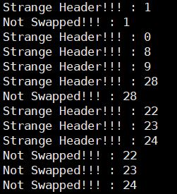

* 첫번째 사진을 보면 \-O3 옵션을 줘도 동일하게 제대로 들어온 패킷의 헤더를 swap하지 않는 경우가 존재함을 확인할 수 있다.
* 위의 결과를 보며 추측한 것은 **free되지 않는 패킷 버퍼가 남아있고 이는 destination mac ip가 ckjung으로 되어있는 상태인데 이를 다시 swap하려고 시도하는가**이다.
* 이는 불가능하다.


<center> Make Bufs Null </center>


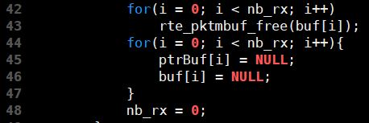

* 이는 dpdk.c에 rx\_loop 함수 내에 있으며, 패킷 버퍼를 tx로 전송한 직후에 있는 코드이다.
* 패킷 버퍼를 rte\_pktmbuf\_free로 free시켜준 후 패킷 버퍼의 데이터 부분을 가리키는 포인터를 담고 있는 배열인 ptrBuf와 패킷 버퍼 배열인 buf 모두 NULL로 바꿔준 뒤, nb\_rx까지 0으로 바꿔주는 것을 확인할 수 있다.
  * 사실 nb\_rx는 0으로 바꿔줄 필요가 없지만 혹시나해서 넣었다.
* 따라서 실제로 패킷 버퍼가 free가 되었든지 말든지 배열에 담겨있는 모든 포인터를 버려버리기 때문에 새로 할당받아 붙여주지 않는 이상 사용할 수 없다.
* 만약 이 전 turn에 받은 패킷 버퍼를 재접근해서 헤더를 바꾸려는 시도를 할 경우 NULL 포인터에 접근하는 것이므로 에러가 떴을 것이다.
* 하지만 에러가 발생하지 않은 것을 통해 **직전에 받은 패킷만 사용하고 그 전 turn에 받은 패킷은 사용하지 않았음**을 확인할 수 있다.

---

### Compiler Optimization

* DPDK에서 발생하는 이상한 현상의 원인은 아직 파악하지 못했다.
* 다만 **\-O3 옵션의 유무가 DPDK 정상작동과 무관하다**라는 것은 확인할 수 있었다.
* 여기서 선택의 기로가 생긴다.
* **\-O3 옵션을 준 상태로 컴파일한 코드를 사용할 것인가, 컴파일러 최적화 옵션이 없는 상태로 컴파일한 코드를 사용할 것인가**이다.
* 이는 아주 ~~좋지 못한~~ 큰 차이를 보이기 때문에 중요하다.


<center> DPDK forwarding rate : without compiler optimization option </center>


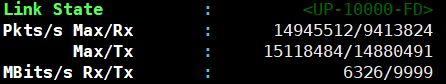

* 위는 기존에 확인했던 DPDK의 forwarding rate이다.


<center> DPDK forwarding rate : with 3rd level compiler optimization option </center>


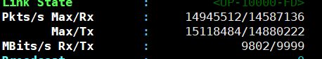

* 위는 \-O3 옵션을 줬을 때의 forwarding rate이다.
* 거의 100%에 가까운 rate을 보인다.

---

* 만약 \-O3 옵션이 DPDK의 정상작동에 영향을 끼친다다면, \-O3 옵션 없이 실행시킨 첫번째 rate\(65%\)을 사용하면 되고 문제가 없다.
* 하지만 만약 -O3 옵션이 DPDK의 정상작동에 정말 하나도 영향을 끼치지 않는다면, 두번째 rate\(99%\)을 논문에 실어야한다.

* \-O3는 높은 확률로 DPDK의 정상작동에 영향을 끼치지 않을 것 같다.
* DPDK의 오작동의 원인을 정확하게 파악하여 어떠한 결과를 사용할 것인지 파악할 필요가 있어 보인다.

---

## 07/08 현재상황

1. DPDK의 구조는 이전 chapter\_idx를 사용하던 버전을 사용하게 되었다.
   * packetShader와 APUNet에서는 패킷 I/O가 **하나의 thread가 RX와 TX를 모두 담당한다**.
     * RX와 TX를 분리해서 구현할 필요가 없다.
   * packetShader와 APUNet에서 master thread가 필요한 이유는 **NIC개수에 맞게 worker thread가 여러개이기 때문에 worker들이 RX한 패킷을 sequential하게 정렬해줄 필요가 있기 때문이다.**
     * 우리는 NIC이 1개여서 worker thread도 1개만 있으면 된다.
     * 고로 master thread가 필요없다.
   * NF를 DPDK와 실험하기 위해서는 GPU-Ether의 실험에서 사용한 NF를 **어차피 수정해야한다**.
     * 패킷을 batch해서 GPU에 전달해야하기 때문에 mempool의 운용방식이 변경될 수 밖에 없다.
     * contiguous한 공간에 패킷을 담아서 batch해야하는 방식이 GPU-Ether의 mempool에 패킷 버퍼가 minimempool을 통해 저장되는 방식과 충돌하기 때문
   * 따라서 **GPU-Ether와 DPDK가 각각 다른 구조의 NF를 사용하므로 패킷 버퍼 운용방식을 통일시킬 필요가 없다**.
2. DPDK가 GPU에 패킷을 전달하지 않고 **오직 CPU에서만 작동되는 DPDK의 forwarding**을 실험해보았다.
   * 이는 아래에 서술해두었다.

---

### DPDK with ONLY CPU forwarding

* 64B와 128B의 패킷에 한해서 GPU에 패킷을 넘겨주지 않고 CPU내에서만 실행되는 DPDK의 성능을 확인해보았다.


<center> 64B packet forwarding </center>


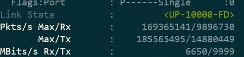


<center> 128B packet forwarding </center>


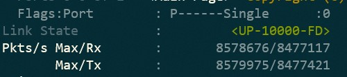

* 위의 사진을 보면 64B의 경우 65%, 128B의 경우 100%의 성능을 보이는 것을 확인할 수 있다.
* 하지만 이는 신뢰할만한 수치가 아니다.


<center> 64B packet forwarding retransmitt </center>


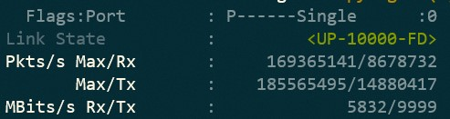


<center> 128B packet forwarding after several seconds </center>


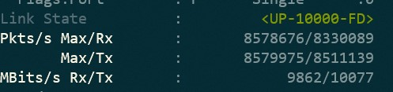


<center> 128B packet forwarding retransmitt </center>


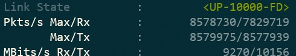

* 64B와 128B 두 경우 모두 pktgen에서 traffic 생성을 멈췄다가 다시 전송했을 때 ~~랜덤한 확률로~~ TX rate 떨어진다.
* 128B의 경우 pktgen에서 전송 시작 후 몇 초내로 TX rate이 떨어진다.

* 이 원인은 파악 중에 있다.

---

## 07/08 현재상황 - 삭제

* 아래의 내용은 불필요해 삭제되었다.

* packetshader와 apunet에서 구현한 Packet I/O의 형태를 본따 DPDK 대조군을 구현중에 있다.
* 대략적 구상을 마쳤고, 실제 구현만 하면 되는 상태이다.

---

### 함수 흐름


<center> dpdk packet flow </center>


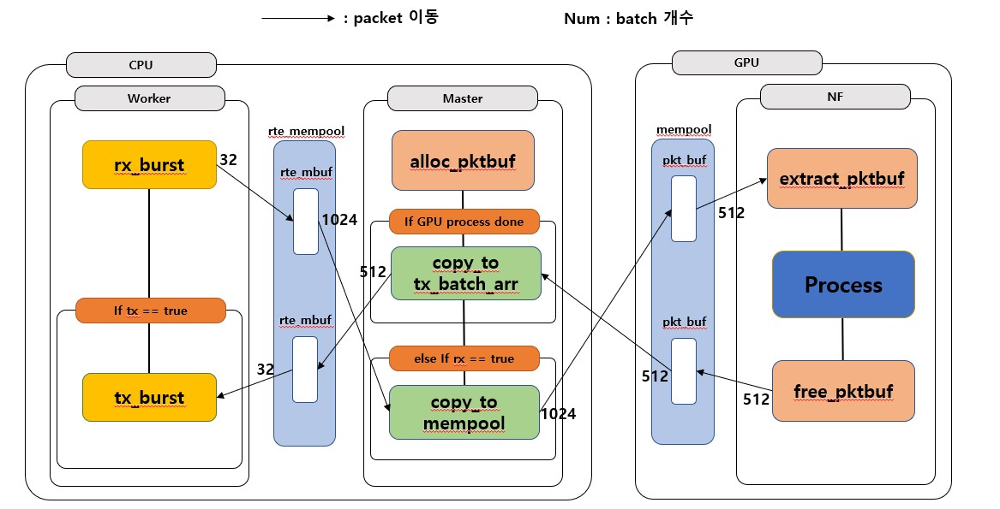

* 현재 구상중이 DPDK의 패킷 흐름이다

1. worker

   1. rx_burst 
      * DPDK가 NIC에서 패킷을 받아온다.
      * 이는 기본 burst 개수인 32개가 max이다.
      * 이를 rte\_mempool\(DPDK의 mempool\)내부의 rte\_mbuf\(DPDK의 패킷 버퍼)에 저장한다.
      * 저장한 패킷 버퍼가 무엇인지 master node에게 알린다.
      * rx를 true로 변경한다.
   2. if tx == true
      * tx flag가 true인지 확인한다.
      * tx flag는 master node에서 변경된다.
   3. tx\_burst
      * tx flag가 true일때만 실행된다.
      * master node가 지정해준 버퍼들을 하나씩 전송한다.

2. master

   1. alloc\_pktbuf

      * GPU의 mempool\(GPU-Ether의 mempool\)에서 pkt\_buf\(GPU-Ether의 패킷 버퍼\)를 할당받는다.

   2. if GPU process done

      * 할당받은 패킷 버퍼가 GPU process를 끝낸 데이터를 담고있는 버퍼인지 확인한다.
      * 해당 process가 끝났는지에 대한 정보는 app\_idx로 판단한다.

   3. copy\_to\_tx\_batch\_arr

      * GPU process가 끝난 패킷에 대해서만 실행된다.

      * 버퍼들을 worker node에게 알려준다.

   4. else if rx == true

      * GPU process가 끝낸 데이터를 담고 있는 패킷 버퍼를 할당받은 것이 아니며, DPDK가 받은 패킷을 GPU에 전달해야하는 상황인지 확인한다.
      * rx flag는 worker node에서 변경된다.

   5. copy\_to\_mempool

      * worker node에 의해 지정된 패킷 버퍼\(DPDK\)들을 mempool\(GPU-Ether\)의 패킷 버퍼\(GPU-Ether\)에 복사해넘겨준다.
      * 이를 app\_idx를 통해 GPU에게 알려준다.

3. GPU

   1. extract\_pktbuf
      * GPU-Ether에서의 역할과 동일하게 할당받고 데이터까지 저장된 패킷을 받아오는 역할을 한다.
      * GPU-Ether과 내부구조는 차이가 있다.
      * batch해서 넘겨줘야하는 DPDK의 구조에 의해 chapter\_idx를 쓰던 버전과 유사한 구조의 mempool형태를 띄고 있다.
      * 현재 chapter내에 있는 버퍼들이 모두 처리가 끝나야 다음 버퍼로 넘어간다.
   2. free\_pktbuf
      * 현재 chapter 내에 있는 버퍼들이 모두 처리가 끝난 경우 해당 버퍼들을 free해준다.
      * 여기서 GPU process가 끝났다는 것을 알려줄 필요가 있다.
      * 이는 위에서 서술한 바와 같이 app\_idx로 알린다.

---

### 세부 구현시 주의해야할 사항

1. batch하는 패킷의 수에 변동
   * batch하는 패킷의 수가 변동하는 이유는 **모든 크기의 패킷들에 대해 DPDK가 최대의 효율을 보이는 batch의 개수가 1024개이지만, GPU의 thread 수는 512개이기 때문**이다.
   * 이러한 변동사항이 있어도 pipelining이 잘 이루어지는지에 대한 의문이 있다.
   * 결국 이러한 구조로 변경하게 되면 GPU-Ether가 겪었던 문제를 유사하게 겪게되는 것이다.
   * 만약 이슈가 발생한다면 GPU-Ether가 해결한 방식으로 해결을 시도하거나, batch하는 패킷의 수를 통일시킬 필요가 있다.
2. 구조체 변경 \(DPDK의 rte\_mbuf \-\> GPU-Ether의 pkt\_buf)
   * NF들은 모두 GPU-Ether의 mempool과 pkt\_buf를 사용하는 것에 맞춰서 구현되어 있다.
   *  DPDK와 NF를 호환시키기 위해서는 **master node가 패킷 버퍼 구조체를 변경시켜줄 필요가 있다**.
   * **여기서 발생하는 overhead는 무시할 것인가**에 대한 생각을 해볼 필요가 있다.
     * 사실 원래 필요한 cudaMemcpy에 GPU-Ether의 pkt\_buf에 필요한 field 몇개 변경이 추가된 정도에 불과하다.
     * 이 또한 사실 app\_idx처럼 field 변경이 불가피한 경우가 존재한다.
     * 걱정되는 부분은 **위의 부분이 충분한 사유가 되는가**이다.
   * 만약 패킷 버퍼 구조체를 변경시키지 않는 방향으로 구현을 하게 된다면, NF의 구조를 변경시켜야한다.
   * 이렇게 되면 **DPDK와 GPU-Ether가 실험에 사용한 NF의 구조가 각각 다른 형태를 띄게 된다**.
     * 사실 extract\_pktbuf 함수의 내부구조와 mempool의 운용방식에 변화가 있어 이미 같은 구조라고 보기는 힘들다.
   * 실행 중에 구조체를 변경시킬 것인지 NF 코드의 구조를 변경시킬 것인지에 대한 결정이 필요하다.
3. ~~rte\_mempool의 사용~~
   * ~~기존 DPDK 코드는 rte\_mempool을 선언하지만 사용하지는 않는다.~~
   * ~~대신 rte\_mbuf를 한번 선언하고 이를 계속 재활용해서 사용하는 형태로 구현되어 있다.~~
   * ~~모든 기능을 하나의 함수 내에서 sequential하게 진행하던 기존 방식과 달리, worker와 master node로 분리된 현재 방식을 위해선 rte\_mempool의 사용이 필수적이다.~~
   * ~~구조의 어마어마한 변화가 필요한 것은 아니지만 rte\_mempool을 운용하는 방식을 알아볼 필요가 있다.~~
   * 


---

## 06/28 현재상황

* 다음의 실험을 진행하였다.

1. cache pollution 실험

   * 이 전의 실험과 달라진 점이 두가지 있다.

   1. 1회의 컴파일로 생성된 아웃풋 파일을 모든 실험에 반복 사용하였다.
      * 이 전에는 매 실험때마다 컴파일 후 새로 생성된 아웃풋 파일을 사용
   2. 배열의 크기를 L3 캐시의 크기에 맞춰서 생성하였다.
      * i7-6800k CPU를 사용하는 snow 서버는 15MB의 L3 캐시 사이즈를 가진다.
   3. access와 memcpy가 아닌 두 개의 배열에 있는 값을 더하여 다른 배열에 저장하는 add 실험이 추가되었다.
      * arr1과 arr2에 있는 값을 arr3에 대입하며, arr1와 arr2의 크기의 합이 L3캐시의 크기와 같다.

2. 완성된 rx_kernel을 사용해서 nf 실험

   * 이 전과 달리 ipsec도 실행 가능하다.

---

### cache pollution

* 위에 서술한 바와 같이 **L3 캐시를 모두 사용하는 크기의 배열**을 만들어 실험에 사용하였다.
* 결론부터 말하자면 **DPDK는 최소 8%, GPU-Ether는 최대 2.5%의 burden이 발생했다**.


<center> cache pollution test result </center>


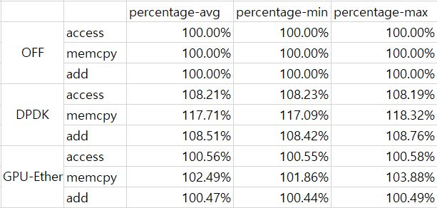

* DPDK의 경우 최소 8% 이상의 burden을 보였고 memcpy의 경우 최대 18%의 burden을 보였다.
* GPU-Ether의 경우 최소 0.5%, memcpy의 경우 2.5%의 burden을 보였다.
* DPDK와 GPU-Ether 모두 memcpy에서 다른 실험에 비해 큰 값을 가졌는데 이에 대해서는 더 알아볼 필요가 있어보인다.
* access와 add 실험의 경우 모두 DPDK는 cache pollution을 보이지만 GPU-Ether는 cache pollution을 거의 보이지 않는다는 결과를 보여준다.

---

### nf 실험

* nf에서는 신경써야할 이슈가 하나 있다.
* 이슈에 대해서 논하기 전에 이슈를 신경쓰지 않고 결과를 도출해보자면 다음과 같다.
* nids와 router는 모두 100%가 나와 생략했다.
  * 사실 nids는 64B와 1514B만 측정했으나 100%가 나올것으로 추정되어 생략했다.


<center> ipsec table </center>


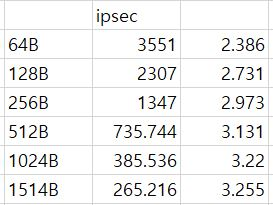

* 왼쪽의 값이 Kpps이고 오른쪽의 값이 Gbps이다.
  * 사실 10G NIC을 사용하였으므로 오른쪽의 값은 데이터 전송 퍼센트라고 봐도 무방하다.
* packet의 크기에 따라 linear하게 증가함을 확인할 수 있다.
* 결과는 모두 의도대로 도출되어 nf가 모두 제기능을 한다고 봐도 되지만 하나의 이슈가 발생하였다.
* 이는 **시간이 지나면 rate가 점점 떨어진다**는 것이다.


<center> ipsec 1024B start </center>


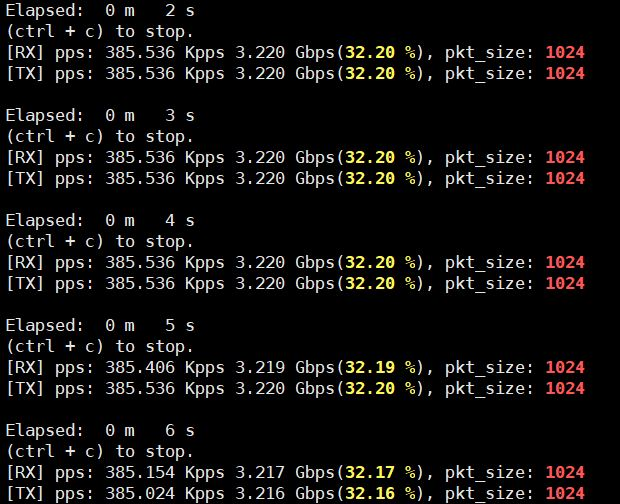


<center> ipsec 1024B end </center>


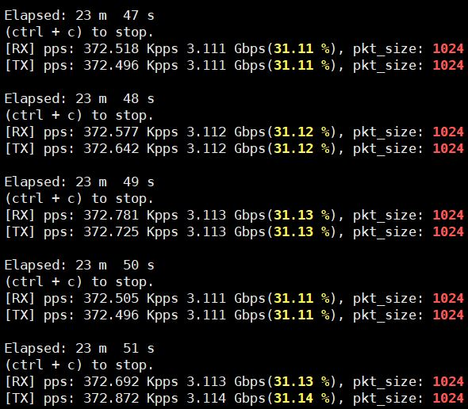

* 위의 사진은 ipsec을 1024B의 패킷에 대해서 20분가량 실행시켰을 때의 결과를 나타내고 있다.
* **20분이 경과하자 총 1%가량 RX와 TX(NF) rate가 감소하였다.**
* 이는 ipsec뿐만 아니라 router와 nids 모두 발생하는 현상이다.
* 이는 기존에 \_\_syncthreads의 문제였던 기억이 있어 nf에 \_\_syncthreads를 추가하여보았다.
* 그 결과 ipsec의 경우 감소 추세는 급격히 감소하였으나 여전히 감소하는 추세를 보였고, nids와 router는 감소하지 않았다.
  * 하지만 nids와 router도 5분가량만 실행시켜본 상태이기때문에 확실히 감소하지 않을 것이라고는 보장할 수 없다.
  * 다만 ipsec의 경우 5분 가량만 실행시켜도 0.5%이상 감소하였기때문에 이와 비교하였을때 감소는 하지만 그 감소폭이 매우 미세하다고 추측할 수 있다.
* 이는 rx\_kernel에 문제가 있는 것으로 추정된다.

---

## 06/27 현재상황

* cache pollution을 위한 실험을 진행하였다.
* 06/25일자 실험에서 반복문의 반복 횟수를 500배 증가시켜 실험을 진행하였다.
* 상황 설정은 06/25일자 실험과 동일하게 설정되었다.
  * 아래에 설명되어있다.

1. 1칸씩 이동하면서 배열에 접근하여 값을 가져와 간단한 연산 후 c라는 변수에 대입
   * 배열의 단일 데이터 접근 실험
2. 16칸씩 이동하면서 배열 arr1의 값 64B를 arr2에 memcpy
   * 배열의 다수 데이터 동시 접근 실험

* 결론부터 말하자면 **cache pollution으로인한 시간적 비용은 약 7~8%로 동일했다.**


<center> Single data access : No any applications </center>


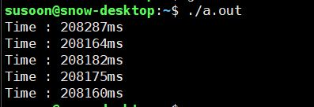


<center> Single data access : DPDK </center>


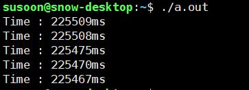


<center> Single data access : GPU-Ether </center>


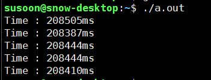


<center> Multiple data access : No any applications </center>


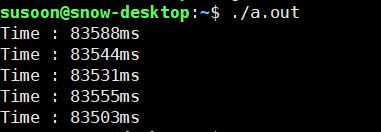


<center> Multiple data access : DPDK </center>


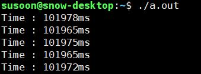


<center> Multiple data access : GPU-Ether </center>


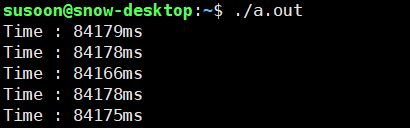

* 위의 데이터를 보면 단일 데이터 접근의 경우 DPDK가 225.5초, GPU-Ether와 app을 실행시키지 않은 경우가 208.3초로 **17.3초\(8.3%\) 정도의 차이를 보였다**.

* 다수 데이터 접근의 경우 DPDK가 19.8초, GPU-Ether와 app을 실행시키지 않은 경우가 18.2초로 **1.5초\(8.2%\) 정도의 차이를 보였다**.


---

## 06/25 현재상황

* cache pollution을 위한 실험을 진행하였다.
* 실험은 65536개의 칸을 가진 배열을 이용했다.

1. 1칸씩 이동하면서 배열에 접근하여 값을 가져와 간단한 연산 후 c라는 변수에 대입
   * 배열의 단일 데이터 접근 실험
2. 16칸씩 이동하면서 배열 arr1의 값 64B를 arr2에 memcpy
   * 배열의 다수 데이터 동시 접근 실험

* 결론부터 말하자면 **cache pollution으로인한 시간적 비용은 약 7~8%로 동일했다.**


<center> Single data access : No any applications </center>


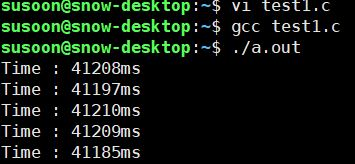


<center> Single data access : DPDK </center>


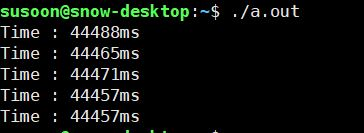


<center> Single data access : GPU-Ether </center>


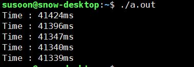


<center> Multiple data access : No any applications </center>


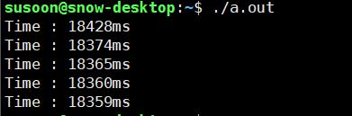


<center> Multiple data access : DPDK </center>


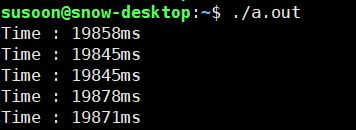


<center> Multiple data access : GPU-Ether </center>


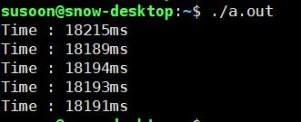

* 위의 데이터를 보면 단일 데이터 접근의 경우 DPDK가 44.5초, GPU-Ether와 app을 실행시키지 않은 경우가 41.3초로 **3초\(7.2%\) 정도의 차이를 보였다**.

* 다수 데이터 접근의 경우 DPDK가 19.8초, GPU-Ether와 app을 실행시키지 않은 경우가 18.2초로 **1.5초\(8.2%\) 정도의 차이를 보였다**.


---

## 06/24 현재상황

1. nf들 mempool 구조에 맞게 수정 후 실험
   * ipsec은 RX-TX 연결이 완성되면 그 후 실험
2. dpdk와 GPU-Ether 각각 CPU cache pollution 있는지 실험

---

### 1. nf들 mempool 구조에 맞게 수정 후 실험

* 모든 nf들을 mempool 구조에 맞게 수정하였다.
* 또한, 1개의 packet당 1개의 thread만을 사용하면서, packet의 크기를 dynamic하게 확인하고 이에 맞게 각 기능을 수행하게끔 모두 수정하였다.

* ipsec의 경우 RX-TX의 연결간에 발생하는 문제와 동일한 문제가 발생하여 추후에 RX-TX 연결간의 문제가 해결될 경우 실험하기로 했다.
  * RX-TX 연결간에 발생하는 문제란 RX가 할당한 버퍼를 사용하는 커널(TX 혹은 nf들)이  버퍼를 반납하는 속도가 RX에 비해 많이 느리면 뻗어버리는 증상을 말한다.
  * ipsec의 경우 RX에 비해 처리속도가 매우 느려 RX가 할당 요청을 압도적으로 더 많이 하다보니 터지는 듯하다.
  * 이는 찬규형과 함께 고쳐봐야할 것 같다.
* router와 nids는 모든 packet size에 대해서 100%의 속도를 보인다.
  * RX와 nf만 실행시켰을 때의 상황
  * free를 nf에서 해줌
* 아래는 router와 nids의 실험결과를 64B와 1514B에 대한 것만 남긴 것이다.


<center> router : 64B </center>


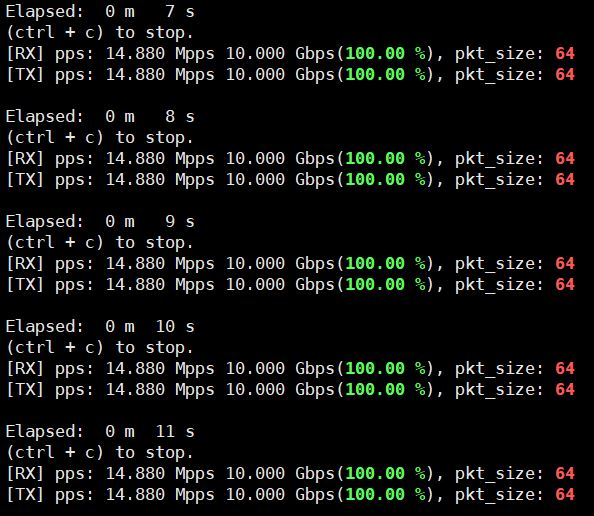


<center> router : 1514B </center>


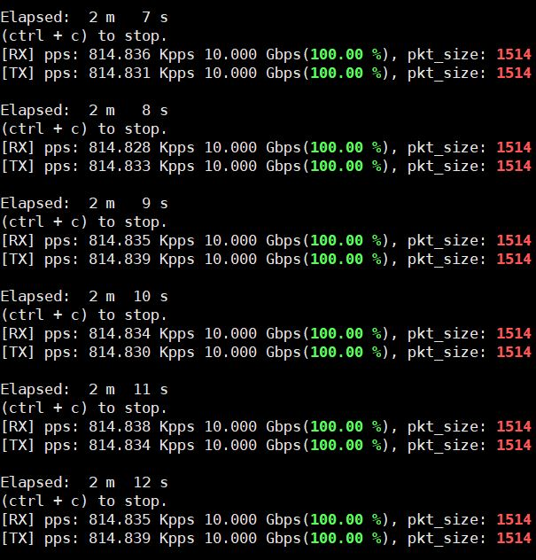


<center> nids : 64B </center>


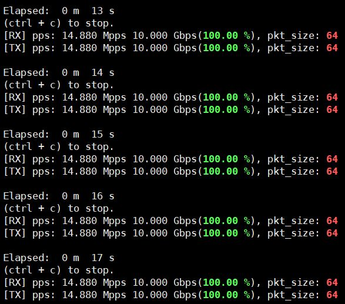


<center> nids : 1514B </center>


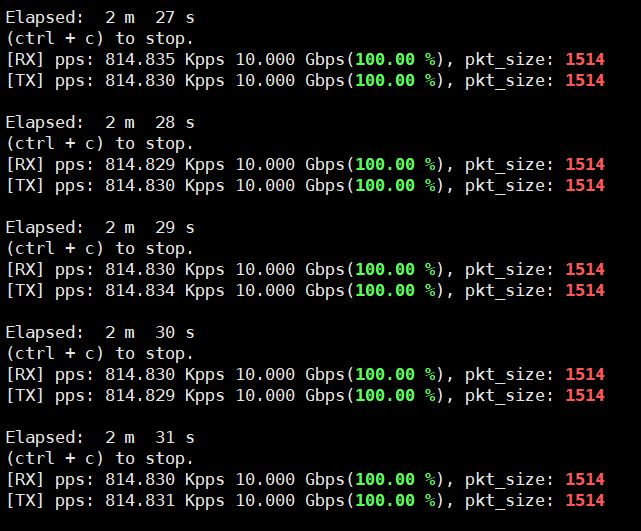

* ~~아주 아름답게도~~ 100%의 속도를 보이고 있음을 확인할 수 있다.
* 이 경우에는 nids와 router가 처리하는 속도가 충분히 빨라서 RX의 속도를 떨어뜨리지 않는 것을 확인할 수 있다.

---

### 2. cache pollution

* DPDK와 GPU-Ether가 각각 cache pollution을 일으키는지 실험해보았다.
* 실험방법은 다음과 같다.

1. DPDK와 GPU-Ether를 snow에서 각각 실행시킨 후 ckjung에서 pkt-gen을 사용해서 64B packet을 최대 pps로 전송한다.

2. snow에서 교수님이 주신 코드를 cache를 사용하는 버전으로 실행시킨다.
   * 교수님이 주신 코드는 2000만번 배열에 접근하는 코드이다.
   * 배열에 2000만번 접근하는 데에 걸린 시간을 측정해서 출력해준다.
   * 이를 cache가 적용되도록 접근하는 것과 cache가 적용되지 않게 접근하는 것 두 가지 방법으로 구현되어있다.
     * cache가 적용되지 않게 접근하는 것은 index를 엄청나게 큰 수(e.g. 100이상)로 증가시켜 cache에 다음 접근될 데이터가 담기지 않도록 구현한 것이다.
   * 실행시킬때 DPDK와 GPU-Ether 모두 **pps 출력 기능을 off해 packet 처리 외의 CPU 사용을 금지시켰다**.

* 이 결과는 다음과 같다.


<center> Normal (without any packet transmission) </center>


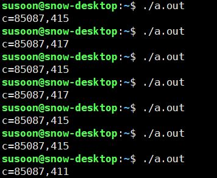


<center> DPDK  </center>


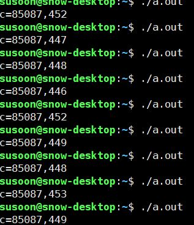


<center> GPU-Ether </center>


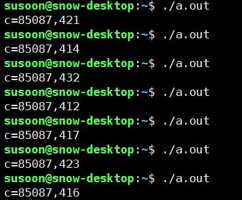


* 위의 결과를 보면 GPU-Ether와 DPDK 모두 실행시키지 않고 test 프로그램을 실행시켰을 때의 결과를 확인할 수 있다.
  * 415ms
  * 이를 base로 삼고 비교한다.
* DPDK를 실행시켰을 경우 450ms, GPU-Ether를 실행시켰을 경우 420ms의 시간이 소요되었다.
  * 오차를 5ms정도로 추정하고 있다.
* DPDK가 base에 비해서 30ms 가량 더 오래 걸리는 것을 확인할 수 있다.

* 반면 GPU-Ether는 오차를 감안하면 동일한 수치를 보임을 확인할 수 있다.
* 결론적으로 **GPU-Ether는 cache pollution을 일으키지 않는다**.


---

## 06/10 현재상황

1. ipsec의 개선점을 찾기
   * 현재 ipsec의 상황은 linear한 증가와 percent상 나름 준수한 수치를 보이는 희망적인 상황이다.
   * 하지만 app buf로의 memcpy를 제외했을 때도 현재와 유사한 상황이 보일지는 의문이 든다.
   * global memory에 높은 빈도로 접근하는 것이 성능 저하의 주 요인인지 정확한 파악이 필요해보인다.
2. nids와 router의 상태파악
   * nids와 router가 어떤 상태에 있는지 파악이 필요했다.
     * 성능이 낮아 최적화가 필요한지
     * resource가 모자라지는 않은지

---

### 1. ipsec

* 어제의 실험으로 ipsec은 완성에 가까운 수준에 도달한 것으로 보인다.
* 현재 가장 걱정되는 사항은 **mempool 시스템으로 바꾸고 나서도 유사한 그래프가 도출될 것인가**이다.
* 이러한 걱정이 생기는 이유는 다음과 같다.

1. memcpy의 overhead가 그렇게 큰 영향을 주지 않을 것 같다는 추측
2. 기존 논문들에서 언급한 주 성능 저하 원인은 SHA에서의 성능저하보다 기존 논문들에서는 큰 영향이 없다던 AES에서의 성능저하가 압도적으로 큰 것
3. ipsec 성능 저하의 정확한 원인 파악 실패

* ipsec 성능 저하의 원인은 **global memory의 빈번한 접근, rx\_buf에서 application buffer로의 memcpy**가 현재까지 밝혀낸 원인이다.
* 하지만 이들은 모두 이 모든 최적화 과정을 거치기 전의 ipsec 초안 버전에서도 동일하게 적용되는 문제들이다.
* 그 때는 multi-thread를 사용했다할지라도 현재 버전의 성능저하가 매우 심하다.
* 이는 mempool 시스템으로 바꾸고 난 뒤의 실험결과를 보고 확인해야할 것 같다.

---

### 2. router & nids

* 결론부터 말하자면 **더 이상 고칠 부분이 없다**이다.
* router와 nids 모두 정상작동하며 100%의 성능을 보인다.
* nids의 경우에만 일부 수정이 있었다.
* nids의 경우 ipsec과 동일하게 1개의 packet당 1개 이상의 thread가 할당되어야했다.
  * 할당되는 thread의 수도 동일했다.
* 이 경우, 512B 이상의 size를 가지는 packet들에 대해서는 thread 수가 부족해 성능의 급격한 저하를 가지게 된다.
* 이를 해결하기 위해서 ipsec에 적용했던 single thread solution을 적용하였고 그 결과 모든 크기의 packet에서 100%의 성능을 보인다.
  * 아래에 사진에는 64B와 1514B의 성능만 남겼다.

<center> 64B nids </center>


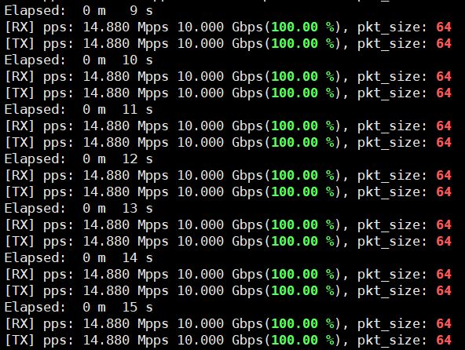


<center> 1514B nids </center>


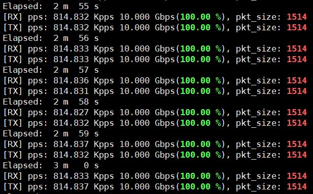

* trie에 payload를 한 번 거치면 nids의 모든 과정이 끝나기때문에 overhead가 그렇게 크지 않은 것이 원인으로 추측된다.
* thread의 수를 1개로 줄이면서 코드도 일부 수정되었다.
* 기존 nids의 코드는 multi-thread를 사용하기 위해 수정된 코드였다.
  * Report\_20.02\_20.04.md 파일의 03/20일자 참고
* 이를 single-thread를 위해 구현된 초안 코드로 변경하였다.
* 이는 성능에 전혀 영향을 주지 않았다.
  * 애초에 성능을 저하시킬수는 없는 변화였다.
* 모든 수정이 끝나면서 nids는 packet의 크기에 전혀 영향을 받지 않는 코드가 되었고, 따라서 nids와 router는 **packet의 size와 상관없이 실행가능하며 100%의 성능을 보이는 코드**가 되었다.


---

## 06/09 현재상황

* 모든 packet size에 대해서 single thread만 ipsec을 처리할 경우의 문제점이 **local memory의 부족**이었다.
  * 06.08일자 참고
* 이를 해결하기위해서 global memory에 application buffer를 선언한 후 kernel에게 parameter로 넘겨주어 작업하게끔 변경하였다.
* 이때, 가장 문제가 되는 부분이었던 AES처리한 값을 header에 넣어주는 과정을 더 최적화하기 위해 headroom이란 개념을 도입했다.

* headroom이란 개념은 dpdk의 packet manipulation 방식에서 착안했다.


<center> dpdk mbuf </center>


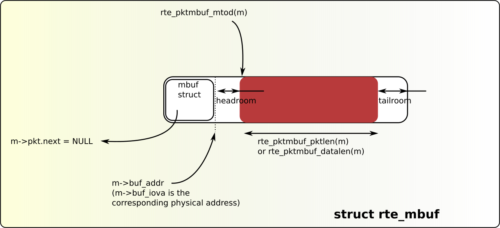

* 위의 사진은 DPDK의 공식 문서에서 발췌한 사진이다.
* 실제 packet의 payload가 담기는 부분 앞과 뒤에 headroom과 tailroom이 존재한다.
* 이 전에 DPDK를 공부할때에는 저 headroom과 tailroom의 존재의 이유를 몰랐는데 ipsec을 위해 header 처리를 고민하다가 알게 되었다.


<center> dpdk headroom description </center>


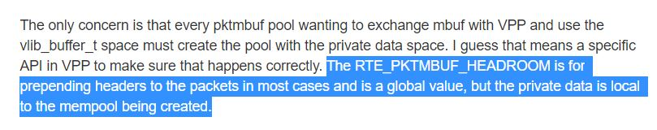

* 위의 설명을 보면 RTE_PKTMBUF_HEADROOM이 대부분의 경우에서 packet의 앞에 header를 추가하기 위함이라고 나와있다.
* 이 개념을 도입하면 aes\_tmp를 전혀 사용할 필요가 없게 된다.
* aes\_tmp를 사용할 필요가 없게 된다면 각 size별로 사용하는 local variable의 크기는 static한 것들만 남게 된다.
  * e.g.) sha1_gpu_context, IV, etc...
* 그렇다면 더 이상 **local variable로 인한 문제는 발생하지 않는다.**

* 위의 개념을 도입한 이후 ipsec의 성능을 확인하기 위해서 3가지 실험을 진행하였다

1. 64B \~ 1514B 크기의 packet을 rx\_buf에서 application buffer로 memcpy만 했을때의 pps
2. 64B \~1514B 크기의 packet을 HEADROOM 개념을 도입했을 때의 pps
3. 64B 크기의 packet을 single thread과 multi thread를 혼용하고  HEADROOM 개념을 도입했을 때의 pps

---

### 1. memcpy test와 headroom개념 도입 test 비교

* 위의 3가지 실험 중 1번과 2번 실험의 결과를 표와 그래프로 나타내었다.


<center> memcpy and headroom test table </center>

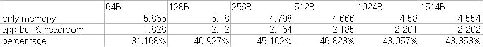


<center> memcpy and headroom test graph </center>


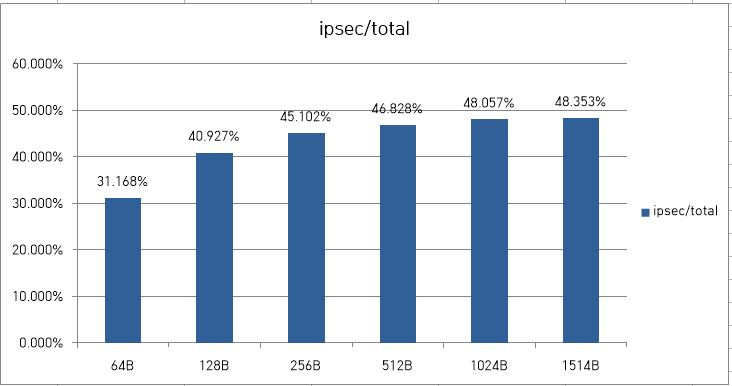

* 위의 그래프를 보면 memcpy만 실행시켰을 경우의 pps는 거의 linear하게 감소하고, headroom을 도입하여 ipsec을 실행한 경우의 pps는 거의 linear하게 증가한다.
* memcpy만 실행한 경우를 total로 보고 headroom을 도입한 경우를 이로 나누었을 때의 그래프가 아래의 그래프이다.
* 거의 linear하게 증가하지만 50%를 넘지 못한다.

---

### 2. 64B single + multi thread

* 64B의 경우 기존에 multi thread와 single thread를 혼용하여 ipsec 처리를 한 ver.이 있었다.
  * 이 경우 9Gbps 정도의 처리량을 보였다.
* 이를 headroom과 application buffer를 도입하여 재실험해보았다.


<center> 64B single + multi thread </center>


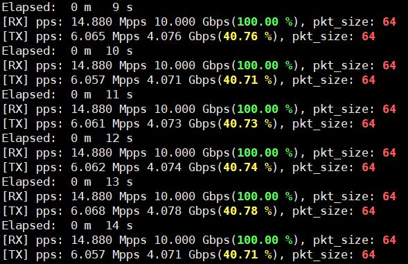

* 위의 사진을 보면 40%정도의 성능을 보임을 알 수 있다.
* 이는 기존 성능\(90%\)에 비해 절반에 못 미치는 성능을 보이지만 위의 memcpy만 진행했을 때를 total로 보고 계산할 경우 꽤 높은 성능을 보인다.
  * 4.074 / 5.865 = 69.463%
  * 유일하게 50% 이상의 성능을 보인다.
* 확실히 multi-thread의 성능이 더 뛰어남을 알 수 있는 실험이다.

---

## 06/08 현재상황

* 64B부터 1514B까지 ipsec의 모든 기능을 single thread로 진행하였을때의 속도를 확인하고 있다.
* 이를 위해서 각 size별로 ipsec을 수정중이다.
* 이는 APUnet에서 ipsec 실험을 1개의 thread로 진행한 것에서 착안하여 모든 size의 packet을 1개의 thread로 진행하여 나온 속도를 확인하기 위함이다.
* 기존에는 100%의 속도(10Gbps)를 보여주기위해서 수정했다면 현재는 최고 속도를 구하기 위함이다.
* 각 실험은 application buffer를 각 thread마다 local variable로 선언 후 그 buffer 상에서 작업을 진행하였다.

---

### 1. 64B / 128B / 256B의 실험


<center> 64B All single thread & app buffer </center>


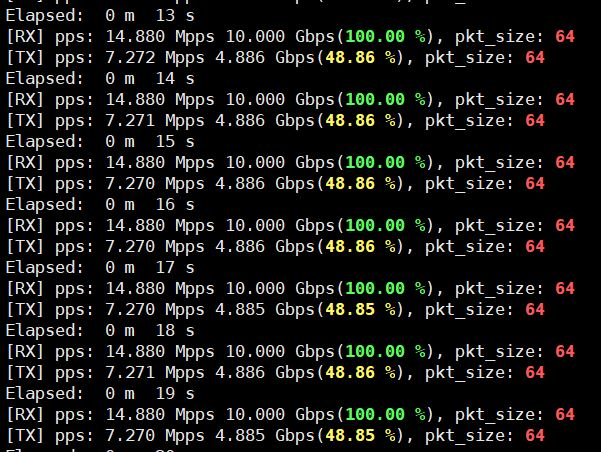


<center> 128B All single thread & app buffer </center>


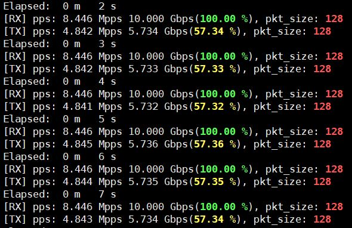


<center> 256B All single thread & app buffer </center>


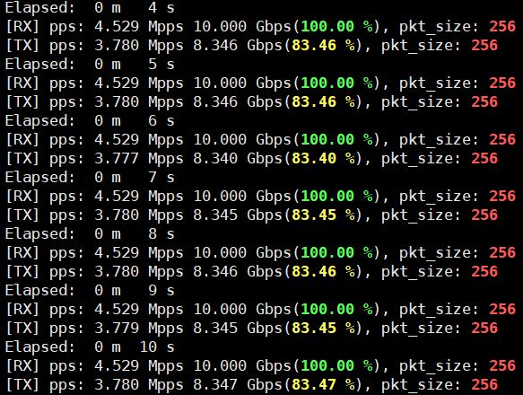

* 위의 사진을 보면 ~~아름답게~~ 증가하는 형태를 띄고 있다.
* 다만 걸리는 부분은 64B \-\> 128B으로의 증가량에 비해서 128B \-\> 256B으로의 증가량이 월등히 크다.
  * 64B \-\> 128B : 9% (0.9Gbps)
  * 128B \-\> 256B : 26% (2.6Gbps)
* 이는 IFG(Interframe Gap)을 제외한 순수한 packet이 전송되는 수의 차를 확인할 필요가 있어보인다.
  * 위의 bps는 IFG를 포함한 크기이지만 실제로 IFG값을 빼면 64B의 경우 bps가 7.XX Gbps로 떨어진다.
  * 128B와 256B에서의 순수 bps가 얼마나 나오는지 비교하여보고 납득할만한 수치로 증가한 것인지 확인이 필요하다

---

### 2. 512B의 실험

* 결론부터 말하자면 실험에 실패했다.
* 그 이유는 **local variable의 과도한 선언**에 있다.


<center> local variable of 256B ver. </center>


<center> local variable of 512B ver. </center>


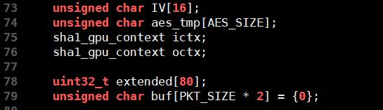

* 위의 사진들은 256B와 512B의 packet ver.에서 각각 선언된 local variable들이다.
* 256B의 경우 총 1,136B 사용되었다.
  * IV : 16B
  * aes_tmp : 240B (256B - 16B)
  * ictx : 24B
  * octx : 24B
  * extended : 320B (80 * 4B)
  * buf : 512B (2 * 256B)

* 512B의 경우 총 1,906B 사용되었다.
  * IV : 16B
  * aes_tmp : 498B (512B - 16B)
  * ictx : 24B
  * octx : 24B
  * extended : 320B (80 * 4B)
  * buf : 1024B (2 * 512B)

* 256B의 경우보다 512B의 경우에서 770B의 local variable이 더 사용되었다.
* local variable의 문제인지 확인하기위해서 512B ver.에서 다른 부분은 그대로 유지한 채로 local variable의 사용량을 감소시켜보았다.

<center> local variable of modified 512B ver. </center>


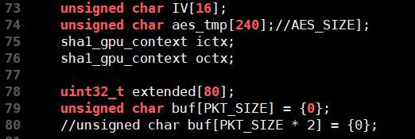

* 위의 사진처럼 256B ver.에서 필요한 만큼만 선언 후 실행시켜보았더니 정상 실행되었다.
  * 하지만 aes_tmp 배열의 크기가 작아서 runtime error가 발생한다.
  * 단지 kernel launch가 되는가를 확인하기 위해 실행시킨 것이다.
* local variable의 사용량을 줄일 필요가 있다.
  * extended를 sha1_kernel_global_512 함수(SHA 작업을 실제로 진행하는 ipsec의 callee 함수) 내에서 선언
    * 하지만 320B만 확보가 가능해 1024B 이상의 크기를 가지는 packet의 경우 해결되지 않는다.
  * aes_tmp의 간소화
    * packet의 정보를 덮어씌우지 않으면서 IV값 대입을 하기 위해선 tmp가 필요하다.
    * 이를 줄이려면 철저한 계획이 필요하다.
* 사실 이는 mempool의 적용을 통해 buf 사용이 불필요해지면 자연스럽게 해결될 문제이다.
  * buf의 크기가 가장 큰 용량을 차지하므로
* 하지만 속도 확인과 구현 상 이슈를 파악하기 위해 해결해야할 필요가 있다.


---

## 06/05 현재상황

1. 128B packet버전에서의 ipsec이 실행되지 않는 문제점에 대해서 알아보고 있다.
* 다음과 같은 런타임 에러명을 띄우며 실행되지 않는다.

<center> Error Name </center>

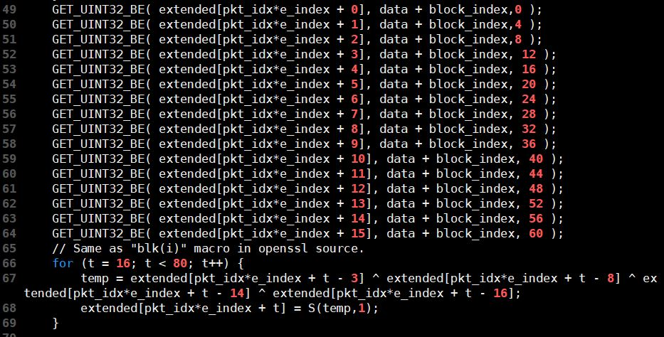

* cudaErrorLaunchOutOfResources 에러는 다음과 같은 상황에 발생한다.

<cetner> Error reason </center>

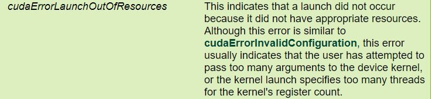

1. device kernel에 과하게 많은 parameter를 넘겨줄 경우 발생
  * 이 전에 global memory에 선언 후 넘겨주었을 때 실행되지 않았던 이유
  * 64B와 달리 128B 이상의 경우 global memory에 선언한 d\_extended 변수를 kernel에 parameter로 넘겨준다.
  * 이때 해당 parameter를 주석처리할 경우 실행되고, 주석처리하지 않은 경우 위의 에러가 발생하였다.

2. register에 과하게 많은 thread를 할당한 경우 발생
  * 현재 local memory에 선언한 extended를 사용한 경우에 해당하는 이유로 추측된다.
  * SHA처리를 하는 경우 extended 배열에서 작업하는 부분이 있는데 해당 부분에서 에러가 발생한다.

<center> Error Part </center>

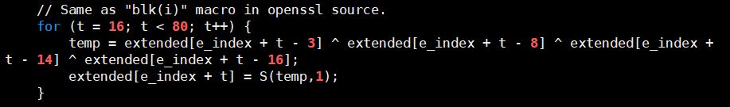

* 위의 사진에서 for문 내에 두번째 줄에서 에러가 발생한다.
  * extended\[e\_index \+ t\] = S\(temp,1\);
  * 해당 부분을 다루는 과정에서 에러가 발생하여 실행이 안된다.
    * 위아래 부분을 주석처리하면 변화가 없으나 해당 부분을 주석처리하면 실행이 된다.

* 단, 걸리는 것이 하나 있다.
* register에 thread가 너무 많이 할당되었다는 것은 한 순간에 처리해야할 작업량이 많다는 뜻이다.
  * **kernel**에 thread를 너무 많이 할당한 것이 아니라 **register**에 할당한 것이므로
  * register에 할당했다는 것은 그 순간에 처리해야할 작업이 생겼다는 것
  * 너무 많이 할당되었다는 것은 처리해야할 작업량이 과도하게 많다는 것이다.
* 그렇다면 다른 부분을 주석처리해도 동일하게 실행되어야하는 것이 아닌가?
* 작업량의 문제가 정말 맞는 것인가에 대한 의문이 남는다.

---
## 06/03 현재상황
1. 64B packet
* IV값을 대입해주는 것을 제외한 모든 부분(SHA포함)만 돌렸을 때의 성능을 확인해보았다.

<center> ipsec 64B Application Buffer </center>

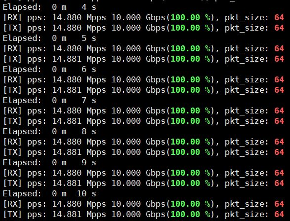

* 100%의 성능이 나온다.
* 이는 IV값을 대입해주는 for문에 문제가 있다는 것을 보여준다.
  * 문제가 isolation되었다.
* 이를 어떻게 해결할 것인가에 대한 해결책이 필요하다.
* 해결책을 위해선 정확한 원인 파악이 필요하다.

2. 128B packet
* 128B 버전으로 구현된 ipsec을 실행시켰더니 다음과 같은 에러가 발생하면서 ipsec kernel이 launch되지 않았다.

<center> Error of 128B packet ipsec </center>

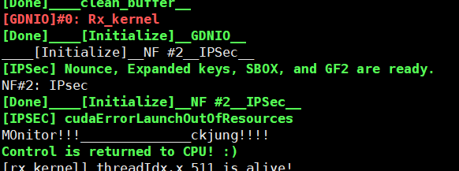

* 위의 에러의 원인을 찾아냈다.
  * extended변수의 indexing 문제였다.
* 기존 64B와 1514B packet 코드를 기준으로 구현하였는데, 이 코드는 extended를 global memory에 선언하고 이를 매개변수로 받아 사용했다.
* 이 후 코드를 변경하면서 extended가 local memory로 넘어가게 되었는데 이 과정에서 indexing이 꼬이면서 에러가 발생하였다.

<center> Error part </center>


* 위의 사진이 에러를 유발한 부분이다.
* 기존에는 global memory에 선언된 extended에 여러 packet의 data가 저장되고 이를 여러개의 thread가 나눠 사용하다보니 저런 index의 변환이 필요했다.
* 하지만 extended를 local memory에 선언한 뒤에는 각 thread가 고유의 extended 배열을 가지므로 그럴 필요가 없다.

<center> Fixed Error part </center>

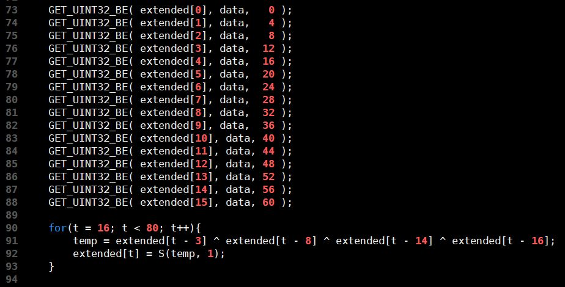

* local memory에 선언된 extended를 위한 indexing을 구현한 것이다.
* 수정 후에는 kernel이 정상적으로 launch되었다.
* 하지만 여전히 문제가 남아있는 듯하다.

<center> ipsec 128B packet test </center>

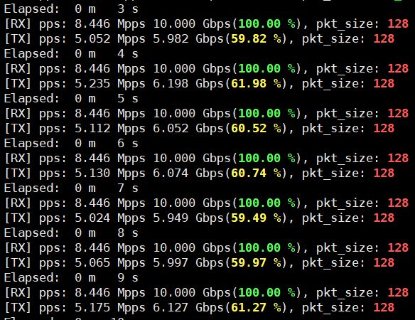

* 위의 사진은 수정된 128B packet에 대한 ipsec 코드를 실행한 결과이다.
* 위의 코드는 rx\_buf에 직접 접근하여 ipsec작업을 진행하는 것이 아니라 local memory에 application buffer를 선언하여 그 위에서 작업을 진행한다.
* 이 코드는 현재 60%의 성능을 보이고 있다.
* 이는 위의 64B packet의 실험에서 문제가 되었던 IV값 대입부분을 **multi-thread로 실행**한 버전이다.
* 이전의 128B packet의 실험의 경우 위의 에러를 해결하지 못해 SHA를 주석처리 후 실험을 진행하였다.
* 그 결과 100%의 성능을 보였다.
* 64B packet의 SHA 처리 overhead가 그리 크지 않은 것으로 미루어보았을때, 128B packet도 SHA에 의한 overhead가 40%까지 성능을 저하시키진 않을 것으로 추측된다.
* 코드 전반적인 indexing 문제를 해결 후 재실험이 필요하다

---
## 06/01 현재상황
1. ipsec 64B 버전에서 SHA처리한 값을 rx\_buf에 memcpy하는 것을 single thread로 넣었을 때의 throughput을 구하였다.

<center> Single Thread Copy </center>

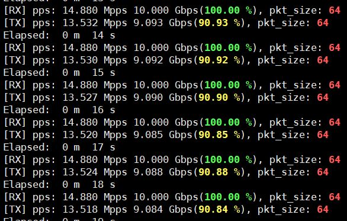

* 위의 결과가 현재까지 가장 높은 속도를 보여준다.

2. ipsec 64B 버전에서 ipsec의 모든 과정을 single thread로 실행했을 때의 throughtput을 구하였다.
  * 여기서는 다양한 상황을 가정하였다.
  1. rx\_buf를 이용해 직접 작업을 하며, IV값 대입을 1byte씩 연산하여 대입한 경우
  2. application용 buffer를 kernel의 local memory 영역에 선언하여 rx\_buf의 값을 복사해 작업하며, IV값 대입을 1byte씩 연산하여 대입한 경우
  3. application용 buffer를 kernel의 local memory 영역에 선언하여 rx\_buf의 값을 복사해 작업하며, IV값 대입을 8byte씩 연산하여 대입한 경우

<center> IV value Assign with 1 byte Code </center>

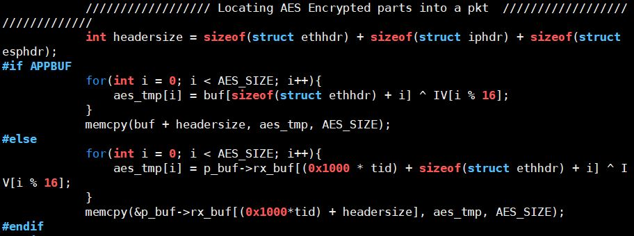

* IV값 대입을 1byte씩 진행한 경우의 코드이다.
* 최적화를 위해서 aes_tmp값을 buffer에 대입하는 것은 memcpy로 대체했다.

<center> IV value Assign with 8 byte Code </center>

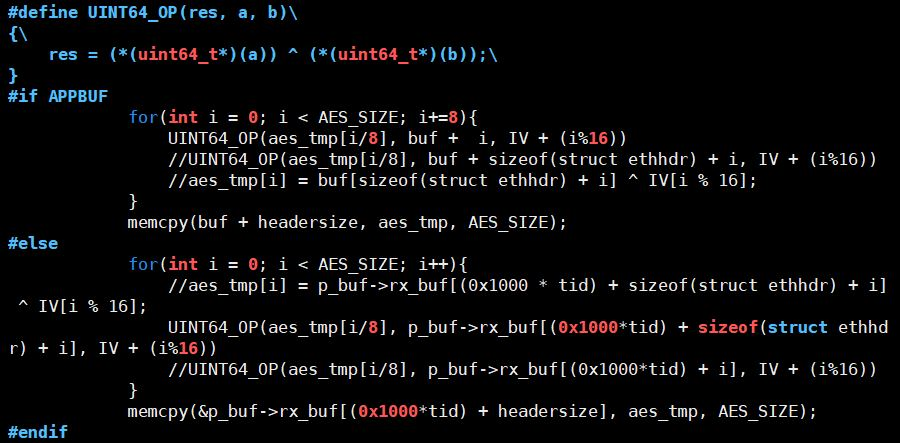

* IV값 대입을 8byte씩 진행한 경우의 코드이다.
* 역시 최적화를 위해서 memcpy를 사용했다.

* 각각의 경우에 대해서 \(1\) SHA만 실행한 경우, \(2\)IV값 대입만 실행한 경우, \(3\) SHA와 IV값 대입 모두 실행한 경우로 나누어 실험을 진행하였다.
* 자세한 실험 결과는 아래에 남겼다.
---
### Single Thread 실험
1. rx\_buf & 1byte

<center> rx_buf & 1byte : SHA </center>

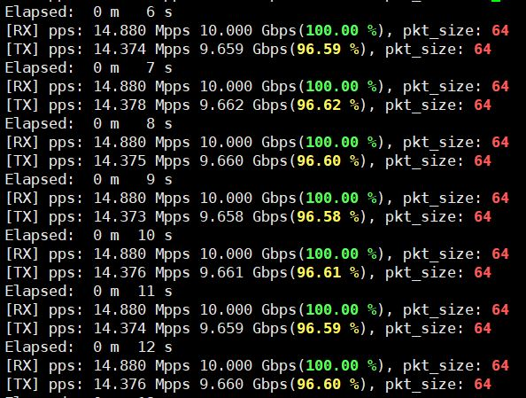

<center> rx_buf & 1byte : Assign </center>

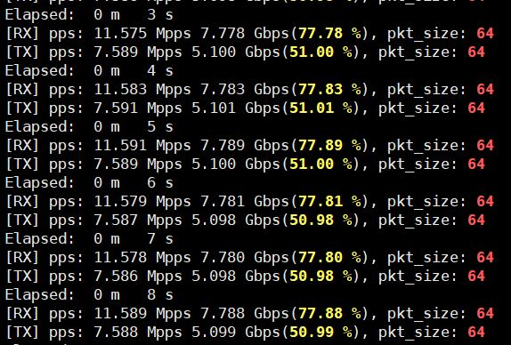

<center> rx_buf & 1byte : SHA & Assign </center>

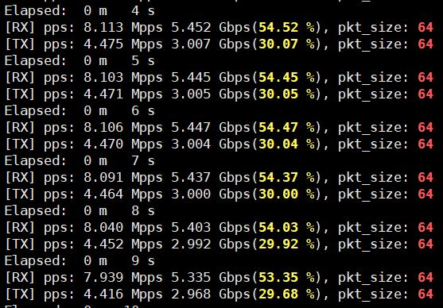

* rx\_buf에 직접 작업을 하는 경우 RX rate까지 떨어지는 것을 알 수 있다.
* SHA만 실행한 경우 96%의 효율을 보여주지만, IV값 대입을 실행할 경우 rx\_buf에 접근 횟수가 늘어나 rx\_kernel가 rx\_buf에 접근하는 것을 방해해 RX rate까지 떨어진 것을 확인할 수 있다.
* SHA와 IV값 대입을 모두 실행할 경우 30%의 아주 저조한 효율을 보인다.

2. application buf & 1byte

<center> application buf & 1byte : SHA </center>

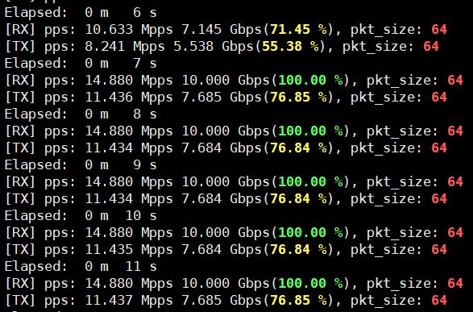

<center> application buf & 1byte : Assign </center>

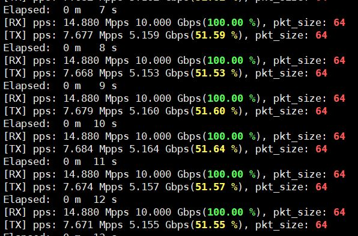

<center> application buf & 1byte : SHA & Assign </center>

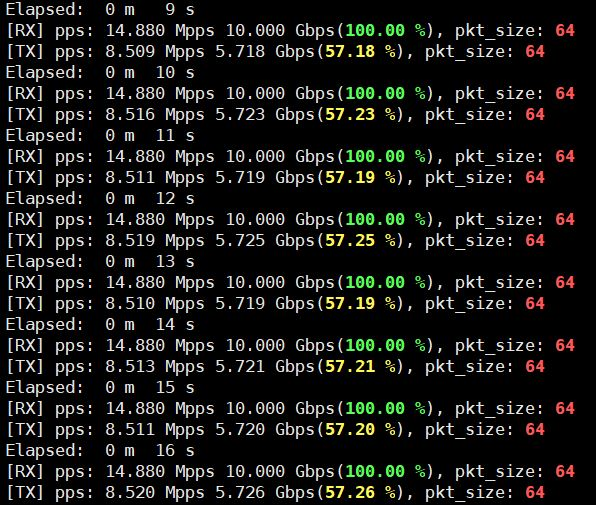

* application buffer를 사용한 경우 RX rate에 전혀 영향이 없음을 확인할 수 있다.
* SHA만 진행한 경우 rx\_buf를 사용했을 때보다 더 낮은 pps를 보이지만 IV값 대입을 진행한 경우에는 더 높은 pps를 보였다.
* 특히 SHA와 IV값 대입 모두 진행했을 경우에는 rx\_buf를 사용했을 때보다 20%가량 더 높은 pps를 보였다.

<center> Copy to App buf </center>

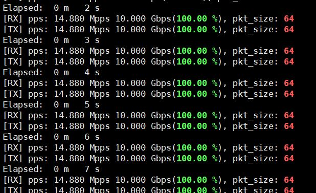

* packet을 받아와 buf에 copy해주면서 발생하는 overhead에 의해 SHA가 더 낮은 pps를 보였는지 확인하기 위해서 buf에 copy해주는 것만 실행되게끔 수정 후 실험해보았다.
* 100% 효율을 보였지만 copy overhead가 전혀 없다고 확신할 수는 없다.
  * SHA와 copy를 동시에 진행함으로 인해 overhead가 큰 폭으로 증가할 가능성이 있으므로
    * scheduling이 꼬인다거나, 단순히 둘의 overhead의 합이 크다거나
* 하지만 크게 영향을 미치지는 못하는 것으로 보인다.

3. application buf & 8byte

<center> application buf & 8byte : Assign </center>

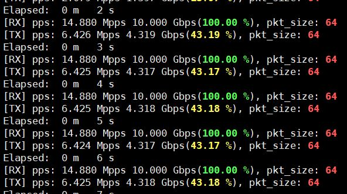

<center> application buf & 8byte : SHA & Assign </center>

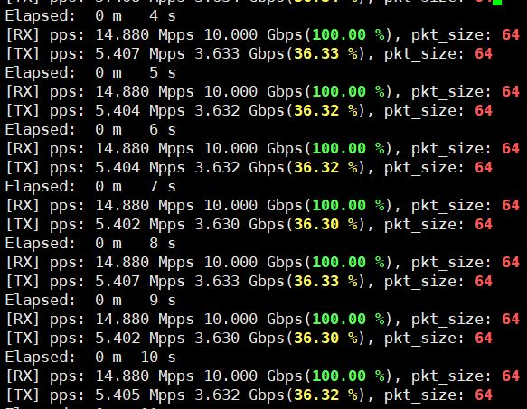

* IV값 대입을 8byte로 하는 경우는 SHA만 실행할 경우 2번 실험과 동일하기때문에 SHA 실험은 진행하지 않았다.
* 1byte씩 진행하는 경우보다 더 느린 속도를 보였다.
* 이 전에 misaligned 문제를 해결하기 위해 uint32\_t를 모두 unsigned char로 수정하여 코드를 실행했을 때, 형 변환이 너무 빈번하게 일어나 오히려 속도가 떨어진 것과 동일한 원인에 의해 속도가 떨어진 것으로 추정된다.
* 사실 misaligned 문제가 여기서도 발생한다.
  * 형변환을 통한 할당이 진행되는데 sizeof\(struct ethhdr\)의 값이 2의 제곱수 형태가 아니므로
* 위의 코드를 확인해보면 pps 측정을 위해 sizeof\(struct ethhdr\)의 값 없이 진행한 것을 확인할 수 있다.
* application buffer로만 실험을 진행한 이유도 있다.
* rx\_buf에 직접 접근하여 형변환을 시도할 경우 illegal memory access 에러를 띄우고 실행이 되지 않는다.

<center> Illegal Memory Access Error </center>


* 런타임 에러가 발생하는 것을 확인할 수 있다.
---
### 결론 및 추가 실험의 필요성
1. rx\_buf를 사용할 경우 RX rate의 성능저하
* rx\_buf에 직접 접근하여 처리할 경우, syncthreads가 없어 여러개의 thread가 제각기 다른 시간에 rx\_buf에 접근하게 된다.
  * e.g.) thread 1번이 접근하는 중에 thread 2번이 접근하고, thread 15번이 접근을 시도하는 등
* rx\_kernel의 경우 syncthreads에 의해 모든 therad가 기다렸다가 한 번에 접근을 시도하는 데, ipsec이 rx\_buf에 연속적으로(각 therad의 접근시간이 연속적으로) 접근을 시도해서 rx\_kernel이 방해받게 되는 것이다.
* 이로인해 application buffer의 속도가 더 빨라진 것으로 추측된다.

2. 1 thread per 1 packet의 가능성
* 위의 결과를 보면 ipsec의 모든 과정을 1개의 thread로 실행할 경우 속도가 급격하게 떨어짐을 알 수 있다.
* 1 thread per 1 packet이 가능해졌을 경우의 장점은 **모든 size의 packet에 대해 동일하게 ipsec을 적용할 수 있다**이다.
* 위의 장점이 주는 효과는 거대하다.
  * 가능만하다면 ipsec에는 더이상 이슈가 존재하지 않는다.
  * batch를 할 필요도 없어보인다.
* 다만 가능성이 낮아보이고, **이를 해결하는 것이 현재 논문에 꼭 필요한 사항인가**가 의심된다.
  * 이거 하나로도 논문을 쓸 수 있지 않을까라는 생각도 든다.
* 추가적으로 알아볼 필요는 있겠으나, 구현을 통한 직접적인 해결이 필요한지는 더 논의가 필요한 것 같다.

---
## 05/27 현재상황
* ipsec 64B의 성능향상을 위한 실험을 진행했다.

1. Memory False Sharing에 의한 성능 저하가 있는가
* 결론부터 말하자면 **없다**.
* 실험은 다음과 같은 상황속에서 실행되었다.
  * data의 크기 : 64B / 20B
  * thread의 수 : 1 / 2 / 3
  * copy방향 : local memory \-\> global memory

---
## 05/26 현재상황

1. ipsec 1024B의 성능저하 원인을 알아보려 이것저것 실험 중 이상한 현상을 발견했다.
  * 해결
2. ipsec 64B의 성능향상 실험

---
### 1번 현상 의문제기 & 실험 1

<center> ipsec 1024B ring num </center>

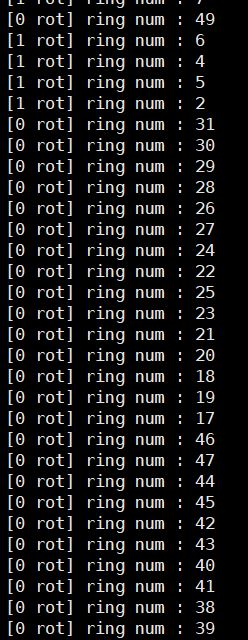

* 위의 사진은 192pps로 PKT-GEN에서 packet을 보냈을 때, gdnio가 packet 수를 count하는 if문 내에서 ring의 몇번째 칸이 반응하는지 출력한 것이다.
  * e.g.) \[1th rot\] ring num : 15는 1번째 rotation의 15번째 칸이니 186(=171 * 1 + 15)번째 칸에 packet이 들어왔고 이때문에 해당 칸을 담당하는 thread가 위의 값을 출력한 것이다.
* 위의 사진을 보면 대부분 0번째 rotation만 출력됨을 알 수 있다.
  * 위의 사진은 일부분만 가져온 것이긴하지만 1번째와 2번째 rotation에서 출력된 경우는 전체 중 10%이하에 불과했다.
* 결국 ipsec의 thread들이 **0번째 rotation에서는 제 몫의 일을 다하지만 그 외의 rotation의 경우 그렇지 못한다**라는 것을 알 수 있다.
* 하지만 의문인 것은 그렇다면 왜 **몇몇 thread는 일을 하고 그 외의 thread는 일을 하지 못하는가**이다.
* 만약 기존의 가설대로 rx\_kernel이 ipsec의 thread들이 packet buffer에 접근하는 것을 막아 packet을 확인하지 못해서 성능이 떨어진 것이라면, 0번째 rotation에서만 일을 하고 나머지 rotation에서는 일을 하지 못해야하는 것이 맞다.
  * 혹시나 몇몇 thread가 먼저 일을 마치고 rx\_kernel이 막기 전에 packet buffer에 접근하는 일이 생길까봐 ipsec에서 syncthreads()로 thread를 정리하면서 코드가 진행되게끔했다.
* 결국 packet buffer에 ipsec의 모든 thread들이 동시에 도착하지만 몇몇 thread들만 packet을 확인할 수 있었다는 것이다.
* 이것은 결국 두루뭉실하게 넘어갔던 rx\_kernel이 ipsec의 thread들을 **막는다**는 개념을 정확하게 할 필요가 있음을 보여주는 것이라 추측된다.
* 0번째뿐만이 아닌 1번째, 2번째 rotation까지 넘어가서 일을 하는 thread들이 특정한 칸(e.g. 각 rotation의 0번째 칸)을 담당하는 thread들인지, 아니면 랜덤한 thread들인지 확인해볼 필요가 있을 것 같다.
  * 현재까지는 15번째 이하의 칸을 관리하는 thread들만 다음 rotation에 넘어가서도 packet을 확인할 수 있었다
---

### 실험 2

* pps는 출력하지 않고 rot\_index가 변하는 시점과 ring num만 출력하게 해보았다

<center> ring num and rot_index </center>

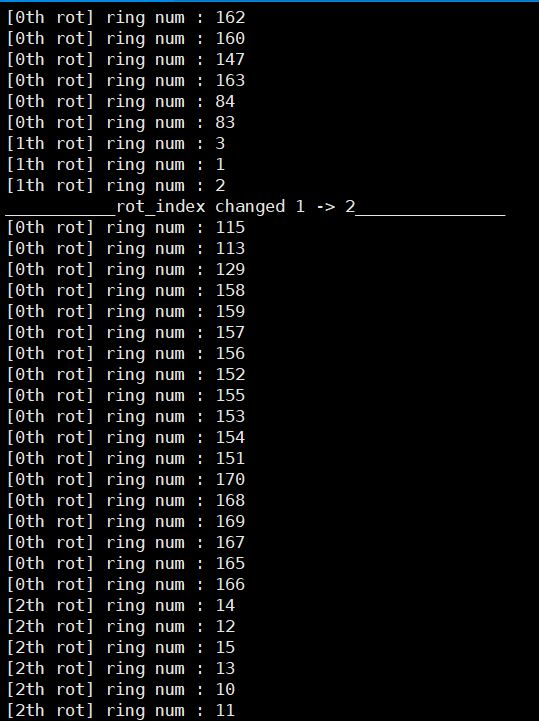
* 위의 사진을 보면 rot\_index는 1에서 2로 넘어갔음에도 불구하고 rot\_index가 변하는 시점 앞뒤로 대부분 0번째 rotation에 속해있음을 확인할 수 있다.
  * 1에서 2로 넘어갔다면 변하는 시점 전에는 1번째 rotation으로 찍혀야하고 후에는 2번째 rotation으로 찍혀야함이 맞다.
* 그 말은 결국 **rotation은 돌지만 대부분의 thread들은 다음 rotation으로 넘어가지 못했다**라는 결론이 나온다.
  * 이번에도 15번째 이하의 칸을 관리하는 thread들만 rotation에 넘어가서도 packet을 확인할 수 있었다.
  * 즉, 945(=15*63)번째 thread까지만 rotation을 돌았다는 뜻이다.
    * 1개의 Thread Block에는 1008개의 thread가 할당되어 있다.
    * Thread Block과 어느정도 연관돼있을 가능성이 있어보인다.
      * 63(=1008-945)개의 thread만 빼고 모두 첫번째 Thread Block에 있는 thread만 넘어간 것이다.
      * 1024B의 packet은 1개의 packet당 63개의 thread가 할당된다.
* 각 Thread Block이 어떻게 일을 하고 있는지 확인이 필요해보인다.

---
### 해결

* rot\_index 변수를 shared 변수로 설정해두었는데, shared 변수의 경우 Thread Block 내에서만 공유되고 서로 다른 Thread Block간에는 공유되지 않는다.
* 그래서 첫번째 Thread Block에서만 rotation을 돌고 다른 Block의 경우 돌지 않아 성능이 떨어진 것이다.
* 수정 후 재실험이 필요하다.
---
### 2번 문제 현상 및 의문 제기

* 64B packet을 ipsec에 넣고 돌렸을 때 생기는 성능저하가 SHA처리한 값을 packet에 memcpy로 넣어주는 과정에서 생기는 것을 발견.
  
  * 05/25일자 실험 참고
* 성능저하의 구체적인 주 요인이 무엇인가와 memcpy를 제거할 수 있는가에 대한 실험을 진행해야함
  1. Multi-Thread copy로 인해 발생한 Memory False Sharing에 의한 성능저하가 큰 폭으로 존재하는가
    * 성능저하의 실질적 주요인은 memcpy 그 자체이겠지만, 05/25의 실험의 결과를 보면 Multi-Thread copy가 Single-Thread copy보다 성능이 떨어지는 것의 원인 파악이 필요해보였다.
    * Multi-Thread copy와 Single-Thread copy의 성능차이가 Memory False Sharing에 의한 것으로 가설을 세우고 실험을 진행했다.
      * 20B밖에 되지 않는 data를 3개의 Thread로 나누어 copy를 하다보니 서로의 cache를 더럽혀 overhead가 발생하지 않을까라는 추측을 통해 가설을 세웠다.
      * GPU의 실질적으로 호출되는 cache line size는 32B이다.
      * [GPU cacheline Question](https://forums.developer.nvidia.com/t/pascal-l1-cache/49571/4)
  2. SHA의 결과값을 packet에 붙여주기위해 사용되는 octx배열의 삭제를 통한 memcpy 제거
    * octx 배열의 경우 Outer Digest를 진행하고 그 결과값을 packet에 붙여주기전까지의 data를 저장하기 위해 사용된다.
    * 결국 octx 배열을 사용하지 않고 Outer Digest에 packet buffer를 바로 넘겨주면 memcpy가 필요없게 된다.

---
## 05/25 현재상황

* ipsec의 경우 한번의 loop으로 모든 packet(512)개를 처리할 수 없는 경우 packet을 받았는지 확인하는 것 자체에서 성능저하가 이미 발생
  * 512byte 이상의 packet의 경우 두 번 이상의 loop로 packet을 처리해야함
  * 1024byte 기준으로 512개의 packet을 3번에 걸쳐서 처리함
* rx\_kernel과 ipsec의 처리속도 차이로 추정중


* 64byte의 경우 ipsec을 실행시켰을 때, 성능저하가 있었던 것에 대해서 추가 실험을 진행했음
  * AES만 실행될 때
  * SHA처리까지만 진행되고 처리된 값이 copy되지는 않을 때
  * SHA처리 된 값이 multi-thread에 의해 copy될 때
  * SHA처리 된 값이 하나의 thread에 의해 copy될 때


<center> Only AES </center>


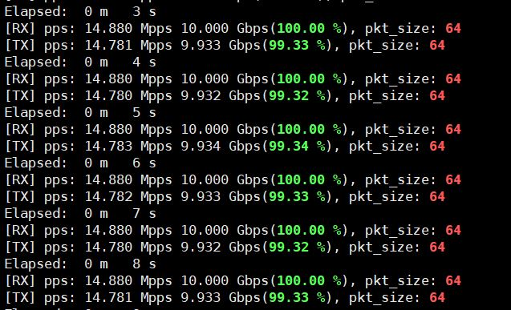


<center> AES and SHA </center>


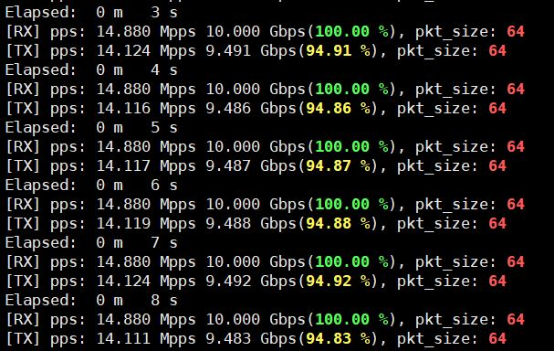


<center> Copy with multi-threads </center>


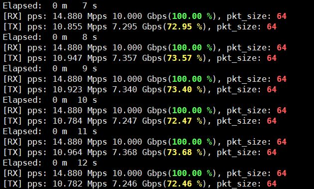


<center> Copy with one-thread </center>


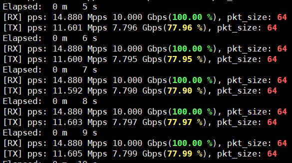


---

## 05/19 현재상황

* ipsec에 1개의 thread block당 512개이상의 thread를 할당할 경우 kernel이 launch되지 않았다.
  * 128byte 이상을 처리하는 ipsec 커널의 경우 1개의 thread block에 512개 이상의 thread가 할당됨
    * 모두 launch되지 않음
  * 128B를 처리하는 ipsec 커널의 경우, 1개의 thread block당 896개의 thread를 사용하고 총 4개의 thread block이 사용됨
  * 이를 1개의 thread block당 448개의 thread를 할당하고 총 8개의 thread block으로 늘렸을때는 launch됨
* 이와 동일한 현상이 nids에도 발생하는지 확인 필요
  * nids의 경우 먼저 확인되어야할 것이 packet의 size별로 할당되는 thread의 수가 다른지 코드를 확인해야함
* MM의 경우 일단 local 상에서 실험 후 코드 분석 필요
  * local 상에서 Matrix 크기별로 속도 측정
  * 커널에 thread 할당하는 것과 매커니즘 분석 필요
* DMA Batch 관련 이슈 확인해보기
  * Batched DMA로 검색해보면 될듯함
  * ~~시간이 된다면~~

---
## 05/18 현재상황
* nf의 indexing 문제의 원인을 대략적으로 파악하였다.
* 기존 if문에서 packet을 받은 것을 확인한 방법은 다음과 같다.

<center> packet checking in router </center>

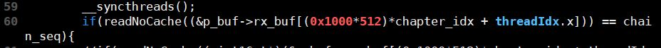
* 위의 사진을 보면 chapter\_idx에는 0x1000을 곱해주었지만 threadIdx.x에는 곱해주지 않았음을 확인할 수 있다.
* 이렇게 되면 thread번호를 통한 이동은 1byte씩 이동하게 된다.
* 원래는 4byte씩 이동해야하므로, 각 thread가 본인이 맡아야할 packet의 부분에 정확하게 도달하지 못하게 된 것이다.
  * 왜 4byte씩인지는 확인해볼것
* rx\_kernel에 buf\_status의 값을 변화시키는 부분이 있어 packet을 확인하는 부분에 buf\_status를 활용하는 것으로 수정했다.
  * rx\_buf의 값을 변화시키며 packet을 확인하는 것은 packet의 data를 변조시키는 것이므로 이를 피하면서 indexing 문제도 덜한 buf\_status를 활용했다.

<center> packet checking with buf_status in router </center>

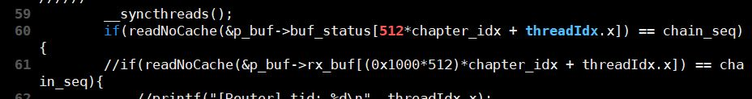
* 위의 사진처럼 buf\_status의 값을 확인해서 packet을 확인하게끔했다.
* 수정 후 pps는 다음과 같이 확인되었다.

<center> pps with router after modification </center>

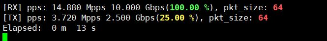
* 정확히 25%가 나오는 것을 확인할 수 있다.
* 이는 chapter\_idx의 관리가 제대로 되지 않아 발생한 문제로 추측된다.

---
## 05/17 현재상황
* nf와 Matrix Multiplication 구현중이다.

---

### NF 구현

* nf의 경우 router, ipsec, nids 모두 수정 후 실행해보았다.
* pps가 매우 이상하게 계산된다


<center> router pps </center>


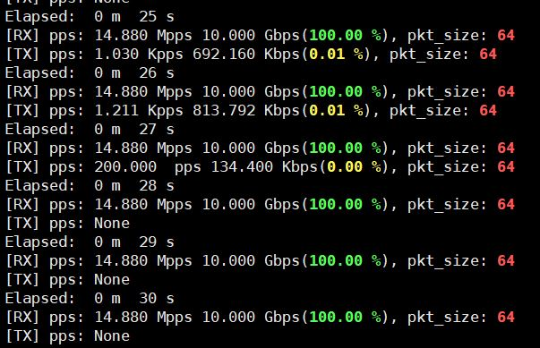


<center> ipsec pps </center>


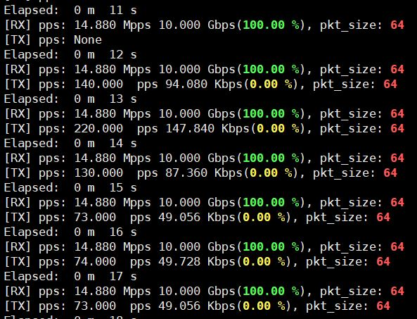


<center> nids pps </center>


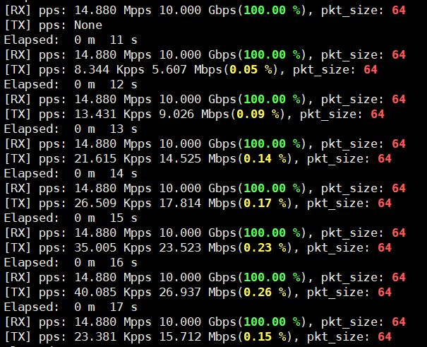

* 위의 캡쳐사진들을 보면, packet을 아예 처리하지 못하거나, 1%미만의 packet들만 처리하는 것을 확인할 수 있다
* 이에 대한 원인은 추측 중이다
  1. rx\_buf의 인덱싱문제
     * ipsec과 nids의 경우, 코드 수정후 재확인 필요
     * 자세한 내용은 아래에
  2. 아직 해결되지 않은 buffer의 pipelining 문제
     * 이는 찬규형과 얘기해봐야 알 것 같다
---
### rx_buf indexing problem
* router는 1개의 packet당 1개의 thread가 할당되고, router 커널이 512개의 Thread를 가진 1개의 Thread Block을 할당받는다.
  * rx\_kernel과 동일한 개수의 Thread가 할당되고, 동일한 개수의 Thread를 가진다.
* 따라서 rx\_kernel에 chapter\_idx를 도입한 것과 동일하게 indexing을 해주면 문제가 없다.


<center> router indexing </center>


* 위의 if문 내부 조건을 보면, (0x1000\*512)\*chapter\_idx를 인덱스에 더해주어 chapter\_idx를 도입하고 있음을 알 수 있다.
* ipsec과 nids는 1개의 packet당 1개 이상의 thread가 할당되어, rx\_kernel과 다른 개수의 Thread를 가지게 된다.
  * ipsec은 64B의 packet의 경우 1개의 packet당 3개의 thread가 할당되어, 커널이 128개의 thread를 가진 Thread Block 3개를 가진다.
  * nids의 경우 1개의 packet당 3개의 thread가 할당되어, 커널이 128개의 thread를 가진 Thread Block 3개를 가진다.
* 따라서 chapter\_idx를 도입할 때, 추가적인 indexing이 필요하다.


<center> ipsec indexing </center>


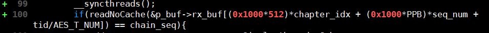
* 위의 if문 내부 조건을 보면, chapter\_idx외에 (0x1000\*PPB)\*seq\_num를 인덱스에 더해주어 chapter\_idx를 도입하고 있음을 알 수 있다.
* router와 달리 ipsec과 nids는 loop를 1번 실행하여 모든(512개) packet을 처리할 수 없으므로, 1번의 loop 실행 뒤 chapter\_idx 변경을 하면 안된다.
  * 1번의 loop 실행이 128개의 packet을 처리하니 총 4번의 loop가 필요하다.
    * 위에서 제시한 예시의 경우 3개의 Thread Block이 1번 loop를 실행한 뒤 1개의 Thread Block이 loop를 1번 더 실행해주어야한다.
* 따라서 seq\_num을 사용하여 4번에 걸쳐서 대입하게끔 유도한 것이다.

* 위의 추측대로 문제가 해결된다면, router는 제대로 작동해야함이 맞다.
* 하지만 router도 정상 작동을 하지 않는 것을 통해 다른 문제가 있을 수 있음을 추측할 수 있다.

---

### Matrix Multiplication

* 다음과 같은 가정 속에서 코드를 구현했다
  1. packet의 payload에 matrix의 값들이 빈틈없이 채워져있다고 가정했다.
    * packet의 payload size가 60B라면 4B의 int값 15개가 채워져있다고 가정했다.
  2. (1개의 packet에 들어있는 data의 개수) * 16의 row와 column을 가진 Square Matrix로 연산한다 
    * 60B의 payload size를 기준으로 15 * 16 = 240개의 row와 column을 가졌다고 가정했다
  3. MM 커널에서 packet을 받아와 mat1과 mat2에 data를 넣어준 뒤 gpu\_matrix\_mult함수를 호출시, mat1과 mat2를 곱하여 mat\_result에 저장하는 과정을 진행한다
    * gpu\_matrix\_mult함수가 github에서 가져온 코드이다

* github에 star를 2번째로 많이 받은 코드를 가져왔다
  * github 사이트 : [matrix-cuda](https://github.com/lzhengchun/matrix-cuda)
  * 첫번째로 많이 받은 코드는 cuda로 구현하였지만 python에서 사용할 수 있게끔 API를 제공하는 모듈이어서 제외했다
  * 첫번째로 많이 받은 MM 코드 : [blocksparse](https://github.com/openai/blocksparse)
  
* 어떠한 알고리즘을 적용하는 것이 아닌 직접 곱셈을 하는 코드이다
  
  * 이러한 이유때문에 첫번째 코드를 써야하나 고민중에 있다
  
* 이 코드는 seed를 고정한 후 rand함수를 사용해 matrix를 채우고, gpu에서 MM을 계산하고 cpu에서 MM을 계산한 후 속도차이를 확인하는 코드이다.

* matrix를 채우는 부분을 packet에서 데이터를 뽑아서 채워넣도록 수정했다


<center> Filling Matrix </center>


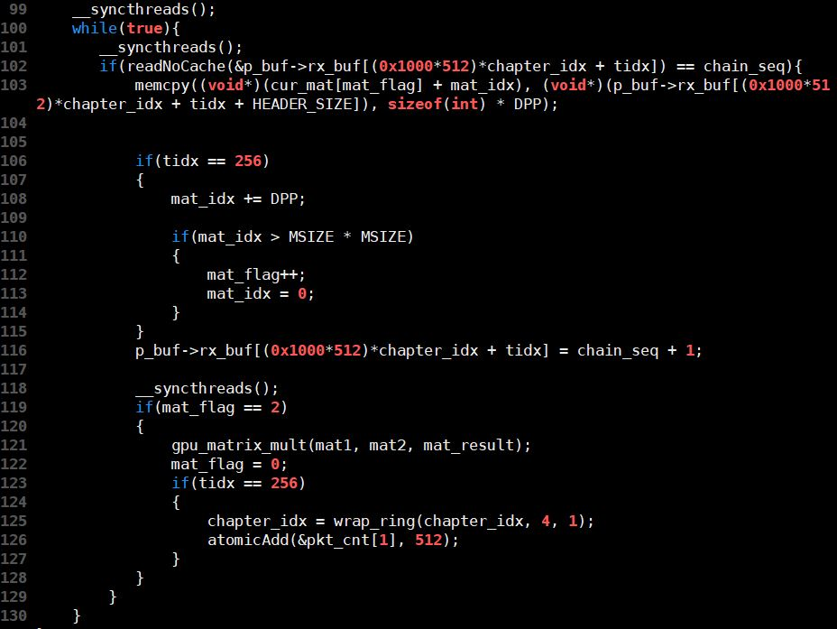

* packet의 data부분을 memcpy로 matrix(2차원 배열이지만 1차원처럼 사용)에 그대로 넣어주었다.
  * packet의 payload에 matrix의 값이 빈틈없이 채워져있다는 가정을 위해서.
* 한번에 matrix의 모든 값을 채워넣을 수 없으므로, mat\_idx를 사용하여 현재 값이 대입되어야할 위치를 알려준다.
* mat\_flag로 현재 값을 대입 중인 matrix를 알려준다.
  * cur\_mat\[mat\_flag\]가 현재 값을 대입 중인 matrix이다.
* mat\_flag가 2가 되면 mat1과 mat2 모두 값 대입이 완료되었다는 의미이므로, gpu\_matrix\_mult 커널을 호출한 뒤 chapter\_idx를 이동시키고, pkt\_cnt값을 올린다.

* 현재 위의 코드는 실행되지 않고 있다.
  * cudaMemcpy가 실행되지 않는다.


<center> Error Part </center>


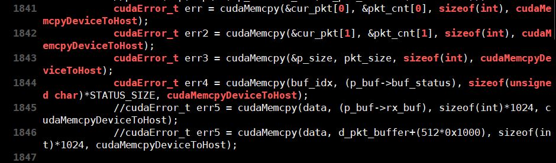

* while문 전체를 주석처리할 경우 실행되지만, while문만 남기고 while문 내부 코드를 전부 주석처리하여도 실행이 안된다.
* 원인은 할당된 thread의 수가 gpu가 감당할 수 있는 thread의 수를 넘어갔기 때문으로 추측중이다.
* 이 때문에 thread 수를 재조정 중이다.
  * row와 column이 모두 240(=15\*16)이므로 matrix의 값의 총 개수는 49600(=240\*240)이다.
  * 하나의 값당 하나의 thread가 사용되므로 총 49600개의 thread를 할당하려 시도했던 것이다.
  * 이로 인해 MM 커널에서 thread를 모두 가져가버렸고, rx\_kernel이 사용하려했던 thread도 MM이 사용하게 되어버린 것이다.
* 여기서 의문은 thread의 수를 과도하게 할당했다면, 커널 자체가 실행되지 않았어야하지않는가 이다.
* 더 자세히 알아볼 필요가 있을 것 같다.
* 아래의 사이트는 MM 코드를 수정하면서 찾아본 cuda의 thread 할당방법을 소개한 사이트이다.
  * 아직 더 읽어봐야할 것 같다.
* [cuda_Grid](http://haanjack.github.io/cuda/2016/03/27/cuda-prog-model.html)


---

## 04/01 현재상황

* 아래의 것들은 확인한 내용들이다

1. segment의 개수
2. 각 segment의 크기 지정
3. rte\_mem\_virt2phy의 역할 및 원리

* 아래의 것들은 추가 확인이 필요한 내용들이다

1. VFIO driver
2. rte\_mem\_virt2phy의 세부 원리 및 실제 활용
   * /proc/self/pagemap의 사용방법
3. HEADROOM의 존재 이유

---

### 1. segment의 개수

* 결론부터 말하자면 **LRO를 사용하지 않는 경우는 모두 1개, LRO를 사용하는 경우는 packet과 segment의 크기에 따라 다르다**
* ixgbe 드라이버를 사용할 경우 rx를 담당하는 함수는 총 6가지가 있다
  * ixgbe_recv_pkts_lro_bulk_alloc
  * ixgbe_recv_pkts_lro_single_alloc
  * ixgbe_recv_scattered_pkts_vec
  * ixgbe_recv_pkts_vec
  * ixgbe_recv_pkts_bulk_alloc
  * ixgbe_recv_pkts
* 이를 나누는 기준은 2가지로 나뉜다
  * packet의 처리 방식
    1. LRO(Large Receive Offload)
    2. vectore
    3. default
  * allocation 방식
    * bulk allocation(batch allocation)
    * single allocation
    * default
* 위의 기준에 따라 총 6가지의 함수가 생겼고, 현재 드라이버의 상태와 사용자가 입력해준 옵션에 맞춰서 함수가 선택된다
* 이 중 LRO버전을 제외한 모든 함수들은 segment가 1로 고정되어있다
  * 모든 packet이 하나의 segment에 담겨진다는 뜻이다
* LRO버전의 경우 여러개의 packet을 하나로 합쳐서 넘겨주기 때문에 합쳐진 packet의 크기가 segment의 크기를 넘을 수 있다
* 이를 위해서 segment를 여러개를 만들어 packet을 저장한다

* 이 때문에 segment의 크기와 packet의 크기에 따라 segment의 개수는 달라질 수 있다

---

### 2. 각 segment의 크기 지정

* segment의 크기는 **프로그래머가 mempool을 만들때 지정해준다**


<center> mempool_create in fancy </center>


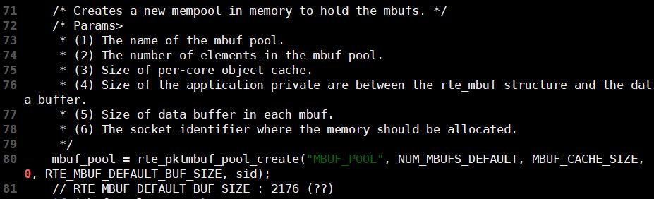

* fancy에 있는 dpdk 코드이다
* rte\_pktmbuf\_pool\_create라는 함수를 보면 매개변수로 RTE\_MBUF\_DEFAULT\_BUF\_SIZE를 넘겨준다
* 이 매개변수는 위의 주석에서 4번에 해당하는 변수로 각 mbuf의 data buffer의 크기를 지정해주는 변수이다
* RTE\_MBUF\_DEFAULT\_BUF\_SIZE는 2048 + 128로 지정되어있다
  * 03/31일자 기록 참고
* 이와 관련된 내용은 03/31일자 기록에 있는 함수의 매개변수를 따라가보면 확인할 수 있다
* 그렇다면 이 data buffer의 크기는 어떤 범위에서 허용될까


<center> buf_size setting in ixgbe_dev_rx_init </center>


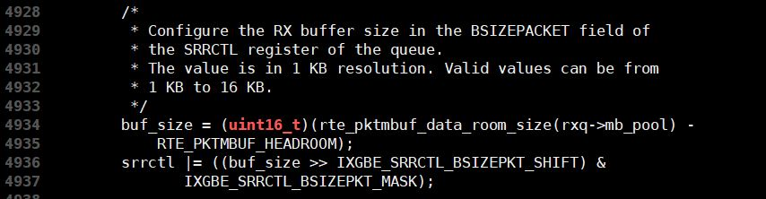

* 위의 캡쳐를 보면 1KB에서 16KB사이의 값이 유효하다고 한다
* ixy에서도 그렇고 위의 default값도 그렇고 2KB로 지정되어있는데 왜 최소가 1KB로 되어있을까
* 그 이유는 ixgbe의 rx함수 중 vector 기능을 사용하는 함수에서 추측할 수 있다


<center> comment in _recv_raw_pkts_vec </center>


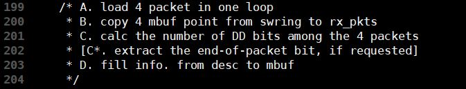

* 위의 주석은 \_recv\_raw\_pkts\_vec의 함수에 있는 주석이다
  * \_recv\_raw\_pkts\_vec함수는 ixgbe\_recv\_pkts\_vec 함수를 따라가면 나오는 vector 기능을 사용하는 rx 함수이다
* 4개의 packet을 하나의 loop에서 처리한다고 기술되어있다
* 4개의 packet을 한번에 처리하여 contiguous한 공간에 담아준다


<center> load to contiguous memory space  </center>


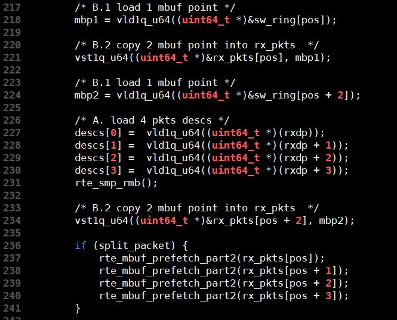

* 따라서 총 4KB 이상의 메모리를 사용하게 하여 DMA의 사용 효율을 높인 것이다

---

### 3. rte\_mem\_virt2phy의 역할 및 원리

* 함수명 그대로 Virtual Address를 Physical Address로 변환해주는 기능을 한다
* 좀더 자세히 설명하자면 **Virtual Address에 해당하는 page를 찾아 Physical Address로 변환해준다**


<center> Get Page Number </center>


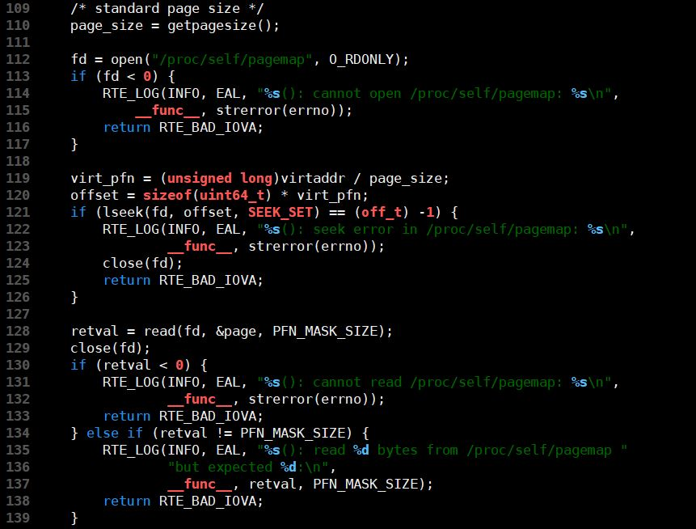

* 위의 캡쳐는 rte\_mem\_virt2phy 함수의 일부이다
* Virtual Address를 page size로 나눠서 page number를 구한다
  * page는 virtual address의 관점이고, frame이 physical address의 관점이다
  * 따라서 virt\_pfn이라는 변수는 사실 page number를 뜻하고, 아래의 page라는 변수가 실제 pfn이 될 것이다
* offset을 이용해 pfn값을 구해온다
  * pagemap을 읽어와 사용하는 이 부분은 추가확인이 필요함


<center> Get Physical Address </center>


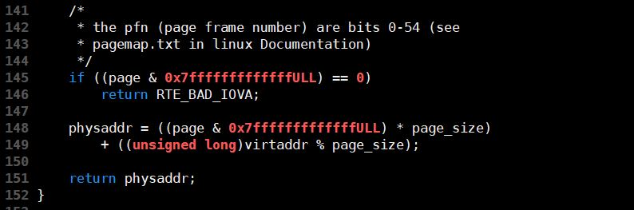

* 위의 캡쳐는 이전 캡쳐의 다음 부분이다
* 구한 pfn값과 Virtual Address를 page size로 나누어 얻은 page offset(실제로는 frame offset)을 더해 Physical Address를 구한다

---

### 확인해야할 부분

1. VFIO driver
   * VFIO 드라이버가 dpdk에서 하는 역할을 확인해야한다
   * VFIO와 IOVA as VA 모드간의 관계도 확인해야한다
2. rte\_mem\_virt2phy의 세부 원리 및 실제 활용
   * /proc/self/pagemap의 사용방법과 offset의 역할에 대한 확인이 필요하다
3. HEADROOM의 존재 이유
   * 빈 padding일 가능성이 매우 크지만 확실하지 않다
   * tailroom은 document에서는 등장하지만 실제 코드에서는 등장하지 않는다는 점과 함께 확인해볼 필요가 있다
