# Daily Report

##  ToDo List

1. Version Number 관리 구현
2. 패킷의 Header 관리 구현
3. CPU에 저장 후 CPU에 저장된 메모리 공간의 주소를 다시 GPU로 넘겨주는 것 구현
4. GPU Kernel과 Thread 수를 고려한 pipelining 구현

## Evaluations
1. Key와 Value의 크기에 따른 KVS 성능
    * Key와 Value의 크기는 Mega\-KV와 KV\-Direct를 참고
    * Workload를 어떤 것으로 할 것인가도 위의 논문들 참고
        * e.g.) R100 / R95 W05 등등...
    * Distribution은 Uniform으로
2. Workload의 종류에 따른 KVS 성능
    * Key와 Value의 크기를 고정해둔 채로 실험
    * YCSB의 모든 Workload를 실험하면 될듯
    * Distribution은 Uniform으로
3. Distribution에 따른 KVS 성능
    * Zipf와 Uniform Distribution으로 실험
    * Key/Value의 크기와 Workload의 종류는 타 논문 참고.
4. GPU hash table에 저장되는 데이터 크기의 Limit에 따른 성능
    * KV\-Direct에서 hash table에 inline으로 저장해두는 것을 참고한 실험
    * 현재는 주소값 변수의 크기인 64B로 되어 있음
    * 이를 실험하기 위해서 코드 수정이 필요함
5. Dynamic한 상황에서의 성능 비교
    * Read\(Search\)와 Write\(Update\)의 비율이 Dynamic하게 변하는 상황에서의 성능 실험
    * Key와 Value의 크기는 고정
    * Distribution은 uniform으로
6. 가장 Basic한 상황에서의 전력소모 측정
    * GPU로 KVS 처리했을 때의 강력한 장점 중 하나이다.
    * 이는 Mega\-KV와 KV\-Direct에서 중요하게 다루는 점 중 하나
7. Latency 측정
    * KVS가 Service와 밀접한 관련이 있다보니 Latency도 중요하게 여긴다.
    * CPU를 거치는 경우와 거치지 않는 경우 모두 측정 필요
8. Mega\-KV와의 기본 성능 비교
    * Mega\-KV를 까고 우리 KVS의 성능을 돋보이게하기 위해서 필요하다.
    * Mega\-KV의 코드가 있으니 돌리기 쉬울듯.

---
## 07/28 현재 상황

* CPU TX에 성공했다.
* 계속 TX에 실패한 이유는 다음과 같다.

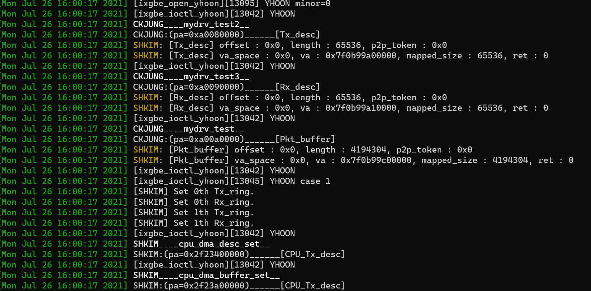
* 위의 사진을 보면 Set 1th Tx\_ring이 출력된 다음 SHKIM\_\_\_\_cpu\_dma\_desc\_set\_\_이 출력된다.
* 이 뜻은 **TX를 위한 Physical Address를 NIC에 적어준 다음 TX를 위한 Physical Address를 받아온다**라는 것이다.
* 더 자세히 서술하자면, dma\_tx\_desc\_from\_dram과 dma\_addr\_to\_dram이란 변수를 이용해 NIC에게 Physical Address를 넘겨준다.
* 그런데 이 변수들에게 값을 대입시켜주지 않은 상태로 이 변수들에 들어있는 값을 NIC에게 전달해준다는 것이다.
* 그렇게 되면 쓰레기값을 DMA할 주소로 넘겨주는 것이 되므로 NIC에서 패킷을 보내려고 DMA를 할때 문제가 발생한다.
* 이 때문에 ixgbe driver를 내렸다가 올릴때 에러가 발생하는 것이다.
    * NIC 입장에서는 TX하려고 DMA를 시도하는 중에 에러가 떠있는 상태인데 드라이버를 내릴려고하니 충돌이 발생한 것.
* 이를 위해 코드의 구조를 살짝 수정했다.
* 큰 변화는 없고, GPU\-Ether처럼 main함수에서 Packet Buffer와 Descriptor를 미리 다 할당한 뒤 ioctl로 ixgbe driver에게 넘겨준 다음 *set\_desc\_doorbell* 함수를 호출해 PA를 NIC에게 넘겨준 것이다.
* 그 결과 드라이버 코드 순서가 아름답게 진행된다.

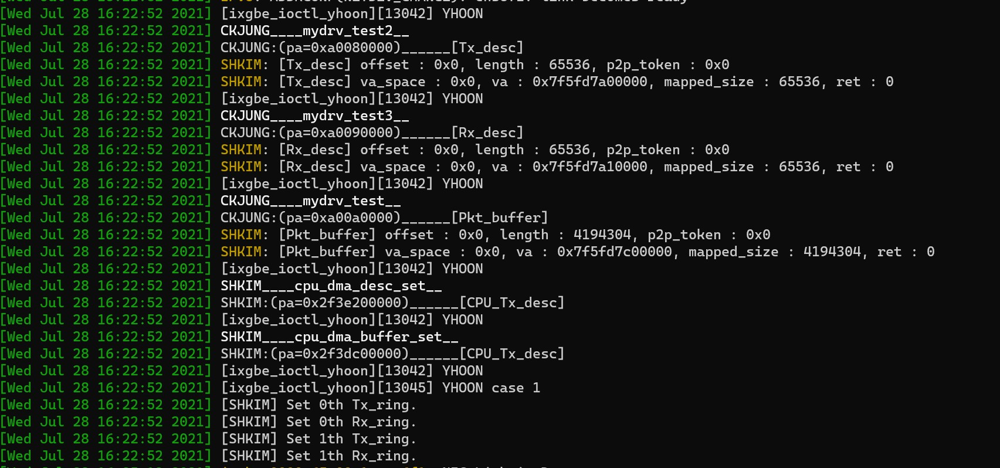

* 위의 캡쳐를 보면 아름다운 순서로 진행된 것을 확인할 수 있다.

* 이 상태에서 KVS 코드에 에러가 없게 한 다음 실행시키면 패킷이 잘 전송된다.
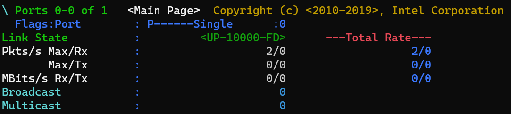
* 현재 코드가 Dummy Packet을 이용해 무한 루프를 돌면서 계속 패킷을 보내야하는데 gpu\_job\_handler의 kernel 수와 thread 수가 고려되지 않은 pipelining에 의해 패킷이 2개밖에 안 갔다.

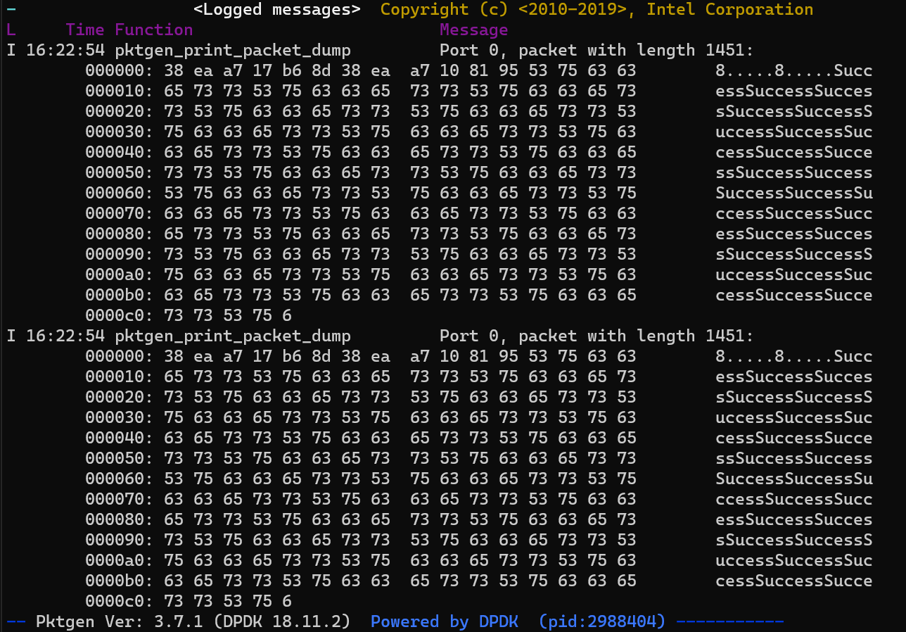
* 하지만 pktgen을 통해 packet dump를 해보면 오른쪽 패킷 내용에 수많은 Success가 찍혀있는 것을 확인할 수 있다.
    * Success 하나가 query 응답 하나이다.
* KVS 코드가 보낸 패킷이 정상적으로 도착했음을 확인할 수 있다.
* 이제 코드만 완성하면 된다.


---
## 07/20 현재 상황

* ~~오랜만에 써보는 일지~~
    * ~~앞으로는 늦어도 일주일에 한번은 써야할듯... 자꾸 까먹네...~~
* 일지의 공백기간 동안 진행된 사항을 아래에 나열해두었다.
1. Mellanox NIC에서 Intel NIC으로 변경
2. 대부분의 구조들 구현 완료
3. \(gpu\_balancer\) \- \(gpu\_job\_handler\) \- \(gpu\_pkt\_maker or cpu\_storage\_server\)간의 데이터 전달을 위한 queuing에 문제가 있어 디버깅 중
4. CPU에서 패킷을 전송하기위해 수정한 ixgbe 드라이버와 이를 활용한 패킷 전송 과정에 문제가 있어 디버깅 중
5. 논문에 추가될 실험 종류 선정

---
### 1. Mellanox NIC에서 Intel NIC으로 변경

* Mellanox NIC에서 Intel 40G NIC으로 target HW를 변경했다.
    * ~~이게 언제적인데....~~
* 그 이유는 **Mellanox NIC Driver에 대한 이해도 부족**때문이다.
* Mellanox NIC Driver의 경우 RDMA에 대한 내용도 코드에 담겨있어 코드의 양이 훨씬 방대하다.
* 또한 이를 사용하는 방법도 Intel NIC Driver에 비해 훨씬 복잡하다.
    * dpkg로 코드를 패키지화시켜서 Kernel에 등록시켜주는 방식을 사용한다.
    * DPDK나 Nvidia Driver를 사용할때처럼 여기서도 버젼관리가 매우 중요하다.
    * 그런데 버젼관리가 DPDK와 Nvidia Driver에 비해 훨씬 어렵다...
    * 혹시 필요한 상황이 생기면 수기형한테 물어볼 것.
* Mellanox NIC으로 결정한 이유는 일단 성능이다.
    * Mellanox NIC의 스펙시트를 확인해보면 64B 패킷에서도 40G Line Rate을 뽑아준다.
        * 특정 조건 아래에서만.
        * 자세한 조건은 스펙시트 확인 필요
    * 하지만 Intel NIC은 64B 패킷에서 40G Line Rate을 못 보여준다.
* 성능에서 격차를 보이기 때문에 성능에 초점을 맞춘 최신 논문들은 굳이 RDMA를 사용하지 않더라도 Mellanox RDMA NIC을 사용한다.
    * RDMA NIC으로 RDMA없이 RDMA의 성능을 보여주는 논문이 있다고 한다.
    * 이 논문은 찬규형이 알고 있다.
* 따라서 Mellanox NIC을 사용해 성능을 더 끌어올리면서 혹시 모를 NIC 선정 이유에 대한 질문을 사전 차단하고자 했었다.
* 하지만 GPU\-KVS에서 사용하는 패킷은 MTU사이즈에 가깝고, 배치를 최대한 해서 패킷 사이즈는 크면 클수록 좋다.
* 이러한 상황에서 굳이 시간을 더 들여서 복잡하고 어려운 Mellanox NIC 드라이버를 까보는 것보다 조금 더 익숙하고 10G NIC에 대한 경험이 ~~찬규형한테~~ 있는 Intel NIC이 더 좋은 선택으로 보였다.
    * ~~결국 밀렸지만...~~
* 이 때문에 Intel NIC으로 변경했다.

---
### 2. 대부분의 구조들 구현 완료

* 제목과 같다. 일단 구현은 완료했다.
* 하지만 아래에 서술할 내용들을 확인하면 알 수 있듯이 디버깅에서 시간이 매우 많이 소모되었다.
* 일단 세부구조는 다음과 같다.

```
NIC - GPU(RX Kernel) - KVS Kernel -  GPU(TX Kernel)      - NIC
                                  |
                                  -  CPU(Storage Thread) - NIC
```
* 이 전에 사용했던 구조와 동일하다.
* 이를 더 자세히 설명하자면 아래의 구조가 된다.

```
NIC - RX Kernel - GPU Balancer - GPU Job Handler - GPU Pkt Maker      - TX Kernel       - NIC
                                                 |
                                                 - CPU Storage Thread - CPU Network I/O - NIC
```

* 위의 구조가 되도록 구현은 일단 완료된 상태이다.
* 구현이 필요한 부분들은 다음과 같다.
1. Version Number 관리
2. 패킷의 Header 관리
3. CPU에 저장 후 CPU에 저장된 메모리 공간의 주소를 다시 GPU로 넘겨주는 것

#### Version Number 관리
* Version Number 관리의 경우 GPU가 동시에 여러개의 데이터를 처리하다보니 각 Thread가 어떠한 종류의 데이터를 전달받았냐에 따라 먼저 들어온 데이터가 나중에 들어온 데이터보다 늦게 처리될 수 있다.
* 이를 관리하기 위해서 **Version Number를 구현할 계획**이다.
* 기본 아이디어는 각 데이터들이 Version Number를 가지고 있고 Thread들이 해당 데이터를 읽거나 쓰기를 할 때 Version Number를 비교해 요청된 시점의 version에 맞는 데이터를 전달시켜주는 방식으로 진행된다.
* 여기에는 고민해봐야할 부분이 2가지가 있다.
1. 각 Thread들은 해당 데이터의 Version Number를 어떻게 확인할 것인가.
    * hash table에 있는 데이터의 경우 Version Number가 함께 저장되어있기 때문에 확인이 가능하다.
    * 하지만 Thread들이 가지고 있는 데이터는 패킷에서 막 뽑아낸 데이터이기 때문에 패킷에 Time Stamp라도 찍혀있지 않는 한 Version Number를 확인할 수 없다.
2. 꼭 Version Number가 필요한가?
    * Version Number가 아니면 데이터의 sequential한 처리를 보장해줄 수가 없는지 고민해볼 필요가 있다.   
    * KV\-Direct에서 사용한 것처럼 각 query를 바로 처리하지않고 배치를 해서 Write Operation이 오면 그 전의 Read를 다 처리하는  reservation station방식도 고려해볼 필요가 있을 것 같다.

#### 패킷의 Header 관리
* 패킷의 Header의 경우 현재는 SEARCH를 담당하는 GPU Job Handler의 Thread 중 하나가 맡아서 담당하게끔 구현되어 있다.
* 사실 실험 세팅 상 Direct하게 서로 연결되어 있어 헤더를 따로 관리해줄 필요가 없음에도 구현하고 있는 이유는 Generality때문이다.
* 현재의 구조상 패킷 헤더를 처리하면 그냥 queue에 넣는 방식이기 때문에 헤더와 데이터가 정확하게 매칭되지 않는다.
* 이 부분은 DB 서버의 구조상 Client와 Server 모두 데이터 센터 내부에 존재하는 서버 중 하나이기 때문에 각 Node가 direct하게 연결되어 있다고 가정해도 되지 않나 싶긴하다.
* 이 부분은 교수님과 얘기해보는 걸로.

#### CPU에 저장 후 CPU에 저장된 메모리 공간의 주소를 다시 GPU로 넘겨주는 것
* 이 부분은 좀 critical하다.
* 위의 두가지는 사실 없어도 모른척할 수 있다고 쳐도 이 부분은 구조에 필수적으로 있어야하는 부분이다.
* 기본 아이디어는 GPU hash table의 주소도 CPU에 넘겨주어 CPU가 slab에 데이터를 저장한 다음 해당 주소값에 slab의 주소값을 넣어주는 방식이다.
* 이 부분이 성능저하를 일으키지는 않을지 걱정이다...

---
### 3. queueing에 문제 디버깅

* GPU Kernel들 간의, GPU Kernel과 CPU Thread 간의 Queueing을 하는 과정에 문제가 발생했다.
* 문제의 원인은 모두 같은데 Queue의 head와 tail이 하나라는 점이다.
* 이게 문제를 일으키는 이유는 GPU의 Thread가 매우 많기 때문.
* GPU의 Thread 수는 최소 512개인데 이를 하나의 Queue에 넣고자하다보니 각 Thread들이 서로의 데이터를 덮어씌운다거나 Queue의 head 관리가 잘 안된다.
* 이를 해결하기 위해 모든 Thread들은 각 Thread들이 담당하는 Queue에서 자신들에게 할당된 공간에만 데이터를 넣는다.
    * 2번째 Kernel의 35번째 Thread는 2 \* 512 \+ 35번째 자리에만 데이터를 넣는다.
    * 이 공간의 크기는 변경해볼 가치가 있을듯
* CPU \- GPU 간의 queueing에서는 GPU가 담당하는 모든 공간을 CPU가 traverse하면서 확인하는 게 overhead가 매우 클 것으로 예상되어 \_\_ballot\_sync와 bit operation을 활용했다.
* 각 GPU Thread들이 데이터를 넣고 난 다음 각자에게 할당된 변수의 bit를 toggle한다.
    * \_\_ballot\_sync가 warp단위로 sync를 지원해 32bit int 변수를 사용한다.
* CPU는 해당 변수들을 traverse하면서 polling하다가 0이 아닌 변수를 발견하면 processing을 진행한다.
    * 0이 아니라는 것은 어떠한 GPU Thread 중 하나가 자신에게 할당된 bit를 1로 toggle했다는 것.
* 이러한 방식을 통해 CPU의 traverse 범위를 줄이고 GPU Thread들에게 queue의 head를 넓혀줄 수 있었다.

---
### 4. CPU에서 패킷을 전송 과정 디버깅

* 드디어 CPU 코드와 ixgbe 드라이버 코드 디버깅으로 왔는데 여기서도 당연히 문제가 있다.
    * index를 증가해주지 않아 에러가 떴다던가하는 시덥지않은 실수들은 생략한다.
* 일단 패킷은 전송되지 않는다.
* 아래의 부분에서 코드가 멈춘채로 돌아가지 않는다.

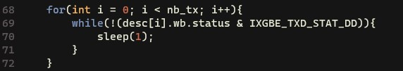 
* 이 말은 NIC이 패킷을 보내지 않았다는 이야기이다.
* 이 후에 재실행을 위해 ixgbe를 내리면 dmesg에 다음과 같은 에러를 보이며 해당 인터페이스가 존재하지 않는다면서 preconf도 멈춘다.
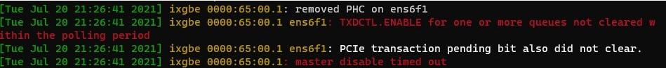
* 해당 에러 내용을 코드에서 찾아보니 `ixgbe_disable_tx_queue`라는 함수에서 출력하는 에러 내용이다.
* ixgbe 드라이버가 사용된 tx queue들에게 disable 요청을 보낸 뒤, wait\_loop라는 값이 0이 될 때까지\(일정 시간동안\) disable이 안되면 뱉어내는 에러이다.
* 추측상 CPU쪽에서 queue를 물고 놔주지 않아 발생하는 에러로 보인다.
    * 그 이유는 위에서 NIC이 패킷을 보내지 않은것처럼 보이는 현상때문.
* 여기서 CPU가 왜 queue를 놔주지 않는지 확인해본 결과 가장 높은 확률로 doorbell에 문제가 있어보인다.
* 왜냐하면 doorbell이 GPU\-Ether에서 사용된 코드를 그대로 가져와 사용하기 때문이다.
* CPU쪽에서는 1번 ring을 사용해야하므로 GPU\-Ether와 달리 1번 ring을 사용하도록 강제해줘야한다.
* 당연히 ixgbe 드라이버쪽에서도 조치가 필요할 수 있다.
* 현재 ixgbe 드라이버에서 doorbell을 mmap으로 mapping할때 메모리 공간의 크기를 기존의 두배로 설정해두고 CPU쪽에서 doorbell을 mapping할때 mmap으로 받은 다음 0x1000\*8만큼 이동해서 사용하게한 상태이다.
* 이 경우에 dmesg에 다음과 같은 에러를 뱉어낸다.
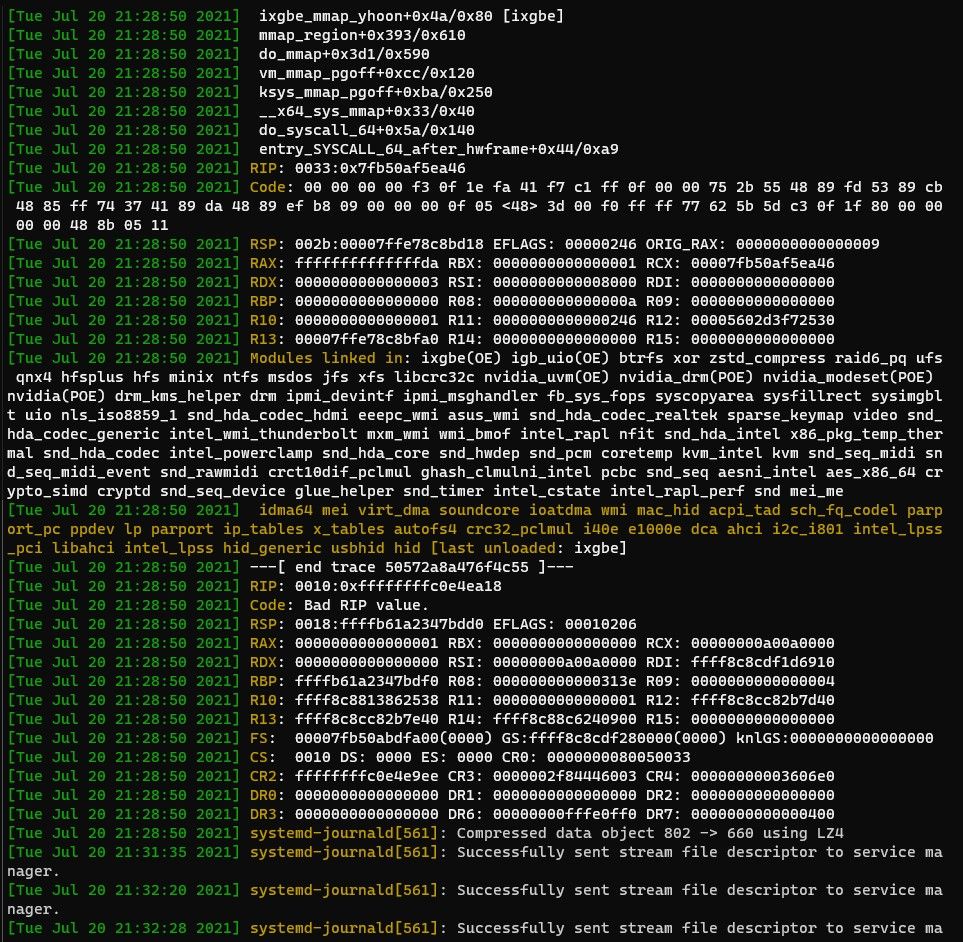
* 이는 보통 메모리 Access 관련 에러라고 한다.
* 모든 ring들의 Doorbell Register들이 contiguous한 공간에 mapping되어있지는 않은 것 같다.
* 이 부분은 내일 바로 확인 예정
---
### 5. 논문에 추가될 실험 종류 선정

* 논문에 추가할 실험 종류를 미리 기록해둘 필요성이 있어보여 남긴다.

1. Key와 Value의 크기에 따른 KVS 성능
    * Key와 Value의 크기는 Mega\-KV와 KV\-Direct를 참고
    * Workload를 어떤 것으로 할 것인가도 위의 논문들 참고
        * e.g.) R100 / R95 W05 등등...
    * Distribution은 Uniform으로
2. Workload의 종류에 따른 KVS 성능
    * Key와 Value의 크기를 고정해둔 채로 실험
    * YCSB의 모든 Workload를 실험하면 될듯
    * Distribution은 Uniform으로
3. Distribution에 따른 KVS 성능
    * Zipf와 Uniform Distribution으로 실험
    * Key/Value의 크기와 Workload의 종류는 타 논문 참고.
4. GPU hash table에 저장되는 데이터 크기의 Limit에 따른 성능
    * KV\-Direct에서 hash table에 inline으로 저장해두는 것을 참고한 실험
    * 현재는 주소값 변수의 크기인 64B로 되어 있음
    * 이를 실험하기 위해서 코드 수정이 필요함
5. Dynamic한 상황에서의 성능 비교
    * Read\(Search\)와 Write\(Update\)의 비율이 Dynamic하게 변하는 상황에서의 성능 실험
    * Key와 Value의 크기는 고정
    * Distribution은 uniform으로
6. 가장 Basic한 상황에서의 전력소모 측정
    * GPU로 KVS 처리했을 때의 강력한 장점 중 하나이다.
    * 이는 Mega\-KV와 KV\-Direct에서 중요하게 다루는 점 중 하나
7. Latency 측정
    * KVS가 Service와 밀접한 관련이 있다보니 Latency도 중요하게 여긴다.
    * CPU를 거치는 경우와 거치지 않는 경우 모두 측정 필요
    * ~~Mega\-KV보다 느리면....큰일나....~~

---
## 06/25

* ubuntu의 커널 자동 업데이트를 막는 명령어를 찾았다
```
sudo apt-mark hold linux-image-generic linux-headers-generic
```

---
## 04/27 현재 상황

* Mellanox ConnectX\-5 Ex 40Gbps NIC을 설치 중에 있다.
* 현재 rain과 sunny 서버 모두 NIC을 부착했고, driver도 설치했다.
* mlx5 driver를 설치하는 과정은 간단하다.
* mlx5 driver를 검색하면 Mellanox 홈페이지가 나오는데 거기서 다운로드 받고 설치하면 된다.
    * [Driver Download](https://www.mellanox.com/products/ethernet-drivers/linux/mlnx_en)
* 다만 설치할때 다음의 option들을 추가해줘야한다.
```
sudo ./install --add-kernel-support --dpdk
```
* `-add-kernel-support`옵션은 해당 드라이버가 자동으로 지원하는 Kernel 버젼과 rain, sunny의 커널버젼이 호환되지 않기 때문에 줘야한다.
    * 4.18.15라는 커널 버젼을 옵션으로 따로 주지 않아도 알아서 인식해서 설치해준다.
* `--dpdk` 옵션은 해당 NIC을 dpdk로 사용하려면 줘야하는 옵션이다.
* 이 옵션을 줘서 설치를 해야지 mlx5 library가 설치가 되고, 그래야 dpdk를 build할때 mlx5 library도 같이 가져가서 build한다.
    * dpdk를 build하는 과정은 이 전과 동일하게 그대로 진행하면 된다.
* dpdk를 사용할때 주의할 점은 10G NIC을 사용할때와 달리 igb\_uio 드라이버가 아닌 mlx5\_core 드라이버, 즉, Mellanox의 드라이버를 사용해야한다는 점이다.
    * 따로 interface를 DPDK 전용 드라이버에 binding 시킬 필요가 없어진다.
* pktgen을 쓸때에는 좀 주의해야하는데, 그 이유는 dpdk 전용 드라이버를 사용하지 않아 어떤 interface를 사용해야할지 지정해줘야하기 때문이다.
* 아래의 명령어를 사용하자
```
sudo ./build/app/pktgen -l 0-4 -n 2 -w b3:00.0,txq_inline=256,txqs_min_inline=4 -- -T -P -m "[1-2:3-4].0" -f./default.pkt
```
* 여기서 `b3:00.0`은 사용하고자 하는 interface의 PCIe 번호이다.
* txq\_inline과 txqs\_min\_inline은 Mellanox NIC을 위한 옵션인데 성능과 관련이 있다고하니 Document를 자세히 보자

---
## 04/19 현재 상황

* 남은 구현 상황을 남긴다.
* 추후에 구현할 때 잊지 않기 위해서이다.

* 추가내용을 첨부한다.

* cgQ의 Q의 경우에는 dma를 통해 직접 전송하는 방식으로 구현하고자했다.
* 하지만 어려움이 있다.
* gdrcopy의 경우에는 CPU측에서 GPU의 메모리 공간의 physical address를 가져와 CPU에서 접근이 가능하게 VA를 mapping한 다음 page table에 등록시켜주는 방식으로 진행된다.
    * 실제로 PA를 가져오는 건 아닌 듯하나 이건 좀 더 공부가 필요하다.
    * nvidia\_p2p\_get\_pages 함수를 사용한다.
    * 도도의 설명을 들어 얼추 그림을 그렸으니 잊기 전에 page와 page table 운용방식을 공부하자.
* GPU\-Ether의 경우 NIC의 정보가 담긴 `/dev/ixgbe`파일에서 dma 관련 세팅에 대한 정보를 가져온 다음 gdrcopy처럼 GPU의 메모리 공간을 page table에 등록시키고 ixgbe의 정보와 GPU의 정보를 연결시켜주는 방식으로 진행된다.
    * 이 부분도 좀 더 공부가 필요하다.
* 위의 내용들을 완벽하게 이해한 것은 아니지만, 이해한 내용까지로 생각해봤을때 **GPU쪽에서 CPU로 DMA를 하는 것은 불가능**해보인다.
* 그 이유는 gdrcopy와 GPU\-Ether 모두 GPU의 메모리 공간의 PA를 가져와 DMA가 가능하도록 CPU의 page table에 등록하는 방식을 사용하기 때문이다.
* GPU에서 CPU의 메모리 공간을 가져와야하기 때문에 CPU의 메모리 공간을 GPU의 page table에 등록해야하는데 이 방식은 알기가 어렵다....
    * 그렇다고 없진 않을수도 있으니 찾아는 보자.
* 일단 HostAlloc을 이용해서 빠르게 구현한 다음 실험은 먼저 해보는게 좋을 것 같다.

---
1. CPU\-GPU간의 Q인 cgQ를 어디서 할당할 것 인가.
    * initialize\_kvs에서 해도 되고 initialize\_storage\_server에서 해도 됨.
    * 주의할 것은 cgQ의 Q는 일반 cpu dram 메모리 공간에 할당한 다음 dma에 가능하게 주소값을 받아두는 것.
    * 두번째는 cgQ의 head는 cudaHostAlloc을 이용한 할당을 한뒤 head의 주소값을 받아두는 것.
    * tail의 경우에는 cpu thread에서만 사용할 것 같으니 크게 문제 없을 듯 하다.
2. cgQ에 dma하는 함수 구현
    * 이는 gdrcopy와 GPU\-Ether의 ixgbe코드를 참고해야한다.
3. ixgbe코드 변경
    * 아래의 명령어를 사용하면 rx와 tx의 큐를 따로 잡을 수 있다.
    ```
     ethtool -L|--set-channels devname [rx N] [tx N] [other N] [combined N]
    ```
    * 이를 이용해 rx 큐는 1개, tx 큐는 2개를 잡은 다음, 하나의 tx 큐는 CPU로, 다른 tx 큐는 GPU로 binding시켜주는 코드를 ixgbe에 심어야한다.
    * 또한 GPU\-Ether처럼 CPU에서 NIC의 tx 큐에 바로 dma로 채워넣은 다음 packet을 전송시키게끔 구현해야한다.

* 현재 기억나는 상황은 여기까지다.
* 추가적으로 필요하면 서술하는 것으로.

---
## 04/14 현재 상황

* CPU polling GPU access 실험을 다시 진행해보았다.
* 결과는 어제의 실험이 잘못되었던 것이었다

---
### cudaHostAlloc과 cudaHostGetDevicePointer을 사용한 접근

* 이전과 실험 과정은 동일하게 진행하였다.
* 이전 실험에서 사용된 GPU 코드에 synchthread를 추가하니 정상작동하였다.
* CPU\-GPU의 문제가 아니라 무한 루프 내부에서 thread 간의 scheduling에 문제가 있었던 것이다.

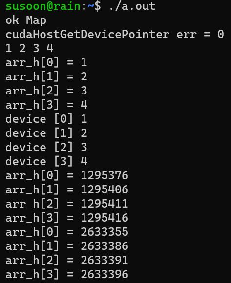

* arr\_h 배열 내부의 값이 정상적으로 증가하고 있음을 확인할 수 있다.

---
### gdrcopy를 사용한 접근

* 이전과 실험 과정은 동일하게 진행하였다.
* 다만 이전 실험에서 사용한 코드에 오류가 있어 이를 수정 후 적용하였다.
    * 해당 오류는 thread에 parameter를 넘겨주는 과정에서의 문제였다.
* 그 결과 CPU에서 polling 중인 메모리에 GPU가 정상적으로 접근이 가능했다.

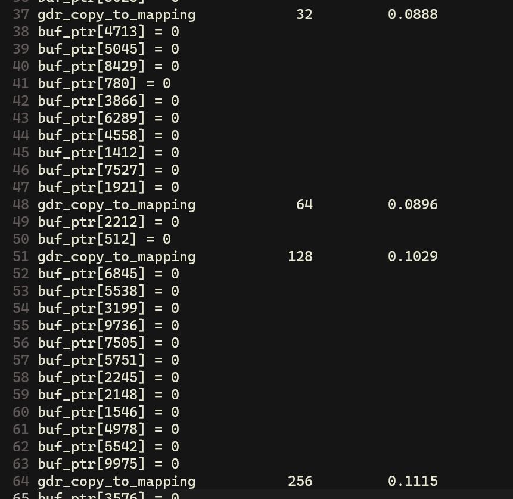


* GPU의 메모리에 write를 하는 *gdr\_copy\_to\_mapping*과 read를 하는 *gdr\_copy\_from\_mapping*함수 모두 정상적으로 작동하고 있는 것을 확인할 수 있다.

---
## 04/13 현재 상황

* CPU에서 polling 중인 메모리 공간에 GPU가 접근해 데이터를 쓸 수 있는지 실험해보았다.

---
### cudaHostAlloc과 cudaHostGetDevicePointer을 사용한 접근

* cudaHostAlloc으로 host memory에 pinning해둔 메모리 공간을 할당.
* 해당 메모리 공간을 cudaHostGetDevicePointer을 사용해 GPU에서 접근 가능한 VA의 형태로 변경
* GPU에서 해당 VA를 사용해 접근함과 동시에 CPU에서 해당 host memory 공간을 polling

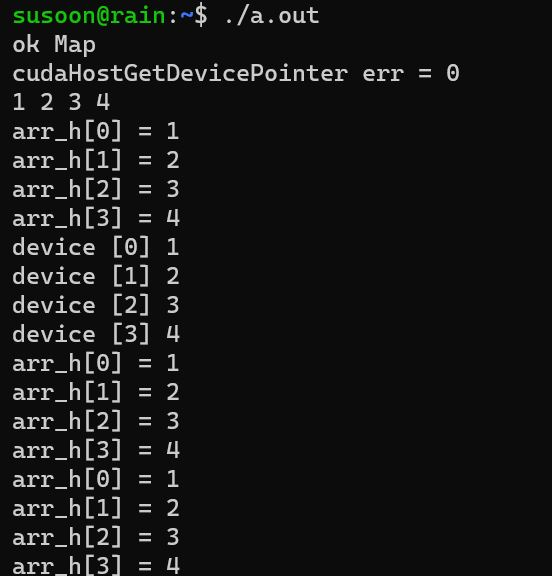

* arr\_h배열이 위에서 설명한 host memory 공간이다.
* GPU에서 해당 배열 공간에 접근해 값을 1씩 증가시켰다.
* arr\_h배열에서는 GPU가 접근할 수 있는 타이밍을 주기위해서 sleep함수를 이용해 1초에 한번씩 접근하였다.
* 하지만 위의 캡쳐를 확인하면 값이 변하지 않고 있음을 확인할 수 있다.
* 만약 GPU에서 printf를 통해 해당 메모리 공간을 출력하고자 한다면 정상적으로 작동을 한다.

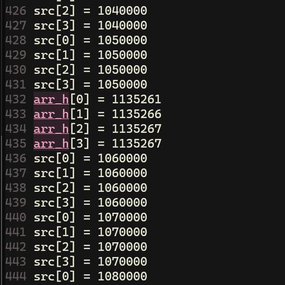

* 가능성이 아예 없는 것 같진 않지만 좀 어려워보이긴 한다.
* 좀 더 알아볼 필요가 있다.

---
### gdrcopy를 사용한 접근

* gdrcopy에서 제공한 copylat이라는 test를 이용했다.
* 내부에서 copylat에 구현된 memcpy를 그대로 진행시키되 pthread를 하나 더 파서 해당 thread에서 memcpy되는 공간을 polling하도록 했다.
* 결과는 다음과 같다.

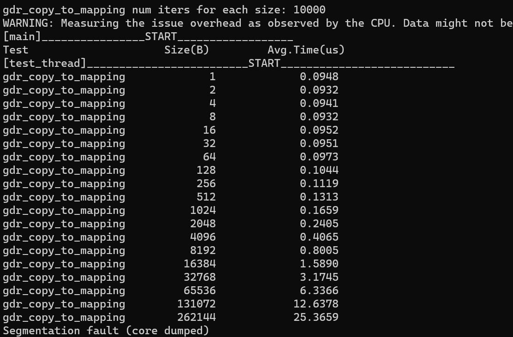
* segfault가 발생한다.
* pthread에서 해당 공간을 접근하는 순간 바로 에러가 발생하는 것 같다.
* dma를 사용한 접근은 어려워 보인다.
* 이는 더 정확한 실험으로 더 자세히 알아볼 필요가 있어보인다.
    * ~~하지만 안될 것 같다~~

---
* gdrcopy의 구현을 공부하다가 \_mm\_mfence라는 함수를 발견했다.
* 해당 함수의 역할을 검색하다 **Memory Visibility**와 **Memory Barrier**에 대한 내용을 발견했다.
    * [Memory Visibility and Memory Barrier](https://m.blog.naver.com/jjoommnn/130037479493)
* 간단히 요약하면 다음과 같다.
```
Memory Visibility : 하나의 Thread가 변경한 메모리의 데이터가 다른 Thread에서도 정상적으로 READ할 수 있는가
Memory Barrier    : 각 core가 cache와 register에 저장하고 있는 데이터를 메모리에 반영하는 지점
```
* 이는 complier의 **Memory Ordering**과도 관련이 있다.
* complier가 코드를 build할때 Memory Reordering 최적화를 진행하는데, 이때 Memory Barrier 내부의 데이터에 대한 operation만 ordering을 한다.
* 따라서 Multi Thread 혹은 Multi Core Programming을 할때에는 Memory Barrier을 잘 지정해주어야 적절한 Memory Visibility를 확보할 수 있게 되는 것이다.

---
## 04/08 현재 상황

* 아래의 부분들은 구현이 완료되었다.
    * Slab Allocator
    * Storage Thread\(Network 부분 제외\)
* 아래의 부분들은 구현이 필요하다.
    * CPU에서의 Network 구현
        * ixgbe 드라이버를 수정해 tx queue를 하나 더 할당
        * 추가된 tx queue와 Storage Thread간의 연결
        * 이를 위한 DMA와 Descriptor, Doorbell
        * netmap과 ixy 코드 확인
    * GPU KVS의 opertion의 Atomicity 보장
        * version number 혹은 reservation station을 이용
    * GPU job handler와 balancer, pkt\_maker 간의 data pipelining 구현
    * ixgbe 드라이버를 수정해 2 port 사용
    * CPU와 GPU간의 data pipelining 구현
        * value의 크기가 64B보다 크면 CPU로 전달
        * GPU의 hash table에 빈 칸이 없을때 insert가 오면 가장 호출 빈도가 적은 데이터를 CPU로 밀어내고 저장
        * cgQ에 GPU가 데이터를 다 담은 뒤 cgQ의 head값을 변경
        * CPU는 head값만 polling하다가 값이 변경되면 cgQ를 이용해 데이터를 관리
        * 교수님의 말씀으로는 event driven으로 구현하는 것이 좋다고 함.
        * CPU가 메모리 공간을 polling\(access\)하고 있을때 GPU에서 해당 메모리 공간에 write하는 게 가능한지 확인 필요
        * gdr copy를 참고

---
## 04/05 현재 상황

* 현재 slab allocator를 구현 중에 있다.
* slab merge 구현 방법에 대해 조금 더 고민해볼 필요가 있다.
* slab list의 경우 slab allocator쪽에 end를 하나, storage thread쪽에 end를 하나 각각 따로 두어 운용할 필요가 있어보인다.
    * KV\-Direct의 방법을 사용하는 것이다.
    * race problem을 방지할 수 있다.

---
## 04/04 현재 상황

* 논문 디자인에 추가하면 좋을 것 같은 내용을 발견했다.
* 아래의 내용은 KV\-Direct을 읽으며 생각한 내용이다.
1. 추가 실험 내용
    * 아래의 Hvalue로 판단할 value 크기의 threshold에 따라 성능 변화 측정.
    * 이를 위해선 현재 64B의 크기로 고정되어 있는 value의 자료형을 변경해 구현해야한다.
2. Storage Thread에서 memory allocation 방법
    * KV\-Direct에서처럼 미리 allocation되어 있는 공간에 데이터를 저장하는 방식으로 구현하는 게 좋을 것 같다.
    * KV\-Direct에서처럼 구현하려면 2의 배수만큼의 크기에 해당하는 공간들을 미리 할당해둔 뒤 필요에 따라 해당 공간을 쪼개거나 합쳐서 새로운 공간을 만들어 데이터를 저장하는 방식이다.
    * 미리 할당해둔 공간을 모두 사용하고 있거나 최소 크기보다 작은, 최대 크기보다 큰 공간이 필요할 경우 새로 할당을 받아 사용한다.
3. GPU가 KVS 작업을 할 때, write와 read 간의 consistency는 어떻게 맞출 것인가.
    * GPU에서 consistency를 맞춰준다면 CPU쪽은 걱정할 필요가 없다.
        * 그 이유는 GPU가 CPU에게 작업을 넘길때 queueing이 되어 넘어가기 때문.
    * GPU는 여러 thread가 동시에 작업을 하므로 먼저 도착한 write보다 나중에 도착한 read가 먼저 처리될 수 있다.
    * 이 부분은 고민해봐야할 것 같다.

---
## 03/31 현재 상황

* KV\-Direct의 Design을 참고해 논문 구현의 디자인을 변형했다.
* 변형한 이유는 Host DRAM의 사용이 필수불가결해졌기때문이다.
* 이를 위해 CPU에도 구현해야할 사항이 추가되었다.
* 현재 필요한 구현 내용은 다음과 같다.
1. CPU의 Storage Thread
2. GPU \- CPU간의 queue
3. GPU \- CPU간의 communication을 위한 Protocol
4. CPU와 communication을 진행할 GPU의 Kernel

---
### 디자인 변경 이유

* KV\-Direct\(2018\)와 Learned Cache\(2020\)과 같은 최신 동향을 봤을때 **DRAM을 사용하지 않는 것은 불가**하다는 판단이 들었기 때문이다.
    * 사실 최신 동향이라기엔 표본이 너무 적긴하다.
    * 하지만 아래의 문제점을 해결하기 위해서 DRAM의 사용은 필수적으로 보인다.
* PIM\(Process In Memory\)의 컨셉이 포함된다.
    * 이 부분은 더 조사해보자.
* ~~논문 제목은 GaaChe : GPU as a caChe~~
* GPU를 Host DRAM의 Cache로 사용하겠다는 의미이다.
    * 사실 정확하게는 PIM로 사용한다는 것이 더 옳은 의미이다.
* 기존 디자인의 문제는 모든 데이터가 GPU내에 있어야하고, static한 크기의 value만 사용가능하다는 것에 있었다.
* 이를 해결하기 위해서는 DRAM을 사용하지 않을 수가 없었다.
* 하지만 DRAM을 사용하면 다음의 문제가 발생한다.
    1. 장점으로 주장한 CPU의 비사용을 깨고 CPU를 사용해 DRAM을 처리해주어야한다.
    2. Mega\-kv의 단점이자 우리 논문의 Motivation인 cudaMemcpy 삭제를 못하게 된다.
* 위의 문제점들은 아래의 근거로 무효화시킬 수 있다.

1. KVS를 사용하는 Storage Server가 굳이 CPU를 사용하지 않을 이유가 없다.
    * CPU 사용량이 적다 정도로만 넘어가도 무관하다.
    * 그 이유는 Storage Server에서 KVS 대신 다른 application을 굳이 돌릴 필요가 없기 때문.
    * 대신 CPU 사용량이 적어 Storage Server의 CPU가 굳이 고사양일 필요가 없다고 주장할 수 있다.
2. cudaMemcpy가 아닌 다른 방식으로 copy를 진행하거나 DRAM을 사용하면서도 copy 자체를 생략할 수 있다.
    1. cudaMemcpy대신 GPU Direct RDMA API를 사용해 DMA로 직접 전송하면 훨씬 적은 overhead로 H\-to\-D 혹은 D\-to\-H copy가 가능하다.
        * 이 방식은 GPU가 모든 Network I/O를 담당할 때 사용 가능하다.
    2. 위의 PIM 컨셉을 이용해 GPU가 Memory의 Processor 역할을 하게 하고, DRAM은 Storage의 형태로 사용하면 된다.
        * 이는 아래에 Design 부분에서 자세히 서술한다.
* 위의 근거들을 기반으로 논문의 구현 방식을 변경해나가기로 했다.

---
### 논문 구현 디자인

* 기존 디자인인 GPU\-Ether \+ Mega\-KV는 그대로 유지한 채로 디자인은 추가하는 형태로 진행된다.
    * GPU\-Ether를 이용해 GPU로 Network packet을 받아와 Mega\-KV의 GPU KVS 코드를 Persistent Kernel로 구현해 KVS를 진행.
* 여기에서 DRAM 사용을 위해 CPU에도 데이터 관리를 위한 Storage Thread를 추가로 운용해야한다.
* client가 보낸 query의 흐름은 다음과 같이 진행된다.
```
NIC - GPU(RX Kernel) - KVS Kernel -  GPU(TX Kernel)      - NIC
                                  |
                                  -  CPU(Storage Thread) - NIC
```
* 위의 query 흐름 중 위의 흐름은 기존 디자인의 흐름이다.
* 아래의 흐름은 **GPU에 캐싱해 저장할 수 없는 크기의 value를 호출해야할 경우**에 발생하는 흐름이다.
* 위의 흐름은 기존 디자인과 동일하니 자세한 설명은 생략한다.
* GPU에 캐싱할 수 없는 크기의 value\(Hvalue\)가 Insert되어 Update, Search 그리고 Delete되는 과정은 다음과 같다.

#### Insert
1. Hvalue의 Insert가 요청됨.
2. Hvalue의 key값을 hashing해 적절한 자리에 key값을 대입.
3. Hvalue값과 key값, 해당 value를 요청한 packet의 metadata를 GPU \- CPU간의 queue에 push.
    * 이후 KVS Kernel이 CPU가 Hvalue를 저장한 DRAM의 주소값\(VA or PA\)를 넘겨줄때까지 대기할지, 다른 Kernel이 이를 관리할지는 정해진바 없음.
    * 다른 Kernel이 관리하는게 더 효율적으로 보임.
4. CPU의 Storage Thread가 queue를 polling하다가 Hvalue 저장 요청이 오면 메모리를 할당받아 Hvalue와 metadata를 저장.
5. CPU에서 Insert Success or Fail을 queue의 metadata로 패킷을 만들어 전송.

#### Update
1. Hvalue의 Update가 요청됨.
2. Hvalue의 key값을 hashing해 GDDR 내부의 hash table에서 Hvalue의 위치를 찾음.
3. value가 저장되어야하는 위치에 주소값이 저장되어 있다면 이를 GPU \- CPU간의 queue에 push.
    * 해당 위치에 저장된 값이 주소값인지 value인지는 bit하나를 따로 두어 이를 통해 확인.
    * Insert에서 value와 metadata만 queue에 push했던 것과 달리 주소값도 같이 push.
    * queue에도 bit를 이용해서 update임을 표기
4. CPU에서 Hvalue를 update
5. CPU에서 Insert Success or Fail을 queue의 metadata로 패킷을 만들어 전송.

#### Search
1. Hvalue의 Search가 요청됨.
2. Hvalue의 key값을 hashing해 GDDR 내부의 hash table에서 Hvalue의 위치를 찾음.
3. value가 저장되어야하는 위치에 주소값이 저장되어 있다면 이를 GPU \- CPU간의 queue에 push.
    * queue에 key값과 metadata만 push
    * Protocol의 일관성을 위해 Update와 유사하게 bit로 Search임을 알려도 됨.
4. CPU에서 해당 주소값에서 Hvalue를 찾아와 queue에서 받은 metadata로 packet으로 만든 뒤 전송.

#### Delete
1. Hvalue의 Search가 요청됨.
2. Hvalue의 key값을 hashing해 GDDR 내부의 hash table에서 Hvalue의 위치를 찾음.
3. value가 저장되어야하는 위치에 주소값이 저장되어 있다면 이를 GPU \- CPU간의 queue에 push.
4. CPU에서 해당 주소를 deallocation함.
5. CPU에서 Insert Success or Fail을 queue의 metadata로 패킷을 만들어 전송.

* 위의 과정을 통해 Hvalue의 query가 진행된다.
* 이를 위해 필요한 추가 구현 내용은 다음과 같다.
1. CPU의 Storage Thread
2. GPU \- CPU간의 queue
3. GPU \- CPU간의 communication을 위한 Protocol
4. CPU와 communication을 진행할 GPU의 Kernel
    * 만약 필요하다면

---
## 03/12 현재 상황

* 요약
1. GPU\-Ether의 정상작동에 실패한 이유는 ixgbe 드라이버 컴파일 및 install 당시 잘못된 kernel header를 참조했기 때문이다.
    * DPDK와 유사하게 build라는 이름의 symbolic link를 생성한 뒤 해결되었다.
2. GPU\-Ether의 성능이 저하되는 현상이 발생했다.
    * 이는 Bad TLP와 관련되어 메인보드의 PCIe 칩셋에 의한 것으로 추정된다.
* rain에서 GPU-Ether가 실행되지 않던 현상을 해결했다.
* 이와 관련된 이슈를 정리해 남겨둔다.

---
### GPU-Ether 실행 오류

* rain의 kernel 버전이 4.18.15임에도 불구하고 ixgbe의 install이 실패하고, GPU-Ether가 정상작동하지 않는 오류가 발생했다.
* sunny에 DPDK Pktgen을 실행시키고, rain에서 GPU\-Ether\(RX와 TX만 하는 가장 기본 형태\)를 실행시켰을 때 GPU\-Ether가 패킷을 하나도 받지 못하는 상황이 발생했다.

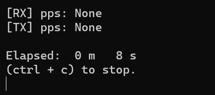
* 위의 형태로 pps가 변하지도 않았고 sunny의 pktgen에서도 패킷이 탐지되지 않았다.
* 이를 해결하기 위해 시도했던 것들을 아래에 남긴다.

1. ixgbe 버전 Miss Match

* rain과 sunny에 4.18.15의 kernel 버전을 설치한 뒤에 ixgbe를 추가적으로 설치해주지 않았다.
* 이로 인해 GPU\-Ether를 위한 customed ixgbe를 실행시키지 않은 normal 상태에서도 ifconfig에 packet이 감지되지 않았다.

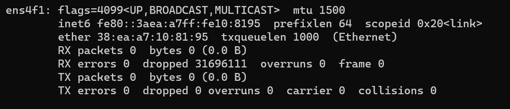
* 위는 ens4f1의 상태를 ifconfig로 확인한 것이다.
    * 문제가 해결된 뒤 캡쳐한 사진이기 때문에 ens4f1이다.
    * 원래는 ens4f0으로 시도했었다.

* GPU\-Ether에서 사용한 ixgbe의 버전은 5.5.3으로 이와 동일한 버전의 ixgbe를 인텔 홈페이지에서 다운로드 후 설치해주니 normal 상태에서는 정상작동을 했다.
    * 사실 정상작동은 아니다.
    * 후술하겠지만 Packet을 받는 것만 정상작동한 것이다.
* 하지만 GPU\-Ether는 customed ixgbe를 사용하므로 이 일로 GPU\-Ether의 실행에 변한 것은 없었다.

2. NIC Port Miss Match

* rain과 sunny는 10G NIC의 2개의 port가 모두 연결된 상태였다.
* 이는 Mega\-KV와 동일한 환경에서 실험을 진행하기 위함이었다.
* 하지만 GPU\-Ether를 위해 변형된 customed ixgbe는 1개의 port만을 위해 변경된 상태였다.
* 이 때문에 오류가 발생할 가능성을 위해 1개의 link를 제거했다.
* ens4f0을 사용하기 위해 0번 port를 연결하고 1번 port의 link를 제거해서 실행했다.
* 이 때는 위와 달리 GPU\-Ether가 정상실행조차 하지 못했다.
* doorbell과 descriptor 세팅을 완료하지 못하고 프로그램이 멈춘다.
* 이때 dmesg를 확인해보면 `Null pointer handling`이라는 에러 문구가 보인다.
    * 모든 과정이 해결된 뒤 작성하는 문서라 사진이 없다...
* 이는 GPU\-Ether를 위해 custom된 ixgbe 코드 중 ixgbe\_main.c에서 tx ring을 세팅해주는 부분에서 에러가 발생한다.
* 1번 port에 맞게 ring을 다 세팅해주려는데 1번 port는 link가 끊겨 있어 세팅이 불가하고 세팅이 되지 않은 0번 port가 ring을 요구하니 Null pointer handling 에러가 발생하는 것이다.
* ixgbe 코드를 수정하기 전까지 1번 Port만 사용해야한다.

3. Kernel header Miss Match

* snow에서는 GPU\-Ether가 정상작동한다는 사실을 확인 후 이와 비교하며 다른 점을 확인했다.
* 이때 ixgbe 코드를 make install할 때 에러가 발생해왔었다는 것을 발견했다.
```
- SSL error:02001002:system library:fopen:No such file or directory: ../crypto/bio/bss_file.c:69
```
* 위의 에러가 발생했으나 install이 실패하지는 않았다.
* 이 때문에 여태껏 ixgbe 드라이버가 **정상작동한다고 착각**했던 것이다.
* 이를 고치기 위해서 ixgbe 드라이버가 make를 통해 컴파일 되는 과정과 make install을 통해 install 되는 과정의 log를 지켜보았다.
* rain에서는 `/usr/src/linux-4.18.15`와 `/usr/src/linux-headers-4.18.15` 폴더를 참조해 linux kernel의 헤더파일을 불러왔고, snow에서는 `/usr/src/linux-4.18.15` 폴더만 참조해 헤더파일을 참조했다.
* 같은 코드를 컴파일했지만 다른 헤더파일을 불러온 이유는 다음과 같다.

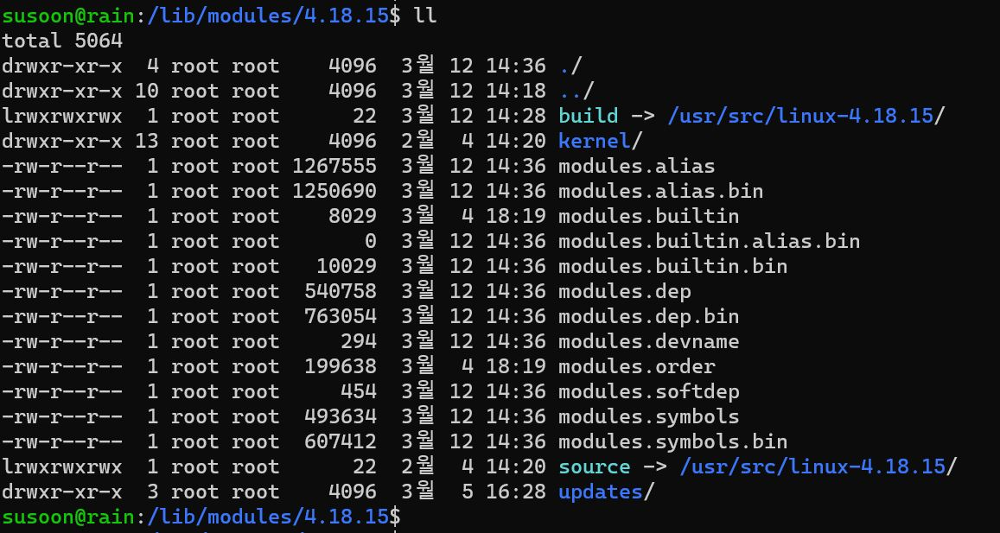
* 위는 `/lib/modules/4.18.15` 폴더 내부의 파일들을 보여준 것이다.
* 이때 **build**라는 symbolic link를 확인할 수 있다.
* **이것이 rain에는 없고 snow에는 있던 link이다.**
* 이 link의 유무로 인해 kernel header 파일을 참조하는 위치가 달라졌던 것이다.
* snow에서는 이 build라는 link가 없다보니 직접 header 파일 참조 위치를 지정해줘야해 linux\-headers\-4.18.15 폴더를 찾아갔던 것이다.
    * 이는 DPDK\-20.08 설치를 진행할때도 발생했던 일이다.
    * **Kernel header file을 참조할때 꼭 확인해볼 것.**
* 위의 사진처럼 build라는 이름의 link를 세팅해 준 뒤에는 ixgbe 드라이버를 컴파일 및 install할때 snow처럼 `/usr/src/linux-4.18.15`에서만 헤더파일을 참조해 진행했다.
* 그 결과 위의 에러가 발생하지 않고 정상적으로 컴파일 및 install이 완료되었다.
* 이는 GPU\-Ether의 ixgbe도 동일했다.
* 이 이후 GPU\-Ether가 작동했다.

---
### GPU\-Ether의 성능 저하

* 위의 방법을 통해 GPU\-Ether가 작동하게 되었으나, 성능에 저하가 생겼다.

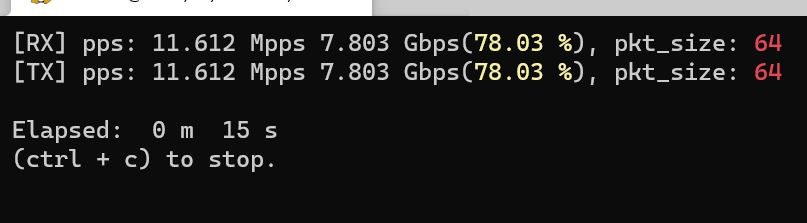
* 원래는 88% 근방의 속도를 내지만 64B 패킷 기준으로 78% 근방의 속도 이상 올라가지 않은 것.
* 이는 **메인 보드 PCIe의 성능의 한계**로 보인다.
    * 좀 더 정확하게는 메인보드 PCIe 칩셋의 한계이다.
* snow의 경우 rain보다 더 좋은 성능의 PCIe 칩셋을 메인 보드에 탑재했을 것으로 추측된다.
    * 이는 확인해볼 필요가 있다.
* 이러한 추측을 하게된 계기는 **Bad TLP**때문이다.
* snow에서 GPU\-Ether를 실험할 경우 최고 속도로 작동을 함에도 불구하고 dmesg에는 빨간색으로 에러 메세지가 뜬다.
    * 찬규형 Report 참고
* Bad TLP와 관련된 에러로 이는 우분투 버그로 알려져 있다.
* 이 때문에 snow에서도 GPU\-Ether가 불안정한 속도를 보여주는 경우가 있다.
* 오랜시간동안 돌리지 않다가 다시 GPU\-Ether를 돌리게 되면 64B 패킷 기준으로 50%~80%의 성능을 보이는 현상이 있었다.
    * 이 경우 GPU\-Ether를 종료했다가 다시 실행하면 정상 속도\(88%\)로 돌아왔다.
* Black\-White 노드를 이용해 실험했을때는 현재 rain\-sunny 노드와 유사하게 낮은 성능을 보여주었다.
    * 이 때는 심지어 DPDK도 64B 패킷 기준으로 13.8Mpps의 낮은 성능을 보였다.
* 이러한 현상을 만드는 원인이 Bad TLP로 추측하고 있었는데, rain\-sunny 노드에서는 **Bad TLP 에러가 발생하지 않는다.**
* 대신 성능이 저하된 것이다.
* snow 노드와 Black\-White 노드, rain\-sunny 노드에서의 GPU\-Ether 속도가 각각 다른것과, Bad TLP 에러가 발생하는 경우도 있고 그렇지 않은 경우도 있다는 것을 미루어보았을 때 **메인보드가 무엇이냐에 따라** GPU\-Ether의 성능이 달라진다는 것을 알 수 있다.
    * 물론 이것 말고 이전부터 PCIe에 대한 의심과 추측이 있었기 때문에 메인보드가 주 원인일 것이라고 판단한 것이다.
* 결과적으로 Bad TLP에 대해 더 조사해볼 필요가 생겼다.

---
## 02/26 현재 상황

1. YCSB를 봤으나 YCSB는 말그대로 generator만 해주는 코드이고 그 외에 인터넷 연결이나 서버 구성같은 것은 사용자가 모두 진행해야한다.
    * 서버 구성과 관련된 부분은 **Fast RDMA-based Ordered Key-Value Store using Remote Learned Cache\(OSDI/2020)**의 appendix를 참고하자
2. 네트워크를 통해 DB query를 날리는 부분을 확인하기 위해서 Memcached의 코드를 확인할 필요가 생겼다.
    * 네트워크 관련된 부분만 빠르게 파악하자
3. RX\-Search\-Update\-TX간의 Kernel 구성의 큰 그림을 그렸다.

---
### Kernel 구성

* RX가 status\_idx를 변경하면 이 전의 NF들로 패킷의 권한이 넘어간 듯이 이를 이용해 각 Kernel들로 권한을 넘겨준다.
* 이때, Search와 Update를 하는 Kernel은 동일한 Kernel을 사용한다.
* Search와 Update를 모두 할 수 있는 Kernel을 N개 띄워둔 뒤, Update의 빈도에 따라 Kernel 내부 로직을 변경해 Search를 하던 Kernel이 Update를 진행하도록 변경시킨다.
* 이를 이용해 Dynamic한 Workload에 대응할 수 있게 된다.
* 한 Kernel 내에서 1\)패킷을 받고, 2\)패킷의 job\(e.g. Get, Set, and etc..\)을 확인한 뒤, 3\)해당 패킷의 job에 맞는 일을 진행한다.
* 이때 Search를 담당하는 Kernel이 Update 패킷을 만날 경우 해당 패킷의 status\_idx를 Update Kernel의 인덱스로 변경해주는 일만 한다.
    * Update를 담당하는 Kernel이 Search 패킷을 만날 경우도 유사하다.
* 본인 담당이 아닌 패킷의 status\_idx를 변경해주면 해당 패킷의 job을 담당하는 Kernel이 status\_idx를 확인한 뒤 해당 패킷을 집어가서 일을 수행할 것이기 때문에 잘 이어질 것 같다.
* 다만 여기서 걸리는 부분은 위의 방식으로 구현할 경우 **패킷을 까서 어떤 job의 패킷인지 확인하는 과정이 중복된다**는 것이다.
* 이로 인해 발생하는 overhead가 얼마나 되는지 확인한 뒤 overhead가 크다면 이를 방지할 방법도 구현해주는 것이 필요하다.
    * 단순히 status\_idx를 분리하는 방식으로 해결할 수도 있다.
    * 예를 들어, KVS용 status\_idx를 Search, Update 뿐만이 아닌 Divide라는 인덱스도 가지게 해 처음에는 Divide라는 인덱스로 패킷을 받아 분류하는 것으로 할 수 있다.
    * 이 경우, Divide로 받은 패킷은 패킷의 job을 확인하고, 이와 달리 Search나 Update의 인덱스로 받은 패킷은 패킷의 job을 확인하는 절차 없이 바로 일을 진행해도 된다.
* 이는 직접 구현하면서 자세한 issue를 확인해봐야할 것 같다.


---
## 01/13 현재 상황

* rain과 sunny 서버에 DPDK와 Pktgen을 설치해 실행해보았다.
* DPDK가 20.11버젼으로 업데이트되면서 dpdk\-setup.sh 파일이 사라지고 일반 gmake로 build를 할 수 없게 되었다.
* DPDK 20.X버젼이 아니면 현재 rain과 sunny의 커널버젼인 5.8.0\-36\-generic과 호환되지 않아 이 기회에 meson과 ninja를 이용한 build 및 setup을 시도해보았다.
* 실행 결과로는 1514byte packet을 기준으로 10GbE dual port NIC에서 20Gbps의 성능을 보였다.
* Mega\-KV는 KVS를 포함한 성능이 13Gbps정도 되니 Network Throughput를 line rate으로 보여준 것은아니다.
* 다만 DPDK \+ GPU 코드를 사용해 DPDK를 사용하였을 경우 GPU까지 도달하는 rate을 확인해볼 필요는 있을 것 같다.
    * 10GbE dual port NIC의 Network Throughput이 20Gbps인 것을 미루어보았을 때, 이전에 측정한 DPDK의 성능에 2배일 것 같다.

---
### DPDK build

* 해당 내용은 rain과 sunny 서버에 build\_dpdk.sh 파일로 만들어져있다.
* 가장 먼저 해야할 일은 DPDK와 Pktgen, libbpf 코드를 github에서 다운로드 받는 것이다.
* 그 다음에 libbpf를 build해주어야한다.
```bash
cd ~/libbpf/src/
make && sudo make install
```
* build 과정은 단순하다.
* 하지만 위의 방법으로 설치할 경우 `/usr/lib64/`에 shared library가 설치된다.
* DPDK는 `/usr/lib`에서 library를 검색하기 때문에 다음의 명령어를 이용해 복사해주어야한다.
```bash
sudo cp /usr/lib64/libbpf* /usr/lib/
```

* DPDK의 build 과정은 DPDK 개발자의 서버 상황에 맞게 설정되어 있어 우리 서버의 상황을 변경시켜줄 필요가 있다.
* 하지만 kernel과 관련된 설정들을 함부로 바꿨다가는 무슨 일이 일어날지 모르기 때문에 DPDK만의 설정을 만들어 준다.
* 구체적으로 설명하자면 DPDK는 `/lib/modules/<kernel version>/`의 위치에 build라는 폴더가 있고 그 안에 kernel의 header들이 존재한다고 가정하고 build를 진행한다.
* 하지만 우리 서버의 경우 `/usr/src/linux-headers-<kernel version>`에 kernel의 header들이 존재하므로 아래의 명령어를 이용해 symbolic link를 만들어준다.
```bash
sudo ln -s /usr/src/linux-headers-$(uname -r) ~/build
```
* 굳이 build라는 폴더로 만들어 준 이유는 meson으로 configure를 진행할때 kernel\_dir을 option으로 넘겨주는데 이 위치를 홈 디렉토리로 줄 것이기 때문이다.
* 위에서 설명한 것처럼 DPDK는 build라는 폴더가 있다고 가정하고 build를 진행하기 때문에 홈 디렉토리에 build라는 이름으로 symbolic link를 만들어 주는 것이다.
* 그 후 dpdk를 meson과 ninja를 이용해 build해주면 된다.
```bash
meson -Denable_kmods=true -Dkernel_dir=/home/susoon/ build
cd ./build/
ninja && sudo ninja install && sudo ldconfig
```

---
### DPDK Setup

* DPDK build를 마쳤다면 이제 setup을 해줄 차례이다.
* DPDK를 위한 setup은 1\)hugepage setup과 2\)igb\_uio module load, 3\) Ethernet binding으로 이루어진다.
* 첫번째 hugepage setup은 아래의 명령어로 간단하게 설정할 수 있다.
```bash
echo 1024 > /sys/kernel/mm/hugepages/hugepages-2048kB/nr_hugepage
```
* 만약 permision과 관련된 에러가 뜬다면 직접 vi로 해당 파일에 접속해 값을 1024로 변경해주자
```bash
sudo vi /sys/kernel/mm/hugepages/hugepages-2048kB/nr_hugepages
```
* 두번째로 igb\_uio 모듈을 load하기 위해서는 원래 `modprobe`를 사용한다고 한다.
```bash
modprobe igb_uio
```
* 하지만 우리 서버에서는 kernel이 igb\_uio를 모듈로 인식하지 못하고 있기 때문에 직접 load해주어야한다.
* 이때, igb\_uio는 uio 모듈이 load되어 있어야 사용 가능하기 때문에 아래의 명령어로 uio를 먼저 load 후 igb\_uio를 load해준다.
```bash
cd ~/dpdk/build/kernel/linux/igb_uio/
sudo modprobe uio
sudo insmod ./igb_uio.ko
```
* 위의 과정까지 끝나면 이제 ethernet을 igb\_uio에 bind해주면 된다.
* 먼저 ifconfig를 이용해 해당 ethernet들을 down시켜주는 과정이 필요하다.
    * 이 과정은 쉬우니 생략한다.
* 아래의 명령어로 ethernet들의 상황을 파악한다.
```bash
cd ~/dpdk/usertools/
sudo ./dpdk-devbind.py --status
```
* 그 뒤에 아래의 명령어로 해당 ethernet들을 bind 혹은 unbind해주면 된다.
```bash
sudo ./dpdk-devbind.py -b (ixgbe or igb_uio) (ethernet pci id) (ethernet pci id)
sudo ./dpdk-devbind.py -u (ALL ethernet pci id)
```
* 여기서 bind을 할 때에는 여러개의 ethernet을 한번에 진행할 수 있지만, unbind을 할 때에는 한 번에 한 개의 ethernet만 진행가능하다.
* ALL ethernet pci id란 앞의 0000까지 입력하라는 의미이다.
    * e.g.) 0000:17:00.1
* 위의 과정까지 거치게 되면 DPDK의 setup은 끝이 난다.

---
### Pktgen Set up

* Pktgen은 pcap library를 사용하므로 먼저 설치해주자.
```bash
sudo apt install libpcap-dev
```
* Pktgen은 기존의 gmake를 이용한 build가 가능하므로 간단하게 build를 할 수 있다.
```bash
cd ~/Pktgen-DPDK/
make && sudo make install
```
* Pktgen을 build하고 난 뒤 실행시킬 때에는 아래의 명령어를 사용한다.
```bash
sudo ./usr/local/bin/pktgen -l 0-10 -n 2 -- -T -P -m "[1-3:4-5].0, [6-8:9-10].1" -f./rain.pkt
```
* `-l`: lcore로 사용할 core의 번호를 지정해준다. DPDK는 master lcore에 core를 하나 사용하므로 이를 포함해서 core의 개수를 지정해줘야한다.
* `-n`: 사용할 memory channel의 개수를 지정해준다. 성능과 관련있는 듯하나 필요없어 보인다.
* `-T`: Pktgen page에 color를 사용할 것인지 지정해준다.
* `-P`: 모든 port에 Promiscuous mode를 사용할 것인지 지정해준다.
* `-m`: 사용할 port와 core를 mapping해준다.
    * "[1-3:4-5].0, [6-8:9-10].1"이 의미하는 바는 1-3번 core를 0번 port의 rx에, 4-5번 core를 0번 port의 tx에, 6-8번 core를 1번 port의 rx에, 9-10번 core를 1번 port의 tx에 사용하겠다는 의미이다.
* `-f`: Pktgen 실행시 자동으로 입력해줄 Pktgen command의 파일 위치를 지정해준다.
* rain과 sunny의 ip와 mac은 아래와 같다.
* rain
    * Port 0 : 10.0.0.3 / 38:ea:a7:10:81:94
    * Port 1 : 20.0.0.3 / 38:ea:a7:10:81:95
* sunny
    * Port 0 : 10.0.0.4 / 38:ea:a7:17:b6:8c
    * Port 1 : 20.0.0.4 / 38:ea:a7:17:b6:8d

---
## 01/10 현재 상황

* Mega\-KV와 KV\-Direct의 실질적인 **Network Throughput**을 계산했다.
* Mega\-KV는 10GbE NIC dual port를 모두 사용한 20Gbps 중 14Gbps, KV\-Direct는 40GbE NIC 중 15Gbps, 40Gbe NIC 10개를 사용할 경우 103Gbps의 Throughput을 보인다.

---
### Mega\-KV

* Mega\-KV의 경우 key와 value의 크기가 모두 8byte인 경우 client가 하나의 패킷에 최대한 많은 양의 request를 batch해 request를 전송했다.
* 위의 상황에서 GET request만 보낸 경우 166MOPS의 throughput이 나왔다고 한다.
* GET request이기 때문에 key값만 전송해 하나의 request data의 크기는 8byte이다.
* Mega\-KV의 아래의 매크로 코드를 통해 meta data의 크기를 유추할 수 있다.

```
#define MEGA_MAGIC_NUM_LEN 2 // sizeof(uint16_t)
#define MEGA_JOB_TYPE_LEN  2 // sizeof(uint16_t)
#define MEGA_KEY_SIZE_LEN  2 // sizeof(uint16_t)
#define MEGA_VALUE_SIZE_LEN  4 // sizeof(uint32_t)
```
* 여기서 key와 value의 크기는 실제 key와 value의 크기가 아니라 key와 value의 크기를 알려주는 meta data의 크기이다.
* 각 패킷당 한번 저장되는 값인 magic number와 job type의 크기를 패킷 길이에서 제외해주어야한다.
* MTU size인 1514byte에서 ethernet crc인 4byte를 빼고 모든 헤더의 크기인 42byte를 빼주면 다음과 같은 값이 나온다.
* 1514\(MTU\) - 4\(Ethernet CRC\) - 14\(Ethernet Header\) - 20\(IP Header\) - 8\(UDP Header\) = 1468Byte
* 여기에서 meta data의 크기를 빼주면 다음과 같은 값이 나온다.
* 1468 - 2\(Magic Number\) - 2\(Job Type\) = 1464Byte
* 이 값을 Key size를 알려주는 metadata\(2Byte\)와 Key size\(8Byte\)의 합인 10Byte로 나누어주면 하나의 패킷당 batch가능한 최대 GET request의 수는 146개가 된다.
* 166MOPS를 146으로 나누면 실제로 초당 전송된 패킷의 수인 1,136,986이 나온다.
* 이 값으로 초당 전송된 데이터 수를 계산해주면 다음과 같은 값이 나온다.
* \(1,514\(Pkt Size\) + 20\(IFG\)\) * 1,136,986\(PPS\) * 8\(Bit per Byte\) = 13,953,092,192 = 13.95Gbps
* Mega\-KV는 10GbE NIC을 사용했으니 대략 14Gbps의 수치는 이상한 값이다.
* 하지만 논문에 언급된 다음의 문장을 보면 생각이 달라진다. </br>
```latex
Each socket is installed with an Intel 82599 dual port 10 GbE card
```

* 각각의 socket이 dual port에 설치되었다는 표현으로 미루어보았을때 10GbE NIC의 모든 port를 사용한 듯하다.
* 그렇다면 필요한 것은 현재 snow\-ckjung 서버간의 10GbE NIC의 모든 포트를 사용했을때의 throughput이 얼마인가이다.

---
### KV\-Direct

* **KV\-Direct는 논문 전체를 읽은 것이 아닌 Evaluation 중 필요한 부분만 차용한 것이므로 실험 환경에 대한 이해도가 부족할 수 있음.**
* KV\-Direct의 경우 총 8개의 server를 사용했으며, 40GbE SNIC을 사용하였고, 0번째 server에 NIC을 설치하였다.
* server를 8개나 사용한 이유는 사용하는 memory의 크기를 크게하기 위함으로 보이며 이로 인해 총 64GB의 RAM이 사용되었다.
* KV\-Direct는 open source를 제공하지 않아 정확한 meta data의 크기를 확인할 수 없었으나, Mega\-KV와의 비교가 담긴 표의 제목으로 미루어보았을때 하나의 GET request의 크기는 10Byte로 보인다.
* 그 외의 meta data의 크기는 Mega\-KV와 동일하다고 가정했다.
* 위의 환경에서 KV\-Direct는 180MOPS의 throughput을 보였으니 초당 전송된 패킷 수는 1,232,876개이다.
* 이 값으로 초당 전송된 데이터 수를 계산해주면 다음과 같은 값이 나온다.
* \(1,514\(Pkt Size\) + 20\(IFG\)\) * 1,232,876\(PPS\) * 8\(Bit per Byte\) = 15,129,854,272 = 15.13Gbps
* 40GbE NIC을 사용한 것 치고는 처참한 성능이 나왔다.
* 논문에서 밝힌 10개의 SNIC을 사용한 경우의 성능을 계산하면 102.55Gbps이 나온다
* 이는 모든 NIC의 최대 throughput을 합한 값인 400Gbps에 비하면 한참 낮은 수치이다.

---
## 01/08 현재 상황

* 고장냈던 snow를 고쳤다.
* 고장난 경위는 아래와 같이 추정된다.
1. cuda Sample을 build 후 실행
    * 여기서 cuda Sample은 cuda library 11.1 version이다.
2. 실행 실패
3. Nvidia driver에 등록된 cuda library version\(10.1\)과 실제 작동되는 혹은 작동을 시도했던 library version\(11.1\)이 mismatch되어 오류 발생
4. 3번을 고치기위해 재설치한 nvidia driver의 version이 P4000과 호환되지 않음
    * P4000과 호환되는 기존에 사용하던 library의 version은 418, 재설치한 nvidia driver의 version은 340
5. 부팅시 P4000을 호출하고 초기화할 driver가 정상작동하지않아 부팅 실패
* 이를 고치기 위해 했던 시도와 방법을 남겨 추후에 유사한 상황이 발생했을 경우를 대비한다.

---
### Nvidia Driver & cuda Library Version Mismatch

* Nvidia driver와 version이 맞지 않은 cuda library를 호출하면 다음과 같은 에러를 만나게 된다.
```bash
nvml driver/library version mismatch
```
* 이 경우에는 nvidia driver들을 모두 unload시킨 뒤 재부팅 시키면 해결된다.
* 이는 version이 맞지않은 library와 연결된 driver를 unload한 뒤 nvidia driver가 스스로 version이 맞는 library와 연결하도록 하는 것이다.

1. 가장 먼저 load되어있는 nvidia driver를 확인한다. </br>
**$ lsmod | grep nvidia**
```bash
nvidia_uvm            798720  0
nvidia_drm             40960  3
nvidia_modeset       1093632  6 nvidia_drm
nvidia              17907712  274 nvidia_uvm,ixgbe,nvidia_modeset
drm_kms_helper        172032  1 nvidia_drm
drm                   458752  6 drm_kms_helper,nvidia_drm
ipmi_msghandler       102400  2 ipmi_devintf,nvidia
```

2. nvidia driver를 unload하기 위해 nvidia에 dependency를 가지고 있는 driver들을 모두 unload해준다. </br>
<strong>
$ sudo rmmod nvidia\_drm </br>
$ sudo rmmod nvidia\_modeset </br>
$ sudo rmmod nvidia\_uvm </br>
</strong>

3. nvidia driver를 unload해준다. </br>
<strong>
$ sudo rmmod nvidia </br>
</strong>

4. "rmmod: ERROR: Module nvidia is in use"와 같은 error가 발생할 경우 아래의 명령어로 관련 프로세스를 확인한 다음 kill해준다.</br>
<strong>
$ sudo lsof /dev/nvidia*</br>
$ sudo kill -9 \<PID of nvidia*> </br>
</strong>

5. 다시 nvidia driver가 load되어있는지 확인해본다. </br>
<strong>
$ lsmod | grep nvidia</br>
</strong>

* 위의 방법으로도 해결되지 않는 경우가 있고, 이번이 그 경우였다.
* 이를 해결하기위해 nvidia driver를 삭제 후 재설치하려했고, 그 과정에서 nvidia driver를 잘못 설치해 문제가 생겼다.

* 참고 : [Unload Nvidia Drivers](https://jangjy.tistory.com/300)

---
### When Nvidia driver is not compatible with GPU

* 이 경우는 상당히 심각하다.
* 보통 부팅이 안되고 화면이 출력되지 않는다.
* 일반적인 메인보드를 가진 서버의 경우 GPU를 분리한 다음에도 디스플레이 port가 있어 GPU를 분리한 뒤 부팅해 Nvidia driver를 제거 후 재설치하면 된다.
* 하지만 snow는 GPU를 분리하면 디스플레이를 연결할 수 없었다.
* Nvidia driver가 아닌 nouveau driver로 접속한 뒤 nvidia driver를 삭제해 문제를 해결해야했고 그때문에 먼저 부팅에 성공해야했다.
* 부팅을 하는 방법은 다음과 같다.

1. 부팅할때 <kbd>shift</kbd>와 <kbd>Esc</kbd>를 번갈아가면서 연타해 grub 페이지에 접속한다.
2. grub command창에 도달한 경우 `normal`을 입력한 후 <kbd>Enter</kbd>를 누르고 바로 <kbd>Esc</kbd>를 눌러 Editing Menu로 접속한다.
3. Editing Menu에서 Advanced options for Ubuntu로 들어가 원하는 커널 버젼에 커서를 올리고 <kbd>e</kbd>를 눌러 boot command menu로 접속한다.
4. command 중 linux option으로 가서 마지막에 **nomodeset**을 추가해준다.
5. <kbd>ctrl</kbd>+<kbd>x</kbd> 혹은 <kbd>F10</kbd>을 눌러 해당 option을 적용한 상태로 부팅한다.
* 보통 위의 방법으로 부팅하면 정상적으로 부팅에 성공한다고 한다.
* 하지만 이를 실패할 경우 다음의 방법을 통해 부팅을 시도한다.

1. 위와 같은 방법으로 boot command menu로 접속한다.
2. nomodset대신 **nouveau.noaccel=1**을 입력한 뒤 <kbd>ctrl</kbd>+<kbd>x</kbd> 혹은 <kbd>F10</kbd>을 눌러 부팅한다.
3. 위의 방법도 실패하면 다시 boot command menu로 접속해 **quiet splash**를 지우고 **noapic noacpi nosplash irqpoll**를 입력한 뒤 부팅한다.
* 위의 방법까지 실행하면 보통 정상적으로 부팅에 성공한다고 한다.
* 하지만 snow의 경우 nvidia driver가 완전히 삭제되지 않고 일부만 삭제된채로 계속 주도권을 가지고 있어 정상부팅에 실패했다.
* <kbd>ctrl</kbd>+<kbd>Alt</kbd>+<kbd>F2</kbd>~<kbd>F7</kbd>를 눌러 ubuntu desktop이 아닌 ubuntu server로 접속할 경우 command를 입력할 수는 있었다.
* nvidia driver를 삭제 후 재설치한뒤 실행하려했지만 삭제하는 과정에서 실수가 있어 실패했다.
* 또한 nvidia driver를 위해 nouveau driver를 blacklist에 올려둔 상태인데다가 network까지 정상작동하지 않아 nouveau로 실행되지도 않았고 재설치에도 실패했다.
    * network가 정상작동하지 않은 이유는 잘 모르겠다.
    * 아마 GPU driver를 먼저 실행한 뒤 network driver를 실행하는데 GPU driver가 실패해 network driver도 실패한 것 같다.
* 아래의 방법으로 nouveau driver를 blacklist에 추가하는 방법이다.
* 아래의 기술된 파일을 삭제한뒤 커널에 입력시켜주면 blacklist에서 제외된다.

1. 다음의 파일을 찾아간다.
```
/etc/modprobe.d/blacklist-nouveau.conf
```
2. 다음 내용을 삭제한다.
```
blacklist nouveau
options nouveau modeset=0
```
3. 커널에 입력시켜준다. 이때 -k \<사용하는 커널 버젼\>을 옵션으로 추가해 사용중인 커널 버젼의 이미지에 입력시켜준다.
```
sudo update-initramfs -u -k 4.18.15
```
4. 재부팅한다.
```
sudo reboot
```
* 위의 방법을 사용하면 nouveau를 blacklist에서 제외한뒤 실행시킬 수 있다.
* 아래의 방법을 사용하면 network를 다시 살릴 수 있다.
* 이는 원래 부팅시에 "A start job is running for wait for network to be configured"라는 메세지가 뜨며 부팅이 지연되는 경우 사용하는 방법이다.

1. 아래의 파일을 실행한다.
```
/etc/netplan/01-network-manager-all.yaml
```
or
```
/etc/netplan/01-netcfg.yaml
```
2. 연결이 끊긴 ethernet device의 설정에 아래의 내용을 추가한다.
```
optional: true
```
3. 아래의 명령어를 실행해 적용한다.
```
sudo netplan apply
```
* 위의 방법을 적용하면 인터넷이 정상작동한다.
    * ping을 이용해 확인해본다.
* 이 후 아래의 방법으로 nvidia driver를 삭제한 다음 재실행해주면 정상작동한다.
```
sudo apt remove --purge nvidia-*
```
* 이때 <strong>nvidia\-\*</strong>로 해야 정상적으로 nvidia driver가 삭제되니 유의하자.
* 이 후 재부팅하면 nouveau driver를 사용해 부팅되며 이 때 nvidia driver를 재설치한 뒤 nouveau를 blacklist에 추가하고 재부팅하면 원래대로 돌아온다.
* 만약 "A start job is running for wait for network to be configured"라는 메세지가 부팅시에 계속 뜬다면 아래의 명령어로 방지할 수 있다.
```
sudo systemctl disable systemd-networkd-wait-online.service
sudo systemctl mask systemd-networkd-wait-online.service
```
* 이 후 GPU\-Ether를 실행해 정상작동하는지 꼭 확인해주자.
* 참고
    * [grub setting](https://itsfoss.com/fix-ubuntu-freezing/)
    * [Driver reinstall](https://askubuntu.com/questions/1149169/changing-nvidia-drivers-makes-ubuntu-freeze-on-startup)
    * [network setting](https://askubuntu.com/questions/972215/a-start-job-is-running-for-wait-for-network-to-be-configured-ubuntu-server-17-1)


---
## 01/04 현재 상황

* ToDo List에 있는 사항들을 조사중에 있다.
* 간략한 요약을 먼저 남기자면 다음과 같다.

1. Memcached의 server selection에 사용되는 hash function 조사
* 보통 bit operation 수준의 간단한 hashing 과정을 거친다.
2. UVM의 성능 저하와 관련된 issue 및 solution 조사
* 아직 조사중에 있다.
3. Memcached에서 사용되는 hash function 조사 혹은 논문 작성을 위해 사용할 새로운 hash function 관련 조사
* MD5, Jenkins 등의 유명하고 많이 사용하는 hash function들을 주로 사용한다.
4. NIC\-GPU 간의 Direct communication으로 얻을 수 있는 성능적 이점 파악
* Network가 큰 overhead인 것 같긴 하지만 더 많은 논문을 조사할 필요가 있다. 
5. Memcached의 노드당 메모리 크기 조사
* AWS기준으로 3GB에서 14GB정도를 제공한다.
6. Memcached의 real trace or synthetic data 조사
* [Twitter Real Trace](https://github.com/twitter/cache-trace)
* [mutilate Memcached load generator](https://github.com/leverich/mutilate)
* 첫번째는 Twitter에서 제공하는 Real Trace이고 두번째는 Synthetic Data generator이다.
7. Memcached / Redis / MICA 파악
* Memcached는 Multi\-Thread를 제공하는 Distributed Memory Caching System이며 In\-Memory KVS를 제공한다.
* Redis는 Memcached와 동일한 system이지만 Single Thread만을 제공하며 Memcached에 비해 더 많은 util성을 제공하며 Disk도 사용한다.
* 2015년도 이후로 MICA를 언급하는 곳은 찾기 힘들었다. 하지만 MICA 논문도 읽어봐야하고 조금 더 조사가 필요하다.

---
### 세부사항

#### 1. Memcached의 server selection에 사용되는 hash function 조사


* 위의 코드는 Memcached C++ library의 코드 중 일부를 발췌한 것이다.
* 위의 함수는 client가 요청한 request를 어떠한 서버로 전송해야하는지 hashing하는데 사용되는 함수이다.
* 여기서 client는 **user**를 의미한다.
* user가 request를 보낼때 **직접 hashing을 진행해 server를 골라** 전송하는 것이다.
* hash function으로는 특별한 hash function을 사용하는 것이 아닌 bit operation을 통한 간단한 hashing을 진행하는 것을 확인할 수 있다.


* 위는 Oracle에서 설명한 Memcached에서 client가 server를 선택할때 진행되는 hashing 과정의 특징이다.
* client에서 server selection을 진행하며 이 때문에 client가 요청하는 operation과 무관하게 server가 선택된다고 한다.
* selection에 사용되는 hash function은 매우 빠른 algorithm이 사용된다고 한다.
    * 이 설명 위에 기재된 예시는 \(요청한 data의 값\) % \(총 server의 수\)일 정도로 단순했다.
* **결론 : server selection에 사용되는 hash function은 단순한 bit operation 수준에 해당하는 function.**

* 참고 : [Oracle Memcached Server Selection](https://docs.oracle.com/cd/E17952_01/mysql-5.6-en/ha-memcached-using-hashtypes.html)

<br>

#### 2. UVM의 성능 관련 issue 및 solution 조사

* 이 부분은 아직 조사중에 있다.

<br>

#### 3. Memcached에서 사용되는 hash function 조사 혹은 논문 작성을 위해 사용할 새로운 hash function 관련 조사

* 먼저 현재 Memcached에서 사용되는 hash function에는 어떤 종류가 있는지 살펴보았다.
* 역시 Memcached C++ library의 코드 중 일부를 참고했다.


* 위는 Memcached가 제공하는 hash algorithm들이다.
* 처음 들어보는 hash algorithm도 있지만 대부분 흔하게 사용되는 hash function들이다.
* Mega\-KV에서 hash function으로 사용했다고 생각한 AES의 경우 제공하지 않았다.
* AES는 client와 server간의 인증을 위해 사용한듯하다.
    * ~~사실 생각해보면 당연한 얘기이긴 하다....~~
    * Meag\-KV에서도 Signature ID를 생성할 때 사용했던 것 같다.
    * 추가확인 필요
* 위의 algorithm들이 사용된 이유를 파악할 이유가 있어보인다.
* 그 이유는 MD5 또안 보안에서 주로 사용되던 algorithm인데 hashing으로 사용되었다는 것은 value를 통해 생성된 key를 이용해 다시 value를 알아내지 못하도록 하는 보안관련 issue가 있을 수 있기 때문이다.
* 그 외에도 성능적으로 어느정도의 overhead까지 용인되는지 등등의 issue가 있다.
* **중간 결론 : Memcached에는 평범하게 유명한 hash algorithm들이 사용됨. 각 algorithm들이 사용된 이유 파악 필요**
* 중간 결론인 이유는 새로운 hash function을 만드는 방법에 대해서는 알아보지 않았기 때문이다.
* 위의 중간 결론을 교수님이랑 같이 얘기해본 뒤 새로운 hash function을 만드는 방식으로 novelty를 채우는 것이 맞는지 확인해볼 필요가 있다.

<br>

#### 4. NIC\-GPU 간의 Direct Communication으로 얻을 수 있는 성능적 이점 파악

* 이는 논문을 더 찾아볼 필요가 있을 것 같다.
* 2013년도 이전의 논문들이라 오래된 논문들이긴 하지만 대부분 Network에 Bottleneck이 있다고 서술하고 있는 논문들을 발견했다.
* 더 자세히 읽어보고 다른 GPU에 KVS를 offload시킨 논문들을 파악할 필요가 있을 것 같다.
    * 특히 Motive가 된 Designing High\-Performance In\-Memory Key\-Value Operations with Persistent GPU Kernels and OpenSHMEM 논문을 읽어볼 필요가 있다.

<br>

#### 5. Memcached의 노드당 메모리 크기 조사


* 위는 AWS에서 제공하는 Memcached 노드의 정보가 기록된 표이다.
* 각 노드당 제공되는 메모리의 크기가 다양하다.
* 3.22GB부터 14.28GB까지 다양하며 총 Memory의 크기는 평균적으로 35GB에서 42GB사이로 제공되는 것 같다.
* **결론 : 각 노드당 제공되는 메모리의 크기는 3GB부터 14GB까지 존재한다.**

* 참고 : [AWS Nodes Select Size](https://docs.aws.amazon.com/AmazonElastiCache/latest/mem-ug/nodes-select-size.html)

<br>

#### 6. Memcached의 real trace or synthetic data 조사

* 2개의 Open Source\(?\)를 발견했다.
* [Twitter Real Trace](https://github.com/twitter/cache-trace)
* [mutilate Memcached load generator](https://github.com/leverich/mutilate)
* Twitter Real Trace는 말 그대로 Twitter Request를 모은 Real Trace이다.
* 압축된 크기는 2.8TB이고 압축이 풀린 크기는 14TB이다.
* 이는 A large scale analysis of hundreds of in-memory cache clusters at Twitter라는 2020년도 OSDI에 실린 논문 저자들이 분석 후 정리한 trace이다.
* mutilate은 Characterizing Facebook's Memcached Workload라는 IEEE Internet Computing에 publish된 논문에서 소개된 Memcached Load generator이다.
* 위의 두가지 모두 사용이 가능할 것 같으며 특히 **Twitter Real Trace의 경우 2020년 OSDI에 실린 논문 저자들이 정리한 trace이므로 신뢰도가 아주 높아보인다.**
* 위의 두가지가 각각 Real Trace와 Synthetic Data이다.

<br> 

#### 7. Memcached / Redis / MICA 파악

<br>

   ###### Memcached
* In\-Memory KVS system
* RAM안에 모든 Data를 저장한 뒤 client가 data를 요청할 경우 KVS를 사용해 data를 찾아주는 시스템이다.
* Memory\(RAM\)을 Cache처럼 사용하기 때문에 Memcached라고 불리며 RAM에 모든 데이터를 저장하기 때문에 서버가 종료되면 모든 데이터가 사라진다.
* 이 때문에 DB\(Disk\)에도 데이터를 저장하며 데이터를 저장하는 기간동안에는 DB에서 데이터를 검색해와야해 성능이 떨어질 수 있다.
* Memory Caching기능 뿐만아니라 Distributed Memory System도 제공한다.
* 여러개의 Server의 Memory를 하나의 Server의 Memory처럼 사용할 수 있도록 해준다.
* 위의 기능들을 포함한 가장 단순한 기능들만 탑재하여 속도가 빠르다.
* Multi\-Thread를 지원한다.

<br>

###### Redis
* In\-Memory KVS System
* Memcached와 동일하게 대부분의 데이터를 Memory에 저장하지만 Disk에도 데이터를 저장한다.
* Disk와 Memory 간의 데이터 Synchronization을 위해 2가지 기법을 제공한다.
    * Snapshotting과 AOF가 있다.
    * Snapshotting은 특정 시점의 Snapshot을 Disk에 지속적으로 저장해 Server Reboot시 해당 Snapshot만을 load하는 방식이다.
    * AOF\(Append On File\)방식은 redis의 모든 write/update 연산 자체를 모두 log파일에 기록하는 형태이다.
    * 자세한 내용은 아래의 링크를 참조할 것
    * [About Redis](https://brownbears.tistory.com/43)
* String만 지원하는 Memcached와 달리 set, sorted set, list 등 다양한 자료구조를 제공한다.
* Multi\-Thread를 지원하지 않아 Single Thread만을 사용한다.
* 아래의 링크가 Memcached와 Redis의 비교 분석을 간단하게 잘 요약해두었다.
* [Memcached vs Redis](https://chrisjune-13837.medium.com/redis-vs-memcached-10e796ddd717) 

<br>

###### MICA
* MICA는 2014년 NSDI에 실린 논문이다.
* Memcached를 확장 및 변형시킨 In\-Memory KVS이다.
    * 논문명도 MICA: A Holistic Approach to Fast In\-Memory Key\-Value Storage이고 논문 내부에서도 Storage라는 표현을 사용하지만 In\-Memory라는 표현으로 미루어보았을때 Disk는 사용하지 않을 것 같다.
* [MICA github](https://github.com/efficient/mica)
* 이 당시에는 Redis가 강한 영향력을 가지지 못한 시기였던 것 같다.
    * Redis는 2009년에 개발되었지만 2015년부터 Redis Labs가 지원하기 시작했다.
* Evaluation에서 Memcached, MemC3, RAMCloud 등과는 비교했지만 Redis는 비교군에 넣지 않았다.
* 현재 가장 많이 사용되고 있다는 Redis가 크게 상용화되기 전의 논문이어서 그런지는 논문들을 추가적으로 확인해볼 필요가 있긴하다.
    * Mega\-KV에서는 MICA를 이용해 비교하긴 했지만 Mega\-KV도 2015년도 논문이기 때문에 실험 당시에는 Redis가 지원받기 전이었다.
* MICA가 어느정도의 영향력을 가지고 있고 MICA와 비교하는 것이 타당한 evaluation 방향인지는 조금더 찾아볼 필요가 있다.

* 참고 사이트 <br>
[Redis & Memcached 정리](https://real-dongsoo7.tistory.com/114) <br>
[Memcached and Persistence](https://www.gosquared.com/blog/memcache-and-persistence) <br>
[Redis vs. Memcached: In-Memory Data Storage Systems](https://alibaba-cloud.medium.com/redis-vs-memcached-in-memory-data-storage-systems-3395279b0941) <br>
[\[Cache\] Redis vs. Memcached](https://chrisjune-13837.medium.com/redis-vs-memcached-10e796ddd717) <br>
[AWS Memcached](https://aws.amazon.com/ko/memcached/) <br>
[Opendocs](https://myblog.opendocs.co.kr/archives/591) <br>
[About Redis](https://brownbears.tistory.com/43) <br>
[MICA github](https://github.com/efficient/mica) <br>
[Oracle Memcached docs](https://docs.oracle.com/cd/E17952_01/mysql-5.6-en/ha-memcached-using-hashtypes.html) <br>

