# Daily Report for DPDK

## ToDo List

* ~~64B, 128B의 추가 test 필요~~
* ~~dpdk와 copy\_to\_gpu가 실행되는 core 확인~~
* ~~만약 dpdk와 copy\_to\_gpu가 같은 core에서 실행되고 있다면, 다른 core에서 실행되게끔 code 수정 후 test~~
* ~~monitoring loop가 다른 core에서 실행되게 code 수정 후 test~~
* ~~현재까지 나온 test 결과 정리 (Summary 파일에 정리)~~
  * ~~polling으로 64B, 128B 추가 측정하여 data 뽑기~~
  * ~~3-3) batch delay 부분 수정~~
  * ~~graph로 쓸만한 data 선별하여 graph 추가하기~~
* ~~gpu SHA code 확인해서 fancy의 SHA code랑 비교하기~~
  * ~~openssl sha 구조 확인하기~~
  * ~~fancy의 sha가 gpgpu의 sha와 구조적으로 동일한지 확인하기~~
* ipsec packet size별로 구현해놓은 것들 잘 구현되었는지 확인하기
	* ~~Thread Block 수와 thread 수를 할당한 양이 과도한 양은 아닌지~~
	* ~~Shared Memory를 과도하게 사용하는 것은 아닌지~~
	* 위의 두 내용을 잘 적용하였는지 확인
* ~~nids 공부하기~~
  * ~~Aho-Corasick 알고리즘 공부하기~~
  * ~~nids Kernel 코드 뜯어보기~~
    * ~~Aho-Corasick 알고리즘이 어떻게 적용되었는지 확인하기~~
  * ~~state로 저장해주는 값들의 의미 알아보기~~
  * ~~thread 분배 생각해보기~~
  * ~~Aho-Corasick의 Trie와 Failure Link 구성하는 부분 구현확인하기~~
* dpdk mempool 공부하기
  * dpdk mempool과 cache line이 어떻게 사용되는지 확인
  * dpdk에서 descriptor와 doorbell이 어떻게 align되어있는지 확인
  * dpdk에서 packet 저장방식이 contiguous한지 확인
---
## 03/25 현재상황

* dpdk mempool에 대한 추가 조사를 하고 있다

---

### 1. dpdk mempool과 cache line이 어떻게 사용되는지 확인

* 이 부분은 아직 제대로 알아낸 것이 없다
* 개념적으로는 알아낸 packet의 rx과정은 다음과 같다
  1. 각 lcore들이 packet을 받아서 rte_mempool_cache라는 구조체에 담아준다
  2. rte_mempool_cache에 더 이상 담을 수 없으면 rx queue에 담아준다
     * rte_mempool_ops라는 구조체에 있는 dequeue라는 함수 포인터를 사용한다
     * dequeue 함수는 어떠한 드라이버를 사용하냐에 따라 다른 함수가 대입된다
     * 10G NIC의 드라이버인 ixgbe의 경우 대입되는 함수를 찾지 못했다
  3. packet을 받아서 application에게 넘겨주기 위해 rte_mempool_cache를 먼저 참조한다
  4. cache에서 꺼내올 packet이 없다면 rx queue에서 packet을 꺼내온다
* 위의 과정이 100% 정확하다고 확신할 수는 없으나 대략적인 함수의 흐름과 dpdk 홈페이지의 document를 확인한 결과 80%이상 맞는 것 같다
* 직접적인 함수 call flow를 찾지 못해 아직 해결하지 못했다

---

### 2. dpdk에서 descriptor와 doorbell이 어떻게 aligned되어있는지 확인

* 이 부분에 대해서는 먼저 짚고 넘어가야할 것이 있다
* aligned라는 키워드의 역할이다
* packed라는 키워드와 혼동이 있어 개념을 확인해보았다

---

#### aligned and packed test

* aligned는 **\_\_attribute\_\_((aligned(n)))** 의 형태로 사용되며 n에 align할 byte의 단위가 대입된다
* n은 2의 제곱수 형태만 가능하며 생략하여 aligned로만 써도 된다
* 구조체를 nbyte를 기준으로 끊어서 저장해주는 역할을 한다
  * 구조체에 접근할때 몇 byte 단위로 건너뛰며 접근할지를 정해주는 것이다


<center> aligned example </center>


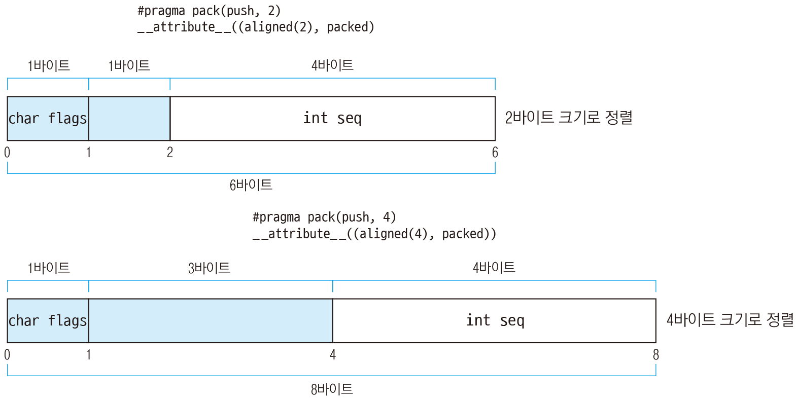

* 위의 사진에서 packed는 없다고 생각하자
  * 위의 예시처럼 사용하면 있으나마나이기 때문에 그냥 그림만 보면 된다
* packed는 **\_\_attribute\_\_((packed))** 의 형태로 사용된다
  * 괄호는 하나만 써도 된다
* aligned를 하게 되면 위의 사진처럼 padding이 생기게되는데 이런 padding없이 contiguous하게 할당되도록하는 것이 packed이다
  * 위의 예시처럼 packed를 사용하면 있으나마나인 이유
  * 위의 예시는 4byte단위로 끊어서 저장(aligned)하게 하고 4byte단위로 packing해서 빈공간이 그대로 남아있다
  * 4byte단위로 packing했다는 것은 4byte보다 작은 단위에서는 padding을 없애지 않겠다는 뜻
  * 위의 예시는 pragma라는 키워드를 통해서 packing하는 단위를 지정해준 것이고 보통 1byte기준으로 packing하므로 padding을 아예 없애주게 된다
* 이런 부분이 실제로 어떻게 저장되는지 보기 위해서 실험을 하나 해보았다


<center> aligned and packed test structure </center>


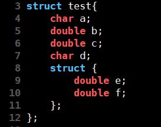

* 위와 같은 field를 가지는 structure를 선언했다
* 위와 같이 field를 준 이유는 다음과 같다
  1. char a다음 double b를 두어 packed를 사용하지 않으면 7byte의 padding이 생기게 하기 위함
  2. double c 다음 char d를 두어 1번과 유사한 효과를 기대함
  3. struct안에 double e와 double f를 준 이유는 이 둘이 합쳐서 하나의 16byte의 data로 인식될 가능성이 있는지 확인하기 위해서
* 동일한 field를 가지는 structure를 다수 만들었는데, 이들의 차이점은 다음과 같다
  * 위의 사진처럼 아무런 조건도 주지 않은 일반 structure
  * aligned만 8byte로 준 경우
  * aligned만 16byte로 준 경우
  * byte를 지정하지 않고 aligned만 사용한 경우
  * aligned 없이 packed만 준 경우
  * aligned를 8byte로 주고 packed를 준 경우
  * aligned를 16byte로 주고 packed를 준 경우
  * byte를 지정하지 않고 aligned만 사용하고 packed를 준 경우
  * packed는 모두 1byte 단위로 지정해주었다
* 이러한 조건으로 실험한 이유는 다음과 같다
  1. word의 크기가 8byte이므로 8byte로 aligned 시킨 것과 그보다 큰 16byte로 aligned 시킨 것의 비교가 필요하다고 추측했다
  2. 8byte보다 작은 크기의 aligned는 test하지 않은 이유는 현재 원하는 data가 cache size인 64byte의 경우에 대한 것이기 때문이다
  3. byte를 지정하지 않고 aligned만을 사용한 경우에는 조건을 주지 않을 경우와 어떻게 다른지 확인하기 위해서
* output data로는 구조체의 총 size와 각 field 변수들의 pointer 위치를 시작 위치를 0으로 보았을 때 몇 byte 뒤에 있는지를 출력하게 하였다


<center> aligned and packed test result : total size </center>


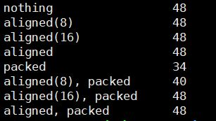

* 위의 사진은 구조체의 총 size만을 먼저 출력한 것이다


<center> aligned and packed test result of not packed : total size and individual field's location </center>


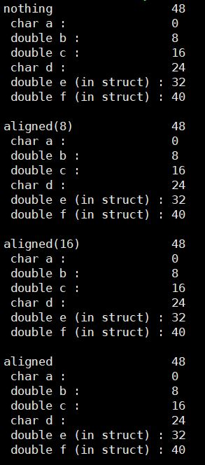

* 위의 사진은 packed를 주지 않은 구조체들의 총 size와 각 field들의 위치를 나타낸 것이다
* packed를 주지 않은 구조체들의 경우 모두 총 size와 field들의 위치가 동일한 것을 확인할 수 있다
  * 그 이유는 아래의 결과를 이용해 추측할 수 있다


<center> aligned and packed test result of packed : total size and individual field's location </center>


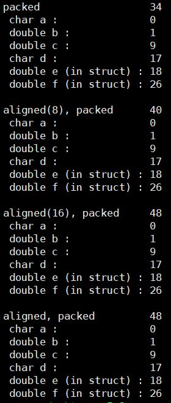

* 위의 사진은 packed까지 준 구조체들의 총 size와 각 field들의 위치를 나타낸 것이다
* 이번 결과에서는 구조체의 총 size는 다양하게 나왔으나 각 field들의 위치는 동일하게 나왔다
* 다음은 각 case에 따른 결과 분석이다

1. packed만 준 경우
   * 해당 경우에서는 packed의 조건만 주어졌기 때문에 1byte단위로 묶이게 된다
   * 따라서 padding이 모두 사라져 가장 작은 size인 34byte만을 차지함을 알 수 있다
2. aligned(8)과 packed를 준 경우
   * field들의 위치는 packed만 준 경우와 동일하지만 구조체의 총 size는 다르다
   * 그 이유는 마지막 field 변수인 f가 26번째 위치에서 8byte를 차지하는데 이렇게 되면 32byte(4 * 8byte)를 넘어간다
   * aligned를 8byte단위로 하라는 조건을 주었으므로 남은 2byte를 위해 8byte를 할당해주어 40byte를 사용하게 되는 것이다
3. aligned(16)과 packed를 준 경우
   * 위의 2번 경우와 동일하다
   * 동일한 이유에 의해서 32byte를 넘어가는 마지막 field 변수 f를 위해서 16byte를 할당해주어 48byte를 사용하게 된 것이다
4. byte의 조건 없이 aligned와 packed를 준 경우
   * 이 경우는 충분히 생각해볼 여지가 있다
   * 총 size가 aligned(16)과 동일하다
   * 실험 전에는 byte의 조건 없이 aligned만 주게되면 기본 aligned 단위인 8byte 단위로 align할 것이라 추측했다
   * 그렇게 되면 aligned(8)을 준 경우와 동일하게 나와야한다
   * 하지만 결과는 달랐고, 따라서 이에 대해선 추가적으로 조사해보았다


<center> aligned without condition of byte </center>


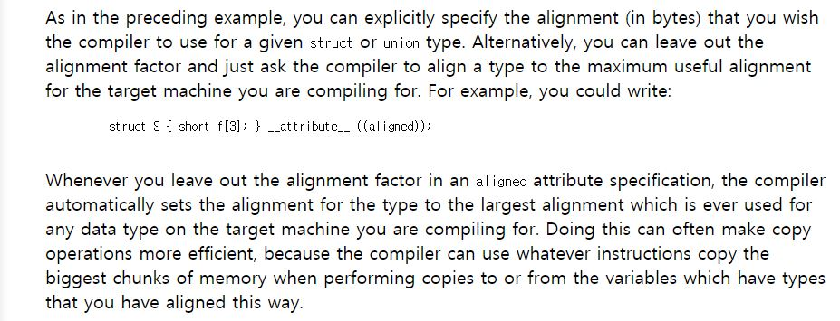

* 위의 문서는 gcc  gnu의 공식 문서 중 aligned에 관한 부분이다
* 우리가 필요한 부분만 요약하자면 **구조체가 가지는 field 중 가장 큰 size의 data type의 size를 단위로 사용한다**이다
* 그럼 우리가 실험한 구조체에서 가장 큰 size를 가지는 data type은 무엇일까
* 다시 구조체를 확인해보자


<center> aligned and packed test structure </center>


* 서두에 구조체의 field변수들을 이렇게 둔 이유 중에 structure를 만든 이유를 서술했었다
* 그 이유는 struct안에 double e와 double f가 합쳐서 하나의 16byte의 data로 인식될 가능성이 있는지 확인하기 위해서이다

* 위의 실험결과와 gnu의 공식 문서를 통해 double e와 double f를 가지고 있는 구조체가 하나의 data type으로 인식되었다는 것을 알 수 있다
* 실험 결과는 다음과 같다

---

#### aligned and packed test analysis

1. aligned의 경우 **기준이 되는 byte * n(임의의 숫자)** 만큼 구조체의 size를 맞춰준다
2. packed의 경우 기존의 추측과 동일하게 1byte단위로 잘 묶어준다
3. **field 변수 중 구조체 변수가 있는 경우 구조체 전체가 하나의 data로 인식된다**
4. aligned에 기준이 되는 byte를 주지 않을 경우 field 변수 중 가장 큰 size를 가지는 data type을 기준으로 aligned한다

---

* 다시 돌아와서 dpdk에서 descriptor와 doorbell이 어떻게 aligned 되어있는지에 대해서 이야기해보자
* doorbell의 경우는 아직 확인하지 못했다
* descriptor의 경우 rte\_mempool\_cache 구조체처럼 \_\_rte\_cache\_aligned 매크로를 통해 직접적으로 cache size로 aligned 되어있지는 않지만 모두 64byte를 기준으로 aligned 되어있다

* 그 이유에 대해서는 아직 정확하게는 파악되지 않았지만 아래의 사진으로부터 유추해보았을때 cpu cache size에 맞춘 것으로 보인다


<center> aligned size comment </center>


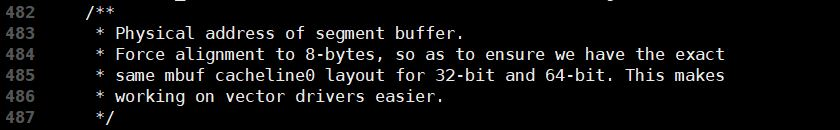

* cacheline과 동일한 layout을 위해 8byte로 align되게끔 강제했다고 한다
* 이는 rte\_mbuf구조체 내에 buffer의 물리적 address를 담고 있는 union에 대한 설명이다

---

### 3. dpdk에서 packet이 contiguous하게 저장되는가

* 이는 아직 완벽하게 확인되지는 않았다
* 추측상으로는 **각 buffer가 저장되는 곳은 contiguous하지 않고 이를 가리키는 pointer가 저장되는 곳이 contiguous하다**
* 이러한 추측을 한 이유는 다음과 같다


<center> asignment of packets </center>


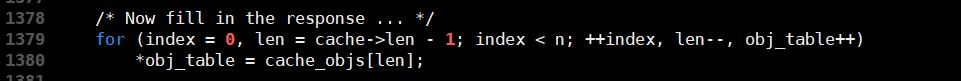

* 위의 사진을 보면 obj\_table를 이동하면서 cache\_objs의 값을 하나씩 대입하고 있다

* 여기서 cache_objs는 NIC에서 받아온 packet을 저장해둔 rte\_mempool\_cache 구조체의 포인터 변수이다
* obj\_table은 rte\_mbuf 구조체의 더블포인터 변수로 application에 넘겨주기 위해 packet을 저장하는 곳이다
* 이를 보면 실제 packet을 넘겨주지 않고 packet의 buffer의 포인터를 넘겨준다는 것을 알 수 있다
* 또한 이 buffer들이 contiguous하게 할당된 공간에 있는 것도 아니다
* 필요할때마다 그냥 할당해서 넘겨준다
* 아직 완벽히 파악하진 못했지만 위의 코드와 dpdk의 홈페이지에 있는 문서에 서술된 packet의 분할 저장 등을 통해 pointer만 contiguous하게 저장하고 실제 buffer들은 각자 저장된다고 추측했다


<center> dpdk document example </center>


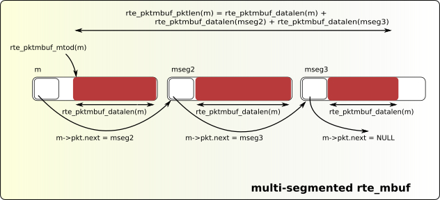

* 위의 사진은 하나의 packet을 여러개의 segment로 나누어 저장하는 dpdk의 packet 처리 과정을 보여준 것이다
* dpdk는 packet을 일정한 크기의 구조체로 나누어 저장한다
* segment 사이를 포인터로 연결해 이동하며 packet을 관리한다
* 결국 dpdk의 packet관리에 대한 추측은 chained linked list array이다


---

## 03/23 현재상황

* dpdk mempool을 공부중이다

---

### 요약

* rte\_eth\_rx\_burst는 결국 ixgbe\_recv\_pkts를 호출한다
* ixgbe\_recv\_pkts에서 실제로 packet을 가져오는 일은 rte\_mbuf\_raw\_alloc이 한다
* rte\_mbuf\_raw\_alloc은 결국 \_\_mempool\_generic\_get을 호출한다
* \_\_mempool\_generic\_get이 packet을 가져오는 과정은 다음과 같이 진행된다
  1. rte\_mempool에 저장된 rte\_mempool\_cache에 packet이 있는지 확인 후 있으면 가져온다
  2. cache에 packet이 없다면 rx\_ring에서 dequeue시켜 packet을 가져온다
* 각 함수들의 호출과 호출의 flow 과정에서 무수한 pointer들의 요청이....
  * GPU상에서 packet을 가져오는 우리는 이런 과정으로 불러올 수 없다

---

### 세부 호출 흐름과 과정

* 10G NIC의 경우 rte\_eth\_rx\_burst를 호출하면 rte\_eth\_dev구조체 변수인 dev의 field변수로 들어가있는 함수 포인터 rx\_pkt\_burst를 호출한다


<center> rx_pkt_burst call (in rte_ethdev.h) </center>


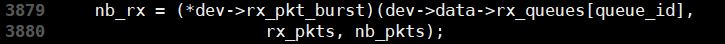


* rx_pkt_burst는 eth\_ixgbe\_dev\_init함수 내에서 ixgbe\_recv\_pkts라는 값이 대입된다


<center> Substitute ixgbe_recv_pkts (in ixgbe_ethdev.c) </center>


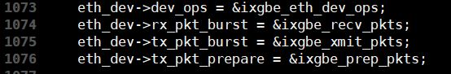


* **rte\_eth\_rx\_burst를 호출했을 때 실제로 호출되는 함수는 ixgbe\_recv\_pkts라는 뜻이다**
* 다음은 ixgbe\_recv\_pkts의 원형이다


<center> ixgbe_recv_pkts </center>


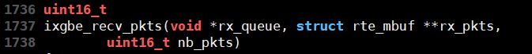


* 이 함수가 하는 일은 당연히 mempool에서 packet을 꺼내와서 rx_pkts라는 rte_mbuf 배열에 하나씩 달아주는 것이다
* 그 과정은 다음과 같다
* 먼저 mempool에서 packet을 꺼내오게 하기위해 rte\_mbuf\_raw\_alloc를 호출한다


<center> Call of rte_mbuf_raw_alloc </center>


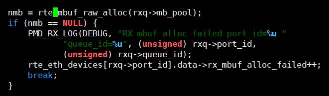

* rte\_mbuf\_raw\_alloc은 rte\_mempool\_get을 호출한다


<center> Call of rte_mempool_get (in rte_mbuf.h) </center>


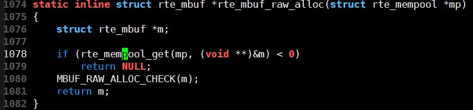

* rte\_mempool\_get은 rte\_mempool\_get\_bulk를 호출한다


<center> Call of rte_mempool_get_bulk (in rte_mempool.h)</center>


* rte\_mempool\_get\_bulk는 rte\_mempool\_generic\_get을 호출한다


<center> Call of rte_mempool_generic_get (in rte_mempool.h) </center>


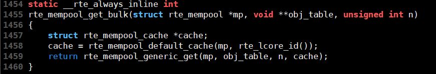

* rte\_mempool\_generic\_get은 다시 \_\_mempool\_generic\_get을 호출한다


<center>Call of __mempool_generic_get (in rte_mempool.h)</center>


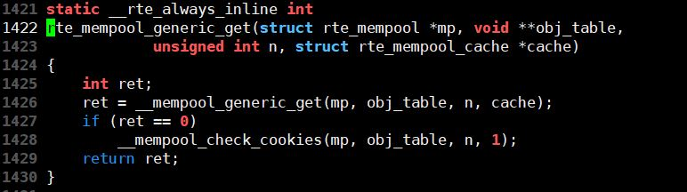

* **그렇게 rte\_mbuf\_raw\_alloc은 결국 \_\_mempool\_generic\_get을 호출한 셈이 된다**
* 아래는 \_\_mempool\_generic\_get의 함수의 원형이다


<center>__mempool_generic_get</center>


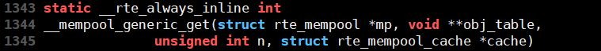

* **이 함수가 하는 일은 rte\_mempool에 저장되어 있는 packet을 불러오는 것이다**
* 그런데 rte\_mempool에 있는 packet을 계속 접근해서 가져오게 되면 여러개의 lcore들이 하나의 공간을 계속 접근하게 된다
* 이렇게 되면 race problem을 처리하기위한 overhead가 발생하여 dpdk는 cache를 사용한다
* rte\_mempool\_cache라는 구조체에 있는 packet을 먼저 꺼내와서 넘겨주고, cache 안에 packet이 없을 경우에 rx\_queue에서 packet을 꺼내와서 넘겨준다
* 여기서 cache라는 것은 각 lcore마다 존재한다
* 실제 lcore의 cache에 저장되는 값을 말하는 것은 아니다
* lcore들이 packet을 가장 먼저 저장하는 곳을 말한다


<center> dpdk mempool cache </center>


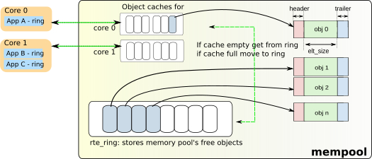


* 위의 그림처럼 각 core들이 cache에 packet을 계속 저장해주고, 이들을 mempool에 옮겨주는 작업을 해준다
* 이때, mempool에 과도한 접근을 막기위해서 cache에 있는 packet을 먼저 꺼내주게된다
* cache에 packet이 없을 경우에만, rte\_ring으로 가서 packet을 꺼내서 가져온다
* rte\_ring에서 packet을 가져오는 것은 rte\_mempool\_ops\_dequeue\_bulk라는 함수를 호출하여 가져온다


<center> rte_mempool_ops_dequeue_bulk </center>


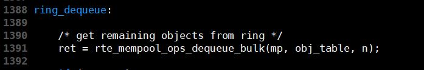

* 이 함수는 따라들어가도 mp(rte\_mempool 구조체)안에 있는 ring에서 obj\_table에 직접 넣어주는 일밖에 안하므로 함수 호출 flow는 생략한다
* 이렇게 꺼내온 packet(rte_mbuf 구조체 형식)에 packet의 data들을 채워 넣어주고 nb\_rx를 증가시켜준다
* 지정된 batch값만큼 packet을 받았거나, state error를 발견하거나, rte\_mbuf\_raw\_alloc을 통한 mbuf 할당이 실패했을때, packet을 가져오는 cycle하나를 끝낸다
* 이렇게 rte\_eth\_rx\_burst의 함수의 역할은 끝이난다

---

### 남은 일

* fancy의 rx\_kernel은 어떠한 과정을 통해 packet을 가져오는지 확인할 필요가 있다
* 이를 dpdk의 mempool이 packet을 호출해오는 과정과 비교하여 **정확히 어떠한 부분이 다르고, 왜 다를 수 밖에 없었는지**에 대해서 정리를 해보아야한다

---
## 03/21 현재상황

* fancy 코드의 Aho-Corasick Trie와 Failure Link를 구성하는 부분을 확인했다
* 결론을 먼저 말하자면 **문제가 없다**
* 일단 github상에 있는 Aho-Corasick 코드를 CPU버전, GPU버전 모두 확인하였고, 그 외에 구글링해서 나오는 코드들도 확인을하였다
  * fancy의 code와 비교할때에는 구글링해서 나온 code(CPU버전)을 사용했다
  * 알고리즘을 가장 직설적으로 표현한 code이기 때문이다
* 코드를 비교했을때 문제되는 부분이 없었다
* 계속 마음에 걸리던 부분이 **알고리즘 상으로도 문제가 없는가**였다
	* 이는 fancy의 코드뿐만이아니라 다른 코드들을 보면서도 들었던 생각이었다
	* 이 부분에 대해서 아래에 자세히 서술했다

---
### Aho-Corasick Algorithm Failure Link 생성 과정

* Failure Link를 이어주는 부분의 코드를 보다가 의문점이 생겼다
* Aho-Corasick Algorithm을 제대로 작동시키려면 **Failure Link을 잘 이어줘야한다**
  * 잘 이어준다는 것은 Failure Link를 이어줬을때, data set에 있는 string을 만들 수 있는 node로 이어져야한다는 것이다
  * 아래의 Example Trie를 참고


<center> Example Trie </center>


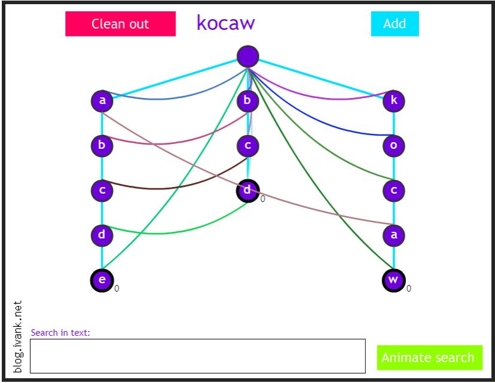

* a b c d e의 c는 b c d의 c로 이어지지만, k o c a w의 c는 b c d의 c로 이어지지 않는다
* 그 이유는 a b c d e의 경우, b c d가 a b c d 로 이어지면서 b c d자체가 data set에 있기 때문이다
* k o c a w의 경우는, k o c d e라는 string이 input으로 들어왔다고 가정해보자
* k o c d e는 이 string이 가지는 어떠한 substring도 data set에 없다
* 그래서 당연히 c d e라는 string이 가지는 어떠한 substring도 data set에 없다
* 그러니 k o c d e의 c에서 Trie 내의 c라는 값을 가지는 다른 node로 이동한다고 해도 data set에 속한 string을 만들 수 없다
* 그래서 이어주지 않는다


* 그러면 현재 코드가 Failure Link를 잘 이어주고 있는가를 확인해야한다
* 먼저 비교확인을 위해 참고한 fancy코드가 아닌 다른 코드를 확인해보자


<center> Failure Link code : Googling </center>


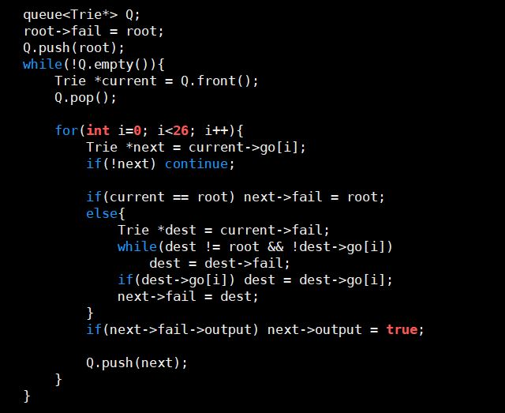

* 위의 코드는 구글링을 하여 찾아낸 Aho-Corasick 코드 중 Failure Link를 구성하는 부분만 발췌한 것이다
* Trie라는 구조체를 만들어 node로 활용하고, queue를 사용하여 Failure Link를 이어주었다
* Aho-Corasick 알고리즘을 착실히 따라가면서 만든 코드이다
* go는 현재 node의 child node에 대한 정보를 담고 있는 배열이다
* code를 보면 current node를 이용해 Faiilure Link를 찾지만 결국 이 과정을 통해 찾은 Failure Link는 next node(child node)를 위한 것이다
  * **이를 기억해두자!!**
* a부터 z까지의 알파벳을 확인하므로 26개의 경우를 확인하며 child node들의 Failure Link를 이어준다

* 의문점이 생긴 부분은 **else의 내부의 while문 부분**이다
* 현재 node의 Failure Link가 이어진 node를 dest라 선언한다
* while문에서 dest가 root가 아니면서, child node가 있을때까지 Failure Link를 따라간다
* next의 Failure Link를 정해줘야하므로 dest -> go로 한칸 더 가준다
* 의문점은 **그냥 Failure Link만 따라가는데 적절한 node에 Failure Link를 이어줄 수 있는가**이다
* 이는 3가지의 경우로 나누어서 생각해봐야한다


#### 1. 현재 node의 depth가 1 이하인 경우

* 이 경우에 속하는 경우는 root node인 경우와 root node의 직속 child node인 경우이다
* 두가지의 경우 모두 Failure Link를 root node로 이어주므로 따로 큰 설명이 필요없다


#### 2.  현재 node의 depth가 2인 경우

* 이 경우에는 Failure Link로 갈 수 있는 node가 depth가 1인 node로 정해져있다
  * root node로 간다는 것은 더 이상 갈 수 있는 곳이 없었다는 뜻이므로 생략한다
* 그리고 그 node는 무조건 1개이다

* 그 이유는 Failure Link는 **현재 node의 depth보다 depth가 작은 node로만** 이어질 수 있고, depth 1인 node는 **Trie의 특성상** 알파벳당 1개이기 때문이다
* 그래서 depth가 1인 node가 없으면 root node로 Failure Link가 이어지고, 있다면 depth가 1인 node로 이어진다
* 그러면 여기서 확실히 해야하는 것은, **depth가 1인 node로 이어지는 것이 정당한가**이다
* **결론부터 말하자면 정당하다**
* 이를 이해하려면 위에서 Failure Link를 이어주려면 Failure Link를 이어서 만든 string이 data set에 있는가에 대해서 생각을 해봐야한다
* 위의 Example Trie를 다시보자


* 위의 Trie를 보면 a b c d e의 b가 b c d의 b로 이어지고 있는데, 이 경우가 현재 node의 depth가 2인 경우이다
* 이 경우를 보면, a b c d e의 b는 b c d의 b로 Failure Link를 이어주게 되면, data set에 있는 b로 시작하는 string 중에 하나는 만들 수 있는 가능성이 있다
  * depth가 1인 node 중에 b가 있으면 그 뒤가 어찌됐든간에 **아무튼 b로 시작하는 string이 data set에 있다**
  * 실제로 못 만들더라도, 일단 b로 시작하는 string이 data set에 존재하니 이어주는 것이다

#### 3. 현재 node의 depth가 2보다 큰 경우

* 이 경우에는 현재 node 이전까지 이어준 Failure Link는 모두 잘 이어줬다는 가정이 필요하다
  * 1번, 2번의 경우에서 현재 node의 depth가 0 ~ 2인 경우를 증명하였으므로 충분히 가정할 수 있다
  * 수학적 귀납법을 사용한다....ㅎ 
* 현재 node의 depth를 n이라 가정했을 때, 이 경우에는 Failure Link로 갈 수 있는 node는 depth가 n 미만인 모든 node이다
  * root node는 1번의 경우와 동일한 이유로 생략한다

* 그 이유는 1번의 경우와 동일하다
* 1번의 경우와 다른 점은, depth가 m(0 < m < n)인 node가 여러개일 수 있으며, 그 node로 이어진다고 하더라도 data set에 있는 string을 만들 수 없을 수도 있다는 것이다
* depth가 m인 node가 여러개일 수 있다는 점은 자명하다
* depth가 m인 node로 이어진다고 하더라도 data set에 있는 string을 만들 수 없을 수 있는 이유는 현재 node의 직전 node때문이다
* 위의 Example Trie를 다시보자


* k o c a w의 c가 b c d의 c로 이어지지 않는 경우가 바로 위에서 설명한 경우이다
* 서두에 간략히 설명을 했는데, k o c a w의 c에서 b c d의 c로 이어진다고해서 data set에 있는 string을 만들 수 없다
* k o c a w의 c가 b c d의 c로 이어졌다고 가정하자
* 그렇게 되면 k o c d라는 input string이 들어왔을 때, k o c에서 b c d의 c로 이어지게 되고, 그러면 k o c d라는 string은 data set에 없지만 b c d에서 d에 있는 output link를 만나서 **data set에 있는 string(b c d)를 만났다**라고 카운트하게 된다
* 이를 방지하기 위해 k o c a w에서의 c는 b c d의 c로 이어지면 안된다
* 그렇다면 위의 code가 이를 반영하고 있는지가 중요하다
  * **즉, 단순히 Failure Link를 따라가기만 하면서 이어줄 Failure Link를 찾아도 되는가이다**
* 이도 당연히 **정당하다**
* 그 이유는 위에서 말한 기억해두자고한 부분에서 나온다


<center> Failure Link code : Googling </center>


* code를 보면 current node를 이용해 Faiilure Link를 찾지만 결국 이 과정을 통해 찾은 Failure Link는 next node(child node)를 위한 것이다
* 이 부분을 기억해두자고 했는데 이 부분이 key point가 된다
* 또 하나의 key point는 현재의 경우를 서술한 초반부에 이야기한 현재의 node 이전에 이어준 Failure Link가 모두 잘 이어졌다는 가정이다
* 가정에 의해, current node의 Failure Link는 잘 이어져있다
* 그렇다면, current node의 Failure Link를 따라가면 data set에 있는 string을 만들 수 있다
* 그래서 current node의 Failure Link를 따라가서 현재 node의 값을 가진 child node가 있는지 확인을 하고 있다면 이를 next node의 Failure Link로 이어주는 것이다
* 만약 현재 node의 값을 가진 child node가 없다면 dest가 root node라는 것이기 때문에 그냥 dest(= root node)를 next node의 Failure Link로 이어주면 된다
* 요약하자면 **data set에 있는 string을 만들 수 있음이 확실한 parent node의 Failure Link를 이용하자**이다


* 위의 3가지 경우에 의해 Failure Link를 따라가기만 해도 적절한 node에 Failure Link를 이어줄 수 있다

---

### fancy의 code 알고리즘에 부합하는가

* Google에 있는 code가 알고리즘에 부합하는지 확인했으니 fancy의 code가 알고리즘에 부합하는지도 확인해보아야한다

* fancy의 code를 확인해보자


<center> Failure Link code : fancy </center>


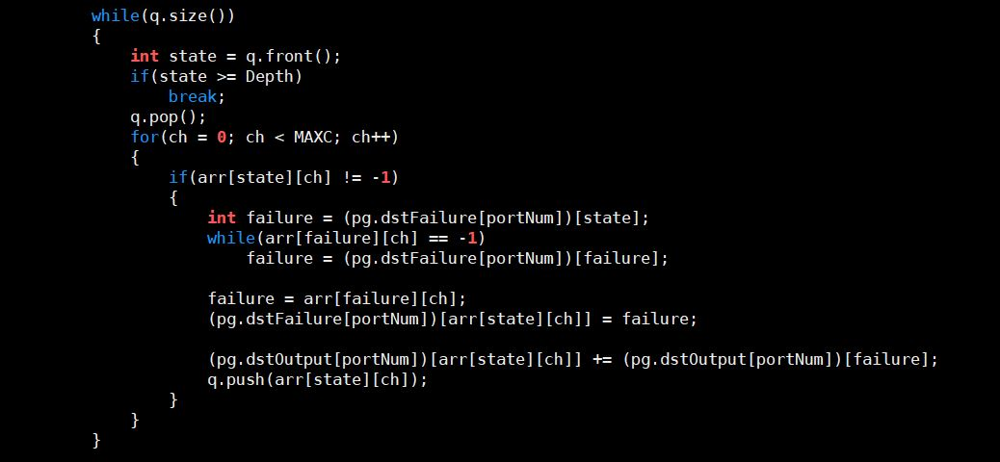

* 우리가 확인해야할 점은 2가지이다

1. Failure Link를 잘 따라가는가
2. 현재 node의 Failure Link를 확인하기위해 이전 node의 Failure Link를 사용하는가

* 위의 두 문제는 다음을 통해 증명할 수 있다
* 먼저 failure에 현재 node의 다음 node의 Failure Link를 대입한다
  * state에 현재 node의 다음 node의 위치가 담겨있다
* while문을 보면, failure에 대입된 값의 state가 존재하는지(-1이면 존재하지 않음) 확인하면서 Failure Link를 따라간다
  * 구글링한 code에서의 dest -> go[i]와 같은 역할
  * **Failure link를 잘 따라간다는 증거**
* while문을 빠져나오게 됐다는 것은, state가 존재한다는 것이다
  * 그것이 root node이든지 아니든지
  * root node의 state는 root node이므로
* 이를 arr\[state\]\[ch\]의 위치의 node의 Failure Link에 대입해준다
  * 현재 node의 다음 node의 다음 node
  * 현재 node의 다음 node의 Failure Link로 현재 node의 다음 node의 다음 node의 Failure Link를 찾아주었으므로 이는 **이전 node의 Failure Link를 사용하여 현재 node의 Failure Link를 확인하는가**에 대한 증거가 된다
    * 말이 좀 어렵지만 두 node가 Parent-Child 관계라는 것을 의미한다
* 이렇게 되면 root node의 state를 가져왔어도 넣어주고, 아니라면 적절한 Failure Link를 넣어준다
* 따라서 **fancy의 Failure Link를 구성하는 code는 정당하다**


---
## 03/20 현재상황

* nids에 대한 공부는 끝났다

1. Aho-Corasick 알고리즘이 nids Kernel에 어떻게 적용되었는가
   * thread마다 각자 16byte의 payload를 처리할 의무를 가진다
   * 각 thread들이 각자 맡은 부분의 payload를 Trie에 검색해보면서 matching되는 rule이 있는지 확인해본다
   * 사실 initialize\_nids에서 Trie와 Failure Link, Output Link를 다 만들어줘서 nids 커널에서는 거창한 무언가가 있는건 아니다
   * Trie와 Failure Link를 타고 matching하는 것만 한다
   * 다만 문제점은 thread들이 payload를 분할하여 관리하다보니 **분할된 구역에 걸쳐있는 rule**들이 검색이 안된다
     * 아래에 해결책 제시했음
2. state로 저장해주는 값이 무엇인가
   * -1 : 빈 칸이므로 여기서는 값을 찾을 수 없다는 의미
   * 0 : root node
   * n(자연수) : n의 Depth를 가지는 node ( == n번째 node)

3. thread 분배는 어떻게 할 것인가
   * 사실상 ipsec과 동일한 방식으로 thread를 분배해주면된다
   * 동일하게 16byte씩 관할하기 때문이다
   * 다만 추가된 알고리즘(1번에서 제시된 문제의 해결책)에 의해서 발생하는 overhead가 크면 각 thread가 관할하는 byte의 수가 줄어야할 수도 있다

---

### 분할된 구역에 걸쳐있는 rule들의 검색

* thread들이 payload를 나눠서 병렬적으로 검색을 하기 때문에 위에서 설명한 바와 같이 분할된 구역에 걸쳐있는 rule들은 검색이 안된다
  * e.g.) |(0) a b c d r u|(1) l e s e f g|
  * rule set 안에 "rules"라는 rule이 있고 각 thread가 6byte씩 관할하며 |를 기준으로 thread가 관할하는 memory 구역을 구분하며 (n)은 n번째 thread가 관할하는 구역을 지칭한다고 가정하자
  * 0번 thread는 u까지 확인하고 1번 thread는 l부터 확인하게 되므로 "rules"라는 rule은 0번과 1번 thread 모두 확인할 수 없게 된다
* 이 문제를 해결하기위해 코드를 조금 수정했다


<center> original code </center>


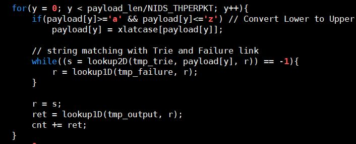

* 기존 code에서는 각 thread가 배정받은 payload_len/NIDS_THPERPKT(16bytes) 만큼만 확인한다


<center> modfied code </center>


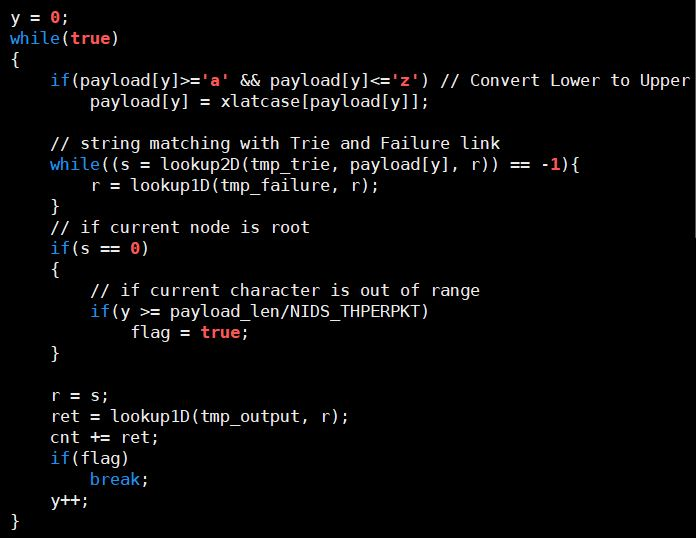

* 수정된 code에서는 while문의 조건을 true로 주어 내부에서 조건이 만족되지 않는한 무한 loop를 돌게 했다
* 다른 부분은 동일하게 주고, 내부에 loop 종료 조건을 추가해주었다
* lookup을 마친 현재의 node가 root node라면 Trie 내에서 search할 수 있는 모든 node를 탐색을 마친 후 새로운 string을 시작해야하는 상태이다
* 이 상태에서 현재 보고 있는 문자가 관할 메모리 구역 외에 있다는 것은, 관할 메모리 구역에서 시작된 string은 rule set과 모두 matching해보았다는 이야기가 된다
* 따라서 이 때 flag를 true로 주고 Output Link를 확인한 후 break로 빠져나간다

___

### 수정한 code에 대한 분석

* 이 code가 완벽하게 모든 rule을 확인할 수 있을까에 대한 의문이 조금 남는다

1. packet에 포함된 모든 rule을 찾아내는가
   * 찬규형과 얘기해보았을때, A B C D E라는 rule과 B C D라는 rule이 있고, packet에 A B C D K라는 부분이 있으면, A B C D E라는 rule을 검색하다가 matching에 실패하게되니 다시 B부터 확인하여 B C D라는 rule을 찾아야하지 않냐라는 질문을 하셨다
   * 원래는 Aho-Corasick 알고리즘이 Trie를 쓴다는 특성덕분에 Trie를 구성할 때, A B C D E라는 branch에서 B C D라는 rule을 위해 D에, 그리고  A B C D E라는 rule을 위해 E에 모두 Output Link가 찍혀있을 것이라고 생각했다
   * 그런데 A B C D E는 A부터 시작하고, B C D는 B부터 시작하는데 D에도 Output Link가 찍혀있을까?
   * 이 부분은 추후에 nids를 돌려보면서 확인해봐야할듯하다
* **해결됨** -> rule matching problem solution 참고
  
2. Trie를 타다가 root로 다시 돌아왔을때, Output Link를 확인해야하는가
   * root는 시작점이라는 것을 제외하고는 아무 의미가 없는 node이다
   * 그러면 여기서 Output Link를 확인하지 말고 그냥 while문을 탈출시키는게 더 좋지 않을까?

* 위의 의문점들은 논문 정리가 끝나면 다시 제대로 확인해봐야할 것 같다

---

### rule matching problem solution

* Aho-Corasick 알고리즘의 특성상 Failure Link를 따라간 node는 그냥 같은 값(위의 예제에서는 D)을 가지는 node가 아니다
* 위의 예제를 통해 Failure Link를 설명하자면
  * A B C D E라는 string은 B C D 라는 string을 substring으로 가진다
  * 그렇기 때문에 A B C D E의 D가 B C D의 D로 연결되는 것이다
  * 만약 F C D라는 string이 또 하나의 rule로 rule set에 존재한다고 하더라도
  * A B C D E의 node들은 F C D와 Failure Link로 이어지지 않는다
  * 아래의 Trie를 보면 A B C D E와 F C D를 이어주는 Failure Link가 없다

<center> Aho-Corasick Trie Example </center>


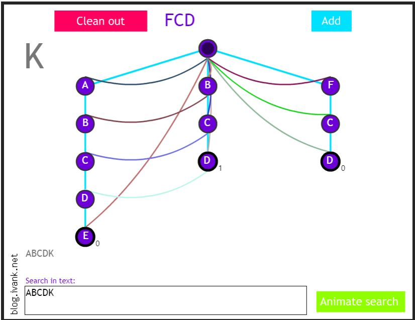

* 따라서 nids 커널에서는 input값(payload)를 받으면 그냥 Trie와 Failure Link를 따라가주기만하면 그 안에 포함된 모든 rule을 matching할 수 있다
* 대신 initialize\_nids 함수에서 Trie와 Failure Link를 만들때 이러한 부분까지 고려해서 구현해야한다
  * 이는 snort와 cuda Aho-Corasick 코드를 확인해서 비교해봐야함

* 위의 Flash Player의 링크를 남겨둔다

[Aho-Corasick Player](http://blog.ivank.net/aho-corasick-algorithm-in-as3.html)


---

## 03/19 현재상황

* Aho-Corasick에 대한 이해를 도와준 블로그 링크이다

[Aho-Corasick Algorithm](https://m.blog.naver.com/kks227/220992598966)


* Aho-Corasick 알고리즘은 다음의 과정을 통해 진행된다

**1. 주어진 data들을 Trie에 담는다**

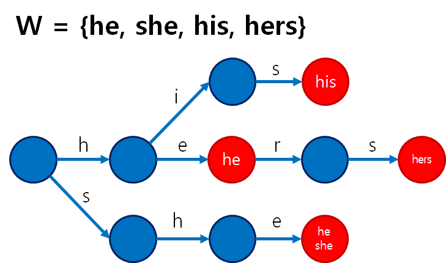

* 위 링크의 블로그에서 보여준 사진이다
* W라는 data set에 있는 he, she, his, hers를 Trie에 담아서 표현해준다

* 이때 he, she, his, hers가 완성되는 지점은 빨갛게 표시되어있는데 저 부분들이 Output Link가 된다

**2. Failure Link를 이어준다**

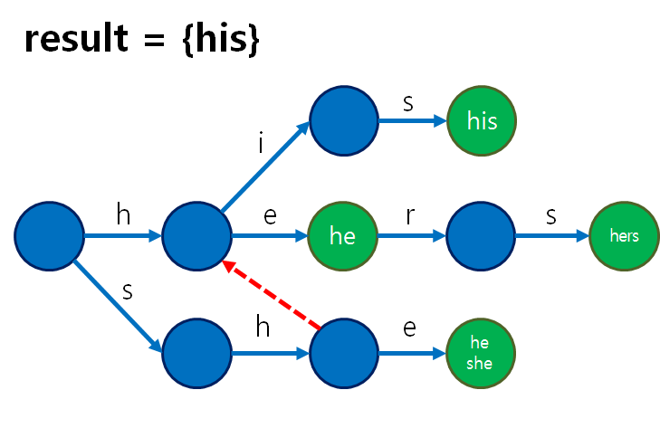

* 위의 사진은 S=shis라는 string을 test해보기 위해서 Failure Link를 추가한 그림이다
* sh까지 test했을때 가장 밑의 줄의 s->h의 과정을 거치다가 다음 글자인 i로 가기위해 두번째 줄의 h의 값을 가진 node로 이동한다
* 이러한 방식으로 하나씩 Failure Link를 추가해준다
* KMP알고리즘에서의 Failure 함수와 동일한 알고리즘의 방식으로 추가해주는 것이다
* 이 과정은 data를 Trie에 추가해주는 과정에 같이 진행된다
* 즉, **input data가 아닌 기존에 가지고 있던 data**를 사용해서 추가해주는 것이다
* 위의 예시에선 S=shis라는 input data를 이용해 Failure Link를 보였지만 실제로는 그렇지 않다

**3. Output Link를 지정해준다**

* 실제로 Link를 지정해준다기보단 Output node를 지정해주는 것이다
* **이 node를 마지막 node로 가지는 string data가 있다**라는 의미이다
* Failure Link를 통해 이동할 수 있는 지점까지 모두 포함해준다

**4. Input data를 matching한다**

* 모든 Link를 이어주었다면 Input data를 matching해본다
* Failure Link를 타고 이어가다가 Output Link를 만나면 가장 최근에 matching되었던 문자부터 Output Link까지의 문자를 matching된 문자열로 인식한다

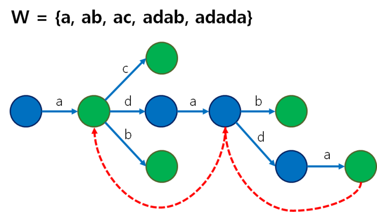

* 위의 사진은 이 전에 있던 예시와 다른 예시이다
* S = adadac를 input data로 받아 matching해본다고 가정하자
* 두번째 줄의 node를 타고 a -> d -> a -> d -> a까지 매칭한다
* 그 다음 a -> c를 매칭하기 위해서 2번째 줄의 3번째 a(파란색 노드)로 Failure Link를 타고 이동한다
* c를 값으로 가지는 child node가 없기 때문에 다시 Failure Link를 타고 두번째 줄의 첫번째 a(초록색 노드)로 Failure Link를 타고 이동한다
* a -> c로 이동할 수 있는 link가 있으므로 a -> c를 매칭시키고 끝낸다

---

* Aho-Corasick 알고리즘이 이해가 되었다
* 하지만 code를 구현하거나 수정하기 위해서 기존의 Aho-Corasick code를 뜯어볼 필요가 있는 것 같다
* cpu code를 먼저 이해하고 나면, cuda code는 Trie대신 2차원 배열을 사용한다는 점만 유의하면서 읽으면 쉽게 이해될 듯하다

---
## 03/18 현재상황

* nids에 대한 공부를 하면서 fancy의 nids 코드를 해석하는 중이다
* 정리가 안되는 느낌이 들어 정리를 해보았다
* 해결되지 않은 의문점들은 코드흐름 후에 있다

---
### 코드 흐름

#### initialize\_nids

* initialize\_nids 함수는 이름과 동일하게 nids를 위한 초기화과정이 담긴다
* 초기화에는 rule set을 가져와 이를 Trie에 담는 것도 포함된다
* Trie에 담는 과정은 다음과 같다
	1. rule set 파일을 읽어와 이를 parsing하여 data를 뽑아내다
		* data에는 dst인지 src인지, port번호는 몇번인지, state는 어떠한지에 대해 담겨있다
		* dst / src와 port에 대한 정보를 알려주고, state의 수(depth)를 알려준다
		* (현재 state) : (이전 state) data(int) data(char)의 형태로 state의 정보가 저장되어있다
	2. Failure Link를 이어준다
		* 해당 port의 Failure Link의 정보를 담는 배열을 -1로 초기화한다
		* 0번째 열의 값들(root node)의 Failure Link를 0으로 지정해 root의 Failure Link가 root로 이어지게 한다
		* root의 child node를 queue에 저장해두고, queue를 pop 시키면서 child node들의 Failure Link를 모두 이어준다
		* Failure Link를 이어준다는 것은 해당 지점에서 Failure이 일어났을때 어디로 이어질 것인가, 즉, 같은 값을 가지는 node이면서 child node를 가지는 값을 찾아서 이어준다는 것이다
	3. Output node를 지정해준다
		* 사실 이 과정은 2번의 Failure Link를 이어주면서 같이 진행된다
		* 해당 지점을 거친 pattern이 어디에 있는 node에서 끝나는지를 저장해주는 것이다
		* 아직 완벽하게 이해가 되지 않은부분이다
	4. Trie에 값들을 대입해준다
* 위의 과정을 rule set에 있는 모든 port에 대해 마치면 이들을 cudaMemcpy로 gpu에 넘겨준다
	* 위의 Trie와 Failure Link, Output을 담는 array는 2차원 배열인데, 이를 cudaMemcpy2D나 cudaMallocPitch로 넘겨주지 않는다
	* cudaMallocPitch의 형태를 본따서 넘겨준다
	* gpu에allocation된 memory를 접근할 pointer를 담을 배열을 만들어 각각의 pointer에 cudaMalloc을 해준다
	* 결국 device pointer 배열을 만들어 이를 이용해 처리하는 방식이다
* gpu에 위의 데이터들을 다 넘겨주고 나면 nids Kernel을 호출한다

#### nids

* rule set에서 뽑아온 data들은 모두 대문자이므로, 대문자로의 변환을 위해 사용할 xlatcase 배열을 만든다
* lookup2D함수를 통해 받아온 packet의 port에 해당하는 Trie에서 packet의 pattern이 있는지 Failure Link를 이어가며 찾아본다
* 찾은 후 output 배열에서 값을 찾아와 매칭이 된건지 판단하여 이를 ret에 저장한다
* 위의 과정을 반복한다

---
### 의문점

* Aho-Corasick 알고리즘의 이해도가 좀 떨어진다
	* 단순히 Trie를 사용한 알고리즘 정도로 생각했다가 세부적인 알고리즘의 이해를 놓쳤다
* nids Kernel에 대한 이해도가 떨어진다
	* Aho-Corasick 알고리즘에 대한 이해도 부족이 영향을 미친듯하다
	* 흐름은 이해를 했지만 수정을 위한 세부적인 이해도가 떨어진다
	* Aho-Corasick 알고리즘을 이해하고 다시 읽어봐야할 것 같다
* trie와 failure, output에 저장되는 값에 대한 이해도가 떨어진다
	* 각 배열에 -1, failure등의 값들을 대입하는데 이 값들의 의미를 모르니 nids Kernel에 대한 이해도가 떨어지게 된다
* 위의 내용을 해결하면 수정을 해야하는데 이때 thread의 할당에 대해 고민을 해봐야겠다
	* 몇개의 thread가 필요할지 감이 잡히지 않는다
	* 각 thread가 일정한 size를 나눠 맡으면서 진행하는 것 같은데 size를 나누는 기준은 찬규형이 forwarding해주신 메일에서도 마무리가 되지 않았다
	* gpu thread warp에 대한 실험을 하셨는데 이 실험에 대한 결과가 더 필요하다
	* 사실 메일의 내용을 보니 가용한 thread를 적절히 분배하면 될 것 같긴 하다
		

---
## 03/17 현재상황
* 찬규형이 forwarding해준 메일을 보면서 공부중이다

---
### packet이 nids를 거치는 과정

1. port와 protocol을 확인한다
	* src port가 80, protocol이udp, dst port가 any라고 가정하자
2. 해당 정보에 부합하는 확인해야할 rule이 rule set에 있는지 확인
	* 1차 search
	* 각 protocol별, src와 dst에 대한 port Group이 있음
		* 현재 가정내에선 UDP src라는 group이 있음
	* 각 port Group은 1 ~ 65535까지의 port를 관리해줌
	* 여기서 해당하는 port를 찾아가서 확인
		* 80번 port를 찾아가서 확인
3. rule set에 있다면 packet이 옳은 rule에 부합하는지 확인
	* 2차 search
	* Trie를 통해 Aho-Corasick algorithm을 적용
	* MPSE가 사용됨
	* 이 과정에서는 MPSE == TRIE == Aho-Corasick algorithm인 느낌
		* 사실 MPSE는 길이가 가장 긴 pattern을 사용하는 TRIE 구조라서 완전히 같진 않음

4. rule에 맞는 packet이라면 RTN을 확인해서 port를 확인해줌
5. Snort Event Queue를 통해 각 case에 맞는 handler로 전달됨

---
### nids의 구현

* github에 있는 cuda Aho-Corasick 코드를 확인해야할 듯함
* 2차원 배열을 통해 Trie를 대체하는 과정을 확인해야함

---
#### 세부 구현

1. cudaMallocPitch와 cudaMemcpy2D 
	* cudaMallocPitch는 n개의 칸을 가진 배열의 포인터를 m개 가진 배열을 만들어서 n * m개의 칸을 가진 행렬을 만드는 방식
		* 실제로 사용되는 메모리칸은 n * m + n개이다
	* cudaMemcpy2D는 n * m개의 2차원 배열을 host -> device로 통째로 복사해줌
		* 여기서도 devicepitch라는 포인터가 사용되는 데 그 이유는??
	* memcpy와 malloc의 차이를 제외하고 보면 배열 포인터의 배열이냐 배열이냐의 차이인듯하다
	* **중요한건 contiguous하게 memory가 할당되느냐!**
	* 이에 관련된 것은 알아봐야함

2. texture memory 사용
	* 이부분은 메일을 더 읽어봐야함

---
## 03/15 현재상황

* ipsec을 수정할때 확인해야하는 부분을 정리해보았다

1. HMAC의 경우 64byte의 경우를 제외하고는 2개 이상의 thread가 하나의 packet을 봐야하므로 이를 관리해주는 부분이 필요함
2. HMAC에 사용하는 thread를 제외하고는 sha1\_kernel\_global 함수에서 return시켜서 array boundary 외의 부분을 건드리는 일이 없도록 해야한다
3. n개의 thread(128byte의 경우 2개의 thread)가 하나의 packet만을 볼 수 있도록 packet index를 지정해서 packet의 위치를 알려줘야함
4. n개의 thread가 하나의 packet을 **나누어** 볼 수 있도록 e\_index와 thread\_index를 지정해서 각자 맡을 위치를 알려줘야함
5. 64byte의 경우 ictx를 n개의 thread가 보기 때문에 그만큼 칸을 만들어줘야함
	* ~~여기서 생기는 의문이 ictx를 n개의 칸으로 나누어서 SHA1을 진행하는데, 그럼 이를 합쳐주는 부분은 어디에 있는가~~
	* packet을 한 개를 보는 게 아니니 당연히 여러개의 octx가 나오고 이를 각각의 packet에 붙여주는것....
6. sha1\_kernel\_global에 parameter를 넘겨줄때, ictx, octx, p\_buf의 index에 thread번호를 잘 할당해줘야함
7. HMAC을 한 부분을 뒤에 붙여줄 때 3개의 thread만 일을 하게끔 해줘야함
8. 512byte 이상의 size의 packet의 경우 rotation을 돌면서 Kernel을 여러번 호출해줘야 512개의 packet을 모두 볼 수 있음
	* 이를 위해 확인해줘야할 것들이 있음
	1. array의 boundary를 넘어가는 부분이 없는지
	2. rot\_index의 증가가 매 Kernel 호출마다 이루어지는지

* 위의 부분을 확인할때, 정리가 되어있지 않아서 빼먹는 부분이 있는 것 같아서 정리해둠
* 5번의 의문점은 일단 읽어보고 찬규형한테 물어봐야할듯함
---

* nids 공부를 하고있는데, snort를 깔아서 코드를 볼려했으나 nids부분이 명확하게 나누어져있지 않은 느낌....
* github에 다른 nids 코드를 찾아보고 있는데 snort와 비슷한 느낌을 받음
* 찬규형이 참고한 code를 찾고 싶은데 아직 찾지 못함
* 일단 code를 찾으면서 fancy의 nids 코드를 읽어봐야할듯함

---
## 03/13 현재상황

* 1514 byte의 경우에서 Thread Block 할당 계산을 잘못했어서 고쳤다
	* 1개의 Thread Block당 1034개의 thread를 할당했는 데, 최대치를 1048로 착각해서 넣은 듯 하다
* 변경 결과는 아래의 표에 기록되어있다

<center> ipsec table : Thread </center>

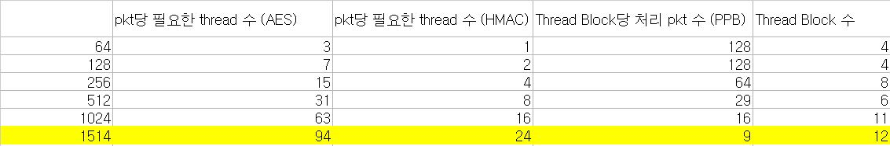

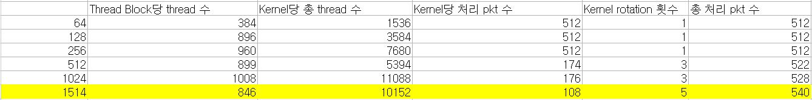

* 1514 byte부분을 노랗게 표시해두었다
* 1개의 Thread Block에서 처리하는 packet의 수를 9개로 줄이고 Kernel 호출 횟수를 5회로 늘였다
* 512개의 packet을 무리없이 처리할 수 있게 되었다

<center> ipsec table : Shared Memory </center>

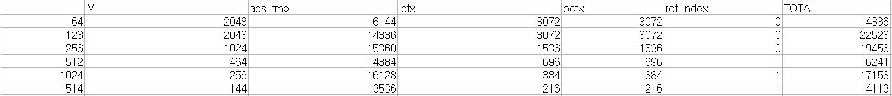

* octx의 memory계산이 잘못되어 수정했고, 1514byte부분을 위의 내용에 맞게 변경했다

* 다만 좀 걸리는 부분은 thread 낭비와 더 늘어나고 복잡해진 if문의 조건이다

```
if(tid < 108*AES_T_NUM && (rot_index == 4 && tid < 108 * AES_T_NUM - 28))
```
* 위의 내용이 rx\_buf의 boundary를 넘기지 않기 위해 thread를 제한하는 if문이다
* Kernel을 한번 호출할 때 thread가 108 * 94(846)개 이상 사용되지 말아야하면서
* 마지막 rotation때는 28개의 thread가 사용되면 안된다
* 여기서 thread의 낭비가 꽤 크다는 느낌을 받는다
* 하지만 현재 상황상 사용할 수 있는 sm의 조건에 맞췄을 때 최소의 thread 낭비이다
* 사실 저기서 Kernel 1회 호출당 처리하는 packet의 수를 103개정도로 줄이면
* 마지막 rotation때 3개의 thread만 버려주면 된다
* 그래도 사실상 낭비되는 thread의 수는 동일하다

<center> HMAC trailer appending </center>


* 위의 code는 hamc trailer를 붙여주기위한 코드이다
	* 1024 byte의 기준의 코드이다
* 일단 임시방편으로 3개의 thread만 사용되도록 코드를 만들어두었다
* 이는 fancy code에서는 주석처리로 가려져있었다는 점에서 문제가 있지 않을까라는 추측을 하고 있다
* 수정이 필요할 듯 하다

___

## 03/12 현재상황

* gpgpu의 sha 구조와 fancy의 sha 구조를 확인해봄
* 적절히 변형된 것 같음
	* data의 길이가 random하지 않다는 점을 이용해서 우리가 사용하기에 적절하게 코드를 변형시킨 것 같음

### nf\_ipsec\_N

* N byte 버전의 ipsec을 구현중이다
* 찬규형의 github Research 내용을 참고하여 각 packet size별로 몇개의 thread가 필요한지 등을 보면서 구현중이다
* 구현하면서 64 byte와 1514 byte에 맞게 숫자로 주어져있던 값들을 macro를 통해 보기 쉽게 수정중이다
	* e.g. 1514 byte 버전에서 94 -> AES\_T\_NUM (AES를 위한 Thread Number)\
___

* 구현과 관련하여 확인해야할 부분이 남아있다

1. ~~Thread Block 수~~
	* 256byte보다 작은 size의 packet들에 대해서는 thread 수에 문제가 없을 듯하다
	* 하지만 512, 1024byte의 size의 packet들의 경우 16개의 Thread Block을 사용하는데 이렇게 많이 사용해도 되는지는 잘 모르겠다

2. ~~Shared Memory~~
	* Shared Memory의 사용량을 고려하지 않았다
	* 찬규형이 구현해놓으신 64byte와 1514byte의 버전에 48K보다 작은가를 확인하는 부분이 있었다
	* 이 부분을 보고 48K 미만이면 괜찮을 것이라는 판단을 해 일단 자유롭게 할당해놓은 상태이다
	* Shared Memory에 대해 알아보고 수정해야할 수도 있다
	* Shared Memory는 충분하다
		* 한 Thread Block당 사용할 수 있는 Shared Memory의 양은 48K임
		* 모든 size의 경우에서 48K를 넘는 Shared Memory를 사용하지 않음
___

#### 구현 - 2차 수정후

* Thread Block에 대한 값을 다시 수정하였다
1. 찬규형이 gdnio를 돌릴때 rx\_kernel과 tx\_kernel에 각각 sm을 1개씩 할당하여 사용하다보니 **최대 사용 가능 sm의 수가 12개**였다
	* 그래서 12개 이상을 사용하는 1514byte의 경우도 Thread Block의 개수를 줄여야했다
2. 512, 1024 byte의 경우들의 thread 수를 조정해야했다
	* 1번과 동일한 이유로 Thread Block의 개수를 줄여야했다
3. 각 packet size별로 Shared Memory를 계산한 것을 수정해야했다
	* Thread Block의 수의 변화도 있고, sha1\_gpu\_context 구조체의 size도 알아내야했다
4. 표에 오타가 있었다
	* 첫번째 표의 두번째 칸은 AES에 필요한 thread 수가 아니라 HMAC에 필요한 thread 수였다
	* 재업로드한 표에는 제대로 나와있으니 상관없다
5. 512, 1024, 1514 byte의 경우에 p\_buf의 범위를 벗어나는 thread를 관리해주는 부분이 필요하다
	* 512 byte의 경우를 예로 들자면,
	* sha1\_kernel\_global 커널을 3번 호출해야 512개의 packet을 처리할 수 있다
	* 이를 위해 커널에 Thread Block당 174개의 thread를 할당했다
	* 그렇게 되면, 174 * 3(522)개의 thread group이 생긴다
	* 522 - 512 = 10개의 thread group이 잉여 group이 되어 이 group들이 p\_buf의 범위 밖의 부분을 건들지 못하게 해야한다
	* 이를 if문을 통해 조절해주었다

<center> ipsec table : thread </center>

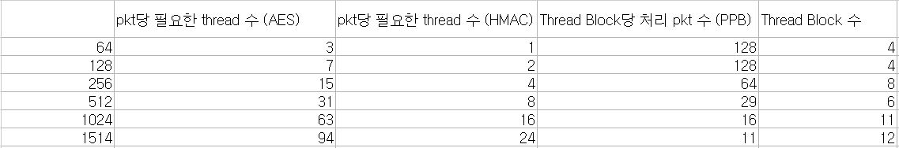

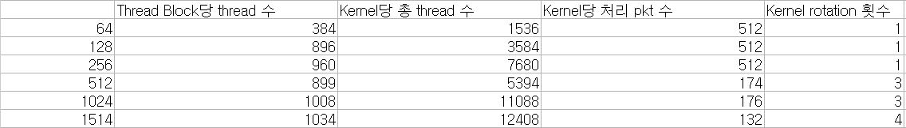

* 위의 두 표는 thread 수에 대한 정보를 나타낸다
* 512byte 이상의 경우에서 Thread Block의 수를 줄였다
* 1514byte의 경우 최대 Thread Block 수인 12개를 사용한다
	* Kernel 호출 횟수는 4번으로 유지되었다
	* 아슬아슬했다....
* 그 외의 변화로는 Thread Block당 thread 수의 data를 추가한 것밖에 없다

<center> ipsec table : Shared Memory </center>

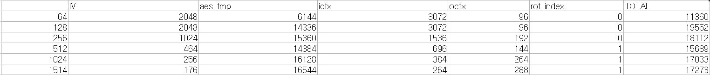

* 위의 표는 Shared Memory에 대한 정보를 나타낸다
* 각 packet size별로 Shared Memory에 할당되는 변수의 size를 기록해두었다
* 모두 48K보다 작다

___

#### 구현 - 1차 수정후

* 찬규형에게 구현한 코드를 검사맡은 후의 1차 수정이다
* 수정해야했던 부분들은 다음과 같다
	1. 현재 찬규형이 사용하고 있는 P4000의 경우 sm이 14개라 Thread Block을 최대 14개까지 사용할 수 있다
		* 512, 1024 byte의 경우 16개의 Thread Block을 사용 중이었으므로 이를 줄여야한다
	2. ictx와 octx의 size가 (HMAC에 필요한 thread 수) * (Thread Block당 처리하는 packet 수)가 되어야한다
		* 현재 ictx와 octx의 선언이 없는 곳도 있음
		* 확인 후 수정해야함

* Thread Block 수와 thread 수를 다음과 같이 변경하였다

<center> Summary of ipsec thread </center>

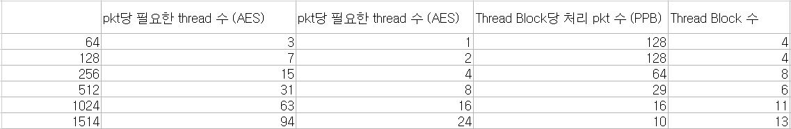

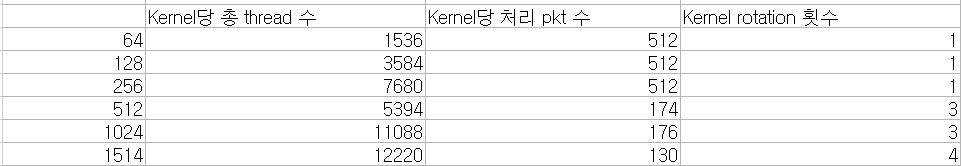

* 첫번째 표는 각 size별로 packet당 필요한 thread의 수와 내가 정해준 Thread Block당 처리하는 packet 수, Thread Block의 수를 정리해놓은 것이다
* 두번째 표는 첫번째 표의 값들에 의해 정해진 Kernel당 총 thread 수와, Kernel당 처리하는 packet 수, Kernel의 rotation 횟수이다.
* 64, 128, 1514 byte의 경우는 수정 전과 동일하다
* 256, 512 byte의 경우 사용 가능한 Thread Block의 수가 줄면서, Kernel을 1회 호출하였을 때 처리할 수 있는 packet의 수가 줄었다
* 따라서 이를 위해 3번의 Kernel 호출을 통해 512개의 packet을 처리할 수 있도록 구현하였다
	* 512byte의 경우 Kernel당 처리 packet 수가 174라고 되어있지만 실제로는 171개이며, 마지막 Thread Block에서는 170개만 처리한다
	* 따라서 171 * 2 + 170 = 512이므로 3회의 Kernel 호출로 512개의 packet이 처리가능하다
	* 1024byte의 경우 Kernel당 처리 packet 수가 176이라고 되어있지만 실제로는 512byte와 동일하게 171개이며, 마지막 Thread Block에서는 170개만 처리한다
	* 따라서 총 3회의 Kernel 호출로 512개의 packet이 처리가능하다
* 이와같이 thread의 수와 Thread Block의 수를 변경함에 따라 내부적인 구조의 수정도 필요하다
	* Kernel 1회 호출당 할당되는 thread의 수와 실제로 packet을 nf처리하는 thread의 수가 다르므로 이 부분을 수정해주어야한다

___

#### 구현 - 수정전

* 모든 packet size에 대한 구현을 끝냈다
* 128, 256, 512 byte의 경우 함수 내용은 동일하며 macro의 값만 다르다
* 1024, 1514 byte의 경우 위의 size들과 함수 내용에서 rot\_index가 존재한다는 점을 제외하면 함수 내용은 동일하며 macro의 값만 다르다
* 64byte를 제외한 나머지의 경우 SHA1 알고리즘에 2개 이상의 thread를 사용하므로 64byte의 경우와 함수 내용이 조금 다르다
	* sha\_kernel\_global함수를 호출할 때 pkt\_idx값을 넘겨주어 어떤 packet을 처리해야하는지 알려준다
* 또한 128byte 이상의 size를 가진 packet들은 SHA1처리를 해야하는 data의 크기가 block의 크기보다 크므로 block\_index를 지정해준다
* 각 size별로 packet당 필요한 thread의 수가 다르기 때문에 각 size에 맞는 thread 수를 할당해주었다
* 찬규형의 Research github을 참고하여 각 숫자를 정해주었다

<center> ipsec macro : 64 byte </center>

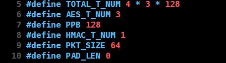

* 하나의 packet당 3개의 thread를 필요로하므로 총 4 \* 3 \* 128(1516)개의 thread를 사용한다
* 한 Thread Block당 384개의 thread가 할당되며, 총 4개의 Thread Block을 사용한다
* 총 thread 수가 28,672개보다 작으므로 descriptor 전체를 한번의 kernel 호출로 처리할 수 있다


<center> ipsec macro : 128 byte </center>

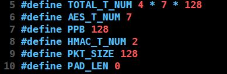

* 하나의 packet당 7개의 thread를 필요로하므로 총 4 \* 7 \* 128(3584)개의 thread를 사용한다
* 한 Thread Block당 896개의 thread가 할당되며, 총 4개의 Thread Block을 사용한다
* 총 thread 수가 28,672개보다 작으므로 역시 descriptor 전체를 한번의 kernel 호출로 처리할 수 있다

<center> ipsec macro : 256 byte </center>

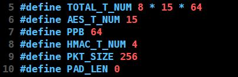

* 하나의 packet당 15개의 thread를 필요로하므로 총 8 \* 15 \* 64(7680)개의 thread를 사용한다
* 한 Thread Block당 960개의 thread가 할당되며, 총 8개의 Thread Block을 사용한다
* 총 thread 수가 28,672개보다 작으므로 descriptor 전체를 한번의 kernel 호출로 처리할 수 있다
* 하지만 하나의 Thread Block이 처리해주는 packet의 수가 64개로 반으로 줄었다

<center> ipsec macro : 512 byte </center>

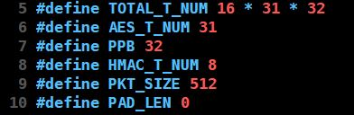

* 하나의 packet당 31개의 thread를 필요로하므로 총 16 \* 31 \* 32(15,872)개의 thread를 사용한다
* 한 Thread Block당 992개의 thread가 할당되며, 총 16개의 Thread Block을 사용한다
* 총 thread 수가 28,672개보다 작으므로 descriptor 전체를 한번의 kernel 호출로 처리할 수 있다
* 하지만 하나의 Thread Block이 처리해주는 packet의 수가 32개로 다시 반으로 줄었다

<center> ipsec macro : 1024 byte </center>

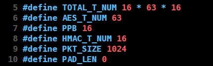

* 하나의 packet당 63개의 thread를 필요로하므로 총 16 \* 63 \* 16(16,128)개의 thread를 사용한다
* 한 Thread Block당 1,008개의 thread가 할당되며, 총 16개의 Thread Block을 사용한다
* 1024 byte부터는 한번의 kernel 호출로 descriptor 전체를 처리할 수 없다
	* 현재 1개의 Thread Block당 16개의 packet을 처리해주며 16개의 Thread Block을 사용하므로 총 16 * 16(256)개의 packet을 처리한다
	* 따라서 descriptor 전체를 처리하려면 2번의 kernel 호출이 필요하다
* 이 때문에 1514byte버전에 찬규형이 짜놓으신 rot\_index를 0 ~ 1 사이에서 변화시키며 처리하도록 했다

<center> ipsec macro : 1514 byte </center>

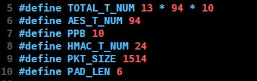

* 하나의 packet당 94개의 thread를 필요로하므로 총 13 \* 94 \* 10(12,220)개의 thread를 사용한다
* 한 Thread Block당 940개의 thread가 할당되며, 총 13개의 Thread Block을 사용한다
* 1514 byte도 역시 한번의 kernel 호출로 descriptor 전체를 처리할 수 없다
	* 현재 1개의 Thread Block당 10개의 packet을 처리해주며 13개의 Thread Block을 사용하므로 총 10 * 13(130)개의 packet을 처리한다
		* 실제로는 128개 단위로 나누어 처리해 Thread Block 하나당 2개의 thread는 사용하지 않는다
	* 따라서 descriptor 전체를 처리하려면 4번의 kernel 호출이 필요하다
* 1514byte에서의 rot\_index는 찬규형이 짜놓으신 것을 그대로 사용하여 rot\_index가 0 ~ 3 사이에서 변화한다

___

## 03/11 현재상황

### OPENSSL SHA 구조 확인

* openssl의 sha의 구조의 틀이 머리속에 어느정도 잡힌 듯함

1. context 구조체
	* h : hash된 값을 저장하는 변수
		* SHA1은 hash fuction을 돌리고 나온 크기가 20byte여야해서 unsigned int의 크기를 5개 가짐
		* SHA512는 hash function을 돌리고 나온 크기가 512bit(=64byte)여야해서 unsigned __int64의 크기를 8개 가짐
	* num : hashing을 해야할 남은 data의 크기
		* 64byte단위로 hashing을 진행하다보니 data의 크기가 64byte로 딱 나누어 떨어지지 않는 경우를 처리해줘야함
		* 이를 위해서 hashing을 해야하는 남은 data의 크기가 얼마나 남았는지 알아야함
		* 이를 저장하는 변수
		* 우리가 궁금했던 20byte길이의 hashing을 한번 거친 data는 어떤 과정을 거치는가를 보려면 얘를 봐야함
	* u(d or p, etc...) : hashing이 필요한 data를 임시로 저장하는 공간
		* 변수명은 SHA버전마다 다름
	* Nh, Nl : hashing된 길이의 합
		* hashing을 할때마다 hashing한 길이를 bit수를 기준으로 Nl에 저장해준다
		* hashing을 할때마다 저장해주다보니 overflow가 일어날 수도 있어서 Nh라는 값을 추가로 준듯하다
		* 결국 최종적으로 Nh와 Nl이 가지게 되는 값은 hashing이 일어난 길이의 누적 합이다

2. SHA\_Update
	* data를 64byte단위로 나누어서 sha\_block\_data\_order를 통해 hashing을 돌려주는 함수이다
	* hashing이 직접 일어나지는 않으며 block 단위로 나누어주는 역할을 한다
	* 여기서 context의 num변수를 변경시키면서 64byte보다 작은 size의 data를 SHA\_Final에서 처리할 수 있게끔 해준다

3. sha\_block\_data\_order
	* hashing이 직접적으로 일어나는 함수
	* data의 값을 rotation이나 ^(XOR)등 다양한 연산을 통해 변형시킨다
	* 그 후 이 값들을 context의 h변수에 더해준다
	* 이 과정을 지정해준 횟수만큼 진행해준다
		* data길이를 64byte로 나눈 횟수만큼
		* e.g.) data의 길이가 512(64 \* 8)byte라면 8번 돌려준다
	* 이 함수가 hash function이라고 보면 될 것 같다

4. SHA\_Final
	* SHA\_Update에서 한번 처리된 data를 말그대로 마무리해주는 함수이다
	* context -> num을 확인해서 64byte보다 작은 크기의 data가 남았다면 이를 sha\_block\_data\_order함수를 통해 hashing해준다
	* 우리가 궁금했던 점은 20byte의 크기의 data가 넘겨질때 64byte랑 다르게 돌아가는지였는데 여기서 해답이 나온다
	* **남은 부분을 0으로 padding해주고 돌린다**
	* data의 hashing 뒷마무리가 끝나면 이를 md라는 변수에 저장해서 output으로 내보내준다
	
* openssl의 SHA1부분을 확인해보면서 이러한 구조를 파악하고 싶었으나 불가능했다
* 그 이유는 SHA1이 왠지는 모르겠으나 미완성인 상태이다
* SHA1\_Update만 함수의 몸체가 있으며, SHA1\_Init과 SHA1\_Final의 경우 몸체가 없다
* 그래서 우리가 궁금했던 data의 처리를 직접적으로 확인해볼 수 없었다

* 이러한 이유에 의해서 SHA512를 확인하였다
* SHA512의 경우 SHA2 알고리즘이지만 이를 확인한다고해서 문제가 생기지는 않을 것이다
* 그 이유는 SHA2 알고리즘은 SHA1에서 hash function output의 size만 다르게 한 것이기 때문이다
* 따라서 알고리즘 자체는 동일하다
___

### fancy code 수정

* 현재 상태
	* 원래 수정해야할 것이라고 생각하였으나 찬규형과의 이야기 후 큰 틀에서의 수정은 필요가 없는 것으로 판단됨
	* 원래 수정해야할 것이라고 생각했지만 실제로는 필요없는 것들과 실제로도 수정이 필요한 것을 모두 기록함
	* 이를 마지막에 정리하여 어떻게 수정했는지 기록함


1. sha를 해줄때 key 값이 있어야하는데 key 값이 없음
	* sha1_gpu_process에서 P라는 macro를 통해 manipulation을 할 때, K라는 macro 값을 계속 변경시켜주면서 더해줌
	* 여기서의 K값이 key값임

2. sha1_kernel_global은 hashing을 하는 함수인데, 그럼 hashing을 확인하는 함수는?
	* 사실 sha1은 hashing한 결과값을 프로그램이 확인해줄 필요는 없다
	* 원래 sha1는 hashing한 값을 data끝에 붙여서 보내주면, 그 값을 나중에 사용자가 직접 확인하는 것이다
	* 그러니 이걸 확인하는 함수를 구현해서 매 packet마다 이를 확인해줄 필요가 없는 것이다

3. ipad와 opad의 IV값이 랜덤하거나 서로 달라야하지 않나?
	* 둘의 IV값이 랜덤해야하냐의 문제는 조금 더 알아봐야할 것 같다
		* 랜덤하다고 생각해보면 sha1를 이용할때 key뿐만이 아니라 ipad와 opad도 같이 공유되어야함
		* 실제로는 그렇지 않음
		* static하게 사용하는게 원래도 맞을 것 같음
	* 어차피 burden을 test를 하기위함이니 ipad와 opad의 IV값이 같은 것이 큰 문제가 되지 않음

4. ~~hashing을 한번 진행한 data(20byte)를 다시 hashing할때 padding을 해서 64byte로 만들어 써야하니 코드 수정이 필요함~~
	* 사실상 main인 부분
	* 실제로 수정이 필요한 부분이며 64byte와 1514byte 각각의 packet size에 맞는 구현이 필요함

<center> modified code : 64byte </center>

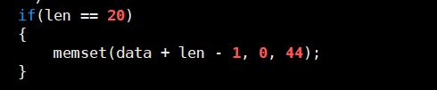
* len이 20일 경우 20만큼 뒤에 44(64 - 20)만큼 0으로 memset을 해줬다

<center> modified code : 1514byte </center>

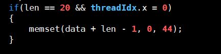
* 64byte일때와 동일하게 진행을 해주었는데 차이점은 thread를 할당해준 것이다
* 원래 44byte를 thread들이 나눠 맡아서 0으로 padding하게끔 해주려했으나 
* 1514byte의 packet size의 경우 94개의 thread를 사용해 47(94 / 2)가 44보다 큰 점, 그리고 44로(또는 를) 나누어떨어지지 않는 점에 의해
* 그냥 하나의 thread가 맡아서 처리하게끔 했다
* Susoon_example에 study_ipsec.cu라는 파일로 저장했다
	* 해당 파일은 원래 fancy에 있던 ipsec.cu에서 주석처리된 부분을 전부 날렸고, 현재 사용하지 않는 함수들도 다 날린 상태이다
___


* 뭔가 계속 정리가 안되는 느낌이었는데 타자로 직접치면서 확인하다보니 정리가 되었다
* 머리속에 떠돌아다니는 생각들이 잡히지 않아서 github에도 못 올리고 있었는데 앞으로는 아예 github에 올리면서 공부를 하는 게 좋을 것 같다
___

## 03/10 현재상황

* 의문점 추가

1. sha1\_kernel\_global을 보면 len이 20일 경우에는 다른 알고리즘이 사용되는데 그 이유를 모르겠음..

<center> len 20 </center>

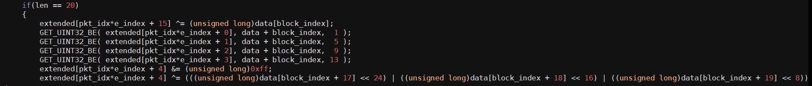

* 현재 코드는 1514B의 packet과 64B의 packet의 경우에 맞춰 구현되어있는데 이를 모든 packet의 size에 대해 적용되도록 코드를 수정해야함
* 하나의 함수로 모든 size의 packet을 nf처리할 수 있는 코드를 짤 수 있을까가 중요
* 64B의 버전과 1514B의 버전을 비교해보면, 차이점이 하나의 packet을 위해 몇개의 thread가 필요하냐이다
* 코드의 차이점이 여기서 오는데, packet당 thread 수를 바꿀 수는 없으니 다른 방법이 필요

1. naive하게 함수 call을 두 번 타고 가게 하는 방법
    * nf\_ipsec이라는 함수를 호출할 때, packet size를 parameter로 받게한다
	* packet size에 따라 thread 수와 array의 크기를 지정해주는 변수값을 다르게 선언해주는 기능을 넣는다
	* sha1\_kernel\_global를 호출하면 그 안에서 packet size에 따라 다른 함수를 호출하게 해준다
		* nf\_ipsec -> sha1\_kernel\_global -> sha1\_kernel\_global\_1514의 형태
	* 그냥 nf\_ipsec에서 packet size에 따라 분기점을 만드는 방식
	* 좋은 방식이 아니라서 어떻게든 합쳐야만 하는데 방법이 없을때만 사용하는 게 좋을듯....

2. parameter 추가 사용
	* 1514B의 버전을 보면 64B의 버전과 함수가 거의 동일하지만 thread\_idx, e\_index, pkt\_idx, block\_index 등 세부적인 index의 조정만 다른 상태이다
	* 이 부분을 이용해서 parameter에 index를 조정해주는 parameter(e.g. mani\_idx)를 넘겨줘서, 이 mani\_idx를 이용해 index의 조정을 하는 방법이다
	* mani\_idx로 어떻게 세부조정을 할 것인가는 더 고민을 해봐야하는 부분이다
		* 간단한 idea는 sha1\_global\_kernel의 1514B 버전에서 pkt\_idx * e\_index라는 부분이 있는데 이는 64B 버전에는 없는 부분이다
		* mani\_idx를 이용해 pkt\_idx를 0이 되게끔 해주면 해당 부분은 64B에서도 동일하게 사용할 수 있다

<center> 1514B version </center>

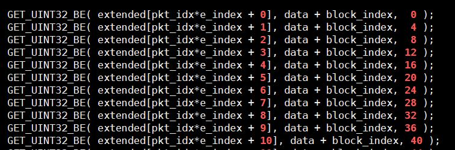

<center> 64B version </center>

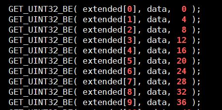

---
## 03/09 현재상황

* fancy의 ipsec.cu의 코드와 github의 gpu sha 코드를 비교하는 중
* 구조를 확인하다보니 의문점이 좀 생겼다

1. sha1\_kernel\_global에 parameter로 정수값 len을 주는데 왜 inner에선 64로, outer에선 20으로 static하게 넘겨주는지?
   * 첫번째 inner padding을 이용한 처리를 할 때는 packet을 64B기준으로 나눠서 처리를 하니 64로 넘겨줌
     * 64B를 다루는 커널이라 사실 나누지는 않지만 1514B 버젼에서도 64로 넘겨주는 것을 통틀어 설명함
   * 두번째 outer padding을 이용한 처리를 할 때는 첫번째 inner padding을 이용한 처리를 한 후 나온 값이 20B이고 이를 처리하니 20으로 넘겨줌
   * Hash function에서 처리해야하는 data의 크기를 넘겨주는 것이니 당연한것
2. sha1\_kernel\_global\_1514에는 e\_index를 사용하면서 왜 sha1\_kernel\_global에는 사용하지 않는가?
   * sha1\_kernel\_global은 64B의 packet을 처리하기 위한 커널
   * 이 때는 하나의 thread가 하나의 packet을 보면 되기때문에 커널 내부에 따로 thread를 분배하는 일이 필요 없음
   * 1514B의 버젼에서는 여러개의 thread가 하나의 packet을 나누어서 봐야하기 때문에 분재하는 과정이 필요함
   * 그래서 나눔
3. sha1\_kernel\_global\_1514에는 pkt\_idx를 사용하는데 그 이유는?
   * 2번의 내용과 관련이 있는데, 64B의 packet은 하나의 thread가 하나의 packet을 보다보니 지정된 자리만 보면 됨
     * 현재 내가 보고 있는 코드에 한해서
     * 변경 예정
   * 그래서 어떤 packet을 보는지는 알려줄 필요가 없음
   *  1514B의 packet은 여러개의 thread가 하나의 packet을 보다보니 어떤 packet을 봐야하는지도 알려줘야 thread가 모여서 packet을 처리해줌
   * 그래서 필요
4. sha1\_kernel\_global\_1514에서 data + block\_index를 하는 이유?
   * 2, 3번과 유사한 이유
5. github 코드에는 unsigned long W으로 되어있는데 fancy에는 uint32\_t W로 되어 있음. size가 달라도 무관한가?
   * 미해결
6. sha1\_kernel\_global\_1514에서 total\_threads의 값이 24로 fix되어있음(아예 total\_threads라는 변수가 없고 그 자리에 24라는 값이 static하게 들어감)
   * 왜 thread 수를 24로 줬는지는 찬규형 github을 봐야할듯
7. ipsec이랑 nf\_ipsec\_64의 차이는?
   * ipsec이 기존 cpu에서 sha1을 하던 코드를 그대로 gpu에 포팅한 것
   * 옛날 거라는 뜻


## 03/04 현재상황

* 그냥 code를 고쳐서 출력값이 조금 더 이뻐지게 만들었다


<center> improved output </center>


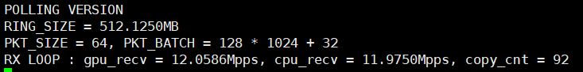

* 1초 주기로 화면이 갱신되며 현재 test 실행 상태를 알려준다
* 찬규형 output화면처럼 깔끔하고 보기 쉽게 만들고 싶어서 수정해봄...


## 03/02 현재상황

### Additional Test

* 64B와 128B의 추가적인 test를 진행하였다


<center> test result </center>


* 비교를 위해서 1024 * 2개의 batch부터 캡쳐를 했다
  * 1024 * 32보다 작은 batch 개수의 test는 thread를 512개 사용할때의 값이었어서 thread를 64개 사용할때의 값을 다시 측정해서 캡쳐사진 수정함
* 64B와 128B 두 size 모두 max pps를 찍고 다시 떨어지는 모습을 보여준다
* 이는 cudaMemcpy의 호출 횟수가 반으로 줄었지만 줄어든 횟수가 100보다도 작은 값이기 때문에 latency에 큰 영향을 미치지 못했기 때문으로 추측된다
* 호출 횟수의 영향이 줄어들어 copy하는 size의 영향이 더 크게 작용하게 되어 속도가 점점 줄어들게 되는 것으로 보인다 
* 다만 여기서 64B의 1024 * 512개 batch와 128B의 1024 * 256개 batch test는 값의 신뢰성이 없다
  * 그 이유는 cudaMemcpy가 제대로 진행되지 않았기 때문이다
  * 다음의 캡쳐 사진에서 확인할 수 있다


<center>  cudaMemcpy error </center>


* 64B를 1024 * 512개 batch했을 때의 실행 결과이다


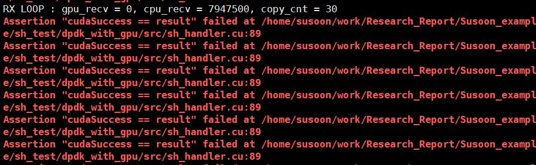

* 128B를 1024 * 256개 batch했을 때의 결과이다


* 모두 cuda관련 함수 호출에 실패한다
  * cudaMemcpy, cudaStreamCreate, etc...
* 64B의 1024 * 512개 batch면 32MB의 size인데 이 이상의 copy는 gpu가 버거워하는 것 같다
  * 왜 실패하는 건지는 모르겠다
  * 일정 이상의 size는 copy가 안되나?
  * copy가 안되면 다른 함수(e.g. cudaStreamCreate)는 실행돼야하는 거 아닌가?

---

### Pthread Test

* pthread를 통해 만들어진 thread가 기존 core와 같은 core에 할당되는지 새로운 core에 할당되는지에 대한 실험을 진행함


<center> test code </center>


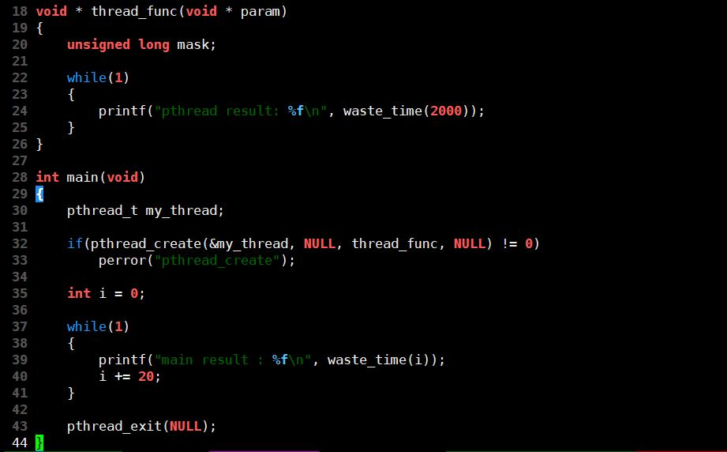

* main함수와 thread\_func에서 각각 infinite loop를 실행시키되 main함수의 경우 i값이 증가됨에 따라 점진적으로 core 사용량이 증가되게 만듬
* 만약 기존 core에 할당되었다가 core 사용량의 증가량에 의해 다른 core로 이전되는 방식이라면 program 시작시 하나의 core만 작동해야함


<center> result </center>


* cpu3과 cpu6 모두 11.0으로 하나의 core에서 작동가능한 수준을 사용하고 있으나 서로 다른 core에서 작동함을 알 수 있음
  * main함수는 점진적으로 사용량이 증가하고,  thread_func는 사용량이 고정되었는데 둘의 cpu 사용량이 같은 이유는 둘 모두 infinite loop이기 때문으로 추정됨
    * main함수의 사용량이 점진적으로 증가할 필요가 없었다...
* 위의 결과로 인해 pthread가 thread를 기존과 다른 core에 할당함을 알 수 있음


---

### ~~Core Seperation Test~~

---

* 원래 dpdk가 master core와 slave core 두개를 사용해서 core가 2개 사용되는데 이걸 간과하고 test를 진행해버림
* 무의미한 실험이 되었음
* pthread를 통해 만들어진 thread가 같은 core에 실행되는가 아니면 새로운 core에 할당되어 실행되는가에 대한 실험을 추가적으로 진행하였음
  * 이를 통해 persistent loop가 dpdk와 다른 core에 실행된다는 것을 알아냄
* 아래의 test 결과들은 무의미한 실험이지만 결과만 기록해둠
  * markdown 정리시 삭제 예정

---

* persistent loop를 사용하여 gpu를 monitor하는 code로 수정 후 cpu의 사용상태를 check 해봤다


<center> cpu status with persistent loop </center>


* 3개의 core를 쓰는 것을 확인할 수 있다
  * 0번 core는 dpdk master core
  * 1번 core는 dpdk slave core
* pthread가 다른 core에서 실행되는 thread를 만들어주었음을 알 수 있다
* 아래의 code는 기존 main.c의 code이다


<center> main.c code </center>


* code를 다음과 같이 수정해 test를 진행하였다


<center> main.c code with core coalescing  </center>


* core\_mask를 2로 주어 1번 core에 monitor thread를 강제적으로 할당해 2개의 core만을 사용하게끔 했다

* 64B와 128B의 packet size를 사용했고, 256개의 batch\_size를 사용했다


<center> pps with core seperation </center>


* monitor하는 thread를 새로운 core에서 실행하는 기존 코드로 64B를 256개 batch하였을 때의 test 결과이다


* 동일한 code로 128B를 256개 batch했을때의 pps이다


<center> pps without core seperation </center>


* monitor하는 thread를 새로운 core에서 실행하는 기존 코드로 64B를 256개 batch하였을 때의 test 결과이다


* 동일한 code로 128B를 256개 batch했을때의 pps이다


---


* dpdk의 persistent loop과 copy\_to\_gpu를 통한 gpu memcpy가 서로 같은 core에서 실행되는지 확인해보았다

* sched\_setaffinity함수를 사용하여 분리했다


<center> code for seperation </center>


* 아래는 코드 수정 전 후의 cpu status이다


<center> cpu status before seperation </center>


<center> cpu status after seperation with core mask 1 </center>


* cpu를 분리하는 code를 삽입하니 cpu 하나에 몰렸다
* 분리하는 code를 삽입하였는데 왜 하나의 cpu만 작동하는지 고민하다가 core\_mask를 2로 줘서 copy\_to\_gpu가 1번 cpu에 돌게 했더니 다음과 같은 결과가 나타났다


<center> cpu status after seperation with core mask 2 </center>


* copy\_to\_gpu가 원래 cpu 1번에서 실행되고 있고, dpdk loop가 0번에서 실행되고 있어서 copy\_to\_gpu를 0번에 할당하니 하나로 돌게 된 것이다

* 위의 결과를 통해 copy\_to\_gpu와 dpdk의 loop가 서로 다른 core에서 실행되고 있었다는 것을 알게되었다
* 아래는 core를 분리하기 전과 후의 pps이다
* test는 64B와 128B의 packet size를 사용했고, 각자 최대의 pps를 보여줬던 1024\*8개의 batch(64B)와 1024\*2개의 batch(128B)에서 test했다


<center> pps with two cores </center>


* 64B를 1024 \* 8개 batch했을 때의 pps이다


* 128B를 1024 \* 2개 batch했을 때의 pps이다


<center> pps with one cores </center>


* 64B를 1024 \* 8개 batch했을 때의 pps이다


* 128B를 1024 \* 2개 batch했을 때의 pps이다


* pps가 50%정도로 떨어진 것을 확인할 수 있다


---

## 02/28 현재상황

### kernel launch

* dpdk.c에서 copy\_to\_gpu를 호출하면, copy\_to\_gpu에서 직접 gpu kernel을 호출하여 packet 개수를 count하게끔 code를 수정함
* 이를 통해 pps가 더 떨어질 것이라고 예상함
  * 또다른 thread를 통해 dpdk.c와 독립적으로 count를 해주면 dpdk를 담당하는 core가 할 일이 적어지므로 더 빠름
  * 이를 dpdk.c가 gpu kernel을 통해 packet의 copy가 정상적으로 진행되었는지 확인하고, packet의 수까지 count하게 바꾸었으니 core가 할 일이 많아져 더 느려져야함


<center> kernel launch test result table </center>


* 위의 표를 보면 64B를 제외한 나머지 packet size의 경우 pkt-gen이 보내주는 pps만큼 받아줄 수 있다는 것을 확인할 수 있다


<center> kernel launch test rx rate result </center>


* 위의 graph는 gpu가 받은 rx pps를 pkt-gen에서 보내준 pps로 나누어 받은 packet의 비율을 나타낸 것이다
* 64B의 경우 100% 모든 packet을 받은 경우가 없었지만 그 외의 size의 경우 100% 모든 packet을 받는 경우가 존재했다
* 모든 packet size가 100%의 packet을 받는 경우는 없었다
  * 모든 packet size를 수용할 수 있는 batch 개수는 32부터 1024개까지이다
  * 128B가 100%의 packet을 수용하려면 1024 * 2개의 batch가 필요하다
  * 256B 이상의 packet size의 경우 512나 1024개의 batch size가 필요하다
* 64B의 경우 어제의 test 결과에서도, 이번 test 결과에서도 다른 size와는 조금 다른 특징을 가졌다
  * 어제의 test에서는 batch 개수 증가에 따른 pps 증가량이 달랐음
  * 이번 test에서는 100%의 packet을 수용하지 못한 유일한 packet size임

* 원래는 64B size만 10Mpps를 넘는 속도로 pkt-gen이 보내주기 때문이 아닐까라고 추측을 했었다
* packet을 보내주는 개수가 압도적으로 많으니 cpu가 따라가지 못한다는 가설을 세웠다
* cudaMemcpy call의 횟수를 보면 가설이 틀렸음을 알 수 있다


<center> cudaMemcpy call count </center>


* packet을 보내주는 수가 많아서 다른 특징을 보이는 거라면, 결국 cudaMemcpy나 gpu kernel의 호출 횟수가 달라서 다른 특징을 보이는 것이라는 얘기가 된다
* 당연한 얘기지만 call count table을 보면 64B의 cudaMemcpy의 호출 횟수가 점점 줄어듬을 알 수 있다
  * copy\_to\_gpu 한 번 호출 당 1씩 증가시켰으므로 gpu kernel도 동일한 횟수로 불렸다
* 이를 통해 알 수 있는 것은 cudaMemcpy의 호출 횟수가 줄어들었으므로 cudaMemcpy의 latency가 줄어들었다는 얘기가 된다
* 이는 어제의 test 결과로 추측해보았을때 cudaMemcpy의 overhead로 인한 pps 감소 외에 다른 요인이 있다는 결론이 나온다
* 여기서 의문점은 그렇다면 왜 64B에서만 이러한 특징이보이는 가이다


#### 64B만 저런 특징이 보이는 이유

* 64B는 10Mpps를 넘기는 유일한 size이다
* 위의 분석에서는 cudaMemcpy에 대한 overhead만 신경쓴 상태
* 실제로 dpdk가 packet을 gpu에 넘겨주는 과정은 NIC에서 packet을 \"받아서\" 넘겨준다
* 그렇기 때문에 dpdk가 NIC에서 packet을 받아오는데 걸리는 시간도 고려해야한다
* cpu가 NIC에서 10Mpps 이상의 속도로 packet을 받아오려면 그에 맞게 core 사용을 할당해야한다
* dpdk는 항상 32개 이하의 packet만 batch해서 가져오므로 여기서 overhead가 발생
* 이 때문에 pps가 100%를 못 찍는다


### 앞으로의 방향

* 찬규형이 slack에 올린 부분을 test해봐야한다

---


1) gpu가 nf 처리를 하면서 다른 application까지 돌리려면 지금처럼 gpu memory를 2GB나 쓰면서 packet을 받아줄 수는 없다
  * K4000 기준 gpu memory 3GB
* 그렇기 때문에 batch해주는 packet의 수를 일정량 이상 높일 수 없기 때문에 100%pps를 보장해줄 수 없다
2) gpu가 하나의 thread block에 1024개의 thread를 넣어줄 수 있다
* 그래서 gpu가 한 번에 처리할 수 있는 packet의 수는 1024개
* 1024개 이상의 packet을 batch해서 넣어주면 gpu는 순차적으로 1024개씩 처리해줄 수 밖에 없다
  * e.g.) 1024 * 2개의 packet을 batch해주면 gpu는 한 번 copy로 받은 packet을 처리해주기 위해 1024개의 thread를 두번 돌려야한다
* 이 말은 1024개 이상의 packet을 batch해서 넘겨주면 gpu가 감당할 수 없다는 뜻이다
3) cpu core에 부하를 줬을 때의 pps 확인이 필요하다

---

* 위의 내용을 확실하게 해주기위한 test가 필요하다
* 받은 packet을 다시 보내주기 위해서는 header를 바꿔주는 작업은 필수다
  * nf처리를 안 한다고 가정했을 때 최소한 header는 바꿔줘야 재전송을 할 수 있으니
* 받은 packet에 대해서 header를 바꿔주는 code를 짜서 실행시켜보고 결과를 뽑아봐야함
* 최대 1024개의 thread를 할당할 수 있고 현재 512개의 thread를 사용하고 있으니 512개의 packet을 batch해서 header를 바꿔줬을 때의 pps와 thread 개수와 batch하는 packet의 수를 1024로 늘려줬을 때의 pps를 확인해봐야함
* cpu core에 부하를 줬을 때의 pps 확인의 경우 현재 test한 결과를 미루어보았을 때 gpu의 rx pps와 cpu의 rx pps가 유사한 것을 근거로 제시할 수 있다
  * test 결과 표는 gpu의 rx pps이지만 cpu의 rx pps도 유사한 값을 나타낸다
* cudaMemcpy를 호출하고 kernel을 launching하는 과정에 cpu core에 부하가 오고, 이 때문에 cpu도 packet을 pkt-gen이 보내주는 만큼 받을 수 없다
* 이는 같은 cpu core에서 진행하는 일이니 dpdk가 cpu의 영향을 많이 받는 다는 것을 보여준 셈이다
* 따라서 추가적인 test는 필요없어보인다
  * test를 진행한다면 thread를 하나 파서 또다른 core에 할당한 다음 그 thread상에서 cudaMemcpy와 kernel launching을 해주게 한 후 pps를 확인하는 것
  * cudaMemcpy와 kernel launching이 dpdk가 NIC에서 packet을 받아오는 것과 독립적으로 실행되니 cpu의 pps가 떨어지지 않을 것이고 이를 보이면 지금까지의 test 결과의 대조군으로써 위의 결과를 입증해줄 것이다


---

## 02/27 현재상황

### 현재까지 test 결과 분석

#### 1) rx pps

<center> pps table </center>


* packet size보다 batch하는 packet의 수에 더 큰 영향을 받음
  * 마지막 analysis에서 자세히 설명
* 32개를 batch 했을 때 64B, 128B, 256B, 512B의 경우 pps가 1.9Mpps로 동일함
  * 최대 pps가 1.9Mpps를 넘는 case들임
* 64개를 batch 했을 때 64B, 128B, 256B의 경우 pps가 3.8Mpps로 동일함
  * 역시 최대 pps가 3.8Mpps를 넘음
* 128개를 batch 했을 때부터 모두 다른 pps를 보임
* 예상대로라면 64B size의 packet을 128개 batch했을 때, 5.8Mpps수준으로 128B size의 packet과 동일한 pps를 보여야하지만 더 높은 pps를 보임
  * 96개를 batch했을 때 5.8Mpps 정도를 보임
  * 이유는 아직 모름...


#### 2) cudaMemcpy

* 같은 횟수의 cudaMemcpy를 시도할 때 copy하는 size가 크면 클 수록 latency가 더 커짐
* 같은 size를 copy할 때 copy하는 횟수가 잦으면 잦을 수록 latency가 더 커짐

<center> memcpy test graph </center>


<center> memcpy test table </center>


* 횟수에 의한 latency 증가폭이 size에 의한 latency 증가폭보다 훨씬 커서 최대한 적은 횟수의 cudaMemcpy 호출이 이득임
  * 하지만 64K의 gpu page 크기 이상을 copy하는 경우 1번 호출하여 전체를 copy하든지 page 크기 이상으로  n번에 나누어서 호출하든지 여러개의 page를 호출해야한다는 점에서 같은 overhead가 발생하여 횟수에 의한 latency 증가폭이 미미해짐
* 100번 loop를 돌린 경우가 한 번만 돌린 경우에 비해 latency가 조금 적다
  * 이는 cudaMemcpy를 할 때 aggregation해서 copy하는 가에 대한 추측을 할 수 있게 한다
* same size test에서 64 * 1024 * 2B 이상의 case를 확인해보면 latency 차이가 거의 미미하며, 심지어 64 * 1024 * 32B보다 작은 case의 latency가 더 작은 경우가 있음을 확인할 수 있다


<center> cudaMemcpy call count table </center>


* packet size별, batch 개수 별 cudaMemcpy 호출 횟수이다
* 최대 호출 수가 60000번 가량으로 보이며 그 이상의 호출은 CPU가 수용 불가능해보인다
* cudaMemcpy의 최대 호출 수가 정해져있어 32개의 batch case의 경우 1.9Mpps가 나오게 된다


#### 3) analysis

* 같은 size를 gpu memory에 copy할 때,  cudaMemcpy를 한 번  호출하여 한 번에 올리는 것이 여러번으로 나누어 copy하는 것보다 더 빠르다는 test 결과를 도출해냄
  * same size test
* packet size별 batch size에 따른 pps를 test한 결과를 살펴보면, 32개를 batch한 경우, 64B, 128B, 256B, 512B의 pps가 같다는 점에 의문을 품었으나 해결했다
* 이것의 원인은 same size test의 결과 때문이다
* 1.9Mpps가 나왔다는 것은 1초에 호출 가능한 cudaMemcpy의 횟수가 정해져있다고 볼 수 있다
* 위의 호출 횟수 표를 보면 32개의 batch를 한 case는 60000번 가량의 cudaMemcpy를 호출하는데 이게 CPU가 수용가능한 최대 호출 횟수인 것 같다
* 그 이후로 batch 개수가 늘면 cudaMemcpy 호출 횟수가 줄어듬을 볼 수 있다
  * 이로 인해 pps는 올라간다
* batch하는 packet의 수를 1024개로 맞춰주면 모든 packet size에서 최고 속도를 낼 수 있다
* normal data의 경우 latency 증가폭이 매끄럽지 않은데 이는 caching의 영향으로 추측중이다


---

### memcpy test code 수정


* code를 수정하였다
* 원래는 caching effect를 없애보려고 수정하였으나 의도대로 되지 않은 것 같다...
* random case의 경우 random index를 가져올때 범위 밖으로 벗어나는 경우가 없게 수정하였다
* 어제의 test의 경우 size를 기준으로 오름차순의 경우만 test를 해보았는데 code를 수정하면서 내림차순의 test도 가등하게 해보았다
* 결과는 유사했고, test시 첫번째 실행되는 size의 경우만 latency가 조금 더 높게 나왔다

<center> ascending order test </center>


* 오름차순으로 test를 진행한 결과값과 graph이다


<center> descending order test </center>


* 내림차순으로 test를 진행한 결과값과 graph이다

* 값의 큰 차이는 보이지 않으며, caching이 어디서 진행되었나에 따라서 latency 값이 튀는 부분만 조금씩 달라진다고 추측할 수 있다
* same size test의 경우에는 descending과 ascending 모두 동일하게 나왔다


## 02/26 현재상황

* cudaMemcpy를 할 때 생기는 latency가 copy해주는 size에 더 큰 영향을 받는지, cudaMemcpy를 호출하는 횟수에 더 큰 영향을 받는지, 각각 어느정도의 latency를 가지는지에 대한 test를 진행하였다.

<center> cudaMemcpy test values </center>


* 위는 test로 얻은 latency를 정리해놓은 것이다
* once라는 것은 같은 size의 cudaMemcpy 호출을 한 번 실행하여 test한 것을 의미한다
* 100 times loop라는 것은 cudaMemcpy 호출을 100번 연속해서 실행하여 test한 것을 의미한다
* random data라는 것은 copy해주는 data를 random한 data로 사용했음을 의미한다
* normal data라는 것은 copy해주는 data를 non-random한 data로 사용했음을 의미한다
* 각 data의 size는 64B packet부터 1514B packet까지, 그리고 64 * 32B부터 64 * 1024 * 32B까지 dpdk test에 사용했던 batch size를 사용했다
* 각 test는 100번 시행하여 latency의 평균을 내어 data로 사용했다.

<center> graph for cudaMemcpy test </center>


* 위의 graph는 표의 data들을 시각화한 것이다
* 이를 통해 알 수 있는 것은 size가 커짐에 따라 latency가 증가했다는 것이다
* 또한 once의 경우 100 times loop의 경우보다 latency의 증가폭이 크며, 최대 size인 64 * 1024 * 32B의 경우 once의 경우가 100 times loop의 경우보다 눈에 띄게 높은 latency를 가짐을 확인할 수 있다
* 반면 random data와 normal data 간의 차는 눈에 띄게 벌어져있지 않다

* graph를 통해 알 수 없는 것들도 있다
	* 1) code 구조상 once를 측정하는 경우, size가 작은 case부터 큰 case까지 순차적으로 한번씩 cudaMemcpy를 호출해준다
	* host\_buf라는 배열의 순차적으로 훑으면서 data를 copy해주며 test를 진행하였다
		* 이 때문에 indexing을 하여 caching의 영향을 받아 latency의 증감이 매끄럽지 않다
			* 이는 data 표를 보면 확인할 수 있다
		* 이는 normal data의 유효성이 의심되는 부분이다
	* 2) 64 * 1024B의 size를 기점으로 latency가 2배씩 상승하는데 이는 gpu의 page가 64K인것과 관련이 있어보인다

<center> data for cudaMemcpy same size test </center>


* 위의 data 표는 같은 size를 copy할때의 latency를 측정한 표이다
	* 같은 size를 copy한다는 것은, 최대 size인 64 * 1024 * 32B를 copy하기 위해서, cudaMemcpy를 여러번 호출하였을 때의 latency를 측정한 것이다
	* e.g.) 최소 size인 64B는 64 * 1024 * 32B를 copy하기 위해서 cudaMemcpy를 1024 * 32번 호출한다
* 이 전의 표와 동일하게 각 test는 100번씩 실행하여 latency를 평균낸 것이고, 각 size는 packet size와 batch size이다

<center> graph for cudaMemcpy same size test </center>


* 위의 graph는 data 표를 시각화한 것이다.
* cudaMemcpy의 호출이 잦아질수록 latency가 급격히 증가함을 알 수 있다
* 이 증가폭은 첫번째 test의 증가폭과는 비교도 안 될만큼 큰 데, 이를 통해 copy하는 size보다, cudaMemcpy의 호출 횟수가 latency에 더 큰 영향을 미친다는 것을 알 수 있다

* 다만 random data의 64 * 1024B(이하 64K) 이상의 경우 표를 확인해보면 32 * 64K를 한 번에 copy하는 것과 64K와 4 * 64K를 copy하는 것은 latency가 거의 동일하고, 심지어 2 * 64K와 8 * 64K, 16 * 64K를 여러번 copy해주는 것이 더 빠르다는 것을 볼 수 있다
* 수치가 거의 비슷한 것을 보면 64K이상의 data copy는 어차피 gpu page를 여러개 가져와서 copy해줘야하기 때문에 더 이상 latency가 감소하기 힘들다는 것을 추측할 수 있다


### 결론

* cudaMemcpy는 copy하려는 size가 크면 클 수록 latency가 크고, 호출 빈도가 잦을수록 latency가 커진다
* 하지만 그 증가폭은 호출 빈도에 의한 증가폭이 훨씬 높으며, 이를 통해 호출 빈도가 latency에 더 큰 영향을 미침을 알 수 있다
* 또한 gpu page size 이상의 data는 어차피 gpu page size로 쪼개서 copy해줘야하기 때문에 cudaMemcpy를 한번 호출해서 copy해주나 여러번 호출해서 copy해주나 거의 비슷한 latency를 보인다

---
* packet size별로 batch 개수에 따른 pps변화를 알아보고 있다
* test 중 의아한 점이 생겨서 원인 파악중

<center> packet size : 64B, batch num : 32 </center>


<center> packet size : 128B, batch num : 32 </center>


<center> packet size : 256B, batch num : 32 </center>


<center> packet size : 512B, batch num : 32 </center>


* packet size가 각각 다른데 batch 개수가 같으면 속도가 동일하다
* 이것이 매우 의심스러운 점인 게 각각 최대 pps도 다르고, packet size도 다르니 batch했을때의 size도 다르다
* 그런데 속도는 동일하다
* 원래 가설대로라면 batch size가 같아도 packet size가 다르면 총 batch size가 달라서 copy overhead가 더 들어가니 더 속도가 떨어져야하는게 맞다
* 지난번 실수처럼 gpu에 copy하는 과정에 모든 packet을 copy하지 않는다든가 하는 오류가 있을 수 있다
* 현재 512B의 packet까지 test한 상태이며, pps의 기록은 batch\_size\_text.xlsx 파일에, 각 test 결과 캡쳐사진은 image/batch\_test/ 안에 packet size별로 정리되어있다

* 이 part의 의문 해결은 02/26 시작부분에 서술되어 있다

---
## 02/25 현재상황

### copy 문제 해결 전


* packet size별로 최대 pps가 나오는 batch size의 범위를 구해봄

<center> range of batch size </center>


* 범위는 위의 캡쳐와 같다
* 사실상 upper bound는 없다고 봐도 무방할 것 같으며, lower bound가 각자 다르다는 것을 알 수 있다.
* 하지만 총 memory 양을 계산해보면 64~1024B까지의 packet들은 batch하는 memory는 같다(2^15B = 1024 * 32B = 32MB)
* 32MB만큼만 batch해서 GPU에 copy해주면 속도면에서 감소는 0.1~0.2Mpps 미만으로 나온다
* 위의 내용들은 잘못된 정보임
  * batch해서 모은 packet들이 gpu에 제대로 copy가 되고 있지 않았음

---

### copy 문제 해결 후

<center> fixed copy_to_gpu </center>


* cudaMemcpy에서 sizeof(unsigned char) * size만큼 copy를 해주고 있었다.
* 이때 size는 dpdk.c에서 batch해서 모은 packet 수였다
* 하지만 변수명이 size이다보니 packet 수에 packet size가 곱해진 총 batch된 size를 말하는 줄 알고 그냥 곱해서 copy해주고 있었음
* 그래서 모든 packet이 copy되고 있지 않았다
* 변수명을 pkt\_num으로 바꿔주고 PKT\_SIZE를 곱해서 정확한 batch된 size만큼 copy를 해주어 모든 packet이 copy되게 하였다
* 그 이후 64B packet으로 test한 결과이다


<center> batch packet number : 512 </center>


<center> batch packet number : 1024 </center>


<center> batch packet number : 1024 * 32 </center>


* send한 packet 수는 13.8~14.0Mpps였다.
* 1024개를 batch했을 때가 가장 속도가 빨랐으며 13.5Mpps로 0.3~0.5Mpps정도 떨어졌다
* 1024를 기준으로 더 적게 batch 했을 때와 더 많이 batch 했을 때 모두 속도가 떨어졌으며 더 적게 batch 했을 때 속도가 더 많이 떨어졌다
* 하지만 여전히 copy overhead로 인한 속도차가 적긴하다


---

## 02/24 현재상황

* gpu에서 infinite loop를 돌려서 그 외의 code에서 gpu에 어떤 명령도 걸 수 없음
* 그래서 gpu에서 loop를 돌리는 게 아니라 cpu에서 loop을 돌고 그 내부에 gpu를 check하는 코드를 넣음


<center> gpu monitoring code </center>


* gpu\_monitor가 packet buffer를 check하고 atomicAdd로 count를 올려주는 함수
* gpu\_monitor_loop가 cpu에서 loop를 돌면서 gpu\_monitor를 호출해 packet buffer를 check하고 atomicAdd로 count를 올려줌

---

### pps가 낮게 나오는 것 수정 전


<center> execution result </center>


* 실행 결과를 보면 rx_pkt_cnt가 rx_cur_pkt에 잘 복사되어 값이 나오는 것을 알 수 있다
* 5.8Mpps정도 나오는데 이 값이 복사는 잘 된 거 같지만 값 자체가 유의미한지는 의심된다.
  * 12번째를 보면 갑자기 1.7Mpps가 나온다
  * send하는 쪽은 13.8Mpps정도로 찍어주는데 5.8Mpps밖에 안나오는 건 너무 적다
* 수정함

---

### pps가 낮게 나오는 것 수정 후 & if문 condition 수정 전


<center> gpu test success </center>


* macro를 잘못 넣어줘서 생긴 문제여서 macro를 알맞게 넣어줌
* send하는 쪽에서 pps가 12.9Mpps 정도 나옴
* 보내는 만큼 거의 다 받음
* 7번째를 보면 가끔씩 1/3정도로 떨어지는 때가 있음
* 5번에 한번씩 저렇게 떨어짐
* 저게 copy에 대한 overhead인 부분인 거 같음

---

### if문 condition 수정 후 & memcpy 수정 전


<center> execution result </center>


* 13.8Mpps로 send에서 보내준 만큼 나옴
* 원인은 uint64_t인 start와 end의 차가 int인 macro ONE_SEC와 비교되다보니 type conversion을 하는 과정에서 문제가 발생한 것이었음
  * 이와 관련된 test는 다음 장에
  * 수정 후 해결
* copy\_to\_gpu가 제대로 실행 된다면 13.8Mpps가 나올 수 없음
  * copy overhead때문에
* 추측상 dpdk.c의 buf를 structure에서 unsigned char*로 변환하는 과정에 문제가 있음


<center> buf type conversion </center>


* buf는 structure 배열이고 ptr은 unsigned char 배열인데, 첫번째 줄은 buf의 packet data만 뽑아서 ptr에 대입해주는 명령이다
* 이 과정에서 buf에 저장된 모든 packet들의 data를 contiguous하게 가지는 pointer를 넘겨주는 것이 아니라, buf[0]의 packet data를 가리키는 pointer를 넘겨줌
  * 실제로 모든 packet data를 contiguous하게 저장하지 않음
* 이로 인해 첫번째 packet의 data만 제대로 copy되고 나머지 자리에는 0만 들어감


<center> copy result </center>


* 두번째 packet자리가 다 0임을 확인할 수 있다
* 이 부분은 수정 필요


---

### type conversion test

* 다음은 uint64_t의 자료형을 가지는 num64와 int의 자료형을 가지는 num 간의 type conversion을 test한 것이다
* LARGE case는 2^50 + 2^30 + 2^10을 대입한 case이고,
* MID case는 2^30 + 2^10을 대입한 case,
* SMALL case는 2^10을 대입한 case이다


<center> LARGE case without any explicit type conversion </center>


<center> MID case without any explicit type conversion </center>


<center> SMALL case without any explicit type conversion </center>


* 어떤 explicit type conversion도 없이 implicit type conversion의 결과를 보기위해 한 test의 결과이다


<center> LARGE case with explicit type conversion to int </center>


<center> MID case with explicit type conversion to int</center>


<center> SMALL case with explicit type conversion to int</center>


* num64를 int로 type conversion해서 나온 결과이다


<center> LARGE case with explicit type conversion to uint64_t</center>


<center> MID case with explicit type conversion to uint64_t</center>


<center> SMALL case with explicit type conversion to uint64_t</center>


* num을 uint64_t로 type conversion해서 나온 결과이다


<center> LARGE case with inequality</center>


<center> MID case with inequality</center>


<center> SMALL case with inequality</center>


* 대소비교 test를 진행한 결과이다


* 뺄셈을 test한 결과로는 implicit type conversion은 uint64_t로 된다는 것을 알 수 있다
* 대소비교 test를 진행한 결과로는 int 범위를 넘어가는 값을 대소비교 하게되면 true, false가 잘못된 값이 나올 수 있다는 것이다.

---

### memcpy 수정 후


<center> dump in cpu </center>


<center> copy in gpu </center>


* gpu와 cpu에서 모두 제대로 packet이 copy 되었음을 알 수 있다


---

### packet size별 pps 확인


* packet size별로 최대 pps가 나오는 최대 batch size를 찾는 test를 진행하고 있다
* 그런데 최대 size로 키워도 속도가 떨어지지 않는다
* 최대 packet size인 1514B로 1514개를 batch로 받아 실행해보았다


<center> Packet size : 1514B, Batch size : 1514 pps </center>


<center> gpu status </center>


* GPU memory를 2GB정도 사용하면서 check를 진행하는데 속도가 정상적으로 나왔다
  * send(pkt-gen) : 8.1Mpps, receive(dpdk) : 8.1Mpps
* copy가 정상적으로 되고 있음에도 속도가 너무 잘 나온다
* copy가 진짜 정상적으로 진행되고 있는지 확인이 필요함
  * packet 받은걸 fprintf로 어딘가에 저장해서, gpu에서 copy한 packet들과 비교하는 코드를 짜서 packet 받고 비교해봐야할듯

---


## 02/22 현재상황

* 여전히 gpu\_monitoring\_loop 때문에 다른 gpu코드가 작동을 못함
* 그래서 test를 위한 코드를 따로 짜서 확인해봄


<center> thand.cu file </center>


* thand.cu 파일의 코드 전문
* dpdk나 다른 기능을 빼고 gpu에서의 infinite loop와 loop내의 atomicAdd를 통한 값 변화, cpu에서 이 변한 값을 가져와 출력하는 infinite loop만 넣은 상태
* pthread로 multithread를 돌려봤지만 제대로 실행되지  않음


<center> execution </center>


* 이런 형태로 count 값이 전혀 전달받지 못함
* cpu에서 값을 받지 못해 계속 0만 출력
* synch문제로 cudaMemcpy가 실행되지 않는 듯함


<center> dpdk_gpu_test execution </center>


* dpdk_gpu_test 파일을 실행시켜 나온 결과
* 5번째까지는 packet을 gpu에 넣기 전이라 0으로 memcpy되지만 6번째에 84180992라는 값은 이전까지 count된 rx packet 수가 그 전까지 cpu에게 전달이 안 되다가 한번에 전달되어 출력된 수로 추측됨
* 이 말은 저때까지는 copy\_to\_gpu 내의 memcpy와 get\_rx\_cnt의 memcpy가 제대로 실행이 되며 gpu\_monitoring\_loop내의 loop도 제대로 실행이 되었다는 뜻
* 그 이후로는 30초 정도 멈춰있다가 cudaMemcpyLaunchTimeout이 발생
* gpu에 과부하가 걸리는 건지 잘 모르겠음
* packet 전송 속도를 0.001%로 해서 초당 200개 미만의 packet을 보내면 조금 더 오랫동안(20~30번 정도?) packet을 count하다가 같은 증상을 보임


## 02/21 현재상황

* gpu에서 gpu\_monitoring\_loop을 돌리면 다른 gpu코드가 작동을 못함
* synch 문제인 거 같음


<center> gpu monitoring loop </center>


* code를 위의 사진처럼 수정함
* #if 0으로 수정해 놓은 부분은 loop를 뺐을때 작동을 어떻게 하는지 보기 위함
* 찬규형의 monitoring loop을 참고함
* 두번째 #if 0 밑에 if(rx_pkt_buf[mem_index] != 0)부분이 packet buffer의 변화를 확인하는 부분
* 각 thread가 buffer에서 맡은 부분을 확인하고 밑의 atomicAdd로 packet 수를 count함
* 이를 dpdk.c가 받아감
* dpdk.c에서 thread를 하나 따로 파서 이를 확인하는 loop를 돌게 해야할 거 같음


## 02/20 현재상황

* gpu에서 시간을 재면서 packet 수를 check한 게 아니라서 다시 코드를 짬


<center> gpu monitoring loop </center>


* gpu에서 packet buffer를 polling 하는 loop
* 원래 의도는 copy\_to\_gpu를 통해 dpdk.c가 flag를 true로 바꿔주면 packet이 들어왔다는 신호로 인식하고 packet을 manipulate하면서 rx_pkt_cnt를 count해주려했음


<center> getter for rx packet count and tx packet buffer </center>


* dpdk.c 에서 위의 함수를 1초마다 불러서 gpu\_monitoring\_loop가 rx_pkt_cnt와 tx_pkt_buf를 채워주면 그 값을 가져가고 0으로 초기화해주는 역할을 하는 함수


* 현재 위의 두 함수 모두 제 기능을 못하는 상태
  * 원인 1)
    *  gpu\_monitoring\_loop가 무한루프임
    * 이 때문에 copy\_to\_gpu나 get\_rx\_cnt, get\_tx\_buf 같은 gpu의 resource를 필요로 하는 함수들이 무한루프에 밀려 기능을 못함(cudaErrorLaunchTimeout을 리턴함)
    * 그래서 gpu memory에 packet이 올라가지 않으니 gpu\_monitoring\_loop도 일을 안함
    * 위의 내용들이 반복됨
  * 원인 2)
    * dpdk.c에서 tx\_pkt\_buf를 받아 tx\_buf라는 rte\_mbuf 구조체 포인터 배열에 copy해 넣고 이를 transmitt함
    * 그 이유는 rx와 tx packet 모두 하나의 변수에 저장되면 rx가 batch를 하는 동안 tx가 packet을 덮어씌워버림
    * 이 때문에 또 다른 변수를 선언하여 copy하는 것을 택함
    * 이때 rte\_mbuf 구조체에 tx\_pkt\_buf를 copy해 넣어야하는데 구조체의 field를 대략적으로라도 알아야함

* 위의 원인들때문에 현재 test가 불가함
* rte\_mbuf는 구조체의 field만 보면 간단히 해결 가능 할 듯
* persistent loop를 고쳐야함


## 02/19 현재상황

* test가 가능한 상태로 완성
* 64byte의 packet 기준으로 512개(총 32kB)가 들어갈 수 있게 batch의 size를 정해주면 최대 속도(13.8Mpps)가 나옴
* 1514byte의 packet 기준으로 448개(총 662kB 정도)가 들어갈 수 있게 batch의 size를 정해주면 최대 속도(0.8Mpps)가 나옴


* 여러 테스트를 진행해봄
* 첫번째, print\_gpu가 실행되지 않은 이유를 d\_pkt\_buf라는 shared memory에 계속 packet을 copy해 넣어서 print_gpu가 scheduler에게 밀려 실행되지 않은 것으로 추정하고 pinned\_pkt\_buf라는 전역변수에 2MB를 할당해 ring처럼 index에 따라 다른 자리에 packet을 copy해 넣어줘 shared memory 문제를 해결하려고 해봄
  * 하지만 여전히 실행되지 않음


<center> ring code </center>


* 두번째, 첫번째 방법을 위한 코드가 제대로 작동하는지 확인하기 위해서 cpu memory에 buffer를 만들어서 같은 역할을 하게끔 코드를 짜서 확인해봄
  * pinned\_pkt\_buf를 다 0으로 초기화하고 dpdk에서 buffer를 받아와 copy해 넣은 다음 해당 부분의 위치와 index가 일치하는지 확인하기위해 해당 부분만 초록색으로 출력
  * copy해 넣은 부분을 다시 0으로 만들어서 다음 index의 test때 확인 가능하도록 해줌 
  * 잘 실행 됨


* \+ 문제 해결 
  * compile할때 sm의 버젼을 30으로 주니 정상적으로 실행됨

<center> ring check code test </center>


* 위의 결과물의 의미는 298번째에 packet이 잘 copy되어서 초록색으로 a0가 출력됨

<center> ring check code </center>


* \+ dpdk의 rx rate를 확인하기 위해서 test를 해봄


<center> rx and tx rate </center>


* 이유는 알 수 없으나 지난번 test때에 비해 1Mpps정도 오름


<center> rx rate without sending </center>


* swap과 send  없이 실행해도 같은 Mpps를 보임
* sh\_handler가 없을때 실행하면 6Mpps가 나왔었음


<center> tx rate without cuda function </center>


* cuda function을 주석처리했을 때 tx rate


<center> rx rate without cuda function </center>


* recv\_total로 직접 rx rate만 확인해보니 12.8Mpps로 보낸 packet수와 얼추 비슷함
  * receive는 잘 되지만 header를 swap하고 send하는 연산의 overhead 때문에 tx가 반 정도 나오는 듯
  * 이 전 결과와 비슷함


<center> rx rate without send and cuda function </center>


* send와 cuda function을 모두 뺀 상태의 rx rate
  * 정상적으로 나옴


* 위의 test 결과를 통해 생긴 의문점은 왜 cuda function과 send가 둘 다 있는 code와 cuda function만 있는 code의 rx rate가 동일한가 이다
  * 추측 ) cuda function과 send 모두 copy하는 연산이므로 같은 buffer를 건드리지만 서로에게 영향이 없어 더 느린쪽인 cuda function이 있을 때의 rx rate가 나온다


## 02/18 현재상황

* 실행에 문제가 없는 듯함
* 아래의 사진을 보면 gpu 상에서 dpdk\_gpu\_test라는 내가 만든 파일이 실행중임

<center> gpu proccess </center>


* 하지만 여전히 화면에 출력은 안됨
* \+ cudaFree를 안해줘서 memory 사용량이 계속 늘어서 cudaFree를 써서 memory 누수를 막아줌
  * 현재는 22MB만 사용


<center> dpdk excution </center>


* gpu 함수를 통한 print를 제외한 다른 printf는 주석처리 한 상태
  * 즉 print\_gpu라는 \_\_global\_\_함수를 제외하고는 print하는 함수의 호출이 없음
* 아무것도 뜨지 않음을 알 수 있음
  * 원인은 모르겠음....
  * gpu가 하는 출력이 다른 곳으로 되고 있지 않나하는 막연한 추측만 가지고 있음
* rx와 tx rate를 보면 속도가 줄어듬을 통해 함수 호출은 되고 있다고 추측할 수 있음


<center> rx and tx rate with call gpu function </center>


* 원래 rx가 6~7Mpps정도였으나 현재는 3Mpps정도를 보임
* 함수 호출과 출력으로 인한 overhead로 인해서 속도가 감소한 거 같음 
  * 수정 gpu 함수 호출 안해도 3Mpps정도임
  * cudaMalloc과 cudaMemcpy까지 호출 안하고 test해보니 6Mpps가 나옴
  * print\_gpu는 실행이 안되는 듯 하고, cudaMalloc과 cudaMemcpy는 호출을 하면 속도가 떨어지는 것을보니 실행이 되는 듯함
* print\_gpu는 실행이 안됨
* dpdk는 정상적으로 packet을 받아들이고 있고, copy\_to\_gpu가 gpu에 cudaMalloc으로 buffer 자리를 파주고 있지만 print\_gpu만 실행이 안됨
* \_\_global\_\_함수만 실행이  안 되는 것으로 추측됨


## 02/17 현재상황

* suhwan 계정에서 compile된 걸 이용해 suhwan 계정에 있는 .dpdk.o.cmd와 .dtest.cmd 파일에서 flag들을 가져와 susoon 계정에 Makefile에 넣어주니 compile됨
* 실행시키면 port도 잘 찾음
* dpdk관련 실행은 문제 없게 됨
* 하지만 copy\_to\_gpu에서 d\_pkt\_buf를 읽어들이는 것과 print\_gpu함수를 호출하는 게 안됨


<center>copy_to_gpu</center>


<center> print\_gpu </center>


<center>  Execution Result </center>


* 위의 캡쳐처럼 copy\_to\_gpu가 print\_gpu를 호출하지만 출력 결과를 보면 packet도 출력이 안되고 [GPU]: 이부분도 아예 출력이 안되는 걸 보면 print\_gpu가 호출이 안됨
* 그래서 copy\_to\_gpu에 print로 packet을 출력시키려 하니 segmentation fault error가 발생함
* cuda관련된 code가 실행되지 않고 있다고 추측 중


## 02/15 현재상황

* 서버 두 대 중 하나인 suhwan 계정에서 dpdk.c가 정상적으로 실행되는 것을 확인
* 둘의 차이는 rte.app.mk를 불러서 이를 통해 compile하는가 아니면 그냥 내가 넣어준 flag를 사용해서 compile하는 가임
* 이 차이가 port를 찾냐 못 찾냐의 차이를 주는 것 같음
* nvidia driver의 오류로 인한 linux 재설치 및 환경 세팅은 끝


## 02/13 현재상황

* suhwan 계정에서는 compile되지 않았지만 root 계정에서는 compile이 된 이유를 알아냄
  * root 계정으로 설치와 설정했던 모든 파일들이(Susun\_examples 내의 파일들) 소유자가 root여서 suhwan 계정이 건들 수 없었음
  * 소유권 다 넘겨주니 excutable file을 제외하고는 모두 compile 됨
  * excutable file은 sudo가 필요함
    * library가 root 권한이어서 그런듯 함
    * library들도 소유권 변경해서 테스트해봐야함!!
  * object file들은 sudo 권한을 주면 또 compile이 안됨
    * 소유권이나 권한의 문제인 듯 하지만 확실하진 않음


<center> make error without sudo </center>


* 실행시에는 다음과 같은 에러가 발생


* 첫번째 error는 address mapping error
  * sh\_handler.cu 내에 read\_handler 함수에서 device를 건드리는 function(\_\_global\_\_ or \_\_device\_\_ or cudaMalloc etc...)를 호출하면 error가 발생
  * linking 과정이나 함수 코드 내의 문제일 가능성 있음
* 두번째 error는 port를 찾을 수 없는 error
  * 이 error는 좀 더 살펴봐야함


## 02/12 현재상황

* root계정에서 suhwan 계정으로 옮겨서 컴파일을 시도 중
* pkg-config의 경로와 library의 경로가 잘못 설정되어 컴파일이 안되는 듯함
* 실제 path를 확인해보면 제대로 설정되어있음
* root계정에선 각 object file이 compile되지만 하나의 파일로 linking하는 데에서 에러가 발생
* suhwan계정에선 main.o를 제외한 파일들이 compile되지 않음...
  * suhwan 계정에서 불러오는 libdpdk.pc와 root 계정에서 불러오는 libdpdk.pc가 달라서 생기는 문제인 걸로 추정됨
  * 하지만 어디서 불러오는지는 찾을 수 없음...
