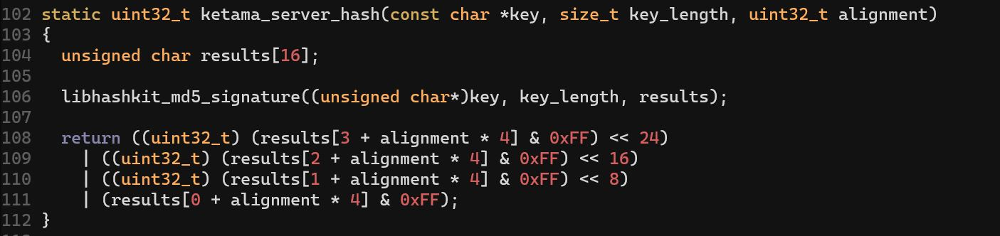
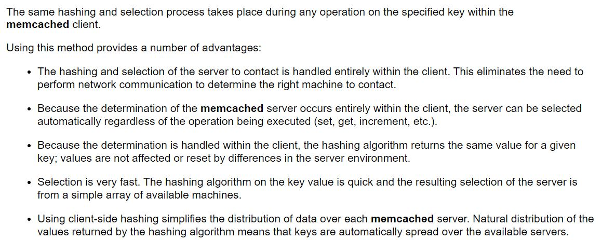
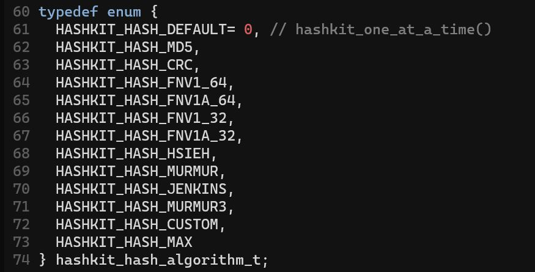
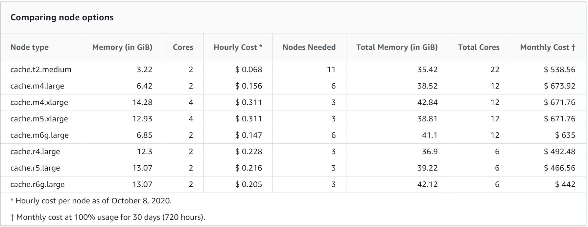

# Daily Report

##  ToDo List

1. Memcached 네트워크 구조 파악
2. Search\-Update Kernel 구현 구조 작성

---
## 02/26 현재 상황

1. YCSB를 봤으나 YCSB는 말그대로 generator만 해주는 코드이고 그 외에 인터넷 연결이나 서버 구성같은 것은 사용자가 모두 진행해야한다.
    * 서버 구성과 관련된 부분은 **Fast RDMA-based Ordered Key-Value Store using Remote Learned Cache\(OSDI/2020)**의 appendix를 참고하자
2. 네트워크를 통해 DB query를 날리는 부분을 확인하기 위해서 Memcached의 코드를 확인할 필요가 생겼다.
    * 네트워크 관련된 부분만 빠르게 파악하자
3. RX\-Search\-Update\-TX간의 Kernel 구성의 큰 그림을 그렸다.

---
### Kernel 구성

* RX가 status\_idx를 변경하면 이 전의 NF들로 패킷의 권한이 넘어간 듯이 이를 이용해 각 Kernel들로 권한을 넘겨준다.
* 이때, Search와 Update를 하는 Kernel은 동일한 Kernel을 사용한다.
* Search와 Update를 모두 할 수 있는 Kernel을 N개 띄워둔 뒤, Update의 빈도에 따라 Kernel 내부 로직을 변경해 Search를 하던 Kernel이 Update를 진행하도록 변경시킨다.
* 이를 이용해 Dynamic한 Workload에 대응할 수 있게 된다.
* 한 Kernel 내에서 1\)패킷을 받고, 2\)패킷의 job\(e.g. Get, Set, and etc..\)을 확인한 뒤, 3\)해당 패킷의 job에 맞는 일을 진행한다.
* 이때 Search를 담당하는 Kernel이 Update 패킷을 만날 경우 해당 패킷의 status\_idx를 Update Kernel의 인덱스로 변경해주는 일만 한다.
    * Update를 담당하는 Kernel이 Search 패킷을 만날 경우도 유사하다.
* 본인 담당이 아닌 패킷의 status\_idx를 변경해주면 해당 패킷의 job을 담당하는 Kernel이 status\_idx를 확인한 뒤 해당 패킷을 집어가서 일을 수행할 것이기 때문에 잘 이어질 것 같다.
* 다만 여기서 걸리는 부분은 위의 방식으로 구현할 경우 **패킷을 까서 어떤 job의 패킷인지 확인하는 과정이 중복된다**는 것이다.
* 이로 인해 발생하는 overhead가 얼마나 되는지 확인한 뒤 overhead가 크다면 이를 방지할 방법도 구현해주는 것이 필요하다.
    * 단순히 status\_idx를 분리하는 방식으로 해결할 수도 있다.
    * 예를 들어, KVS용 status\_idx를 Search, Update 뿐만이 아닌 Divide라는 인덱스도 가지게 해 처음에는 Divide라는 인덱스로 패킷을 받아 분류하는 것으로 할 수 있다.
    * 이 경우, Divide로 받은 패킷은 패킷의 job을 확인하고, 이와 달리 Search나 Update의 인덱스로 받은 패킷은 패킷의 job을 확인하는 절차 없이 바로 일을 진행해도 된다.
* 이는 직접 구현하면서 자세한 issue를 확인해봐야할 것 같다.


---
## 01/13 현재 상황

* rain과 sunny 서버에 DPDK와 Pktgen을 설치해 실행해보았다.
* DPDK가 20.11버젼으로 업데이트되면서 dpdk\-setup.sh 파일이 사라지고 일반 gmake로 build를 할 수 없게 되었다.
* DPDK 20.X버젼이 아니면 현재 rain과 sunny의 커널버젼인 5.8.0\-36\-generic과 호환되지 않아 이 기회에 meson과 ninja를 이용한 build 및 setup을 시도해보았다.
* 실행 결과로는 1514byte packet을 기준으로 10GbE dual port NIC에서 20Gbps의 성능을 보였다.
* Mega\-KV는 KVS를 포함한 성능이 13Gbps정도 되니 Network Throughput를 line rate으로 보여준 것은아니다.
* 다만 DPDK \+ GPU 코드를 사용해 DPDK를 사용하였을 경우 GPU까지 도달하는 rate을 확인해볼 필요는 있을 것 같다.
    * 10GbE dual port NIC의 Network Throughput이 20Gbps인 것을 미루어보았을 때, 이전에 측정한 DPDK의 성능에 2배일 것 같다.

---
### DPDK build

* 해당 내용은 rain과 sunny 서버에 build\_dpdk.sh 파일로 만들어져있다.
* 가장 먼저 해야할 일은 DPDK와 Pktgen, libbpf 코드를 github에서 다운로드 받는 것이다.
* 그 다음에 libbpf를 build해주어야한다.
```bash
cd ~/libbpf/src/
make && sudo make install
```
* build 과정은 단순하다.
* 하지만 위의 방법으로 설치할 경우 `/usr/lib64/`에 shared library가 설치된다.
* DPDK는 `/usr/lib`에서 library를 검색하기 때문에 다음의 명령어를 이용해 복사해주어야한다.
```bash
sudo cp /usr/lib64/libbpf* /usr/lib/
```

* DPDK의 build 과정은 DPDK 개발자의 서버 상황에 맞게 설정되어 있어 우리 서버의 상황을 변경시켜줄 필요가 있다.
* 하지만 kernel과 관련된 설정들을 함부로 바꿨다가는 무슨 일이 일어날지 모르기 때문에 DPDK만의 설정을 만들어 준다.
* 구체적으로 설명하자면 DPDK는 `/lib/modules/<kernel version>/`의 위치에 build라는 폴더가 있고 그 안에 kernel의 header들이 존재한다고 가정하고 build를 진행한다.
* 하지만 우리 서버의 경우 `/usr/src/linux-headers-<kernel version>`에 kernel의 header들이 존재하므로 아래의 명령어를 이용해 symbolic link를 만들어준다.
```bash
sudo ln -s /usr/src/linux-headers-$(uname -r) ~/build
```
* 굳이 build라는 폴더로 만들어 준 이유는 meson으로 configure를 진행할때 kernel\_dir을 option으로 넘겨주는데 이 위치를 홈 디렉토리로 줄 것이기 때문이다.
* 위에서 설명한 것처럼 DPDK는 build라는 폴더가 있다고 가정하고 build를 진행하기 때문에 홈 디렉토리에 build라는 이름으로 symbolic link를 만들어 주는 것이다.
* 그 후 dpdk를 meson과 ninja를 이용해 build해주면 된다.
```bash
meson -Denable_kmods=true -Dkernel_dir=/home/susoon/ build
cd ./build/
ninja && sudo ninja install && sudo ldconfig
```

---
### DPDK Setup

* DPDK build를 마쳤다면 이제 setup을 해줄 차례이다.
* DPDK를 위한 setup은 1\)hugepage setup과 2\)igb\_uio module load, 3\) Ethernet binding으로 이루어진다.
* 첫번째 hugepage setup은 아래의 명령어로 간단하게 설정할 수 있다.
```bash
echo 1024 > /sys/kernel/mm/hugepages/hugepages-2048kB/nr_hugepage
```
* 만약 permision과 관련된 에러가 뜬다면 직접 vi로 해당 파일에 접속해 값을 1024로 변경해주자
```bash
sudo vi /sys/kernel/mm/hugepages/hugepages-2048kB/nr_hugepages
```
* 두번째로 igb\_uio 모듈을 load하기 위해서는 원래 `modprobe`를 사용한다고 한다.
```bash
modprobe igb_uio
```
* 하지만 우리 서버에서는 kernel이 igb\_uio를 모듈로 인식하지 못하고 있기 때문에 직접 load해주어야한다.
* 이때, igb\_uio는 uio 모듈이 load되어 있어야 사용 가능하기 때문에 아래의 명령어로 uio를 먼저 load 후 igb\_uio를 load해준다.
```bash
cd ~/dpdk/build/kernel/linux/igb_uio/
sudo modprobe uio
sudo insmod ./igb_uio.ko
```
* 위의 과정까지 끝나면 이제 ethernet을 igb\_uio에 bind해주면 된다.
* 먼저 ifconfig를 이용해 해당 ethernet들을 down시켜주는 과정이 필요하다.
    * 이 과정은 쉬우니 생략한다.
* 아래의 명령어로 ethernet들의 상황을 파악한다.
```bash
cd ~/dpdk/usertools/
sudo ./dpdk-devbind.py --status
```
* 그 뒤에 아래의 명령어로 해당 ethernet들을 bind 혹은 unbind해주면 된다.
```bash
sudo ./dpdk-devbind.py -b (ixgbe or igb_uio) (ethernet pci id) (ethernet pci id)
sudo ./dpdk-devbind.py -u (ALL ethernet pci id)
```
* 여기서 bind을 할 때에는 여러개의 ethernet을 한번에 진행할 수 있지만, unbind을 할 때에는 한 번에 한 개의 ethernet만 진행가능하다.
* ALL ethernet pci id란 앞의 0000까지 입력하라는 의미이다.
    * e.g.) 0000:17:00.1
* 위의 과정까지 거치게 되면 DPDK의 setup은 끝이 난다.

---
### Pktgen Set up

* Pktgen은 pcap library를 사용하므로 먼저 설치해주자.
```bash
sudo apt install libpcap-dev
```
* Pktgen은 기존의 gmake를 이용한 build가 가능하므로 간단하게 build를 할 수 있다.
```bash
cd ~/Pktgen-DPDK/
make && sudo make install
```
* Pktgen을 build하고 난 뒤 실행시킬 때에는 아래의 명령어를 사용한다.


---
## 01/10 현재 상황

* Mega\-KV와 KV\-Direct의 실질적인 **Network Throughput**을 계산했다.
* Mega\-KV는 10GbE NIC dual port를 모두 사용한 20Gbps 중 14Gbps, KV\-Direct는 40GbE NIC 중 15Gbps, 40Gbe NIC 10개를 사용할 경우 103Gbps의 Throughput을 보인다.

---
### Mega\-KV

* Mega\-KV의 경우 key와 value의 크기가 모두 8byte인 경우 client가 하나의 패킷에 최대한 많은 양의 request를 batch해 request를 전송했다.
* 위의 상황에서 GET request만 보낸 경우 166MOPS의 throughput이 나왔다고 한다.
* GET request이기 때문에 key값만 전송해 하나의 request data의 크기는 8byte이다.
* Mega\-KV의 아래의 매크로 코드를 통해 meta data의 크기를 유추할 수 있다.

```
#define MEGA_MAGIC_NUM_LEN 2 // sizeof(uint16_t)
#define MEGA_JOB_TYPE_LEN  2 // sizeof(uint16_t)
#define MEGA_KEY_SIZE_LEN  2 // sizeof(uint16_t)
#define MEGA_VALUE_SIZE_LEN  4 // sizeof(uint32_t)
```
* 여기서 key와 value의 크기는 실제 key와 value의 크기가 아니라 key와 value의 크기를 알려주는 meta data의 크기이다.
* 각 패킷당 한번 저장되는 값인 magic number와 job type의 크기를 패킷 길이에서 제외해주어야한다.
* MTU size인 1514byte에서 ethernet crc인 4byte를 빼고 모든 헤더의 크기인 42byte를 빼주면 다음과 같은 값이 나온다.
* 1514\(MTU\) - 4\(Ethernet CRC\) - 14\(Ethernet Header\) - 20\(IP Header\) - 8\(UDP Header\) = 1468Byte
* 여기에서 meta data의 크기를 빼주면 다음과 같은 값이 나온다.
* 1468 - 2\(Magic Number\) - 2\(Job Type\) = 1464Byte
* 이 값을 Key size를 알려주는 metadata\(2Byte\)와 Key size\(8Byte\)의 합인 10Byte로 나누어주면 하나의 패킷당 batch가능한 최대 GET request의 수는 146개가 된다.
* 166MOPS를 146으로 나누면 실제로 초당 전송된 패킷의 수인 1,136,986이 나온다.
* 이 값으로 초당 전송된 데이터 수를 계산해주면 다음과 같은 값이 나온다.
* \(1,514\(Pkt Size\) + 20\(IFG\)\) * 1,136,986\(PPS\) * 8\(Bit per Byte\) = 13,953,092,192 = 13.95Gbps
* Mega\-KV는 10GbE NIC을 사용했으니 대략 14Gbps의 수치는 이상한 값이다.
* 하지만 논문에 언급된 다음의 문장을 보면 생각이 달라진다. </br>
```latex
Each socket is installed with an Intel 82599 dual port 10 GbE card
```

* 각각의 socket이 dual port에 설치되었다는 표현으로 미루어보았을때 10GbE NIC의 모든 port를 사용한 듯하다.
* 그렇다면 필요한 것은 현재 snow\-ckjung 서버간의 10GbE NIC의 모든 포트를 사용했을때의 throughput이 얼마인가이다.

---
### KV\-Direct

* **KV\-Direct는 논문 전체를 읽은 것이 아닌 Evaluation 중 필요한 부분만 차용한 것이므로 실험 환경에 대한 이해도가 부족할 수 있음.**
* KV\-Direct의 경우 총 8개의 server를 사용했으며, 40GbE SNIC을 사용하였고, 0번째 server에 NIC을 설치하였다.
* server를 8개나 사용한 이유는 사용하는 memory의 크기를 크게하기 위함으로 보이며 이로 인해 총 64GB의 RAM이 사용되었다.
* KV\-Direct는 open source를 제공하지 않아 정확한 meta data의 크기를 확인할 수 없었으나, Mega\-KV와의 비교가 담긴 표의 제목으로 미루어보았을때 하나의 GET request의 크기는 10Byte로 보인다.
* 그 외의 meta data의 크기는 Mega\-KV와 동일하다고 가정했다.
* 위의 환경에서 KV\-Direct는 180MOPS의 throughput을 보였으니 초당 전송된 패킷 수는 1,232,876개이다.
* 이 값으로 초당 전송된 데이터 수를 계산해주면 다음과 같은 값이 나온다.
* \(1,514\(Pkt Size\) + 20\(IFG\)\) * 1,232,876\(PPS\) * 8\(Bit per Byte\) = 15,129,854,272 = 15.13Gbps
* 40GbE NIC을 사용한 것 치고는 처참한 성능이 나왔다.
* 논문에서 밝힌 10개의 SNIC을 사용한 경우의 성능을 계산하면 102.55Gbps이 나온다
* 이는 모든 NIC의 최대 throughput을 합한 값인 400Gbps에 비하면 한참 낮은 수치이다.

---
## 01/08 현재 상황

* 고장냈던 snow를 고쳤다.
* 고장난 경위는 아래와 같이 추정된다.
1. cuda Sample을 build 후 실행
    * 여기서 cuda Sample은 cuda library 11.1 version이다.
2. 실행 실패
3. Nvidia driver에 등록된 cuda library version\(10.1\)과 실제 작동되는 혹은 작동을 시도했던 library version\(11.1\)이 mismatch되어 오류 발생
4. 3번을 고치기위해 재설치한 nvidia driver의 version이 P4000과 호환되지 않음
    * P4000과 호환되는 기존에 사용하던 library의 version은 418, 재설치한 nvidia driver의 version은 340
5. 부팅시 P4000을 호출하고 초기화할 driver가 정상작동하지않아 부팅 실패
* 이를 고치기 위해 했던 시도와 방법을 남겨 추후에 유사한 상황이 발생했을 경우를 대비한다.

---
### Nvidia Driver & cuda Library Version Mismatch

* Nvidia driver와 version이 맞지 않은 cuda library를 호출하면 다음과 같은 에러를 만나게 된다.
```bash
nvml driver/library version mismatch
```
* 이 경우에는 nvidia driver들을 모두 unload시킨 뒤 재부팅 시키면 해결된다.
* 이는 version이 맞지않은 library와 연결된 driver를 unload한 뒤 nvidia driver가 스스로 version이 맞는 library와 연결하도록 하는 것이다.

1. 가장 먼저 load되어있는 nvidia driver를 확인한다. </br>
**$ lsmod | grep nvidia**
```bash
nvidia_uvm            798720  0
nvidia_drm             40960  3
nvidia_modeset       1093632  6 nvidia_drm
nvidia              17907712  274 nvidia_uvm,ixgbe,nvidia_modeset
drm_kms_helper        172032  1 nvidia_drm
drm                   458752  6 drm_kms_helper,nvidia_drm
ipmi_msghandler       102400  2 ipmi_devintf,nvidia
```

2. nvidia driver를 unload하기 위해 nvidia에 dependency를 가지고 있는 driver들을 모두 unload해준다. </br>
<strong>
$ sudo rmmod nvidia\_drm </br>
$ sudo rmmod nvidia\_modeset </br>
$ sudo rmmod nvidia\_uvm </br>
</strong>

3. nvidia driver를 unload해준다. </br>
<strong>
$ sudo rmmod nvidia </br>
</strong>

4. "rmmod: ERROR: Module nvidia is in use"와 같은 error가 발생할 경우 아래의 명령어로 관련 프로세스를 확인한 다음 kill해준다.</br>
<strong>
$ sudo lsof /dev/nvidia*</br>
$ sudo kill -9 \<PID of nvidia*> </br>
</strong>

5. 다시 nvidia driver가 load되어있는지 확인해본다. </br>
<strong>
$ lsmod | grep nvidia</br>
</strong>

* 위의 방법으로도 해결되지 않는 경우가 있고, 이번이 그 경우였다.
* 이를 해결하기위해 nvidia driver를 삭제 후 재설치하려했고, 그 과정에서 nvidia driver를 잘못 설치해 문제가 생겼다.

* 참고 : [Unload Nvidia Drivers](https://jangjy.tistory.com/300)

---
### When Nvidia driver is not compatible with GPU

* 이 경우는 상당히 심각하다.
* 보통 부팅이 안되고 화면이 출력되지 않는다.
* 일반적인 메인보드를 가진 서버의 경우 GPU를 분리한 다음에도 디스플레이 port가 있어 GPU를 분리한 뒤 부팅해 Nvidia driver를 제거 후 재설치하면 된다.
* 하지만 snow는 GPU를 분리하면 디스플레이를 연결할 수 없었다.
* Nvidia driver가 아닌 nouveau driver로 접속한 뒤 nvidia driver를 삭제해 문제를 해결해야했고 그때문에 먼저 부팅에 성공해야했다.
* 부팅을 하는 방법은 다음과 같다.

1. 부팅할때 <kbd>shift</kbd>와 <kbd>Esc</kbd>를 번갈아가면서 연타해 grub 페이지에 접속한다.
2. grub command창에 도달한 경우 `normal`을 입력한 후 <kbd>Enter</kbd>를 누르고 바로 <kbd>Esc</kbd>를 눌러 Editing Menu로 접속한다.
3. Editing Menu에서 Advanced options for Ubuntu로 들어가 원하는 커널 버젼에 커서를 올리고 <kbd>e</kbd>를 눌러 boot command menu로 접속한다.
4. command 중 linux option으로 가서 마지막에 **nomodeset**을 추가해준다.
5. <kbd>ctrl</kbd>+<kbd>x</kbd> 혹은 <kbd>F10</kbd>을 눌러 해당 option을 적용한 상태로 부팅한다.
* 보통 위의 방법으로 부팅하면 정상적으로 부팅에 성공한다고 한다.
* 하지만 이를 실패할 경우 다음의 방법을 통해 부팅을 시도한다.

1. 위와 같은 방법으로 boot command menu로 접속한다.
2. nomodset대신 **nouveau.noaccel=1**을 입력한 뒤 <kbd>ctrl</kbd>+<kbd>x</kbd> 혹은 <kbd>F10</kbd>을 눌러 부팅한다.
3. 위의 방법도 실패하면 다시 boot command menu로 접속해 **quiet splash**를 지우고 **noapic noacpi nosplash irqpoll**를 입력한 뒤 부팅한다.
* 위의 방법까지 실행하면 보통 정상적으로 부팅에 성공한다고 한다.
* 하지만 snow의 경우 nvidia driver가 완전히 삭제되지 않고 일부만 삭제된채로 계속 주도권을 가지고 있어 정상부팅에 실패했다.
* <kbd>ctrl</kbd>+<kbd>Alt</kbd>+<kbd>F2</kbd>~<kbd>F7</kbd>를 눌러 ubuntu desktop이 아닌 ubuntu server로 접속할 경우 command를 입력할 수는 있었다.
* nvidia driver를 삭제 후 재설치한뒤 실행하려했지만 삭제하는 과정에서 실수가 있어 실패했다.
* 또한 nvidia driver를 위해 nouveau driver를 blacklist에 올려둔 상태인데다가 network까지 정상작동하지 않아 nouveau로 실행되지도 않았고 재설치에도 실패했다.
    * network가 정상작동하지 않은 이유는 잘 모르겠다.
    * 아마 GPU driver를 먼저 실행한 뒤 network driver를 실행하는데 GPU driver가 실패해 network driver도 실패한 것 같다.
* 아래의 방법으로 nouveau driver를 blacklist에 추가하는 방법이다.
* 아래의 기술된 파일을 삭제한뒤 커널에 입력시켜주면 blacklist에서 제외된다.

1. 다음의 파일을 찾아간다.
```
/etc/modprobe.d/blacklist-nouveau.conf
```
2. 다음 내용을 삭제한다.
```
blacklist nouveau
options nouveau modeset=0
```
3. 커널에 입력시켜준다. 이때 -k \<사용하는 커널 버젼\>을 옵션으로 추가해 사용중인 커널 버젼의 이미지에 입력시켜준다.
```
sudo update-initramfs -u -k 4.18.15
```
4. 재부팅한다.
```
sudo reboot
```
* 위의 방법을 사용하면 nouveau를 blacklist에서 제외한뒤 실행시킬 수 있다.
* 아래의 방법을 사용하면 network를 다시 살릴 수 있다.
* 이는 원래 부팅시에 "A start job is running for wait for network to be configured"라는 메세지가 뜨며 부팅이 지연되는 경우 사용하는 방법이다.

1. 아래의 파일을 실행한다.
```
/etc/netplan/01-network-manager-all.yaml
```
or
```
/etc/netplan/01-netcfg.yaml
```
2. 연결이 끊긴 ethernet device의 설정에 아래의 내용을 추가한다.
```
optional: true
```
3. 아래의 명령어를 실행해 적용한다.
```
sudo netplan apply
```
* 위의 방법을 적용하면 인터넷이 정상작동한다.
    * ping을 이용해 확인해본다.
* 이 후 아래의 방법으로 nvidia driver를 삭제한 다음 재실행해주면 정상작동한다.
```
sudo apt remove --purge nvidia-*
```
* 이때 <strong>nvidia\-\*</strong>로 해야 정상적으로 nvidia driver가 삭제되니 유의하자.
* 이 후 재부팅하면 nouveau driver를 사용해 부팅되며 이 때 nvidia driver를 재설치한 뒤 nouveau를 blacklist에 추가하고 재부팅하면 원래대로 돌아온다.
* 만약 "A start job is running for wait for network to be configured"라는 메세지가 부팅시에 계속 뜬다면 아래의 명령어로 방지할 수 있다.
```
sudo systemctl disable systemd-networkd-wait-online.service
sudo systemctl mask systemd-networkd-wait-online.service
```
* 이 후 GPU\-Ether를 실행해 정상작동하는지 꼭 확인해주자.
* 참고
    * [grub setting](https://itsfoss.com/fix-ubuntu-freezing/)
    * [Driver reinstall](https://askubuntu.com/questions/1149169/changing-nvidia-drivers-makes-ubuntu-freeze-on-startup)
    * [network setting](https://askubuntu.com/questions/972215/a-start-job-is-running-for-wait-for-network-to-be-configured-ubuntu-server-17-1)


---
## 01/04 현재 상황

* ToDo List에 있는 사항들을 조사중에 있다.
* 간략한 요약을 먼저 남기자면 다음과 같다.

1. Memcached의 server selection에 사용되는 hash function 조사
* 보통 bit operation 수준의 간단한 hashing 과정을 거친다.
2. UVM의 성능 저하와 관련된 issue 및 solution 조사
* 아직 조사중에 있다.
3. Memcached에서 사용되는 hash function 조사 혹은 논문 작성을 위해 사용할 새로운 hash function 관련 조사
* MD5, Jenkins 등의 유명하고 많이 사용하는 hash function들을 주로 사용한다.
4. NIC\-GPU 간의 Direct communication으로 얻을 수 있는 성능적 이점 파악
* Network가 큰 overhead인 것 같긴 하지만 더 많은 논문을 조사할 필요가 있다. 
5. Memcached의 노드당 메모리 크기 조사
* AWS기준으로 3GB에서 14GB정도를 제공한다.
6. Memcached의 real trace or synthetic data 조사
* [Twitter Real Trace](https://github.com/twitter/cache-trace)
* [mutilate Memcached load generator](https://github.com/leverich/mutilate)
* 첫번째는 Twitter에서 제공하는 Real Trace이고 두번째는 Synthetic Data generator이다.
7. Memcached / Redis / MICA 파악
* Memcached는 Multi\-Thread를 제공하는 Distributed Memory Caching System이며 In\-Memory KVS를 제공한다.
* Redis는 Memcached와 동일한 system이지만 Single Thread만을 제공하며 Memcached에 비해 더 많은 util성을 제공하며 Disk도 사용한다.
* 2015년도 이후로 MICA를 언급하는 곳은 찾기 힘들었다. 하지만 MICA 논문도 읽어봐야하고 조금 더 조사가 필요하다.

---
### 세부사항

#### 1. Memcached의 server selection에 사용되는 hash function 조사



* 위의 코드는 Memcached C++ library의 코드 중 일부를 발췌한 것이다.
* 위의 함수는 client가 요청한 request를 어떠한 서버로 전송해야하는지 hashing하는데 사용되는 함수이다.
* 여기서 client는 **user**를 의미한다.
* user가 request를 보낼때 **직접 hashing을 진행해 server를 골라** 전송하는 것이다.
* hash function으로는 특별한 hash function을 사용하는 것이 아닌 bit operation을 통한 간단한 hashing을 진행하는 것을 확인할 수 있다.


* 위는 Oracle에서 설명한 Memcached에서 client가 server를 선택할때 진행되는 hashing 과정의 특징이다.
* client에서 server selection을 진행하며 이 때문에 client가 요청하는 operation과 무관하게 server가 선택된다고 한다.
* selection에 사용되는 hash function은 매우 빠른 algorithm이 사용된다고 한다.
    * 이 설명 위에 기재된 예시는 \(요청한 data의 값\) % \(총 server의 수\)일 정도로 단순했다.
* **결론 : server selection에 사용되는 hash function은 단순한 bit operation 수준에 해당하는 function.**

* 참고 : [Oracle Memcached Server Selection](https://docs.oracle.com/cd/E17952_01/mysql-5.6-en/ha-memcached-using-hashtypes.html)

<br>

#### 2. UVM의 성능 관련 issue 및 solution 조사

* 이 부분은 아직 조사중에 있다.

<br>

#### 3. Memcached에서 사용되는 hash function 조사 혹은 논문 작성을 위해 사용할 새로운 hash function 관련 조사

* 먼저 현재 Memcached에서 사용되는 hash function에는 어떤 종류가 있는지 살펴보았다.
* 역시 Memcached C++ library의 코드 중 일부를 참고했다.


* 위는 Memcached가 제공하는 hash algorithm들이다.
* 처음 들어보는 hash algorithm도 있지만 대부분 흔하게 사용되는 hash function들이다.
* Mega\-KV에서 hash function으로 사용했다고 생각한 AES의 경우 제공하지 않았다.
* AES는 client와 server간의 인증을 위해 사용한듯하다.
    * ~~사실 생각해보면 당연한 얘기이긴 하다....~~
    * Meag\-KV에서도 Signature ID를 생성할 때 사용했던 것 같다.
    * 추가확인 필요
* 위의 algorithm들이 사용된 이유를 파악할 이유가 있어보인다.
* 그 이유는 MD5 또안 보안에서 주로 사용되던 algorithm인데 hashing으로 사용되었다는 것은 value를 통해 생성된 key를 이용해 다시 value를 알아내지 못하도록 하는 보안관련 issue가 있을 수 있기 때문이다.
* 그 외에도 성능적으로 어느정도의 overhead까지 용인되는지 등등의 issue가 있다.
* **중간 결론 : Memcached에는 평범하게 유명한 hash algorithm들이 사용됨. 각 algorithm들이 사용된 이유 파악 필요**
* 중간 결론인 이유는 새로운 hash function을 만드는 방법에 대해서는 알아보지 않았기 때문이다.
* 위의 중간 결론을 교수님이랑 같이 얘기해본 뒤 새로운 hash function을 만드는 방식으로 novelty를 채우는 것이 맞는지 확인해볼 필요가 있다.

<br>

#### 4. NIC\-GPU 간의 Direct Communication으로 얻을 수 있는 성능적 이점 파악

* 이는 논문을 더 찾아볼 필요가 있을 것 같다.
* 2013년도 이전의 논문들이라 오래된 논문들이긴 하지만 대부분 Network에 Bottleneck이 있다고 서술하고 있는 논문들을 발견했다.
* 더 자세히 읽어보고 다른 GPU에 KVS를 offload시킨 논문들을 파악할 필요가 있을 것 같다.
    * 특히 Motive가 된 Designing High\-Performance In\-Memory Key\-Value Operations with Persistent GPU Kernels and OpenSHMEM 논문을 읽어볼 필요가 있다.

<br>

#### 5. Memcached의 노드당 메모리 크기 조사


* 위는 AWS에서 제공하는 Memcached 노드의 정보가 기록된 표이다.
* 각 노드당 제공되는 메모리의 크기가 다양하다.
* 3.22GB부터 14.28GB까지 다양하며 총 Memory의 크기는 평균적으로 35GB에서 42GB사이로 제공되는 것 같다.
* **결론 : 각 노드당 제공되는 메모리의 크기는 3GB부터 14GB까지 존재한다.**

* 참고 : [AWS Nodes Select Size](https://docs.aws.amazon.com/AmazonElastiCache/latest/mem-ug/nodes-select-size.html)

<br>

#### 6. Memcached의 real trace or synthetic data 조사

* 2개의 Open Source\(?\)를 발견했다.
* [Twitter Real Trace](https://github.com/twitter/cache-trace)
* [mutilate Memcached load generator](https://github.com/leverich/mutilate)
* Twitter Real Trace는 말 그대로 Twitter Request를 모은 Real Trace이다.
* 압축된 크기는 2.8TB이고 압축이 풀린 크기는 14TB이다.
* 이는 A large scale analysis of hundreds of in-memory cache clusters at Twitter라는 2020년도 OSDI에 실린 논문 저자들이 분석 후 정리한 trace이다.
* mutilate은 Characterizing Facebook's Memcached Workload라는 IEEE Internet Computing에 publish된 논문에서 소개된 Memcached Load generator이다.
* 위의 두가지 모두 사용이 가능할 것 같으며 특히 **Twitter Real Trace의 경우 2020년 OSDI에 실린 논문 저자들이 정리한 trace이므로 신뢰도가 아주 높아보인다.**
* 위의 두가지가 각각 Real Trace와 Synthetic Data이다.

<br> 

#### 7. Memcached / Redis / MICA 파악

<br>

   ###### Memcached
* In\-Memory KVS system
* RAM안에 모든 Data를 저장한 뒤 client가 data를 요청할 경우 KVS를 사용해 data를 찾아주는 시스템이다.
* Memory\(RAM\)을 Cache처럼 사용하기 때문에 Memcached라고 불리며 RAM에 모든 데이터를 저장하기 때문에 서버가 종료되면 모든 데이터가 사라진다.
* 이 때문에 DB\(Disk\)에도 데이터를 저장하며 데이터를 저장하는 기간동안에는 DB에서 데이터를 검색해와야해 성능이 떨어질 수 있다.
* Memory Caching기능 뿐만아니라 Distributed Memory System도 제공한다.
* 여러개의 Server의 Memory를 하나의 Server의 Memory처럼 사용할 수 있도록 해준다.
* 위의 기능들을 포함한 가장 단순한 기능들만 탑재하여 속도가 빠르다.
* Multi\-Thread를 지원한다.

<br>

###### Redis
* In\-Memory KVS System
* Memcached와 동일하게 대부분의 데이터를 Memory에 저장하지만 Disk에도 데이터를 저장한다.
* Disk와 Memory 간의 데이터 Synchronization을 위해 2가지 기법을 제공한다.
    * Snapshotting과 AOF가 있다.
    * Snapshotting은 특정 시점의 Snapshot을 Disk에 지속적으로 저장해 Server Reboot시 해당 Snapshot만을 load하는 방식이다.
    * AOF\(Append On File\)방식은 redis의 모든 write/update 연산 자체를 모두 log파일에 기록하는 형태이다.
    * 자세한 내용은 아래의 링크를 참조할 것
    * [About Redis](https://brownbears.tistory.com/43)
* String만 지원하는 Memcached와 달리 set, sorted set, list 등 다양한 자료구조를 제공한다.
* Multi\-Thread를 지원하지 않아 Single Thread만을 사용한다.
* 아래의 링크가 Memcached와 Redis의 비교 분석을 간단하게 잘 요약해두었다.
* [Memcached vs Redis](https://chrisjune-13837.medium.com/redis-vs-memcached-10e796ddd717) 

<br>

###### MICA
* MICA는 2014년 NSDI에 실린 논문이다.
* Memcached를 확장 및 변형시킨 In\-Memory KVS이다.
    * 논문명도 MICA: A Holistic Approach to Fast In\-Memory Key\-Value Storage이고 논문 내부에서도 Storage라는 표현을 사용하지만 In\-Memory라는 표현으로 미루어보았을때 Disk는 사용하지 않을 것 같다.
* [MICA github](https://github.com/efficient/mica)
* 이 당시에는 Redis가 강한 영향력을 가지지 못한 시기였던 것 같다.
    * Redis는 2009년에 개발되었지만 2015년부터 Redis Labs가 지원하기 시작했다.
* Evaluation에서 Memcached, MemC3, RAMCloud 등과는 비교했지만 Redis는 비교군에 넣지 않았다.
* 현재 가장 많이 사용되고 있다는 Redis가 크게 상용화되기 전의 논문이어서 그런지는 논문들을 추가적으로 확인해볼 필요가 있긴하다.
    * Mega\-KV에서는 MICA를 이용해 비교하긴 했지만 Mega\-KV도 2015년도 논문이기 때문에 실험 당시에는 Redis가 지원받기 전이었다.
* MICA가 어느정도의 영향력을 가지고 있고 MICA와 비교하는 것이 타당한 evaluation 방향인지는 조금더 찾아볼 필요가 있다.

* 참고 사이트 <br>
[Redis & Memcached 정리](https://real-dongsoo7.tistory.com/114) <br>
[Memcached and Persistence](https://www.gosquared.com/blog/memcache-and-persistence) <br>
[Redis vs. Memcached: In-Memory Data Storage Systems](https://alibaba-cloud.medium.com/redis-vs-memcached-in-memory-data-storage-systems-3395279b0941) <br>
[\[Cache\] Redis vs. Memcached](https://chrisjune-13837.medium.com/redis-vs-memcached-10e796ddd717) <br>
[AWS Memcached](https://aws.amazon.com/ko/memcached/) <br>
[Opendocs](https://myblog.opendocs.co.kr/archives/591) <br>
[About Redis](https://brownbears.tistory.com/43) <br>
[MICA github](https://github.com/efficient/mica) <br>
[Oracle Memcached docs](https://docs.oracle.com/cd/E17952_01/mysql-5.6-en/ha-memcached-using-hashtypes.html) <br>

