# Daily Report for DPDK

## 02/28 현재상황

### kernel launch

* dpdk.c에서 copy_to_gpu를 호출하면, copy_to_gpu에서 직접 gpu kernel을 호출하여 packet 개수를 count하게끔 code를 수정함
* 이를 통해 pps가 더 떨어질 것이라고 예상함
  * 또다른 thread를 통해 dpdk.c와 독립적으로 count를 해주면 dpdk를 담당하는 core가 할 일이 적어지므로 더 빠름
  * 이를 dpdk.c가 gpu kernel을 통해 packet의 copy가 정상적으로 진행되었는지 확인하고, packet의 수까지 count하게 바꾸었으니 core가 할 일이 많아져 더 느려져야함

 kernel launch test result table 

* 위의 표를 보면 64B를 제외한 나머지 packet size의 경우 pkt-gen이 보내주는 pps만큼 받아줄 수 있다는 것을 확인할 수 있다

 kernel launch test rx rate result 

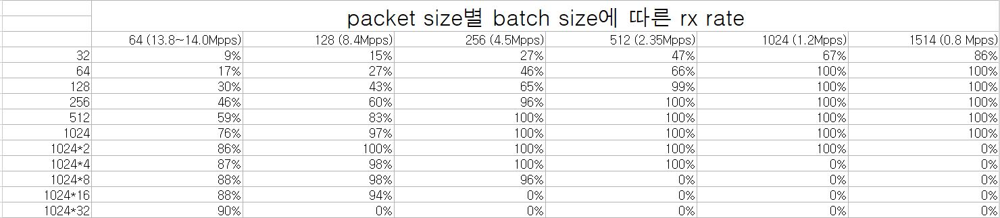

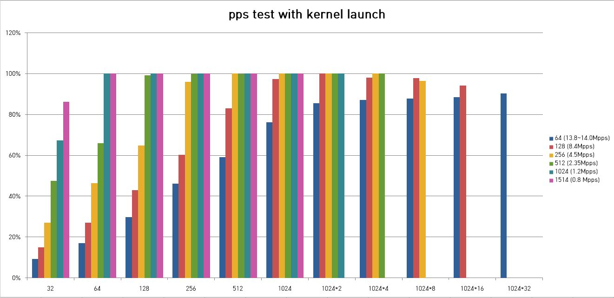

* 위의 graph는 gpu가 받은 rx pps를 pkt-gen에서 보내준 pps로 나누어 받은 packet의 비율을 나타낸 것이다
* 64B의 경우 100% 모든 packet을 받은 경우가 없었지만 그 외의 size의 경우 100% 모든 packet을 받는 경우가 존재했다
* 모든 packet size가 100%의 packet을 받는 경우는 없었다
  * 모든 packet size를 수용할 수 있는 batch 개수는 32부터 1024개까지이다
  * 128B가 100%의 packet을 수용하려면 1024 * 2개의 batch가 필요하다
  * 256B 이상의 packet size의 경우 512나 1024개의 batch size가 필요하다
* 64B의 경우 어제의 test 결과에서도, 이번 test 결과에서도 다른 size와는 조금 다른 특징을 가졌다
  * 어제의 test에서는 batch 개수 증가에 따른 pps 증가량이 달랐음
  * 이번 test에서는 100%의 packet을 수용하지 못한 유일한 packet size임

* 원래는 64B size만 10Mpps를 넘는 속도로 pkt-gen이 보내주기 때문이 아닐까라고 추측을 했었다
* packet을 보내주는 개수가 압도적으로 많으니 cpu가 따라가지 못한다는 가설을 세웠다
* cudaMemcpy call의 횟수를 보면 가설이 틀렸음을 알 수 있다

 cudaMemcpy call count 

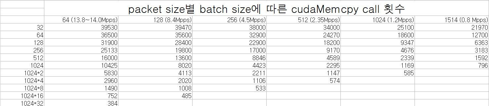

* packet을 보내주는 수가 많아서 다른 특징을 보이는 거라면, 결국 cudaMemcpy나 gpu kernel의 호출 횟수가 달라서 다른 특징을 보이는 것이라는 얘기가 된다
* 당연한 얘기지만 call count table을 보면 64B의 cudaMemcpy의 호출 횟수가 점점 줄어듬을 알 수 있다
  * copy_to_gpu 한 번 호출 당 1씩 증가시켰으므로 gpu kernel도 동일한 횟수로 불렸다
* 이를 통해 알 수 있는 것은 cudaMemcpy의 호출 횟수가 줄어들었으므로 cudaMemcpy의 latency가 줄어들었다는 얘기가 된다
* 이는 어제의 test 결과로 추측해보았을때 cudaMemcpy의 overhead로 인한 pps 감소 외에 다른 요인이 있다는 결론이 나온다
* 여기서 의문점은 그렇다면 왜 64B에서만 이러한 특징이보이는 가이다

#### 64B만 저런 특징이 보이는 이유

* 64B는 10Mpps를 넘기는 유일한 size이다
* 위의 분석에서는 cudaMemcpy에 대한 overhead만 신경쓴 상태
* 실제로 dpdk가 packet을 gpu에 넘겨주는 과정은 NIC에서 packet을 \"받아서\" 넘겨준다
* 그렇기 때문에 dpdk가 NIC에서 packet을 받아오는데 걸리는 시간도 고려해야한다
* cpu가 NIC에서 10Mpps 이상의 속도로 packet을 받아오려면 그에 맞게 core 사용을 할당해야한다
* dpdk는 항상 32개 이하의 packet만 batch해서 가져오므로 여기서 overhead가 발생
* 이 때문에 pps가 100%를 못 찍는다

### 앞으로의 방향

* 찬규형이 slack에 올린 부분을 test해봐야한다

---

* 1) gpu가 nf 처리를 하면서 다른 application까지 돌리려면 지금처럼 gpu memory를 2GB나 쓰면서 packet을 받아줄 수는 없다
  * K4000 기준 gpu memory 3GB
* 그렇기 때문에 batch해주는 packet의 수를 일정량 이상 높일 수 없기 때문에 100%pps를 보장해줄 수 없다
* 2) gpu가 하나의 thread block에 1024개의 thread를 넣어줄 수 있다
* 그래서 gpu가 한 번에 처리할 수 있는 packet의 수는 1024개
* 1024개 이상의 packet을 batch해서 넣어주면 gpu는 순차적으로 1024개씩 처리해줄 수 밖에 없다
  * e.g.) 1024 * 2개의 packet을 batch해주면 gpu는 한 번 copy로 받은 packet을 처리해주기 위해 1024개의 thread를 두번 돌려야한다
* 이 말은 1024개 이상의 packet을 batch해서 넘겨주면 gpu가 감당할 수 없다는 뜻이다
* 3) cpu core에 부하를 줬을 때의 pps 확인이 필요하다

---

* 위의 내용을 확실하게 해주기위한 test가 필요하다
* 받은 packet을 다시 보내주기 위해서는 header를 바꿔주는 작업은 필수다
  * nf처리를 안 한다고 가정했을 때 최소한 header는 바꿔줘야 재전송을 할 수 있으니
* 받은 packet에 대해서 header를 바꿔주는 code를 짜서 실행시켜보고 결과를 뽑아봐야함
* 최대 1024개의 thread를 할당할 수 있고 현재 512개의 thread를 사용하고 있으니 512개의 packet을 batch해서 header를 바꿔줬을 때의 pps와 thread 개수와 batch하는 packet의 수를 1024로 늘려줬을 때의 pps를 확인해봐야함
* cpu core에 부하를 줬을 때의 pps 확인의 경우 현재 test한 결과를 미루어보았을 때 gpu의 rx pps와 cpu의 rx pps가 유사한 것을 근거로 제시할 수 있다
  * test 결과 표는 gpu의 rx pps이지만 cpu의 rx pps도 유사한 값을 나타낸다
* cudaMemcpy를 호출하고 kernel을 launching하는 과정에 cpu core에 부하가 오고, 이 때문에 cpu도 packet을 pkt-gen이 보내주는 만큼 받을 수 없다
* 이는 같은 cpu core에서 진행하는 일이니 dpdk가 cpu의 영향을 많이 받는 다는 것을 보여준 셈이다
* 따라서 추가적인 test는 필요없어보인다
  * test를 진행한다면 thread를 하나 파서 또다른 core에 할당한 다음 그 thread상에서 cudaMemcpy와 kernel launching을 해주게 한 후 pps를 확인하는 것
  * cudaMemcpy와 kernel launching이 dpdk가 NIC에서 packet을 받아오는 것과 독립적으로 실행되니 cpu의 pps가 떨어지지 않을 것이고 이를 보이면 지금까지의 test 결과의 대조군으로써 위의 결과를 입증해줄 것이다

---

## 02/27 현재상황

### 현재까지 test 결과 분석

#### 1) rx pps

 pps table 

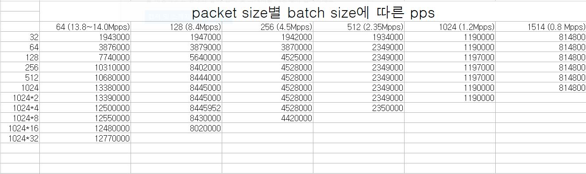

* packet size보다 batch하는 packet의 수에 더 큰 영향을 받음
  * 마지막 analysis에서 자세히 설명
* 32개를 batch 했을 때 64B, 128B, 256B, 512B의 경우 pps가 1.9Mpps로 동일함
  * 최대 pps가 1.9Mpps를 넘는 case들임
* 64개를 batch 했을 때 64B, 128B, 256B의 경우 pps가 3.8Mpps로 동일함
  * 역시 최대 pps가 3.8Mpps를 넘음
* 128개를 batch 했을 때부터 모두 다른 pps를 보임
* 예상대로라면 64B size의 packet을 128개 batch했을 때, 5.8Mpps수준으로 128B size의 packet과 동일한 pps를 보여야하지만 더 높은 pps를 보임
  * 96개를 batch했을 때 5.8Mpps 정도를 보임
  * 이유는 아직 모름...

#### 2) cudaMemcpy

* 같은 횟수의 cudaMemcpy를 시도할 때 copy하는 size가 크면 클 수록 latency가 더 커짐
* 같은 size를 copy할 때 copy하는 횟수가 잦으면 잦을 수록 latency가 더 커짐

 memcpy test graph 

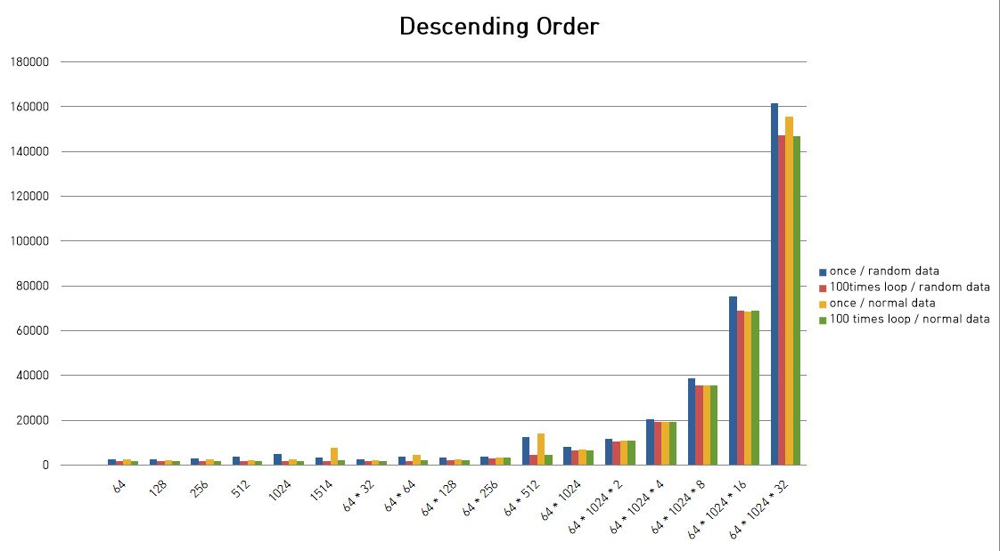

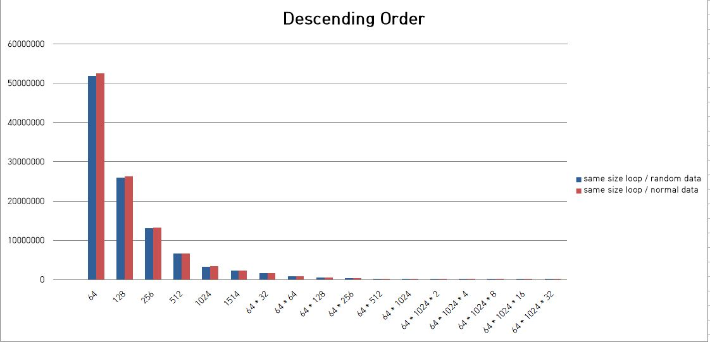

 memcpy test table 

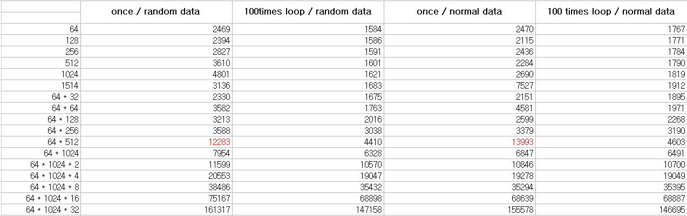

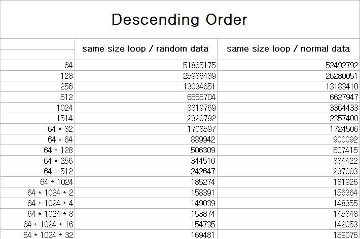

* 횟수에 의한 latency 증가폭이 size에 의한 latency 증가폭보다 훨씬 커서 최대한 적은 횟수의 cudaMemcpy 호출이 이득임
  * 하지만 64K의 gpu page 크기 이상을 copy하는 경우 1번 호출하여 전체를 copy하든지 page 크기 이상으로  n번에 나누어서 호출하든지 여러개의 page를 호출해야한다는 점에서 같은 overhead가 발생하여 횟수에 의한 latency 증가폭이 미미해짐
* 100번 loop를 돌린 경우가 한 번만 돌린 경우에 비해 latency가 조금 적다
  * 이는 cudaMemcpy를 할 때 aggregation해서 copy하는 가에 대한 추측을 할 수 있게 한다
* same size test에서 64 * 1024 * 2B 이상의 case를 확인해보면 latency 차이가 거의 미미하며, 심지어 64 * 1024 * 32B보다 작은 case의 latency가 더 작은 경우가 있음을 확인할 수 있다

 cudaMemcpy call count table 

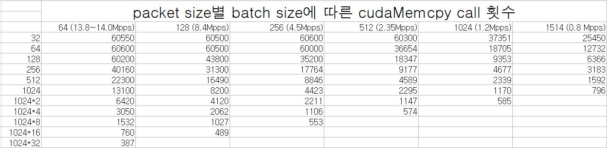

* packet size별, batch 개수 별 cudaMemcpy 호출 횟수이다
* 최대 호출 수가 60000번 가량으로 보이며 그 이상의 호출은 CPU가 수용 불가능해보인다
* cudaMemcpy의 최대 호출 수가 정해져있어 32개의 batch case의 경우 1.9Mpps가 나오게 된다

#### 3) analysis

* 같은 size를 gpu memory에 copy할 때,  cudaMemcpy를 한 번  호출하여 한 번에 올리는 것이 여러번으로 나누어 copy하는 것보다 더 빠르다는 test 결과를 도출해냄
  * same size test
* packet size별 batch size에 따른 pps를 test한 결과를 살펴보면, 32개를 batch한 경우, 64B, 128B, 256B, 512B의 pps가 같다는 점에 의문을 품었으나 해결했다
* 이것의 원인은 same size test의 결과 때문이다
* 1.9Mpps가 나왔다는 것은 1초에 호출 가능한 cudaMemcpy의 횟수가 정해져있다고 볼 수 있다
* 위의 호출 횟수 표를 보면 32개의 batch를 한 case는 60000번 가량의 cudaMemcpy를 호출하는데 이게 CPU가 수용가능한 최대 호출 횟수인 것 같다
* 그 이후로 batch 개수가 늘면 cudaMemcpy 호출 횟수가 줄어듬을 볼 수 있다
  * 이로 인해 pps는 올라간다
* batch하는 packet의 수를 1024개로 맞춰주면 모든 packet size에서 최고 속도를 낼 수 있다
* normal data의 경우 latency 증가폭이 매끄럽지 않은데 이는 caching의 영향으로 추측중이다

---

### memcpy test code 수정

* code를 수정하였다
* 원래는 caching effect를 없애보려고 수정하였으나 의도대로 되지 않은 것 같다...
* random case의 경우 random index를 가져올때 범위 밖으로 벗어나는 경우가 없게 수정하였다
* 어제의 test의 경우 size를 기준으로 오름차순의 경우만 test를 해보았는데 code를 수정하면서 내림차순의 test도 가등하게 해보았다
* 결과는 유사했고, test시 첫번째 실행되는 size의 경우만 latency가 조금 더 높게 나왔다

 ascending order test 

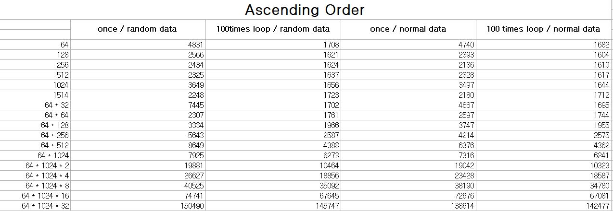

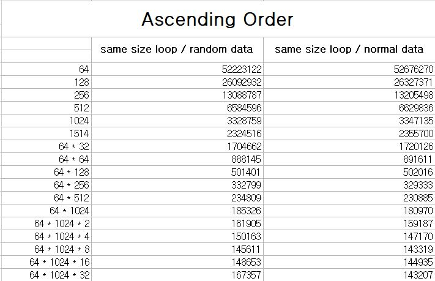

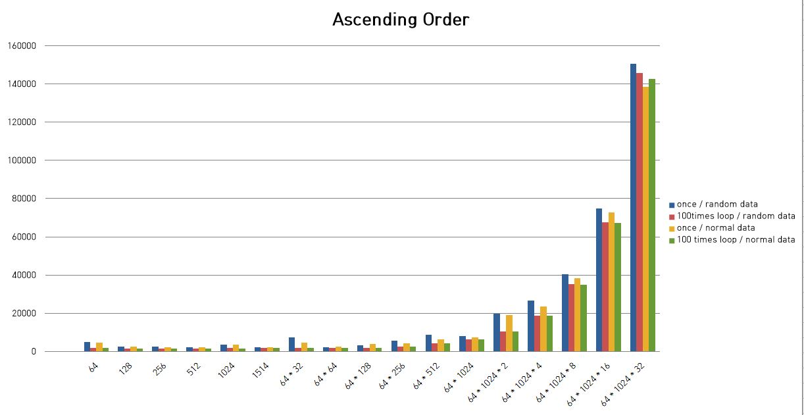

* 오름차순으로 test를 진행한 결과값과 graph이다

 descending order test 

* 내림차순으로 test를 진행한 결과값과 graph이다

* 값의 큰 차이는 보이지 않으며, caching이 어디서 진행되었나에 따라서 latency 값이 튀는 부분만 조금씩 달라진다고 추측할 수 있다
* same size test의 경우에는 descending과 ascending 모두 동일하게 나왔다

## 02/26 현재상황

* cudaMemcpy를 할 때 생기는 latency가 copy해주는 size에 더 큰 영향을 받는지, cudaMemcpy를 호출하는 횟수에 더 큰 영향을 받는지, 각각 어느정도의 latency를 가지는지에 대한 test를 진행하였다.

 cudaMemcpy test values 

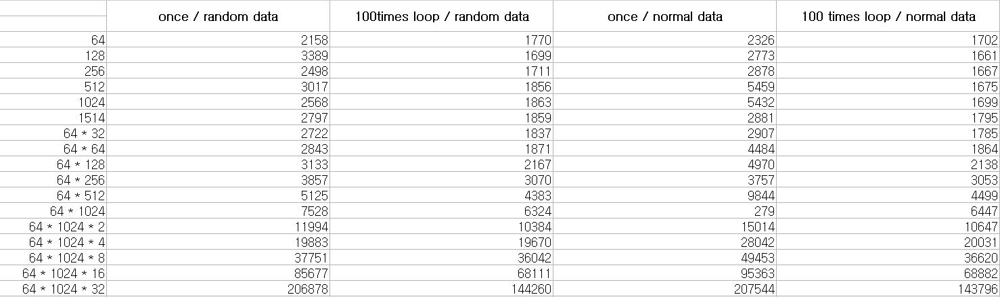

* 위는 test로 얻은 latency를 정리해놓은 것이다
* once라는 것은 같은 size의 cudaMemcpy 호출을 한 번 실행하여 test한 것을 의미한다
* 100 times loop라는 것은 cudaMemcpy 호출을 100번 연속해서 실행하여 test한 것을 의미한다
* random data라는 것은 copy해주는 data를 random한 data로 사용했음을 의미한다
* normal data라는 것은 copy해주는 data를 non-random한 data로 사용했음을 의미한다
* 각 data의 size는 64B packet부터 1514B packet까지, 그리고 64 * 32B부터 64 * 1024 * 32B까지 dpdk test에 사용했던 batch size를 사용했다
* 각 test는 100번 시행하여 latency의 평균을 내어 data로 사용했다.

 graph for cudaMemcpy test 

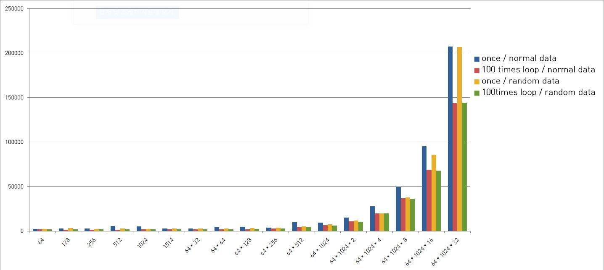

* 위의 graph는 표의 data들을 시각화한 것이다
* 이를 통해 알 수 있는 것은 size가 커짐에 따라 latency가 증가했다는 것이다
* 또한 once의 경우 100 times loop의 경우보다 latency의 증가폭이 크며, 최대 size인 64 * 1024 * 32B의 경우 once의 경우가 100 times loop의 경우보다 눈에 띄게 높은 latency를 가짐을 확인할 수 있다
* 반면 random data와 normal data 간의 차는 눈에 띄게 벌어져있지 않다

* graph를 통해 알 수 없는 것들도 있다
	* 1) code 구조상 once를 측정하는 경우, size가 작은 case부터 큰 case까지 순차적으로 한번씩 cudaMemcpy를 호출해준다
	* host\_buf라는 배열의 순차적으로 훑으면서 data를 copy해주며 test를 진행하였다
		* 이 때문에 indexing을 하여 caching의 영향을 받아 latency의 증감이 매끄럽지 않다
			* 이는 data 표를 보면 확인할 수 있다
		* 이는 normal data의 유효성이 의심되는 부분이다
	* 2) 64 * 1024B의 size를 기점으로 latency가 2배씩 상승하는데 이는 gpu의 page가 64K인것과 관련이 있어보인다

 data for cudaMemcpy same size test 

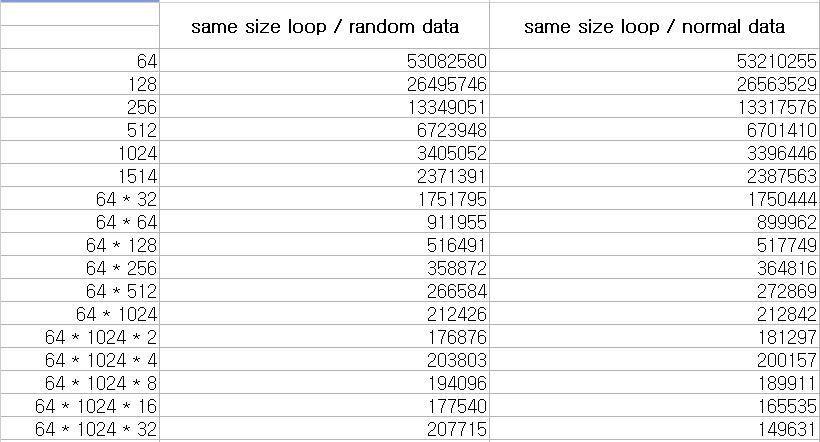

* 위의 data 표는 같은 size를 copy할때의 latency를 측정한 표이다
	* 같은 size를 copy한다는 것은, 최대 size인 64 * 1024 * 32B를 copy하기 위해서, cudaMemcpy를 여러번 호출하였을 때의 latency를 측정한 것이다
	* e.g.) 최소 size인 64B는 64 * 1024 * 32B를 copy하기 위해서 cudaMemcpy를 1024 * 32번 호출한다
* 이 전의 표와 동일하게 각 test는 100번씩 실행하여 latency를 평균낸 것이고, 각 size는 packet size와 batch size이다

 graph for cudaMemcpy same size test 

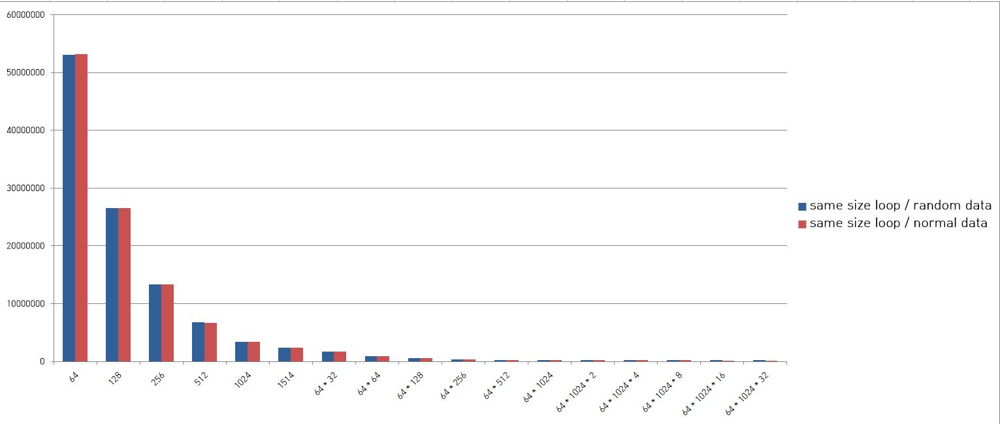

* 위의 graph는 data 표를 시각화한 것이다.
* cudaMemcpy의 호출이 잦아질수록 latency가 급격히 증가함을 알 수 있다
* 이 증가폭은 첫번째 test의 증가폭과는 비교도 안 될만큼 큰 데, 이를 통해 copy하는 size보다, cudaMemcpy의 호출 횟수가 latency에 더 큰 영향을 미친다는 것을 알 수 있다

* 다만 random data의 64 * 1024B(이하 64K) 이상의 경우 표를 확인해보면 32 * 64K를 한 번에 copy하는 것과 64K와 4 * 64K를 copy하는 것은 latency가 거의 동일하고, 심지어 2 * 64K와 8 * 64K, 16 * 64K를 여러번 copy해주는 것이 더 빠르다는 것을 볼 수 있다
* 수치가 거의 비슷한 것을 보면 64K이상의 data copy는 어차피 gpu page를 여러개 가져와서 copy해줘야하기 때문에 더 이상 latency가 감소하기 힘들다는 것을 추측할 수 있다

### 결론

* cudaMemcpy는 copy하려는 size가 크면 클 수록 latency가 크고, 호출 빈도가 잦을수록 latency가 커진다
* 하지만 그 증가폭은 호출 빈도에 의한 증가폭이 훨씬 높으며, 이를 통해 호출 빈도가 latency에 더 큰 영향을 미침을 알 수 있다
* 또한 gpu page size 이상의 data는 어차피 gpu page size로 쪼개서 copy해줘야하기 때문에 cudaMemcpy를 한번 호출해서 copy해주나 여러번 호출해서 copy해주나 거의 비슷한 latency를 보인다

---
* packet size별로 batch 개수에 따른 pps변화를 알아보고 있다
* test 중 의아한 점이 생겨서 원인 파악중

 packet size : 64B, batch num : 32 

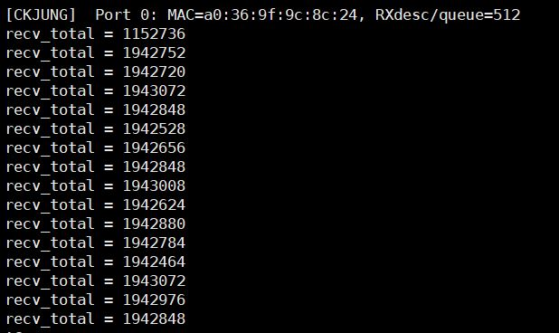

 packet size : 128B, batch num : 32 

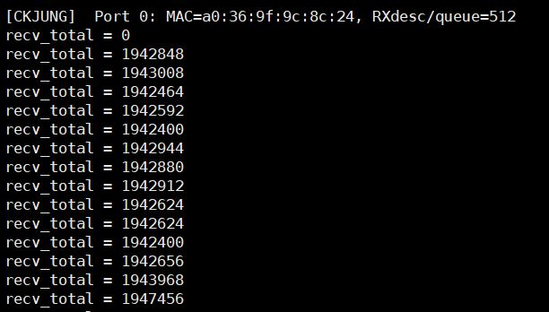

 packet size : 256B, batch num : 32 

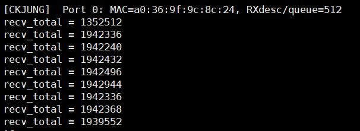

 packet size : 512B, batch num : 32 

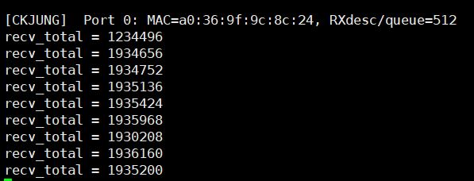

* packet size가 각각 다른데 batch 개수가 같으면 속도가 동일하다
* 이것이 매우 의심스러운 점인 게 각각 최대 pps도 다르고, packet size도 다르니 batch했을때의 size도 다르다
* 그런데 속도는 동일하다
* 원래 가설대로라면 batch size가 같아도 packet size가 다르면 총 batch size가 달라서 copy overhead가 더 들어가니 더 속도가 떨어져야하는게 맞다
* 지난번 실수처럼 gpu에 copy하는 과정에 모든 packet을 copy하지 않는다든가 하는 오류가 있을 수 있다
* 현재 512B의 packet까지 test한 상태이며, pps의 기록은 batch_size_text.xlsx 파일에, 각 test 결과 캡쳐사진은 image/batch_test/ 안에 packet size별로 정리되어있다

* 이 part의 의문 해결은 02/26 시작부분에 서술되어 있다

---
## 02/25 현재상황

### copy 문제 해결 전

* packet size별로 최대 pps가 나오는 batch size의 범위를 구해봄

 range of batch size 

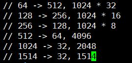

* 범위는 위의 캡쳐와 같다
* 사실상 upper bound는 없다고 봐도 무방할 것 같으며, lower bound가 각자 다르다는 것을 알 수 있다.
* 하지만 총 memory 양을 계산해보면 64~1024B까지의 packet들은 batch하는 memory는 같다(2^15B = 1024 * 32B = 32MB)
* 32MB만큼만 batch해서 GPU에 copy해주면 속도면에서 감소는 0.1~0.2Mpps 미만으로 나온다
* 위의 내용들은 잘못된 정보임
  * batch해서 모은 packet들이 gpu에 제대로 copy가 되고 있지 않았음

---

### copy 문제 해결 후

 fixed copy_to_gpu 

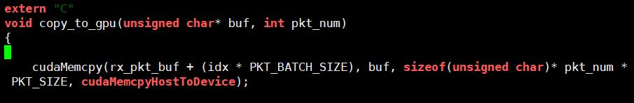

* cudaMemcpy에서 sizeof(unsigned char) * size만큼 copy를 해주고 있었다.
* 이때 size는 dpdk.c에서 batch해서 모은 packet 수였다
* 하지만 변수명이 size이다보니 packet 수에 packet size가 곱해진 총 batch된 size를 말하는 줄 알고 그냥 곱해서 copy해주고 있었음
* 그래서 모든 packet이 copy되고 있지 않았다
* 변수명을 pkt_num으로 바꿔주고 PKT_SIZE를 곱해서 정확한 batch된 size만큼 copy를 해주어 모든 packet이 copy되게 하였다
* 그 이후 64B packet으로 test한 결과이다

 batch packet number : 512 

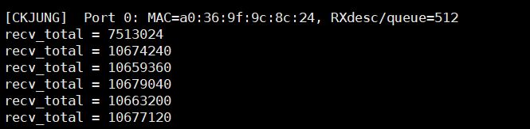

 batch packet number : 1024 

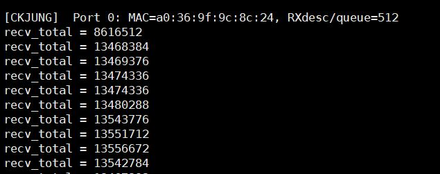

 batch packet number : 1024 * 32 

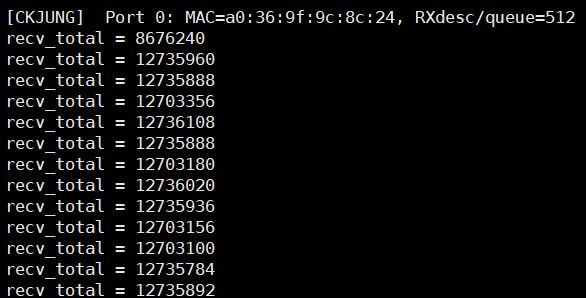

* send한 packet 수는 13.8~14.0Mpps였다.
* 1024개를 batch했을 때가 가장 속도가 빨랐으며 13.5Mpps로 0.3~0.5Mpps정도 떨어졌다
* 1024를 기준으로 더 적게 batch 했을 때와 더 많이 batch 했을 때 모두 속도가 떨어졌으며 더 적게 batch 했을 때 속도가 더 많이 떨어졌다
* 하지만 여전히 copy overhead로 인한 속도차가 적긴하다

---

## 02/24 현재상황

* gpu에서 infinite loop를 돌려서 그 외의 code에서 gpu에 어떤 명령도 걸 수 없음
* 그래서 gpu에서 loop를 돌리는 게 아니라 cpu에서 loop을 돌고 그 내부에 gpu를 check하는 코드를 넣음

 gpu monitoring code 

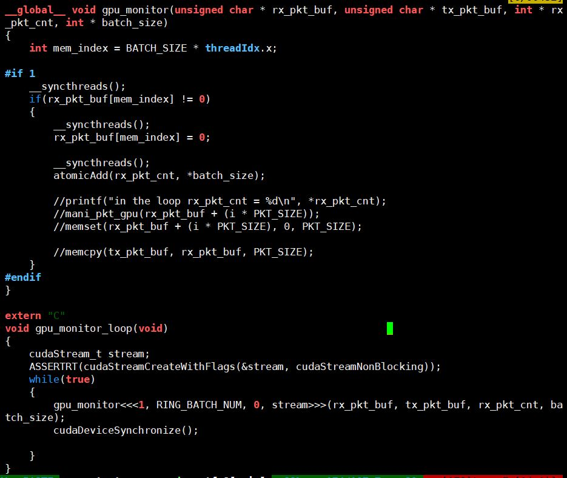

* gpu_monitor가 packet buffer를 check하고 atomicAdd로 count를 올려주는 함수
* gpu_monitor_loop가 cpu에서 loop를 돌면서 gpu_monitor를 호출해 packet buffer를 check하고 atomicAdd로 count를 올려줌

---

### pps가 낮게 나오는 것 수정 전

 execution result 

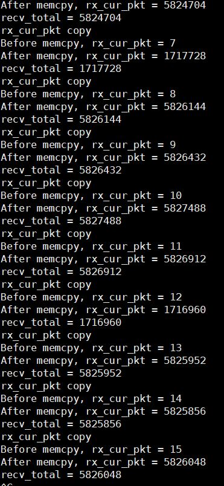

* 실행 결과를 보면 rx_pkt_cnt가 rx_cur_pkt에 잘 복사되어 값이 나오는 것을 알 수 있다
* 5.8Mpps정도 나오는데 이 값이 복사는 잘 된 거 같지만 값 자체가 유의미한지는 의심된다.
  * 12번째를 보면 갑자기 1.7Mpps가 나온다
  * send하는 쪽은 13.8Mpps정도로 찍어주는데 5.8Mpps밖에 안나오는 건 너무 적다
* 수정함

---

### pps가 낮게 나오는 것 수정 후 & if문 condition 수정 전

 gpu test success 

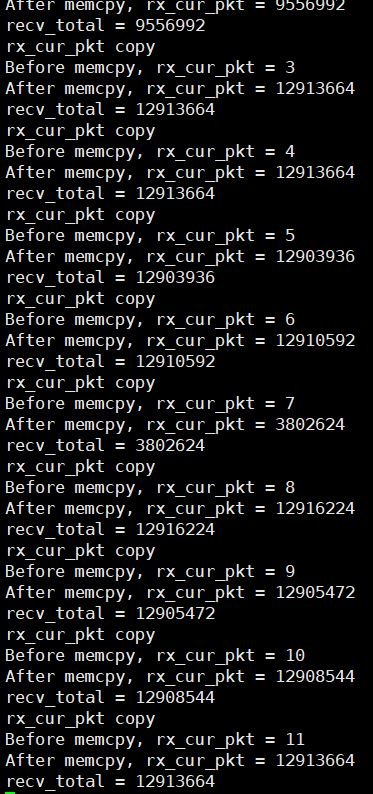

* macro를 잘못 넣어줘서 생긴 문제여서 macro를 알맞게 넣어줌
* send하는 쪽에서 pps가 12.9Mpps 정도 나옴
* 보내는 만큼 거의 다 받음
* 7번째를 보면 가끔씩 1/3정도로 떨어지는 때가 있음
* 5번에 한번씩 저렇게 떨어짐
* 저게 copy에 대한 overhead인 부분인 거 같음

---

### if문 condition 수정 후 & memcpy 수정 전

 execution result 

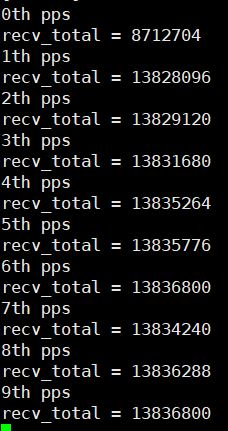

* 13.8Mpps로 send에서 보내준 만큼 나옴
* 원인은 uint64_t인 start와 end의 차가 int인 macro ONE_SEC와 비교되다보니 type conversion을 하는 과정에서 문제가 발생한 것이었음
  * 이와 관련된 test는 다음 장에
  * 수정 후 해결
* copy_to_gpu가 제대로 실행 된다면 13.8Mpps가 나올 수 없음
  * copy overhead때문에
* 추측상 dpdk.c의 buf를 structure에서 unsigned char*로 변환하는 과정에 문제가 있음

 buf type conversion 

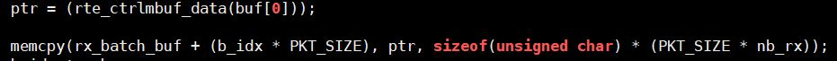

* buf는 structure 배열이고 ptr은 unsigned char 배열인데, 첫번째 줄은 buf의 packet data만 뽑아서 ptr에 대입해주는 명령이다
* 이 과정에서 buf에 저장된 모든 packet들의 data를 contiguous하게 가지는 pointer를 넘겨주는 것이 아니라, buf[0]의 packet data를 가리키는 pointer를 넘겨줌
  * 실제로 모든 packet data를 contiguous하게 저장하지 않음
* 이로 인해 첫번째 packet의 data만 제대로 copy되고 나머지 자리에는 0만 들어감

 copy result 

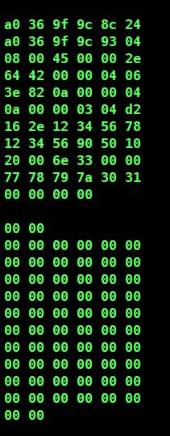

* 두번째 packet자리가 다 0임을 확인할 수 있다
* 이 부분은 수정 필요

---

### type conversion test

* 다음은 uint64_t의 자료형을 가지는 num64와 int의 자료형을 가지는 num 간의 type conversion을 test한 것이다
* LARGE case는 2^50 + 2^30 + 2^10을 대입한 case이고,
* MID case는 2^30 + 2^10을 대입한 case,
* SMALL case는 2^10을 대입한 case이다

 LARGE case without any explicit type conversion 

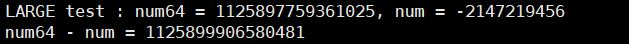

 MID case without any explicit type conversion 

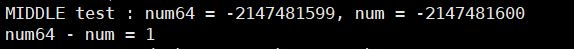

 SMALL case without any explicit type conversion 

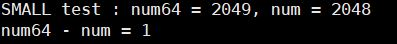

* 어떤 explicit type conversion도 없이 implicit type conversion의 결과를 보기위해 한 test의 결과이다

 LARGE case with explicit type conversion to int 

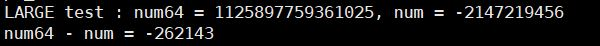

 MID case with explicit type conversion to int

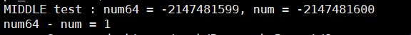

 SMALL case with explicit type conversion to int

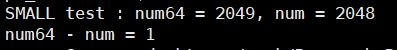

* num64를 int로 type conversion해서 나온 결과이다

 LARGE case with explicit type conversion to uint64_t

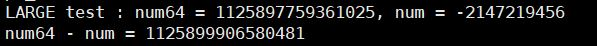

 MID case with explicit type conversion to uint64_t

 SMALL case with explicit type conversion to uint64_t

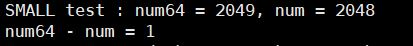

* num을 uint64_t로 type conversion해서 나온 결과이다

 LARGE case with inequality

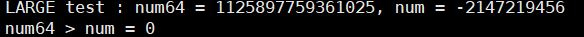

 MID case with inequality

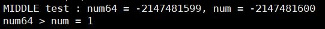

 SMALL case with inequality

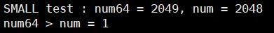

* 대소비교 test를 진행한 결과이다

* 뺄셈을 test한 결과로는 implicit type conversion은 uint64_t로 된다는 것을 알 수 있다
* 대소비교 test를 진행한 결과로는 int 범위를 넘어가는 값을 대소비교 하게되면 true, false가 잘못된 값이 나올 수 있다는 것이다.

---

### memcpy 수정 후

 dump in cpu 

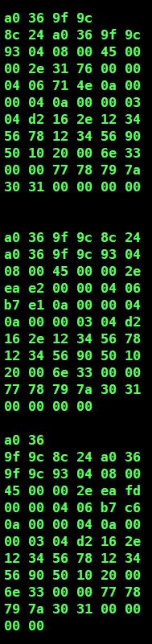

 copy in gpu 

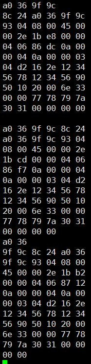

* gpu와 cpu에서 모두 제대로 packet이 copy 되었음을 알 수 있다

---

### packet size별 pps 확인

* packet size별로 최대 pps가 나오는 최대 batch size를 찾는 test를 진행하고 있다
* 그런데 최대 size로 키워도 속도가 떨어지지 않는다
* 최대 packet size인 1514B로 1514개를 batch로 받아 실행해보았다

 Packet size : 1514B, Batch size : 1514 pps 

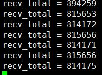

 gpu status 

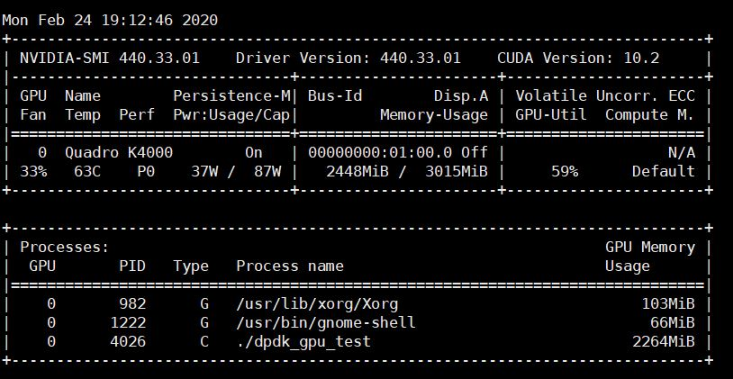

* GPU memory를 2GB정도 사용하면서 check를 진행하는데 속도가 정상적으로 나왔다
  * send(pkt-gen) : 8.1Mpps, receive(dpdk) : 8.1Mpps
* copy가 정상적으로 되고 있음에도 속도가 너무 잘 나온다
* copy가 진짜 정상적으로 진행되고 있는지 확인이 필요함
  * packet 받은걸 fprintf로 어딘가에 저장해서, gpu에서 copy한 packet들과 비교하는 코드를 짜서 packet 받고 비교해봐야할듯

---

## 02/22 현재상황

* 여전히 gpu_monitoring_loop 때문에 다른 gpu코드가 작동을 못함
* 그래서 test를 위한 코드를 따로 짜서 확인해봄

 thand.cu file 

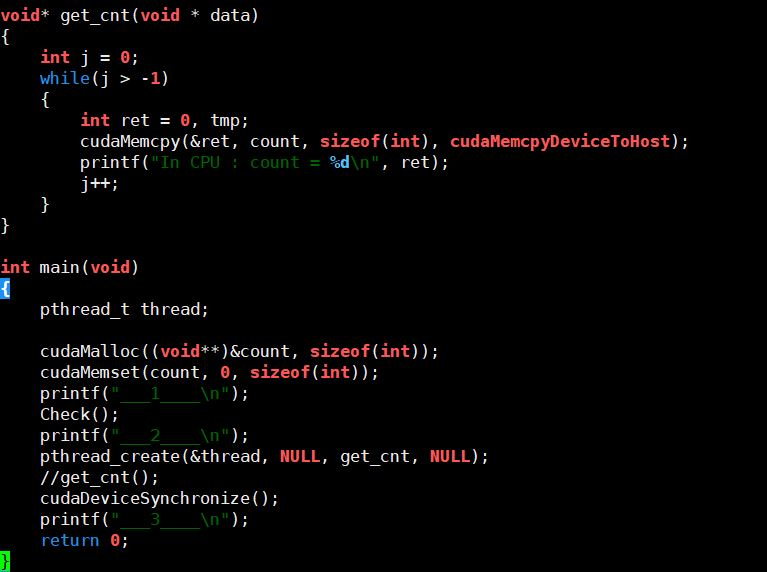

* thand.cu 파일의 코드 전문
* dpdk나 다른 기능을 빼고 gpu에서의 infinite loop와 loop내의 atomicAdd를 통한 값 변화, cpu에서 이 변한 값을 가져와 출력하는 infinite loop만 넣은 상태
* pthread로 multithread를 돌려봤지만 제대로 실행되지  않음

 execution 

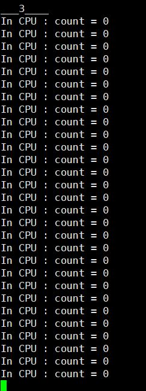

* 이런 형태로 count 값이 전혀 전달받지 못함
* cpu에서 값을 받지 못해 계속 0만 출력
* synch문제로 cudaMemcpy가 실행되지 않는 듯함

 dpdk_gpu_test execution 

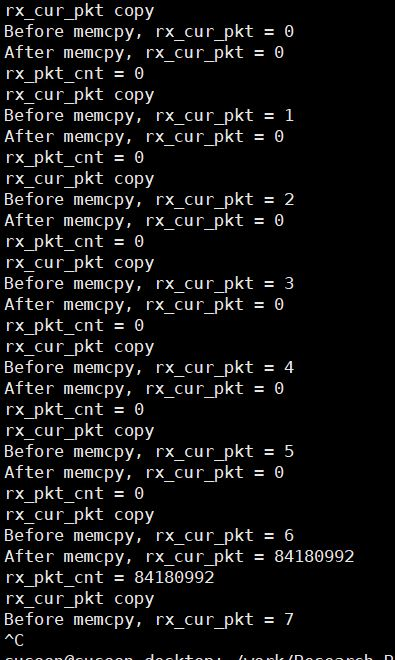

* dpdk_gpu_test 파일을 실행시켜 나온 결과
* 5번째까지는 packet을 gpu에 넣기 전이라 0으로 memcpy되지만 6번째에 84180992라는 값은 이전까지 count된 rx packet 수가 그 전까지 cpu에게 전달이 안 되다가 한번에 전달되어 출력된 수로 추측됨
* 이 말은 저때까지는 copy_to_gpu 내의 memcpy와 get_rx_cnt의 memcpy가 제대로 실행이 되며 gpu_monitoring_loop내의 loop도 제대로 실행이 되었다는 뜻
* 그 이후로는 30초 정도 멈춰있다가 cudaMemcpyLaunchTimeout이 발생
* gpu에 과부하가 걸리는 건지 잘 모르겠음
* packet 전송 속도를 0.001%로 해서 초당 200개 미만의 packet을 보내면 조금 더 오랫동안(20~30번 정도?) packet을 count하다가 같은 증상을 보임

## 02/21 현재상황

* gpu에서 gpu_monitoring_loop을 돌리면 다른 gpu코드가 작동을 못함
* synch 문제인 거 같음

 gpu monitoring loop 

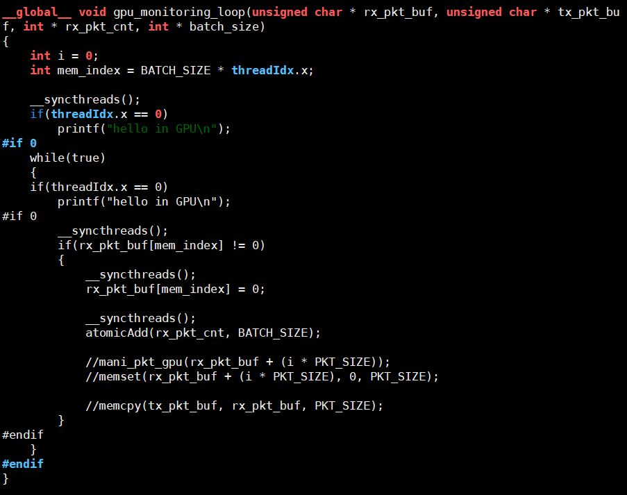

* code를 위의 사진처럼 수정함
* #if 0으로 수정해 놓은 부분은 loop를 뺐을때 작동을 어떻게 하는지 보기 위함
* 찬규형의 monitoring loop을 참고함
* 두번째 #if 0 밑에 if(rx_pkt_buf[mem_index] != 0)부분이 packet buffer의 변화를 확인하는 부분
* 각 thread가 buffer에서 맡은 부분을 확인하고 밑의 atomicAdd로 packet 수를 count함
* 이를 dpdk.c가 받아감
* dpdk.c에서 thread를 하나 따로 파서 이를 확인하는 loop를 돌게 해야할 거 같음

## 02/20 현재상황

* gpu에서 시간을 재면서 packet 수를 check한 게 아니라서 다시 코드를 짬

 gpu monitoring loop 

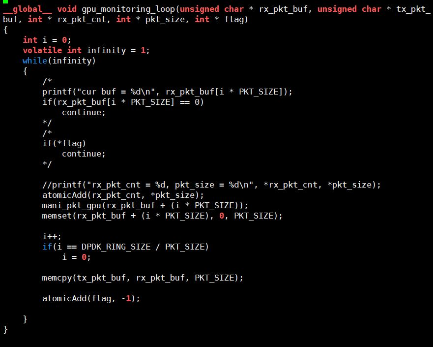

* gpu에서 packet buffer를 polling 하는 loop
* 원래 의도는 copy_to_gpu를 통해 dpdk.c가 flag를 true로 바꿔주면 packet이 들어왔다는 신호로 인식하고 packet을 manipulate하면서 rx_pkt_cnt를 count해주려했음

 getter for rx packet count and tx packet buffer 

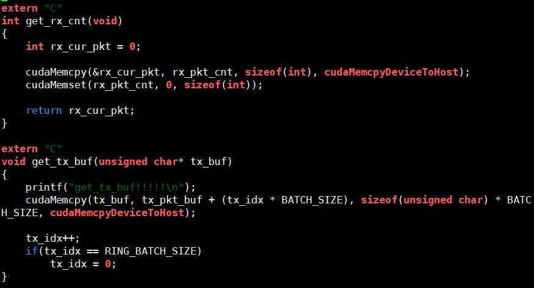

* dpdk.c 에서 위의 함수를 1초마다 불러서 gpu_monitoring_loop가 rx_pkt_cnt와 tx_pkt_buf를 채워주면 그 값을 가져가고 0으로 초기화해주는 역할을 하는 함수

* 현재 위의 두 함수 모두 제 기능을 못하는 상태
  * 원인 1)
    *  gpu_monitoring_loop가 무한루프임
    * 이 때문에 copy_to_gpu나 get_rx_cnt, get_tx_buf 같은 gpu의 resource를 필요로 하는 함수들이 무한루프에 밀려 기능을 못함(cudaErrorLaunchTimeout을 리턴함)
    * 그래서 gpu memory에 packet이 올라가지 않으니 gpu_monitoring_loop도 일을 안함
    * 위의 내용들이 반복됨
  * 원인 2)
    * dpdk.c에서 tx_pkt_buf를 받아 tx_buf라는 rte_mbuf 구조체 포인터 배열에 copy해 넣고 이를 transmitt함
    * 그 이유는 rx와 tx packet 모두 하나의 변수에 저장되면 rx가 batch를 하는 동안 tx가 packet을 덮어씌워버림
    * 이 때문에 또 다른 변수를 선언하여 copy하는 것을 택함
    * 이때 rte_mbuf 구조체에 tx_pkt_buf를 copy해 넣어야하는데 구조체의 field를 대략적으로라도 알아야함

* 위의 원인들때문에 현재 test가 불가함
* rte_mbuf는 구조체의 field만 보면 간단히 해결 가능 할 듯
* persistent loop를 고쳐야함

## 02/19 현재상황

* test가 가능한 상태로 완성
* 64byte의 packet 기준으로 512개(총 32kB)가 들어갈 수 있게 batch의 size를 정해주면 최대 속도(13.8Mpps)가 나옴
* 1514byte의 packet 기준으로 448개(총 662kB 정도)가 들어갈 수 있게 batch의 size를 정해주면 최대 속도(0.8Mpps)가 나옴

* 여러 테스트를 진행해봄
* 첫번째, print_gpu가 실행되지 않은 이유를 d_pkt_buf라는 shared memory에 계속 packet을 copy해 넣어서 print_gpu가 scheduler에게 밀려 실행되지 않은 것으로 추정하고 pinned_pkt_buf라는 전역변수에 2MB를 할당해 ring처럼 index에 따라 다른 자리에 packet을 copy해 넣어줘 shared memory 문제를 해결하려고 해봄
  * 하지만 여전히 실행되지 않음

 ring code 

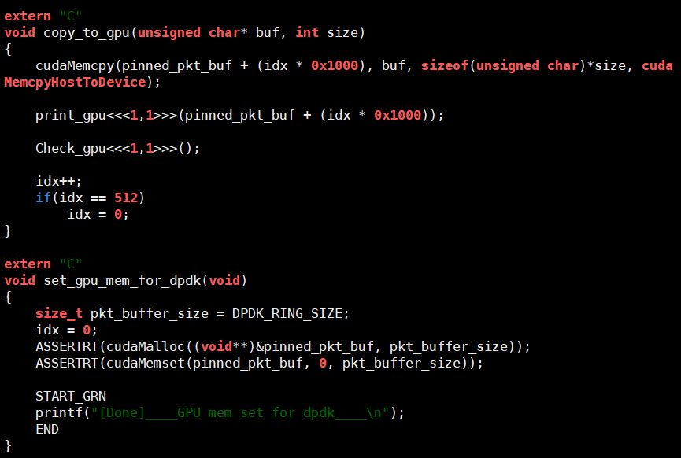

* 두번째, 첫번째 방법을 위한 코드가 제대로 작동하는지 확인하기 위해서 cpu memory에 buffer를 만들어서 같은 역할을 하게끔 코드를 짜서 확인해봄
  * pinned_pkt_buf를 다 0으로 초기화하고 dpdk에서 buffer를 받아와 copy해 넣은 다음 해당 부분의 위치와 index가 일치하는지 확인하기위해 해당 부분만 초록색으로 출력
  * copy해 넣은 부분을 다시 0으로 만들어서 다음 index의 test때 확인 가능하도록 해줌 
  * 잘 실행 됨

* \+ 문제 해결 
  * compile할때 sm의 버젼을 30으로 주니 정상적으로 실행됨

 ring check code test 

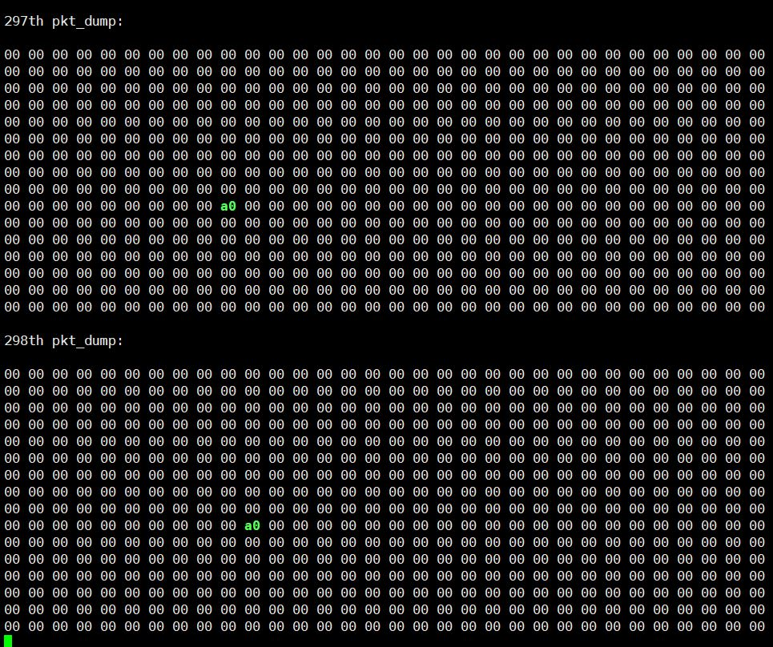

* 위의 결과물의 의미는 298번째에 packet이 잘 copy되어서 초록색으로 a0가 출력됨

 ring check code 

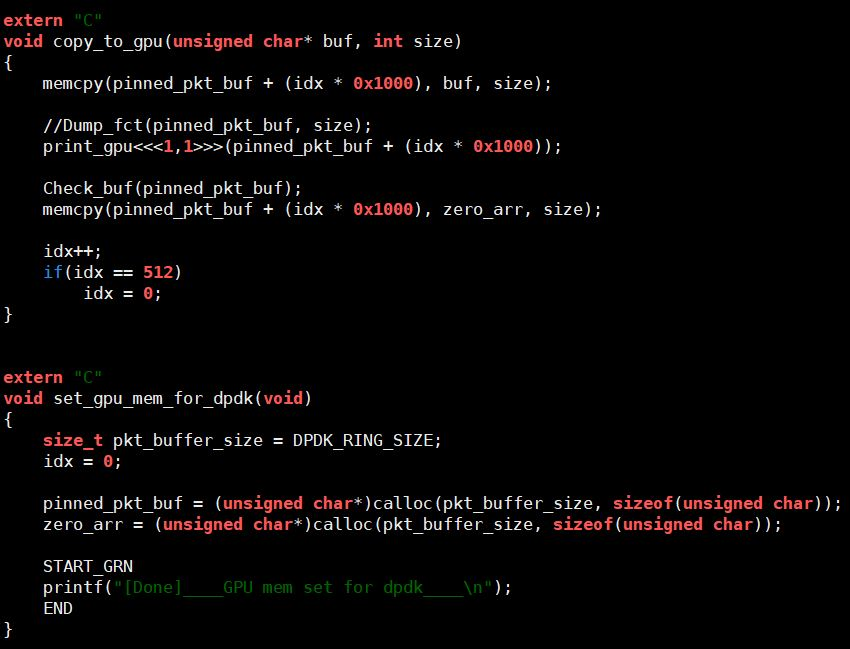

* \+ dpdk의 rx rate를 확인하기 위해서 test를 해봄

 rx and tx rate 

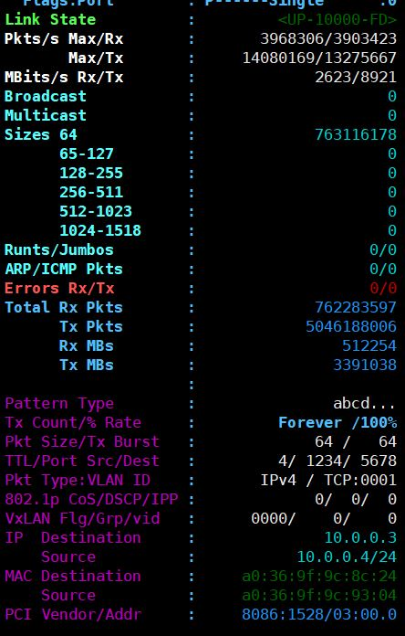

* 이유는 알 수 없으나 지난번 test때에 비해 1Mpps정도 오름

 rx rate without sending 

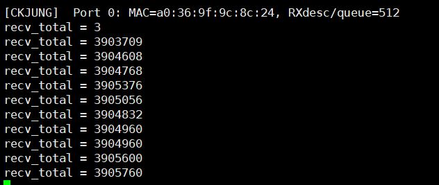

* swap과 send  없이 실행해도 같은 Mpps를 보임
* sh_handler가 없을때 실행하면 6Mpps가 나왔었음

 tx rate without cuda function 

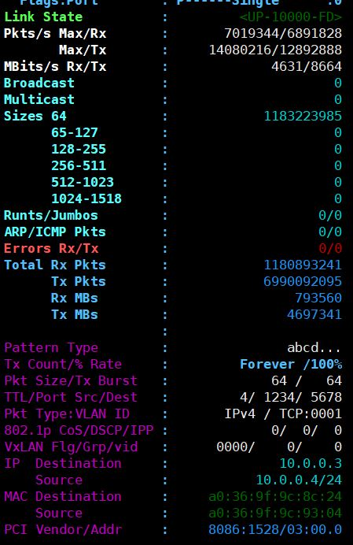

* cuda function을 주석처리했을 때 tx rate

 rx rate without cuda function 

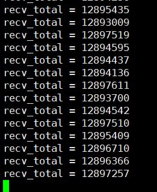

* recv_total로 직접 rx rate만 확인해보니 12.8Mpps로 보낸 packet수와 얼추 비슷함
  * receive는 잘 되지만 header를 swap하고 send하는 연산의 overhead 때문에 tx가 반 정도 나오는 듯
  * 이 전 결과와 비슷함

 rx rate without send and cuda function 

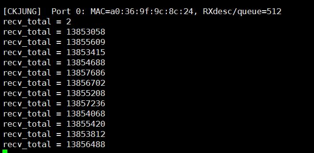

* send와 cuda function을 모두 뺀 상태의 rx rate
  * 정상적으로 나옴

* 위의 test 결과를 통해 생긴 의문점은 왜 cuda function과 send가 둘 다 있는 code와 cuda function만 있는 code의 rx rate가 동일한가 이다
  * 추측 ) cuda function과 send 모두 copy하는 연산이므로 같은 buffer를 건드리지만 서로에게 영향이 없어 더 느린쪽인 cuda function이 있을 때의 rx rate가 나온다

## 02/18 현재상황

* 실행에 문제가 없는 듯함
* 아래의 사진을 보면 gpu 상에서 dpdk_gpu_test라는 내가 만든 파일이 실행중임

 gpu proccess 

* 하지만 여전히 화면에 출력은 안됨
* \+ cudaFree를 안해줘서 memory 사용량이 계속 늘어서 cudaFree를 써서 memory 누수를 막아줌
  * 현재는 22MB만 사용

 dpdk excution 

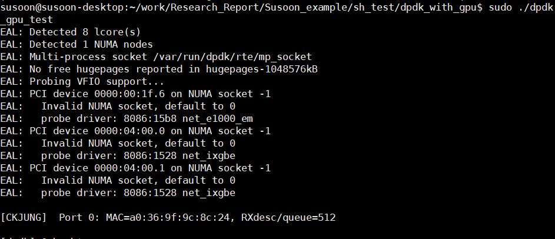

* gpu 함수를 통한 print를 제외한 다른 printf는 주석처리 한 상태
  * 즉 print_gpu라는 \_\_global\_\_함수를 제외하고는 print하는 함수의 호출이 없음
* 아무것도 뜨지 않음을 알 수 있음
  * 원인은 모르겠음....
  * gpu가 하는 출력이 다른 곳으로 되고 있지 않나하는 막연한 추측만 가지고 있음
* rx와 tx rate를 보면 속도가 줄어듬을 통해 함수 호출은 되고 있다고 추측할 수 있음

 rx and tx rate with call gpu function 

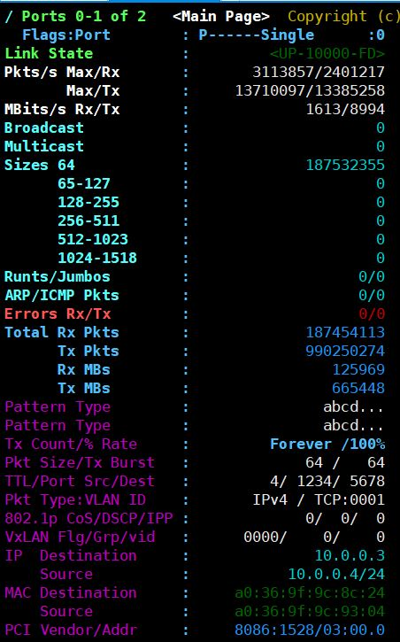

* 원래 rx가 6~7Mpps정도였으나 현재는 3Mpps정도를 보임
* 함수 호출과 출력으로 인한 overhead로 인해서 속도가 감소한 거 같음 
  * 수정 gpu 함수 호출 안해도 3Mpps정도임
  * cudaMalloc과 cudaMemcpy까지 호출 안하고 test해보니 6Mpps가 나옴
  * print_gpu는 실행이 안되는 듯 하고, cudaMalloc과 cudaMemcpy는 호출을 하면 속도가 떨어지는 것을보니 실행이 되는 듯함
* print_gpu는 실행이 안됨
* dpdk는 정상적으로 packet을 받아들이고 있고, copy_to_gpu가 gpu에 cudaMalloc으로 buffer 자리를 파주고 있지만 print_gpu만 실행이 안됨
* \_\_global\_\_함수만 실행이  안 되는 것으로 추측됨

## 02/17 현재상황

* suhwan 계정에서 compile된 걸 이용해 suhwan 계정에 있는 .dpdk.o.cmd와 .dtest.cmd 파일에서 flag들을 가져와 susoon 계정에 Makefile에 넣어주니 compile됨
* 실행시키면 port도 잘 찾음
* dpdk관련 실행은 문제 없게 됨
* 하지만 copy_to_gpu에서 d_pkt_buf를 읽어들이는 것과 print_gpu함수를 호출하는 게 안됨

copy_to_gpu

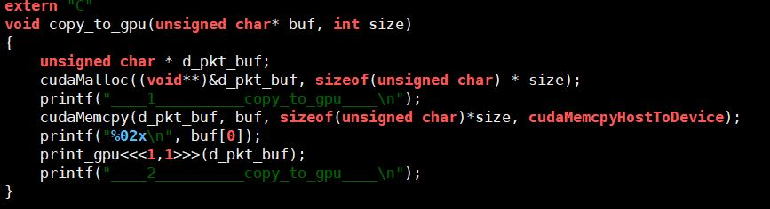

 print_gpu 

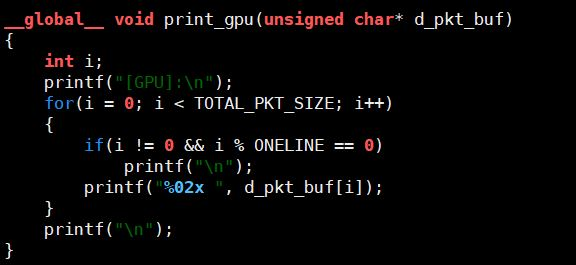

  Execution Result 

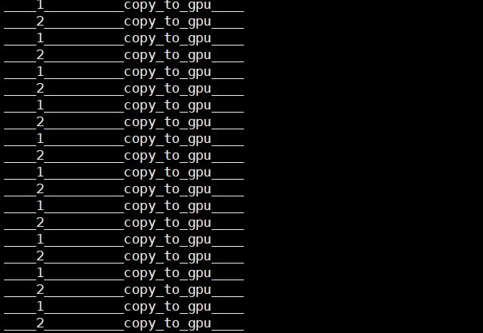

* 위의 캡쳐처럼 copy_to_gpu가 print_gpu를 호출하지만 출력 결과를 보면 packet도 출력이 안되고 [GPU]: 이부분도 아예 출력이 안되는 걸 보면 print_gpu가 호출이 안됨
* 그래서 copy_to_gpu에 print로 packet을 출력시키려 하니 segmentation fault error가 발생함
* cuda관련된 code가 실행되지 않고 있다고 추측 중

## 02/15 현재상황

* 서버 두 대 중 하나인 suhwan 계정에서 dpdk.c가 정상적으로 실행되는 것을 확인
* 둘의 차이는 rte.app.mk를 불러서 이를 통해 compile하는가 아니면 그냥 내가 넣어준 flag를 사용해서 compile하는 가임
* 이 차이가 port를 찾냐 못 찾냐의 차이를 주는 것 같음
* nvidia driver의 오류로 인한 linux 재설치 및 환경 세팅은 끝

## 02/13 현재상황

* suhwan 계정에서는 compile되지 않았지만 root 계정에서는 compile이 된 이유를 알아냄
  * root 계정으로 설치와 설정했던 모든 파일들이(Susun_examples 내의 파일들) 소유자가 root여서 suhwan 계정이 건들 수 없었음
  * 소유권 다 넘겨주니 excutable file을 제외하고는 모두 compile 됨
  * excutable file은 sudo가 필요함
    * library가 root 권한이어서 그런듯 함
    * library들도 소유권 변경해서 테스트해봐야함!!
  * object file들은 sudo 권한을 주면 또 compile이 안됨
    * 소유권이나 권한의 문제인 듯 하지만 확실하진 않음

 make error without sudo 

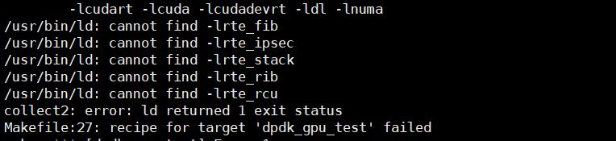

* 실행시에는 다음과 같은 에러가 발생

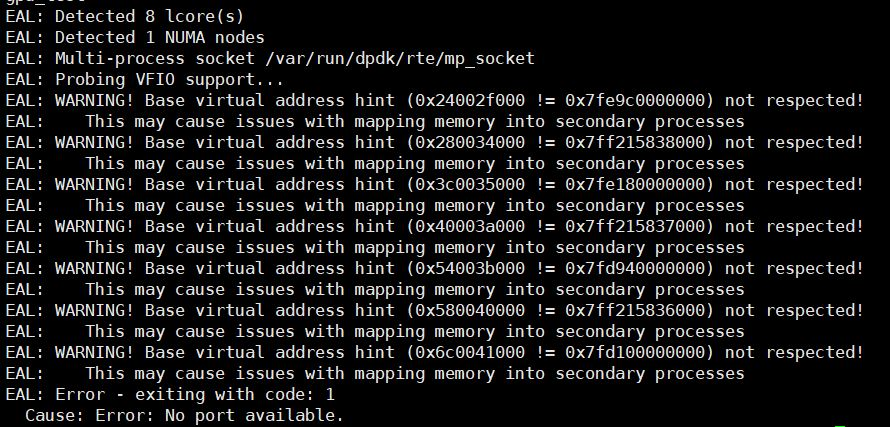

* 첫번째 error는 address mapping error
  * sh_handler.cu 내에 read_handler 함수에서 device를 건드리는 function(\_\_global\_\_ or \_\_device\_\_ or cudaMalloc etc...)를 호출하면 error가 발생
  * linking 과정이나 함수 코드 내의 문제일 가능성 있음
* 두번째 error는 port를 찾을 수 없는 error
  * 이 error는 좀 더 살펴봐야함

## 02/12 현재상황

* root계정에서 suhwan 계정으로 옮겨서 컴파일을 시도 중
* pkg-config의 경로와 library의 경로가 잘못 설정되어 컴파일이 안되는 듯함
* 실제 path를 확인해보면 제대로 설정되어있음
* root계정에선 각 object file이 compile되지만 하나의 파일로 linking하는 데에서 에러가 발생
* suhwan계정에선 main.o를 제외한 파일들이 compile되지 않음...
  * suhwan 계정에서 불러오는 libdpdk.pc와 root 계정에서 불러오는 libdpdk.pc가 달라서 생기는 문제인 걸로 추정됨
  * 하지만 어디서 불러오는지는 찾을 수 없음...
