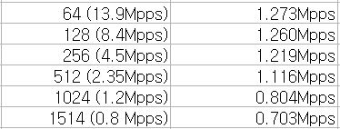
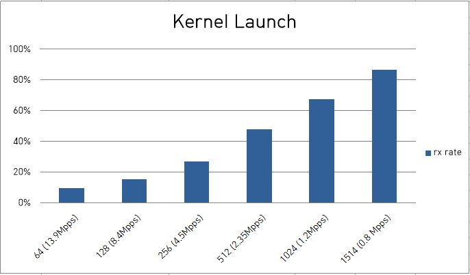
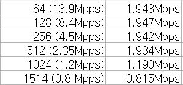
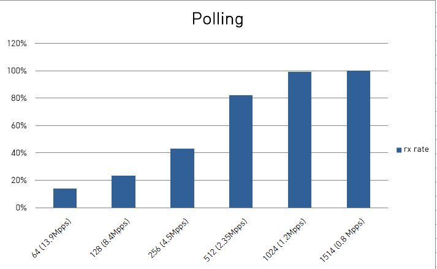
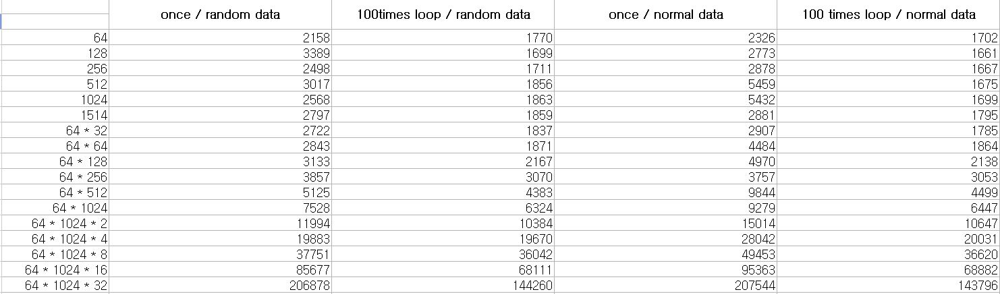
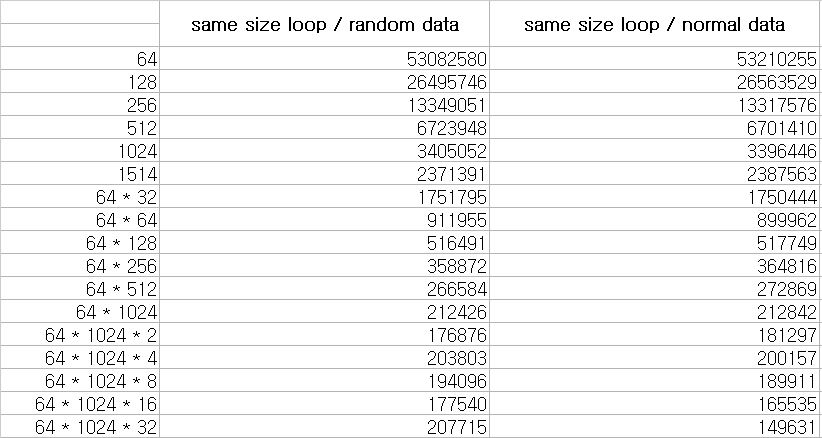
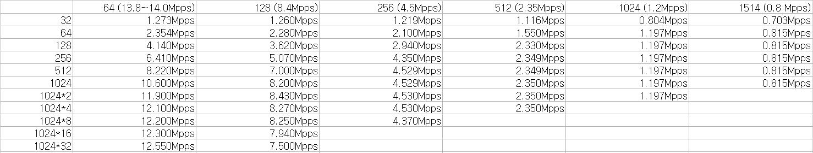
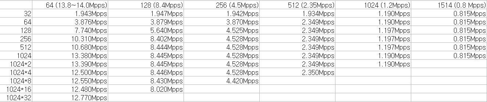

# Introduction

* 해당 파일은 현재까지 나온 test 결과를 정리하여 마무리짓기 위한 파일이다
* dpdk의 3가지 한계점의 근거를 각각 정리하였다

---

# Contents

1. 2개의 cpu core 사용

2. cudaMemcpy에 의한 성능 저하

3. batch-size의 중량화

## 1. cpu core

* dpdk는 모든 packet을 받아올 수 있으나 특성상 master core와 slave core가 필요하므로 최소 2개 이상의 cpu core가 필요하며, 2개의 core 모두 100% 사용량을 보인다

* 이는 자명하게 알려져있는 사실이며 추가적인 근거가 필요하지 않다

## 2. cudamemcpy

* cudaMemcpy를 통해 gpu에 copy해주게 되면 모든 packet을 받아올 수 없다

* dpdk는 기본적으로 packet을 32개씩 batch하여 받아오는 데 이를 바로 GPU memory에 복사해주면 pps가 떨어진다

 pps of dpdk default : Kernel Launch 

* 표는 dpdk에서 packet을 gpu에 넘겨줄 때마다 gpu kernel을 호출하여 packet이 복사되었음을 확인하고, packet의 수를 계산하는 kernel launch방식으로의 측정시 pps이다
* 그래프는 이를 pkt-gen에서 보내주는 pps와의 비를 백분율로 구한 값을 그래프로 나타낸 것이다

 pps of dpdk default : Polling 

* dpdk와 독립적으로 gpu 상에서 persistent loop를 돌며 gpu memory를 확인하는 polling방식으로의 측정시 pps이다
* 그래프는 Kernel Launch와 동일하게 구한 그래프이다

* 위의 실험 결과에서 pkt-gen의 전송속도가 최대인 64B기준으로 kernel launch 방식은 9%, polling 방식은 14%정도의 packet만 gpu에 저장되고 나머지 packet들은 drop된다는 것을 확인할 수 있다
* 이를 해결하기 위해서 dpdk가 NIC으로부터 받아오는 packet들을 batch하여 gpu에 복사해주는 방법을 사용한다
* 그 이유는 cudaMemcpy의 latency는 copy해주는 size보다 호출 횟수에 더 큰 영향을 받기 때문이다

 cudaMemcpy Test 

* packet size인 64B부터 1514B의 크기의 data와 64B기준으로 batch했을 때의 data 크기인 32 \* 64B부터 32 \* 1024 \* 64B의 크기의 data를 cudaMemcpy로 복사했을때의 latency를 ms단위로 측정한 결과이다
  * 1) random / normal data를 사용한 경우
  * 2) 각각 cudaMemcpy를 1번씩 / loop를 통해 100번씩 호출한 경우
  * 3) 같은 크기의 data를 복사해주기 위해 호출한 빈도
  * 의 경우를 나누어 측정했으며, 각각 100번씩 test한 평균을 기록했다
* 첫번째 표를 통해 size가 증가함에 따라 cudaMemcpy의 latency가 더 커짐을 확인할 수 있다
* 또한 각각 1번씩 cudaMemcpy를 호출하는 것에 비해 loop를 통해 100번씩 호출하는 것이 latency가 더 낮음을 알 수 있다
* 두번째 표를 통해 같은 size를 복사해줄 때, 최대한 적은 횟수로 호출하여 복사해주는 것이 더 latency가 낮음을 알 수 있다
  * 64K 이상의 크기로 나눌 경우, 해당하는 모든 경우에서 gpu page(64K)를 여러번 호출해야한다는 점에서 호출 횟수를 줄이는 데에 큰 이득을 기대할 수 없어 유사한 latency를 보였다
* 현재 주제와 관련하여 가장 주목해야할 부분인 값의 증감량이다
* size에 의한 latency 변화는 64B와 32 \* 1024 \* 64B를 비교할 경우 100배 정도에 그쳤으나, 호출 횟수에 의한 변화는 동일한 경우에 대해 255배 이상의 변화를 보였다
* 이를 통해 복사해주는 data의 크기보다 cudaMemcpy의 호출 횟수가 latency에 더 큰 영향을 미침을 알 수 있다

## 3. batch size

### 1) batch size와 pps 비례관계

* 다음은 packet size별 batch하는 packet의 수를 달리했을 때의 pps이다.

 Kernel Launch 

 Polling 

* 위의 표에서 확인할 수 있듯이 cudaMemcpy를 사용하면서 모든 packet을 받아오려면 batch의 size가 굉장히 커져야한다
  * 이는 2장에서 입증했다
* 더 큰 크기의 batch에서의 pps를 확인하기 위해, 64B와 128B의 경우에서만 추가적인 측정을 해보았다

 Additional Test : Kernel Lanuch 

 Additional Test : Polling 

(data 뽑아서 이미지 추가해야함)

* 위는 pkt-gen이 보내주는 pps와 gpu가 받은 pps간의 비를 백분율로 표시한 값을 기록한 표이다
  * 128B의 마지막 0%는 gpu memory 부족으로 측정하지 못해 0%로 기록한 것이다
* 1024 \* 32개 이상을 batch하게되면 오히려 속도가 감소함을 알 수 있다
  * 64B와 128B 모두 마지막 값은 copy가 정상적으로 진행되지 못한 값으로 분석에 사용하지 않았다
* 이는 호출 횟수의 감소가 size에 의한 latency 증가를 무시할만큼 큰 감소가 아니기 때문에 발생한 결과이다

 cudaMemcpy call count : Kernel Launch 

 cudaMemcpy call count : Polling

(data 뽑아서 이미지 추가해야함)

* 위의 표를 확인해보면 1024 * 32개 이상의 batch의 경우 호출 횟수가 200회 이하로 감소하게 되어 latency에 큰 영향을 미치지 못했다는 것을 확인할 수 있다

### 2) batch size의 중량화의 단점 - gpu memory

* batch size가 커지면, 그만큼 gpu memory를 많이 차지하게 된다
* gpu상의 application의 성능 향상을 위한 packet처리가 본 연구 주제의 target인 점을 미루어보았을때 과한 gpu memory의 차지는 불가하다
  * batch를 할 경우 tx를 위한 buffer를 제외하고 최대 1GB정도의 memory를 차지한다
  * 사실 위의 이유를 차치하고서라도 1GB의 packet buffer는 사용하지 않는다
* 이는 batch size를 일정 이하로 낮출 수 밖에 없다는 결론을 내게 된다
  * 최대 512개의 batch size까지 사용할 듯 하다
    * 1514B기준 512개의 batch size : (약 47MB \| 확인 후 기록)
* 하지만 batch size를 낮추면 낮출 수록 pps는 떨어지게 된다

### 3) batch size의 중량화의 단점 - batch delay

* batch size가 커졌을 때, 고려해야하는 delay는 3가지 종류가 있다
* 첫번째, dpdk로 받은 packet을 batch하기 위한 cpu의 delay
  * 사실 멈추지 않고 packet을 받아 저장해뒀다가 한 번에 보내주는 방식이기 때문에 제일 처음 batch할 때에만 gpu가 조금 기다리는 것 외에는 없다

* 두번째, tx를 위한 gpu의 nf처리에서 발생하는 gpu의 delay

* 위의 실험에서는 tx를 위한 nf처리를 하지 않았지만, 실제 packet을 관리하기 위해서는 nf처리를 해주어야한다
* nf처리를 해주게 되면 단순히 packet의 수를 count만해주었던 gpu가 각각의 packet에 thread를 할당해 nf처리까지 해주어야하니 gpu kernel이 가지는 delay는 훨씬 증가한다
*  delay들을 pipelining을 통해 빈틈없이 잇는다는 것은 굉장히 힘들다
  * 이 부분 내용 추가 및 수정 필요

* 세번째, dpdk가 보낼 수 있는 batch size인 32개씩 packet을 나누어서 전송하는 데에서 발생하는 cpu의 delay
* 사실 가장 큰 delay를 발생시키는 구간이다
* 이 구간에서 delay가 크게 발생하고, 이는 cpu가 packet을 받는 속도에 영향을 미치고, 이는 다시 gpu가 packet을 받기 위해 대기해야하는 상황을 만든다
* cpu에 의해 실행되기 때문에 cpu의 영향을 크게 받는 dpdk의 큰 단점이다

---

# Conclusion

* 내가 맡은 역할은 dpdk를 이용해 packet을 gpu에 copy해 넣어 직접 NIC에서 gpu로 packet을 전달해주는 방식의 대조군을 구하는 것이다
* 실험을 통해 알 수 있게 된 dpdk의 단점은 다음과 같다

1. cpu를 통해 실행되기 때문에 기본적으로 core를 2개 이상 사용한다
   * 이는 자명한 사실이다
2. cudaMemcpy에 큰 영향을 받아 batch가 불가피하다
   * batch를 한다는 것 자체는 사실 단점이 아니다
   * batch를 통해 100%의 packet을 받기 위해선 batch size를 무지막지하게 키워야한다는 점이 단점이다
3. batch size를 키우는 것도 낮추는 것도 비효율적이다
   * batch size를 키워 100%의 packet을 받게 되면 gpu memory를 과도하게 차지하게 되어 gpu 상에 application의 memory 사용을 방해한다
   * 이는 주객전도가 된다
   * batch size를 낮춰 gpu 상의 application이 memory 사용을 자유롭게 하게 해주면 100%의 packet을 받는 걸 보장해줄 수 없다
   * 극심한 data 손실이 발생한다
     * Kernel Launch로 64B의 packet을 512개 batch하여 관리하는 경우 41%

* 이는 dpdk와 gpu의 연계에 큰 병목현상을 일으키고 있다

